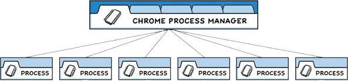

# Electron基础版

## 安装electron

> electron 是一个基于chrom v8引擎和nodejs的客户端开发框架

将Electron设置国内镜像后，可以加快文件的下载速度，需要设置 electron_mirror 与 electron_builder_binaries_mirror 镜像，下面是 electron的国内镜像设置。

### pnpm 设置

```sh 
pnpm config set electron_mirror=https://npm.taobao.org/mirrors/electron/
或
pnpm config set electron_mirror=https://registry.npmmirror.com/-/binary/electron/
或
pnpm config set electron_mirror https://npmmirror.com/mirrors/electron/
或
pnpm config set electron_mirror https://mirrors.huaweicloud.com/electron/
```

**electron_builder_binaries_mirror**

```sh
pnpm config set electron_builder_binaries_mirror=https://npm.taobao.org/mirrors/electron-builder-binaries/
或
pnpm config set electron_builder_binaries_mirror=https://mirrors.huaweicloud.com/electron-builder-binaries/
或
pnpm config set electron_builder_binaries_mirror=https://registry.npmmirror.com/-/binary/electron-builder-binaries/
```

### 创建应用

下面创建一个简单的桌面应用，来体验 electron 的工作流程。

首先安装 [node.js](https://nodejs.org/zh-cn/) ，因为 Electron 将 Node.js 嵌入到其二进制文件中，你应用运行时的 Node.js 版本与你系统中运行的 Node.js 版本无关。

#### package

然后初始化 npm 项目

```
pnpm init
```

创建 package.json 内容如下

```json
{
  "name": "electron-camera",
	"productName":"cosarty-camera",
  "version": "1.0.0",
  "description": "cosarty",
  "main": "index.js",
  "scripts": {
    "test": "echo \"Error: no test specified\" && exit 1"
  },
  "keywords": [],
  "license": "ISC"
}
```

然后安装依赖包

```
pnpm add -D electron
```

修改package.json文件中的 main与scripts配置段

- name字段会做为app.name的默认值
- productName 字段会做为app.name的默认值，优先级高于name
- main 主进程脚本
- dev 运行electron项目命令

```json
{
  "name": "electron-camera",
  "productName":"cosarty-camera",
  "version": "1.0.0",
  "description": "",
  "main": "main.js",
  "scripts": {
    "dev": "electron ."
  },
  "keywords": [],
  "author": "",
  "license": "ISC",
  "devDependencies": {
    "electron": "^22.0.0"
  }
}
```

#### 模板文件

然后创建index.html模板文件


```html
<!DOCTYPE html>
<html>
  <head>
    <meta charset="UTF-8" />
  </head>
  <body>
    <h1>cosarty.com</h1>
  </body>
</html>
```

#### 主进程

创建main.js主进程文件，用于创建窗口并加载模板文件


```js
const { app, BrowserWindow } = require('electron')

const createWindow = () => {
    //定义窗口
    const newWin = new BrowserWindow({
        width: 300,
        height: 300,
    })
    //加载模板
    newWin.loadFile('index.html')
}

//应用准备好后创建窗口
app.whenReady().then(() => {
    createWindow()
    //苹果电脑当关闭所有窗口后，点击dash图标时创建新窗口
    app.on('activate', () => {
        if (BrowserWindow.getAllWindows().length === 0) {
            createWindow()
        }
    })
})

//非苹果系统当关闭所有窗口时退出应用
app.on('window-all-closed', () => {
    if (process.platform != 'darwin') {
        app.quit()
    }
})
```

然后在命令行执行


```
pnpm dev
```

#### 自动重起

有时需要当文件修改后，自动重起项目，这时需要安装nodemon模块


```
pnpm add -g nodemon
```

并修改 package.json 文件

```js
...
"scripts": {
  "test": "echo \"Error: no test specified\" && exit 1",
  "dev": "nodemon --exec electron ."
},
...
```

然后添加 nodemon.json 配置文件


```json
{
	"ignore": [
		"node_modules",
		"dist"
	],
	"colours": true,
	"verbose": true,
	"watch": [
		"*.*"
	],
	"ext": "html,js"
}
```

主进程设置窗口的位置，并且让窗口置顶，这样不会遮挡vscode编辑器

```js
...
const mainWin = new BrowserWindow({
  width: 400,
  height: 400,
  x: 1400,
  y: 100,
  alwaysOnTop: true,
})
...
```

### 安全策略

因为 Electron 项目可以执行javascript代码，也可以访问用户电脑的文件系统，所以访问任何不受信任的内容都可能带来安全隐患。

#### 错误报告

当没有配置安装策略时，Electron会报出警告，你可以在渲染进程的开发者工具中查看到。


#### CSP

内容安全策略(CSP) 是应对跨站脚本攻击和数据注入攻击的又一层保护措施。 我们建议任何载入到Electron的站点都要开启。

**定义方式**

访问内容均来自项目资源

```html
<meta http-equiv="Content-Security-Policy" content="default-src 'self'; script-src 'self'" />
```

允许访问 ***.cosarty.com** 源内容

```html
<meta http-equiv="Content-Security-Policy" content="default-src 'self' *.trusted.com; script-src '*.cosarty.com'" />
```

**模板文件**

我们在模板文件中定义安全策略，以告之Electron我们已经对安全策略进行了定义，上面的警告就不会出现了

```html
<!DOCTYPE html>
<html>
  <head>
    <meta charset="UTF-8" />
    <meta http-equiv="Content-Security-Policy" content="default-src 'self'; script-src 'self'" />
    <title>cosarty</title>
  </head>
  <body>
    <h1>cosarty</h1>
    <script src="renderer.js"></script>
  </body>
</html>
```

### 基于框架

平时项目开发我们都会使用到 vue、react等框架开发渲染进程的代码，所以要配置electron与常用框架的整合。下面我们先自己配置个electron+vite+vue3的脚手架，然后在介绍成熟的开源脚手架。

#### 自己开发

下面我们自己来开发一个使用 electron+vite+vue 技术的脚手架。

首先创建vue3项目

```
pnpm create vite
```

然后安装electron

```
p add -D electron
```

因为我们要跑两个进程所以要安装 [concurrently](https://github.com/open-cli-tools/concurrently) ，它可以控制依次启动多个进程

```
p add -D concurrently
```

然后修改package.json

- "main": "electron/main.cjs" 定义electron 主进程脚本
- "dev": "concurrently "nodemon --exec electron . " "vite"" 定义依次启动 vue与electron脚本

```json
{
  "name": "test",
  "private": true,
  "version": "0.0.0",
  "type": "module",
  "main": "electron/main.cjs",
  "scripts": {
    "dev": "concurrently \"nodemon --exec electron . \" \"vite\"",
    "build": "vue-tsc && vite build",
    "preview": "vite preview"
  },
  "dependencies": {
    "vue": "^3.2.45"
  },
  "devDependencies": {
    "@vitejs/plugin-vue": "^4.0.0",
    "concurrently": "^7.6.0",
    "electron": "^22.0.3",
    "typescript": "^4.9.3",
    "vite": "^4.0.0",
    "vue-tsc": "^1.0.11"
  }
}
```

然后定义 electron/main.cjs 主进程脚本

```
const { ipcMain, BrowserWindow, app } = require('electron')
const path = require('path')

const createWindow = () => {
  const win = new BrowserWindow({
    width: 600,
    height: 600,
    alwaysOnTop: true,
  })
  win.webContents.openDevTools()
  win.loadURL('http://localhost:5173')

  return win
}

app.whenReady().then(() => {
  createWindow()
  app.on('window-all-closed', () => {
    if (process.platform != 'darwin') app.quit
  })

  app.on('activate', () => {
    if (BrowserWindow.getAllWindows().length == 0) {
      createWindow()
    }
  })
})
```

现在就可以启动项目了

```sh
pnpm dev
```


日常开发可以使用 [electron-vite](https://cn-evite.netlify.app/guide/#搭建第一个-electron-vite-项目) 或 [electron-vite-vue](https://github.com/electron-vite/electron-vite-vue) 、 [electron-react-boilerplate](https://github.com/electron-react-boilerplate/electron-react-boilerplate) 等脚手架快速创建项目，脚手架已经为我们完成了基本的配置，并支持使用 Vue与React等技术开发Electron项目。

下面使用 [electron-vite](https://cn-evite.netlify.app/guide/#搭建第一个-electron-vite-项目) 脚手架创建项目

```
pnpm create @quick-start/electron
```

然后进行项目目录 **electron-vite-vue** 安装依赖包

```
pnpm install
```

然后运行项目

```
pnpm run dev
```

运行项目后会打开Election应用


## 调试

### 调试配置

下面介绍在vscode中调试electron项目，微软有一个仓库 [vscode-recipes](https://github.com/microsoft/vscode-recipes) 提供了vscode的 launch.json 常用开发语言的配置。

下面我们使用 [vscode-recipes](https://github.com/microsoft/vscode-recipes/tree/main/Electron) 的 [electron debug](https://github.com/microsoft/vscode-recipes/tree/main/Electron) 配置，首先在 vscode 中创建 launch.json 文件。


然后将 [vscode-recipes](https://github.com/microsoft/vscode-recipes/tree/main/Electron) 的 [electron debug](https://github.com/microsoft/vscode-recipes/tree/main/Electron) 配置荐粘贴进去，其中包含了主进程与渲染进程的调试配置。


```json
  {
      "version": "0.2.0",
      "configurations": [
          {
              "type": "node",
              "request": "launch",
              "name": "Electron: Main",
              "runtimeExecutable": "${workspaceFolder}/node_modules/.bin/electron",
              "runtimeArgs": [
                  "--remote-debugging-port=9223",
                  "."
              ],
              "windows": {
                  "runtimeExecutable": "${workspaceFolder}/node_modules/.bin/electron.cmd"
              }
          },
          {
              "name": "Electron: Renderer",
              "type": "chrome",
              "request": "attach",
              "port": 9223,
              "webRoot": "${workspaceFolder}",
              "timeout": 30000
          }
      ],
      "compounds": [
          {
              "name": "Electron: All",
              "configurations": [
                  "Electron: Main",
                  "Electron: Renderer"
              ]
          }
      ]
  }
```

### 主进程调试

下面介绍主进程的调试。其实做的工作很少，在主进程代码中设置断点，然后运行调试就可以了。


下面我们就可以看到调试的结果了


### 渲染进程调试

因为渲染进程是由主进程打开的，所以在进行渲染进程调试时，需要先启动主进程调试 **Electron:Main**。

#### 分别启动

首先启动主进程的调试。


然后再启动渲染进程 **Electron:Renderer**。


这时在打开的渲染窗口的菜单中选择 **view/Reload** 即可看到调试结果了。


#### 同时启动[](https://doc.houdunren.com/系统课程/electron/2 调试项目.html#同时启动)

因为渲染进程是由主进程打开的，所以在进行渲染进程调试时，需要先启动主进程debug。


运行后就可以查看到调试结果了


## 多进程模型

Electron 将使用两种类型的进程：[主进程](https://www.electronjs.org/zh/docs/latest/tutorial/process-model#the-main-process) 和 [渲染器进程](https://www.electronjs.org/zh/docs/latest/tutorial/process-model#the-renderer-process)。



不同进程承载着不同的任务，本章讨论的进程通信（IPC）就是解决不同进程间任务传递的方式。

- 比如渲染进程通过主进程调用原生Node.js API，比如文件操作
- 主进程通过原生菜单改变渲染进程页面内容
- IPC通信使用 [`ipcMain`](https://www.electronjs.org/zh/docs/latest/api/ipc-main) 和 [`ipcRenderer`](https://www.electronjs.org/zh/docs/latest/api/ipc-renderer) 两个模块传递消息

**主进程**

每个 Electron 应用都有一个单一的主进程，作为应用程序的入口点。 主进程在 Node.js 环境中运行，这意味着它具有使用 Node.js API 的能力。

主进程的主要目的是使用 [`BrowserWindow`](https://www.electronjs.org/zh/docs/latest/api/browser-window) 模块创建和管理应用程序窗口。

**渲染器进程**

每个 Electron 应用都会为使用 `BrowserWindow` 打开的窗口生成一个单独的渲染器进程。

默认情况下渲染进程与主进程使用 preload.js预加载做为通信桥梁。

### 预加载脚本

预加载（preload）脚本包含了那些执行于渲染进程中，且先于网页内容开始加载的代码 。这些脚本虽运行于渲染器的环境中，却因能访问有限的 Node.js、Electron高级权限。

因为Electron项目与其他桌面应用是有区别的，他具有浏览器的特性，所以开放主进程的node.js给渲染进程，是有安全隐患的。默认electron是不会开放高级权限给渲染进程，而是要求开发者自行决定渲染进程可以使用哪些主进程任务，这块功能就要在预加载脚本中完成。

预加载脚本像一个桥接器，用于渲染脚本renderer.js与main.js脚本的连接。

## 预加载脚本

预加载（preload）脚本包含了那些执行于渲染进程中，且先于网页内容开始加载的代码 。这些脚本虽运行于渲染器的环境中，却因能访问有限的 Node.js、Electron高级权限。

因为Electron项目与其他桌面应用是有区别的，他具有浏览器的特性，所以开放主进程的node.js给渲染进程，是有安全隐患的。默认electron是不会开放高级权限给渲染进程，而是要求开发者自行决定渲染进程可以使用哪些主进程任务，这块功能就要在预加载脚本中完成。

预加载脚本像一个桥接器，用于渲染脚本renderer.js与main.js脚本的连接。

### 基础知识

预加载脚本运行在具有 HTML DOM APIs 和 Node.js、Electron 的有限功能访问权限的环境中。

Preload.js 是渲染进程与主进程通信的桥梁。

**使用场景**

- 使用有限的node.js、Electron高级api
- 主进程与渲染进程进行IPC通信，比如渲染进程让主进程帮助在本地保存文件

### 使用示例

下面使用预加载脚本preload.js，通过node 的process查看软件版本的信息

main.js 主进程脚本

```
const { BrowserWindow, app } = require('electron')
const path = require('path')

const createWindow = () => {
  const win = new BrowserWindow({
    width: 300,
    height: 300,
    webPreferences: {
    	//预加载脚本
      preload: path.resolve(__dirname, 'preload.js'),
    },
  })
  win.loadFile(path.resolve(__dirname, 'index.html'))
  win.webContents.openDevTools()
}

app.whenReady().then(() => {
  createWindow()
})
```

preload.js 预加载脚本

```
document.addEventListener('DOMContentLoaded', () => {
  for (const soft of ['chrome', 'electron', 'node']) {
    console.log(soft)
    document.querySelector(`#${soft}`).innerHTML = `${soft}:` + process.versions[soft]
  }
})
```

index.html 模板文件

```
<!DOCTYPE html>
<html>
  <head>
    <meta charset="UTF-8" />
    <meta http-equiv="Content-Security-Policy" content="default-src 'self'; script-src 'self'" />
    <meta http-equiv="X-Content-Security-Policy" content="default-src 'self'; script-src 'self'" />
    <title>houdunren</title>
  </head>
  <body>
    <div id="chrome"></div>
    <div id="node"></div>
    <div id="electron"></div>
    <script src="renderer.js"></script>
  </body>
</html>
```

最终会打印出node、electron、chrome版本信息


## 进程通信

下面介绍主进程与渲染进程是如何进行通信的。

### 渲染进程到主进程

下面介绍渲染进程向主进程通信，这是单向通信行为。本例实现的功能是渲染进程向主进程发送请求，更改窗口标题。

**main.js**

```
const { BrowserWindow, app, ipcMain } = require('electron')
const path = require('path')

const createWindow = () => {
  const win = new BrowserWindow({
    width: 300,
    height: 300,
    alwaysOnTop: true,
    x: 1500,
    y: 100,
    webPreferences: {
      preload: path.join(__dirname, 'preload.js'),
    },
  })
  win.webContents.openDevTools()

  win.loadFile(path.resolve(__dirname, 'index.html'))
}

app.whenReady().then(() => {
  createWindow()

  //主进程事件监听
  ipcMain.on('setTitle', (event, title) => {
    //获取用于控制网页的webContents对象
    const webContents = event.sender
    //获取窗口
    const win = BrowserWindow.fromWebContents(webContents)
    //设置窗口标题
    win.setTitle(title)
  })
})
```

**preload.js**

```
const { contextBridge, ipcRenderer } = require('electron')
//为渲染进程暴露API
contextBridge.exposeInMainWorld('api', {
  //该API用于向主进程事件
  setTitle: (title) => ipcRenderer.send('setTitle', title),
})
```

**index.html**

```
<!DOCTYPE html>
<html>
  <head>
    <meta charset="UTF-8" />
    <meta http-equiv="Content-Security-Policy" content="default-src 'self'; script-src 'self'" />
    <title>houdunren</title>
  </head>
  <body>
    <input type="text" name="title" />
    <button>更改标题</button>
    <script src="renderer.js"></script>
  </body>
</html>
```

**renderer.js**

```
window.addEventListener('DOMContentLoaded', () => {
  document.querySelector('button').addEventListener('click', () => {
    const value = document.querySelector('[name=title]').value

    //使用preload.js暴露出的API，触发主进程事件
    window.api.setTitle(value)
  })
})
```

### 主进程到渲染进程

下面介绍主进程主动向渲染进程通信，这也是单向通信IPC。

将消息从主进程发送到渲染器进程时，需要指定是哪一个渲染器接收消息。 消息需要通过 [`WebContents`](https://www.electronjs.org/zh/docs/latest/api/web-contents) 实例的send方法发送到渲染器进程。

**main.js**

```
const { BrowserWindow, app, ipcMain, Menu } = require('electron')
const path = require('path')

const createWindow = () => {
  const win = new BrowserWindow({
    width: 300,
    height: 300,
    alwaysOnTop: true,
    x: 1500,
    y: 100,
    webPreferences: {
      preload: path.join(__dirname, 'preload.js'),
    },
  })
  //定义菜单
  const menu = Menu.buildFromTemplate([
    {
      label: '菜单',
      submenu: [
        {
        	//主进程向渲染进程发送消息
          click: () => win.webContents.send('increment', 1),
          label: '增加',
        },
      ],
    },
  ])
  Menu.setApplicationMenu(menu)

  //打开开发者工具
  win.webContents.openDevTools()
  win.loadFile(path.resolve(__dirname, 'index.html'))
}

app.whenReady().then(() => {
  createWindow()
})

//接收渲染进程的结果
ipcMain.on('finish', (event, value) => {
  console.log('最后结果是：' + value)
})
```

**perload.js**

```
const { contextBridge, ipcRenderer } = require('electron')
//为渲染进程暴露API
contextBridge.exposeInMainWorld('api', {
  //为渲染进程设置接口，用于接收主进程的消息
  incrementNumber: (callback) => ipcRenderer.on('increment', callback),
})
```

**index.html**

```
<!DOCTYPE html>
<html>
  <head>
    <meta charset="UTF-8" />
    <meta http-equiv="Content-Security-Policy" content="default-src 'self'; script-src 'self'" />
    <title>houdunren</title>
  </head>
  <body>
    <h1></h1>
    <script src="renderer.js"></script>
  </body>
</html>
```

**renderer.js**

```
//向预加载脚本传递回调方法，用于处理主进程的消息
window.api.incrementNumber((event, value) => {
  const h1 = document.querySelector('h1')
  h1.innerHTML = Number(h1.innerText) + value
  //向主进程发送消息
  event.sender.send('finish', h1.innerHTML)
})
```

### 双向通信

使用 ipc 的invoke 进行渲染进程与主进程的通信，主进程会返回 promise。

**index.html**

```
...
<button id="btn">IPC</button>
<script src="renderer.js"></script>
...
```

**main.js**

```
const { BrowserWindow, app } = require('electron')
const { ipcMain } = require('electron/main')
const path = require('path')

const createWindow = () => {
    const win = new BrowserWindow({
        width: 300,
        height: 300,
        alwaysOnTop: true,
        webPreferences: {
            preload: path.resolve(__dirname, 'preload.js'),
        },
    })
    win.webContents.openDevTools()
    win.loadFile(path.resolve(__dirname, 'index.html'))
    return win
}

app.whenReady().then(() => {
    const win = createWindow()
    ipcMain.handle('mainShow', (event) => {
        return 'is main handle'
    })
})
```

**preload.js**

```
const { ipcRenderer } = require('electron')
const { contextBridge } = require('electron/renderer')

contextBridge.exposeInMainWorld('api', {
    show: () => {
        return ipcRenderer.invoke('mainShow')
    },
})
```

**renderer.js**

```
const bt = document.querySelector('#btn')
bt.addEventListener('click', async () => {
    const res = await api.show()
    console.log(res)
})
```

> 其他进程的通信的使用是类似的，可以参考 [electron 文档](https://www.electronjs.org/zh/docs/latest/tutorial/ipc)学习

## 上下文隔离

上下文隔离是从安全角度考量的，即不允许 [`webcontent`](https://www.electronjs.org/zh/docs/latest/api/web-contents)网页使用electron内部组件与node等权限 。 默认情况下 electron 是开启上下文隔离的。

因为使用Electron开发的桌面应用，是比较特殊的。他是使用网页开发的，所以会引用第三方的应用，如果不进行隔离，这些应用是有机会调用node.js api 的，如果应用是恶意的，就会对用户电脑带来案全隐患。

使用上下文隔离对团队开发好处也是明显的，可以让熟悉vue、react的前端工程师专门编写前端页面逻辑，让熟悉nodejs与electron的开发者负责node.js程序编写。

### 变量隔离

关闭上下文隔离后，网页脚本可以使用electron与node api等部分高级api。

下面是在 main.js 中禁用上下文隔离的方法

```
...
webPreferences: {
    preload: path.resolve(__dirname, 'preload.js'),
    contextIsolation: false,
    nodeIntegration: true,
},
...
```

禁用上下文隔离后 preload.js与renderer.js没有隔离机制，在preload.js中定义的变量可以在renderer.js中直接使用。

在 preload.js 定义全局变量

```
window.hd = 'abc'
```

现在可以在 renderer.js 网页脚本中访问了

```
console.log(window.hd)
```

### exposeInMainWorld

禁用上下文隔离后 **contextIsolation: false**，在**preload.js**中则不需要使用 **contextBridge.exposeInMainWorld** 向 **renderer.js** 中提供接口了。

main.js主进程定义IPC事件

```
const { app, shell } = require('electron')
const { BrowserWindow, ipcMain } = require('electron/main')
const path = require('path')

const createWindow = () => {
  const win = new BrowserWindow({
    width: 500,
    height: 500,
    webPreferences: {
      preload: path.resolve(__dirname, 'preload.js'),
      contextIsolation: false
    },
  })
  win.webContents.openDevTools()
  win.loadFile(path.resolve(__dirname, 'index.html'))
}

app.whenReady().then(() => {
  createWindow()
  //定义IPC事件处理程序
  ipcMain.handle('show', () => {
    return 'houdunren.com'
  })
})
```

preload.js 直接定义接口

```
const { ipcRenderer } = require('electron')
const { contextBridge } = require('electron/renderer')

window.api = {
  show: () => ipcRenderer.invoke('show'),
}
```

renderer.js 渲染脚本使用

```
window.api.show().then((res) => {
  console.log(res)
})
```

### nodeIntegration

可以通过修改 main.js 中的 **nodeIntegration** 配置，来开启node支持，这时就可以在preload.js或renderer.js中使用fs 等高级模块了。

```
...
const win = new BrowserWindow({
    width: 500,
    height: 500,
    webPreferences: {
      preload: path.resolve(__dirname, 'preload.js'),
      nodeIntegration: true,
    },
  })
...
```

**preload.js** 默认只能使用有限的 **node.js** api，不能使用 fs 等高级模块，但开启 **nodeIntegration** 后，就可以使用了。

```javascript
const { readFileSync } = require('fs')

const res = readFileSync('package.json', {
  encoding: 'utf-8',
})
console.log(res)
```

如果想在 **renderer.js** 中使用 node.js 高级模块也是可以的，需要在 main.js 文件中关闭上下文隔离 **contextIsolation: false** 和开启node支持 **nodeIntegration: true**

```javascript
...
const win = new BrowserWindow({
  width: 300,
  height: 300,
  x: 1500,
  y: 100,
  webPreferences: {
    preload: path.join(__dirname, 'preload.js'),
    contextIsolation: false,
    nodeIntegration: true,
  },
})
...
```

## 进程沙盒

当 Electron 中的渲染进程被沙盒化时，它们的行为与常规 Chrome 渲染器一样。 一个沙盒化的渲染器不会有Node.js 环境。

在沙盒中，渲染进程只能通过进程间通讯 (inter-process communication, IPC) 委派任务给主进程的方式，来执行需权限的任务 (例如：文件系统交互，对系统进行更改或生成子进程) 。

如果我们想在**preload.js**中使用**node.js**与**electron**高级应用，如shell、fs等，可以通过关闭沙盒完成。当然通过开启 **nodeIntegration** 也可以实现该功能，但这会让**renderer.js**也可以使用node.js高级api，这是不安全的。

所以，开启沙盒，可以赋予**preload.js**高级权限，但不影响renderer.js。

- electron默认是开启沙盒模式的
- nodeIntegration:true 时会自动开启沙盒
- sandbox: false 时 preload.js 可以使用nodejs、electron的高级api，如fs模块

### 基本使用

下面演示在关闭沙盒后，可以在 **preload.js** 中使用**electron**的shell模块

main.js主进程中禁用沙盒模式

```javascript
const { app, shell } = require('electron')
const { BrowserWindow } = require('electron/main')
const path = require('path')

const createWindow = () => {
  const win = new BrowserWindow({
    width: 500,
    height: 500,
    webPreferences: {
      preload: path.resolve(__dirname, 'preload.js'),
      //关闭沙盒模式
      sandbox: false,
    },
  })
  win.webContents.openDevTools()
  win.loadFile(path.resolve(__dirname, 'index.html'))
}

app.whenReady().then(() => {
  createWindow()
})
```

关闭沙盒模式后preload.js 中可以使用shell模块打开链接了

```javascript
const { shell } = require('electron')

shell.openExternal('https://www.houdunren.com')
```

### 自动关闭沙盒

以下代码表示禁用上下文隔离，设置了 **nodeIntegration:true** 也会关闭沙盒。

```javascript
...
webPreferences: {
    preload: path.resolve(__dirname, 'preload.js'),
    contextIsolation: false,
    nodeIntegration: true,
},
...
```

这时可以在**renderer.js**渲染进程脚本中使用 node 与 electron api 等部分高级api。

```javascript
const { shell } = require('electron')

shell.openExternal('https://www.houdunren.com')
```

## 窗口管理

每一个窗口可以简单理解成一个chrome浏览器标签，需要在在electron主文件 **electron/main/index.ts** 中定义。

- 窗口可以定义尺寸
- 窗口可以加载本地文件或一个链接

下面我们创建窗口并加载[后盾人](https://www.houdunren.com/)网站链接

```javascript
function createWindow() {
  ...
  const hdWin = new BrowserWindow({
    title: '后盾人',
    width: 390,
    height: 844,
  })
  hdWin.loadURL('https://www.houdunren.com')
  ...
}
```

下面在项目根据目录创建文件 **hd.html** ，并使用窗口加载该文件


```
const hdWin = new BrowserWindow({
  title: '后盾人',
  icon: path.resolve(__dirname, 'favicon.ico')
})
hdWin.loadFile(path.join(__dirname, '../../hd.html'))
hdWin.webContents.openDevTools()
```

### 常用方法

下面介绍窗口实例常用的方法

| 方法                           | 说明                 |
| :----------------------------- | :------------------- |
| win.loadFile()                 | 加载文件             |
| win.loadURL()                  | 加载链接             |
| win.webContents.openDevTools() | 打开开发者工具       |
| win.setContentBounds()         | 控制窗口尺寸与位置   |
| win.center()                   | 将窗口移动到屏幕中心 |

### 常用属性

下面介绍常用的窗口属性

| 属性            | 说明                                                         |
| :-------------- | :----------------------------------------------------------- |
| title           | 标题，也可以修改html模板的title标签，模板的title标签优先级高 |
| icon            | window系统窗口图标                                           |
| frame           | 是否显示边框                                                 |
| transparent     | 窗口是否透明                                                 |
| x               | x坐标                                                        |
| y               | y坐标                                                        |
| width           | 宽度                                                         |
| height          | 高度                                                         |
| movable         | 是否可以移动窗口                                             |
| minHeight       | 最小高度，不能缩放小于此高度                                 |
| minWidth        | 最大高度，不能缩放小于此高度                                 |
| resizable       | 是否允许缩放窗口                                             |
| alwaysOnTop     | 窗口是否置顶                                                 |
| autoHideMenuBar | 是否自动隐藏窗口菜单栏。 一旦设置，菜单栏将只在用户单击 `Alt` 键时显示 |
| fullscreen      | 是否全屏幕                                                   |

### 属性举例

下面演示一些窗口使用的案例

**ready-to-show**

如果应用过于复杂，在加载本地资源时出现白屏，这时可以监测窗口的 **ready-to-show** 事件。

- 设置show属性为false，让窗口不显示
- 可以通过设置backgroundColor属性指定应用背景颜色，使界面不显示突兀
- ready-to-show事件检测，当渲染进程绘制完成时，显示窗口

```javascript
...
const createWindow = () => {
  const win = new BrowserWindow({
    width: 600,
    height: 500,
    show: false,
    backgroundColor: 'red',
  })
  win.loadFile(path.resolve(__dirname, 'index.html'))
  win.once('ready-to-show', () => {
    win.show()
  })
}
...
```

**窗口定位**

下面将窗口定位到屏幕右侧顶部，需要使用到 electron 库的 screen对象。

```javascript
const { app, BrowserWindow, shell, ipcMain, screen } = require('electron')
function createWindow() {
  win = new BrowserWindow({
    title: 'Main window',
    x: screen.getPrimaryDisplay().workAreaSize.width - 414,
    y: 0,
    width: 414,
    height: 736
  })
  ...
}
```

### 窗口居中

我们有多种方式实现窗口居中，首先使用 **win.center()** 方法操作

```javascript
...
mainWindow.webContents.openDevTools()
mainWindow.loadFile(path.resolve(__dirname, 'index.html'))
mainWindow.center()
...
```

也可以通过screen模块获取屏幕尺寸，经过计算后设置窗口居中

- screen.getPrimaryDisplay().workAreaSize 获取窗口尺寸
- mainWindow.setContentBounds() 设置窗口尺寸与坐标，每二个参数用于定义是否使用过渡动画

```javascript
...
const mainWindow = new BrowserWindow({
  width: 300,
  height: 300,
  x: 1500,
  y: 100,
  alwaysOnTop: true,
  webPreferences: {
    preload: path.resolve(__dirname, 'preload.js'),
  },
})

mainWindow.webContents.openDevTools()
mainWindow.loadFile(path.resolve(__dirname, 'index.html'))

setTimeout(() => {
  mainWindow.setContentBounds(
    {
      width: 300,
      height: 300,
      x: screen.getPrimaryDisplay().workAreaSize.width / 2 - 150,
      y: 100,
    },
    true,
  )
}, 1000)
...
```

**改变位置**

使用 **setContentBounds** 可以改变窗口的尺寸与位置，第二个参数指定是否使用动画

```javascript
...
win.loadFile(path.resolve(__dirname, 'index.html'))

setTimeout(() => {
  win.setContentBounds({ height: 100, width: 100, x: 0, y: 0 }, true)
}, 2000)
...
```

### 动态修改窗口

下面通过动态修改窗口大小的案例来把窗口属性的使用解释一下。


**main.js**

```
const { app, ipcMain, BrowserWindow, screen } = require('electron')
const { createWindow } = require('./window')

app.whenReady().then(() => {
  createWindow()
})

ipcMain.on('setPostion', (event, options) => {
  //获取窗口
  const win = BrowserWindow.fromWebContents(event.sender)
  //根据屏幕尺寸获取窗口的x坐标，使其居中显示
  const primaryDisplay = screen.getPrimaryDisplay()
  const { width, height } = primaryDisplay.workAreaSize
  const x = width / 2 - options.width / 2
  //设置窗口坐标
  win.setContentBounds({ ...options, x, y: 100 }, true)
})
```

**window.js**

该文件用于定义窗口

```
const { BrowserWindow } = require('electron')
const path = require('path')

const createWindow = () => {
  const mainWindow = new BrowserWindow({
    width: 300,
    height: 300,
    x: 1500,
    y: 100,
    alwaysOnTop: true,
    webPreferences: {
      preload: path.resolve(__dirname, 'preload.js'),
    },
  })

  mainWindow.webContents.openDevTools()
  mainWindow.loadFile(path.resolve(__dirname, 'index.html'))
  return mainWindow
}
module.exports = {
  createWindow,
}
```

**preload.js**

预加载脚本用于IPC通信

```
const { ipcRenderer, contextBridge } = require('electron')

contextBridge.exposeInMainWorld('api', {
  changeWindowPos: (options) => {
    ipcRenderer.send('setPostion', options)
  },
})
```

**renderer.js**

渲染进程用于接收按钮事件，然后通过preload.js调用main.js的事件，改变窗口大小。

```
window.addEventListener('DOMContentLoaded', () => {
  const btn = document.querySelector('button')

  btn.addEventListener('click', () => {
    window.api.changeWindowPos({
      width: Number(document.querySelector('[name="width"]').value),
      height: Number(document.querySelector('[name="height"]').value),
    })
  })
})
```

**index.html**

模板文件定义改变窗口的表单


```javascript
<!DOCTYPE html>
<html>
  <head>
    <meta charset="UTF-8" />
    <!-- https://developer.mozilla.org/en-US/docs/Web/HTTP/CSP -->
    <meta http-equiv="Content-Security-Policy" content="default-src 'self'; script-src 'self'" />
    <title>houdunren</title>
  </head>
  <body>
    宽度:<input type="text" name="width" value="500" /> <br />
    调试:<input type="text" name="height" value="500" />
    <button>改变位置</button>
    <script src="renderer.js"></script>
  </body>
</html>
```

## BrowserView

`BrowserView` 被用来让 [`BrowserWindow`](https://www.electronjs.org/zh/docs/latest/api/browser-window) 嵌入更多的 web 内容。 它就像一个子窗口，除了它的位置是相对于父窗口。

下面演示使用 BrowserView 在主窗口中嵌入网页。

```javascript
const win = new BrowserWindow({
  width: 1024,
  height: 500,
  frame: false,
  webPreferences: {
    preload: path.resolve(__dirname, 'preload.js')
  },
})
win.webContents.openDevTools()
win.loadFile(path.resolve(__dirname, 'index.html'))

const view = new BrowserView()
win.setBrowserView(view)

view.setBounds({
  x: 0,
  y: 0,
  width: win.getBounds().width,
  height: 300,
})
view.webContents.loadURL('https://www.houdunren.com')
```


## Shell

electron的 shell 模块是使用操作系统的默认应用程序打开文件或 url。

可以在 [Main](https://www.electronjs.org/zh/docs/latest/glossary#main-process), [Renderer](https://www.electronjs.org/zh/docs/latest/glossary#renderer-process) (只能在非沙盒下使用) 进程中使用

### 案例分析

下面演示使用 shell 模块，用操作系统的默认浏览器打开网页链接。

index.html 模板文件

```html
<!DOCTYPE html>
<html>
  <head>
    <meta charset="UTF-8" />
    <meta http-equiv="Content-Security-Policy" content="default-src 'self'; script-src 'self'" />
    <meta http-equiv="X-Content-Security-Policy" content="default-src 'self'; script-src 'self'" />
    <title>houdunren</title>
  </head>
  <body>
    <a href="https://www.houdunren.com" target="__blank">后盾人</a>
    <script src="renderer.js"></script>
  </body>
</html>
```

main.js 主进程脚本

```javascript
const { app, shell } = require('electron')
const { BrowserWindow } = require('electron/main')
const path = require('path')

const createWindow = () => {
  const win = new BrowserWindow({
    width: 500,
    height: 500,
  })
	
  win.loadFile(path.resolve(__dirname, 'index.html'))
  //捕获a标签的打开事件，使用系统浏览器打开，并阻止新窗口打开
  win.webContents.setWindowOpenHandler((details) => {
    shell.openExternal(details.url)
    //action:deny 拒绝electron新建窗口打开
    //action:allow 允许electron新建窗口打开
    return { action: 'deny' }
  })
}

app.whenReady().then(() => {
  createWindow()
})
```

## 菜单栏

### 清除菜单

下面先来学习不显示默认菜单，在主进程main.js中定义以下代码。

```javascript
const { BrowserWindow, app, Menu } = require('electron')
Menu.setApplicationMenu(null)
```

我们需要用到 [Menu](https://www.electronjs.org/zh/docs/latest/api/menu-item)模块、[MenuItem](https://www.electronjs.org/zh/docs/latest/api/menu-item#new-menuitemoptions) 菜单项与 [`accelerator`](https://www.electronjs.org/zh/docs/latest/api/accelerator) 快捷键知识。

```javascript
const { app, Menu } = require('electron')

//是否是苹果系统
const isMac = process.platform === 'darwin'

const template = [
  {
    label: 'houdunren',
    submenu: [
      {
        label: '打开新窗口',
        click: () => {
          const win = new BrowserWindow({
            width: 300,
            height: 300,
          })
          win.loadURL('https://www.houdunren.com')
        },
      },
      //分隔线
      {
        type: 'separator',
      },
      {
        label: '退出',
        click: async () => app.quit(),
        //定义快捷键
        accelerator: 'CommandOrControl+q',
      },
      //渲染进程触发主进程通信
      {
        click: () => mainWindow.webContents.send('update-counter', 1),
        label: 'Increment',
      },
      isMac
        ? { label: '关闭', role: 'close' }
        : { role: 'quit' },
    ],
  },
  {
    label: '在线网站',
    submenu: [
      {
        label: '后盾人',
      },
    ],
  },
]

const menu = Menu.buildFromTemplate(template)
Menu.setApplicationMenu(menu)
```

## 右键菜单

electron 可以定义快捷右键菜单，需要预加载脚本与主进程结合使用

main.js 主进程定义ipc事件，当preload.js 触发事件时显示右键菜单

```javascript
ipcMain.on('show-context-menu', (event) => {
  const popupMenuTemplate = [
    { label: '退出', click: () => app.quit() },
  ]

  const menu = Menu.buildFromTemplate(
    popupMenuTemplate,
  )
  menu.popup(
    BrowserWindow.fromWebContents(event.sender),
  )
})
```

preload.js 预加载脚本定义，用于触发右键事件，然后通过IPC调用主进程显示右键菜单

```javascript
window.addEventListener('contextmenu', (e) => {
  e.preventDefault()
  ipcRenderer.send('show-context-menu')
})
```

## 错误消息

使用 [showErrorBox](https://www.electronjs.org/zh/docs/latest/api/dialog#dialogshowerrorboxtitle-content) 可以控制显示错误消息，两个参数第一个参数是标题，第一个参数是显示内容。


```javascript
dialog.showErrorBox('通知', '你没有接收协议')
```

## 消息框

使用 [showMessageBox](https://www.electronjs.org/zh/docs/latest/api/dialog#dialogshowmessageboxbrowserwindow-options) 或 [showMessageBoxSync](https://www.electronjs.org/zh/docs/latest/api/dialog#dialogshowmessageboxsyncbrowserwindow-options) 显示消息框，返回结果是点击的按钮索引，然后你可以根据不同点击的按钮实现不同的业务。

> 建议使用 **showMessageBox** 异步方法处理消息框


```javascript
app.whenReady().then(async () => {
  createWindow()
	const res = await dialog.showMessageBox({
    type: 'warning',
    title: '你要退出吗？',
    detail: '有问题可以访问后盾人网站',
    buttons: ['取消', '退出'],
    //取消按钮的索引，使用esc根据索引调用取消按钮，默认为0，所以建议在buttons中将取消设置为第一个
    cancelId: 0,
    checkboxLabel: '接收协议',
    checkboxChecked: false,
  })
  
  if (!res.checkboxChecked) return dialog.showErrorBox('通知', '你没有接收协议')
  if (res.response == 1) app.quit()
})
```

## 选择文件

main.js 主进程，定义IPC通信事件 fileDialog 用于被渲染进程调用。

```javascript
...
app.whenReady().then(() => {
  createWindow()
  ipcMain.handle('fileDialog', () => {
    return dialog.showOpenDialog({
	    //对话框窗口的标题
      title: '选择文件',
      //选择文件、目录，并支持多选
      properties: [
        'openFile',
        'openDirectory',
        'multiSelections',
      ],
      //文件类型限制
      filters: [
        {
          name: 'Images',
          extensions: ['jpg', 'png', 'gif'],
        },
      ],
    })
  })
})
...
```

preload.js 预加载脚本，用于向主进程main.js发送IPC通信，调用dialog模块选择文件

```javascript
const {
  contextBridge,
  ipcRenderer,
} = require('electron/renderer')

contextBridge.exposeInMainWorld('api', {
  selectFiles: () => {
    return ipcRenderer.invoke('fileDialog')
  },
})
```

renderer.js 渲染脚本，使用IPC通信通过preload.js调用主进程任务，并将dialog获取到的文件路径放入DOM #files 标签中。

```javascript
const bt = document.querySelector('#btn')
bt.addEventListener('click', async () => {
  const res = await api.selectFiles()
  document.querySelector('#files').innerHTML =
    res.filePaths.join('<br/>')
})
```

index.html 模板

- \#btn 按钮用于触发IPC通信
- \#files 标签用于显示dialog获取的文件列表


```
<!DOCTYPE html>
<html>
  <head>
    <meta charset="UTF-8" />
    <meta
      http-equiv="Content-Security-Policy"
      content="default-src 'self'; script-src 'self'" />
    <meta
      http-equiv="X-Content-Security-Policy"
      content="default-src 'self'; script-src 'self'" />
    <title>houdunren</title>
  </head>
  <body>
    <button id="btn">选择文件</button>
    <div id="files"></div>
    <script src="renderer.js"></script>
  </body>
</html>
```

## 保存文件

使用 [showSaveDialogSync](https://www.electronjs.org/zh/docs/latest/api/dialog#dialogshowsavedialogsyncbrowserwindow-options) 与 [showSaveDialog](https://www.electronjs.org/zh/docs/latest/api/dialog#dialogshowsavedialogbrowserwindow-options) 接口用于保存文件。

下面是使用dialog保存文件的示例

main.js 主进程，使用dialog模块选择文件保存位置，并调用node的fs模块写入文件。

```javascript
app.whenReady().then(() => {
  createWindow()
  ipcMain.handle('saveFileDialog', async () => {
    const res = await dialog.showSaveDialog({
      //默认文件名
      defaultPath: fileName,
      //对话框窗口的标题
      title: '保存壁纸图片',
      //额外令牌
      message: '向军大叔作品',
      //允许创建目录
      properties: ['createDirectory']
    })
    writeFileSync(res.filePath, 'houdunren')
    return res
  })
})
```

preload.js 预加载脚本，用于向主进程main.js发送IPC通信，调用dialog模块保存文件

```javascript
const {
  contextBridge,
  ipcRenderer,
} = require('electron/renderer')

contextBridge.exposeInMainWorld('api', {
  saveFile: () => {
    return ipcRenderer.invoke('saveFileDialog')
  },
})
```

renderer.js 渲染脚本，使用IPC通信通过preload.js调用主进程任务，并将dialog保存文件。

```javascript
const bt = document.querySelector('#btn')
bt.addEventListener('click', async () => {
  const res = await api.saveFile()
})
```

index.html 模板，定义#btn按钮用于触发保存文件的IPC通信

```html
<!DOCTYPE html>
<html>
  <head>
    <meta charset="UTF-8" />
    <meta
      http-equiv="Content-Security-Policy"
      content="default-src 'self'; script-src 'self'" />
    <meta
      http-equiv="X-Content-Security-Policy"
      content="default-src 'self'; script-src 'self'" />
    <title>houdunren</title>
  </head>
  <body>
    <button id="btn">保存文件</button>
    <div id="files"></div>
    <script src="renderer.js"></script>
  </body>
</html>
```

## 通知消息

### 渲染进程

渲染进程可以使用 [HTML5 通知 API](https://developer.mozilla.org/zh-CN/docs/Web/API/notification/Notification) 发送通知。

renderer.js

```javascript
const bt = document.querySelector('#btn')
bt.addEventListener('click', async () => {
  new Notification('后盾人通知', {
    body: '记得每天早8点签到',
  })
})
```

index.html

```html
<!DOCTYPE html>
<html>
  <head>
    <meta charset="UTF-8" />
    <meta
      http-equiv="Content-Security-Policy"
      content="default-src 'self'; script-src 'self'" />
    <meta
      http-equiv="X-Content-Security-Policy"
      content="default-src 'self'; script-src 'self'" />
    <title>houdunren</title>
  </head>
  <body>
    <button id="btn">发送通知</button>
    <div id="files"></div>
    <script src="renderer.js"></script>
  </body>
</html>
```

### 主进程

主进程发送通知需要使用 [Notification](https://www.electronjs.org/zh/docs/latest/api/notification) 模块。

下面是 main.js 主进程发送通知示例

```javascript
app.whenReady().then(() => {
  createWindow()
  new Notification({
    title: '后盾人通知',
    body: '得每天早8点签到',
  }).show()
})
```

## 安装程序图标

### 生成图标

下面对软件图标进行定义，下面是向军大叔开发的桌面摄像头软件的图标。


#### 基础知识

根据你使用的不同开发脚手架不同，图标文件放置位置也是不同的。下面我们使用 [electron-vite](https://cn-evite.netlify.app/) 脚手架进行安装图标操作

1. **build** 目录内定义个512x512的png图片
2. 删除 build目录中的 icon.icns 与 icon.ico 图片

#### 具体步骤：

使用 Photoshop等图像处理软件创建的512x512尺寸的png 图标，并命名为 icon.png，并放在项目根目录的 build 目录中，如下图。


现在根据你的操作系统运行编译命令，具体在 package.json 文件中查看。


```
pnpm run build:mac
```

然后就可以在 dist 目录中看到软件图标已经有效了


### 苹果上架图标

按上面的快速操作已经可以设置安装图标了，如果应用想上架苹果应用商店，需要生成 icns 格式的图标。

苹果系统安装程序使用的 icns 图标，使用 [electron-icns](https://www.npmjs.com/package/electron-icns) 包生成。首先安装 electron-icns

```
pnpm i -g electron-icns
```

然后生成 icns 图标，会将 ./build/icon.png 图片生成 ./build/icon.icns 图标。

> 生成的文件要放在 ./build 目录

```
electron-icns ./build/icon.png
```

**其他方式（不推荐）**

也可以使用 [AppIcon Maker](https://apps.apple.com/cn/app/appicon-maker-xcasset-creator/id1483484785?mt=12)软件生成，也可以使用 [anyconv](https://anyconv.com/png-to-icns-converter/) 、 [alltoall](https://www.alltoall.net/png_icns/) 网站生成，也可以使用 **sips** 命令生成icns 图标下面来讲解使用 sips 制作icns 图片。

首行创建目录 **icons.iconset** 目录必须以 .iconset 结尾

```
mkdir icon.iconset
```

生成 png 图标，将**build** 目录中的 png图标生成到 **icons.iconset** 目录

```
sips -z 512 512 build/icon.png -o icons.iconset/icon_512x512.png
sips -z 1024 1024 build/icon.png --out icons.iconset/icon_512x512@2x.png
```

执行以下命令在项目根目录下生成 icns 文件

```
iconutil -c icns icons.iconset -o icon.icns
```

然后将 icons.iconset 目录的 icns 图片文件复制到 resources 目录就可以了

## 状态栏图标

下面来定义windows任务栏图标与mac的dock栏图标

### window

首先介绍window 隐藏任务栏图标的方式

```javascript
const mainWindow = new BrowserWindow({
    width: 300,
    height: 300,
   	//隐藏任务栏图标
    skipTaskbar: true,
    ...
})
```

### mac

下面是定义苹果系统隐藏dock 栏图标

```javascript
app.whenReady().then(() => {
  ...
  //隐藏苹果dock图标
  if (process.platform == 'darwin') app.dock.hide()
	...
})
```

## 托盘图标

你可以使用 PS 等软件创建图标文件。如果你使用的是 [electron-vite](https://cn-evite.netlify.app/) 脚手架，需要将图标文件放在 **resources** 目录中。

### 苹果系统

苹果系统图标指的是顶部菜单栏处的图标，要求如下：

- 要求文件名以 Template 单词结尾如macTrayTemplate@2x.png
- 分辨率和尺寸可以是16x16 (72dpi) 或 32x32@2x (144dpi)
- 图标文件后缀是 **Template@2x.png** 时要求是白色图片


### windows

window 图标指的是底部右侧的图标，要求如上：

- 可以使用彩色的 png 图标
- 尺寸和分辨率是32x32（144dpi）文件

### 示例代码

下面是托盘图示的定义，并且 window 与 mac 使用不同的图标

```javascript
import { Menu, Tray } from 'electron'
import path from 'path'
const createTray = () => {
  const tray = new Tray(
    path.resolve(
      __dirname,
      process.platform == 'darwin'
        ? '../../resources/macTrayTemplate@2x.png' //32x32 像素的图片
        : '../../resources/windowTray.png' //可以使用彩色图片，图标的最大大小为 256x256 像素，设置为32x32像素即可
    )
  )
  const contextMenu = Menu.buildFromTemplate([{ label: '退出', role: 'quit' }])
  tray.setToolTip('向军大叔摄像头')
  tray.setContextMenu(contextMenu)
}

export { createTray }
```

需要在 app 之后创建图标

```javascript
app.whenReady().then(() => {
  ...
  createTray()
  createWindow()
	...
})
```

## 安装程序

### 基础知识

使用 [electron forge](https://www.electronforge.io/) 或 [electron-builder](https://www.electron.build/) 都可以打包electron应用。

如果使用脚手架时，一般脚手架已经做好了打包配置，下面是介绍使用 [electron-vite]([https://cn-evite.netlify.app/guide/#��%](https://cn-evite.netlify.app/guide/#%E6%90%25) AD%E5%BB%BA%E7%AC%AC%E4%B8%80%E4%B8%AA-electron-vite-%E9%A1%B9%E7%9B%AE) 脚手架开发的 electron 完成打包操作，他在内部使用 [electron-builder](https://www.electron.build/) 扩展进行打包操作。

### 配置解释

[electron-vite]([https://cn-evite.netlify.app/guide/#��%](https://cn-evite.netlify.app/guide/#%E6%90%25) AD%E5%BB%BA%E7%AC%AC%E4%B8%80%E4%B8%AA-electron-vite-%E9%A1%B9%E7%9B%AE) 脚手架使用 [electron-builder](https://www.electron.build/) 对项目进行打包，**electron-builder.yml** 是打包的配置文件。

下面对常用配置项说明

- productName 为软件的名称，配置文件中可以使用${productName} 读取
- executableName 指 window打包后dist/win-unpacked 目录中的执行程序名称

### 变量

- ${productName} 指electron-builder.yml配置文件中的productName值
- ${name} 指package.json 中的 name 值
- ${version} 指 package.json 中的 version 值

#### directories

打包图标等文件定义

- buildResources 图标文件存放目录
- output 指定打包文件输出目录

#### asarUnpack

asar 是一种将多个文件合并成一个文件的类 tar 风格的归档格式。 Electron 可以无需解压整个文件，即可从其中读取任意文件内容。可加快 require 速度，由于文件整合到一个 asar 文件，所以安装也会变快。

该配置项用于设置哪些文件从 asar 中解压缩。

#### files

相对于[应用目录](https://www.electron.build/configuration/configuration#MetadataDirectories-app)的 [glob 模式](https://www.electron.build/file-patterns)，它指定在复制文件以创建包时要包含的文件。

#### nsis

*NSIS* (Nullsoft Scriptable Install System) 是一个专业开源的制作 windows 安装程序的工具，下面对属性做个说明

- artifactName 设置window 安装程序的名称
- shortcutName 桌面快捷方式的名称
- uninstallDisplayName 设置 window 卸载程序时显示的名称，如在腾讯电脑管家中卸载时显示的名称
- createDesktopShortcut 是否创建桌面快捷方式

#### dmg

配置项中的 dmg 是苹果系统的安装配置

- artifactName 安装程序的名称

#### package.json

- name window 应用安装名称，不能是中文
- author 显示应用程序的作者和版权信息中显示（右键查看应用程序属性）

### ElectronForge

如果你使用 [electron-forge](https://www.electronforge.io/) 进行打包，下面讲解操作说明。不过绝大多数 electron 脚手架内部都使用 electron-build 进行打包，所以上面讲解的 electron-build 还是常用方法。

请在项目根目录执行以下命令安装打包软件

```
pnpm add -D @electron-forge/cli 

npx electron-forge import
```

系统会生成 **forge.config.js** 文件包含不同平台的打包配置。

然后执行下面命令即可生成应用程序

```
pnpm run make
```

然后修改 **forge.config.js** 文件，定义图标文件（注意不用写扩展名）

```
module.exports = {
  packagerConfig: {
      icon: 'icon',
  },
  ...
}
```

然后修改 main.js 主进程文件，设置图标

```
const win = new BrowserWindow({
      height: 800,
      width: 1600,
      show: false,
      webPreferences: {
          preload: path.join(__dirname, 'preload.js'),
      },
      icon: 'icon.png', //设置图标，需要png扩展名
  })
```

这时打包应用就可以得到拥有图标的应用程序，并且在 dock 栏也可以看到图标了。


## 自动更新

使用软件的自动更新可以非常容易的对用户进行交付，使用自动更新可以修复软件的问题，让用户体验到最新的功能。自动更新过程是自动下载的，软件会向用户发送更新通知，用户确认后就可能自动安装软件的新版本了。

electron 自动更新使用是非常简单的，下面我们来学习自动更新。

自动更新需要使用 [electron-build](https://www.electron.build/auto-update) 结合 [electron-builder](https://github.com/electron-userland/electron-builder) 包完成。

> 打包生成的安装程序不要有空格，如果有空格需要使用 - 连接

### 依赖扩展

自动更新需要使用 [electron-build](https://www.electron.build/auto-update) 结合 [electron-builder](https://github.com/electron-userland/electron-builder) 包完成，执行以下脚本安装依赖包。

```
pnpm add electron-updater
```

### 配置文件

#### package.json

自动更新需要在 package.json 文件中添加 **repository** 配置段，指向到你的更新文件地址

```
{
  "name": "camera",
  "version": "1.0.0",
  "description": "方便好用的桌面摄像头软件，适合直播、录课、内容分享时使用",
  "main": "./out/main/index.js",
  "author": "向军大叔",
  "homepage": "https://www.hdcms.com",
  "repository": "https://github.com/houdunwang/camera",
  ...
}
```

### 更新脚本

下面创建脚本 **autoUpdater.ts** 并在主进程文件中引入

```
import { is } from '@electron-toolkit/utils'
import { BrowserWindow, dialog, shell } from 'electron'
import { autoUpdater } from 'electron-updater'
//自动下载更新
autoUpdater.autoDownload = false
//退出时自动安装更新
autoUpdater.autoInstallOnAppQuit = false

export default (win: BrowserWindow) => {
  //检查是否有更新
  if (!is.dev) autoUpdater.checkForUpdates()

  //有新版本时
  autoUpdater.on('update-available', (_info) => {
    dialog
      .showMessageBox({
        type: 'warning',
        title: '更新提示',
        message: '有新版本发布了',
        buttons: ['更新', '取消'],
        cancelId: 1
      })
      .then((res) => {
        if (res.response == 0) {
          //开始下载更新
          autoUpdater.downloadUpdate()
        }
      })
  })

  //没有新版本时
  autoUpdater.on('update-not-available', (_info) => {
    // dialog.showMessageBox({
    //   type: 'info',
    //   message: `你已经是最新版本`
    // })
  })

  //更新下载完毕
  autoUpdater.on('update-downloaded', (_info) => {
    //退出并安装更新
    autoUpdater.quitAndInstall()
  })

  //更新发生错误
  autoUpdater.on('error', (_info) => {
    dialog
      .showMessageBox({
        type: 'warning',
        title: '更新提示',
        message: '软件更新失败',
        buttons: ['网站下载', '取消更新'],
        cancelId: 1
      })
      .then((res) => {
        if (res.response == 0) {
          shell.openExternal('https://github.com/houdunwang/camera/releases')
        }
      })
  })

  // 监听下载进度
  autoUpdater.on('download-progress', (progress) => {
    win.webContents.send('downloadProgress', progress)
  })
}
```

#### 安装进度

如果你想将下载进度展示给用户，需要在 autoUpdater.ts 中设置监听脚本，即在有下载事件发生时，触发渲染进程事件。

```
// 监听下载进度
autoUpdater.on('download-progress', (progress) => {
  win.webContents.send('downloadProgress', progress)
})
```

然后在 **preload.js** 预加载脚本中配置渲染进程事件

```
contextBridge.exposeInMainWorld('api', {
	//下载进度条
  downloadProgress: (callback: (progress: any) => {}) => {
    ipcRenderer.on('downloadProgress', (_event, progress) => {
      callback(progress)
    })
  }
})
```

然后写个 vue 组件展示下载界面，有以下几个特点说明下

- progress.percent 为下载的进度值，100即下载完成
- 使用element-ui 的进度条组件

```html
<script setup lang="ts">
import { ref } from 'vue'

//下载进度条
const progress = ref<any>(null)
window.api.downloadProgress((_progress: any) => {
  progress.value = _progress
})
</script>

<template>
  <main
    class="p-5 w-screen h-screen absolute z-30 flex flex-col justify-center shadow-inner bg-gray-100"
    v-if="progress"
  >
    <div class="flex justify-center">
      
    </div>
    <h1 class="py-3 text-center font-bold opacity-60 text-sm font-mono">下载更新包</h1>
    <div class="">
      <el-progress
        :text-inside="true"
        :stroke-width="26"
        :percentage="parseInt(progress.percent)"
      />
    </div>
    <div class="mt-5 flex justify-center">
      <a
        href="https://github.com/houdunwang/camera/releases"
        target="_blank"
        class="bg-violet-600 py-2 px-4 rounded-md text-white text-sm hover:bg-violet-500"
        >官网下载</a
      >
    </div>
  </main>
</template>
```

## 扩展包

###  常用扩展包

下面介绍常用的electron 扩展包

- [electron-store](https://github.com/sindresorhus/electron-store) 主进程持久数据储存

### 壁纸设置

使用 wallpaper 扩展包操作，如果和 electron 结合使用，就不能使用高版本的 wallpaper，因为 electron 不支持 ESM，但高版本的 wallpaper 使用 ESM

```
pnpm add wallpaper@v5.0.1
```

下面是请求远程图片，并设置为壁纸的主进程代码

```javascript
import { IpcMainEvent, ipcMain } from 'electron'
import { createWriteStream } from 'fs'
import fetch from 'node-fetch'
import { pipeline } from 'node:stream'
import { promisify } from 'node:util'
import { resolve } from 'path'
import wallpaper from 'wallpaper'

ipcMain.on('setWallpaper', async (event: IpcMainEvent, url: string) => {
  const localFile = resolve(__dirname, '../../wallpaper/' + url.split('/').pop())
  const streamPipeline = promisify(pipeline)
  const response = await fetch(url)
  if (!response.ok) throw new Error(`unexpected response ${response.statusText}`)
  await streamPipeline(response.body!, createWriteStream(localFile))

  wallpaper.set(localFile, { screen: 'all', scale: 'auto' })
})
```

## 常见问题

### 鼠标穿透

思路就是鼠标进入 body 时让鼠标可以穿透到 electron 软件的后面程序，鼠标离开 body 元素时让鼠标不穿透，可以点击我们的 electron 软件。

创建hook 用于定义鼠标穿透事件

```javascript
//鼠标穿透处理
export const useIgnoreMouseEvents = () => {
  document.body?.addEventListener('mouseover', (e: MouseEvent) => {
    if (e.target === document.body) {
      window.api.setIgnoreMouseEvents(true, { forward: true })
    }
  })
  document.body?.addEventListener('mouseout', () => {
    window.api.setIgnoreMouseEvents(false)
  })
}
```

hook 中的 **setIgnoreMouseEvents** 是主进程的穿透事件

```javascript
ipcMain.on(
  'setIgnoreMouseEvents',
  (event: IpcMainEvent, ignore: boolean, options?: { forward: boolean }) => {
    getWindowByEvent(event).setIgnoreMouseEvents(ignore, options)
  }
)
```

然后在组件中使用该 hooks

```javascript
const { setIgnoreMouseEvents } = useIgnoreMouseEvents()
setIgnoreMouseEvents()
```

### 编译后打开新窗口

有这个场景，我们想在打开新窗口时，显示 react 或 vue 的指定路由，但是编译后加载的是静态的 html 文件，不能直接操作。我们可以使用 **node:url** 模块来加载文件并指定 hash，解决这个问题。

```javascript
import url from 'node:url'
...
if (is.dev && process.env['ELECTRON_RENDERER_URL']) {
  mainWindow.loadURL(process.env['ELECTRON_RENDERER_URL'] + '/#config')
} else {
  mainWindow.loadURL(
    url.format({
    	//编译后的文件
      pathname: join(__dirname, '../renderer/index.html'),
      //协议
      protocol: 'file',
      //protocol 后面需要两个/
      slashes: true,
      //hash 的值
      hash: 'config'
    })
  )
}
```

### 隐藏鼠标

主要是通过 `webContents.insertCSS` 添加样式来完成，下面是定义主进程事件，当切换全屏时对 `video`标签隐藏鼠标

```javascript
let cssKey = ''
ipcMain.on('toggleFullScreen', async (event: IpcMainEvent) => {
  const win = BrowserWindow.fromWebContents(event.sender)!
  if (win.isFullScreen()) {
    win.webContents.removeInsertedCSS(cssKey)
    win.setFullScreen(false)
    cssKey = ''
  } else {
    cssKey = await win.webContents.insertCSS(
      'video { cursor: none !important;-webkit-app-region: no-drag }',
    )
    win.setFullScreen(true)
  }
})
```

### 鼠标所在的屏幕

```
const point = screen.getCursorScreenPoint()
//根据鼠标的 x、y 获取当前屏幕
const display = screen.getDisplayNearestPoint(point)
```

### 鼠标在屏幕中的位置

```
//获取鼠标在屏幕的 x,y 坐标，根据电脑显示器排列方式，如果主显示器在右边，鼠标在左边显示器，则 x 为负数
const point = screen.getCursorScreenPoint()
```