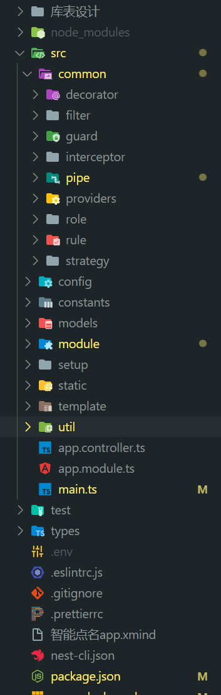
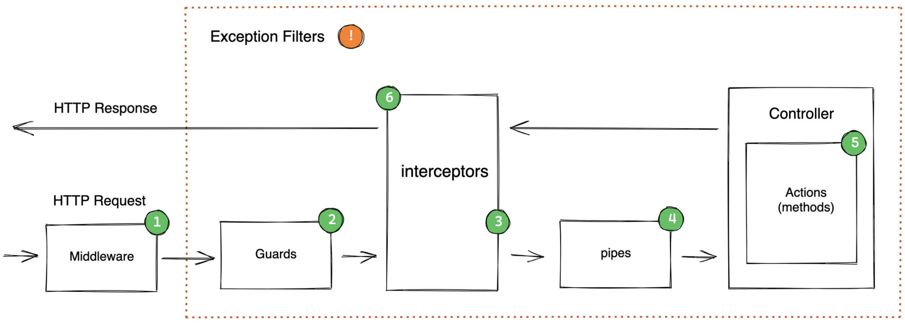
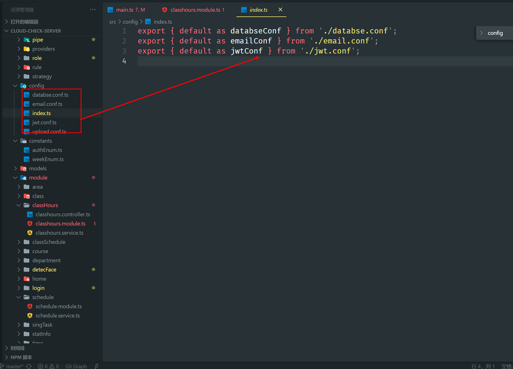

# nestjs 的企业级骨架搭建

[[toc]]

:::tip 开头
最近在使用 nestjs 来作为我毕业设计的后端支持，这篇文章主要用来总结我使用 nestjs 这些天的一些心得和总结，nestjs 是一个高度分装的，扩展性非常强的一个服务端应用框架，他的高扩展性同时也是一柄双刃剑，如果合理的使用它为我们提供的一些服务，会大大提高我们的开发效率和整个服务架构，他的是基于 express 分装的上层应用，支持 AOP 编程
:::

**下面的包管理工具我将使用 pnpm 来管理，npm， yarn ，同理**

> 此文章中并不会详细讲解 nestjs 的具体语法使用：如需学习基础语法 [请查看](../../../posts/20221219-nestjs使用总结)

## 安装 netsjs

- 安装全局脚手架(安装过的可以跳过): `pnpm i -g @nestjs/cli`
- 创建项目:`nest new project-name`

::: info 概述
nestjs 的程序的入口文件是从 main.ts 开始加载，他的内部是按照模块作用域来划分，由一个根组件开始注入，其他模块是挂载在根模块下面
:::

```ts
// file main.ts
import { NestFactory } from '@nestjs/core'
import { NestExpressApplication } from '@nestjs/platform-express'
import * as bodyParser from 'body-parser'
async function bootstrap() {
  const app = await NestFactory.create<NestExpressApplication>(AppModule)
  app.enableCors() // 开启cors
  app.setGlobalPrefix('api', {
    // 排除/路由
    exclude: ['/'],
  }) // 设置全局的请求前缀

  app.use(bodyParser.json({ limit: '50mb' })) // 请求体最大的鞋带大小
  app.use(bodyParser.urlencoded({ limit: '50mb', extended: true }))
  await app.listen(3000)
}
bootstrap()
```

_接下来我们将从这个入口文件开始深入构建_

## 目录结构



这是整个项目的目录结构

```txt
│  .env   环境变量
│  .eslintrc.js   eslint 配置文件
│  .gitignore
│  .prettierrc
│  nest-cli.json   nestjs的配置文件
│  package.json
│  pnpm-lock.yaml
│  README.md
│  tsconfig.build.json
│  tsconfig.json
├─src
│  │  app.controller.ts    根控制层
│  │  app.module.ts   根模块
│  │  main.ts
│  ├─common
│  │  ├─decorator   自定义装饰器
│  │  ├─filter     自定义异常过滤器
│  │  ├─guard      自定以守卫
│  │  ├─interceptor 自定义拦截器
│  │  ├─pipe        自定义管道
│  │  ├─providers    全局提供者
│  │  ├─role       权限校验装饰器
│  │  ├─rule      表单自定义校验规则
│  │  └─strategy    jwt策略
│  ├─config        全局配置文件
│  ├─constants     枚举文件
│  ├─models       库表模块文件
│  ├─module       系统其余模块
│  ├─static       静态资源模块
│  │  └─image
│  ├─template     邮件发送模版
│  └─util         工具文件
├─types          类型声明文件
```

## nestjs 生命周期

> 首先我们先来，了解一下 nestjs 的解析流程，接下来我会以下面的流程顺序展开讲解



一般来说，nest.js 请求生命周期大致如下：

1. 收到请求

2. 全局绑定的中间件

3. 模块绑定的中间件

4. 全局守卫

5. 控制层守卫

6. 路由守卫

7. 全局拦截器（控制器之前）

8. 控制器层拦截器 （控制器之前）

9. 路由拦截器 （控制器之前）

10. 全局管道

11. 控制器管道

12. 路由管道

13. 路由参数管道

14. 控制器（方法处理器）

15. 路由拦截器（请求之后）

16. 控制器拦截器 （请求之后）

17. 全局拦截器 （请求之后）

18. 异常过滤器 （路由，之后是控制器，之后是全局）

19. 服务器响应

## 全局自定义守卫

> 自定义全局守卫的主要职责是，在请求到达之前对请求参数进行校验，并且可以统一错误格式
>
> 下面用到了两个主要库`class-transformer`和`class-validator`主要是用于对参数进行校验装换的库，具体使用 方法可以去其官网查看，下面也会具体讲解其使用方法

::: tabs

@tab main.ts

```typescript
import { AppModule } from './app.module';
import { ValidatePipe } from './common/pipe/validate.pipe';

async function bootstrap() {
  const app = await NestFactory.create<NestExpressApplication>(AppModule);
  .....
  // 自定义验证守卫守卫
  app.useGlobalPipes(new ValidatePipe({ whitelist: false }));
  .....

  await app.listen(3030);
}
bootstrap();

```

@tab validate.pipe.ts

```typescript
import { ValidateErrInfo } from '@/types'
import { MyException } from '@/util/MyException'
import {
  ArgumentMetadata,
  ValidationError,
  ValidationPipe,
} from '@nestjs/common'
import { plainToClass } from 'class-transformer'
import { validate } from 'class-validator'

const deepError = (errors: ValidationError): ValidateErrInfo[] => {
  const field = errors.property
  const message = errors.constraints ? Object.values(errors.constraints)[0] : ''
  if (errors.children?.length > 0) {
    const errList: ValidateErrInfo[] = []
    for (const error of errors.children) {
      error.property = `${field}.${error.property}`
      let err: any = deepError(error)
      err = Array.isArray(err) ? err.flat(Infinity) : [err]
      errList.push(...err)
    }
    return errList
  }
  return [{ field, message }]
}

export class ValidatePipe extends ValidationPipe {
  async transform(value: any, metadata: ArgumentMetadata) {
    const { metatype } = metadata
    //前台提交的表单数据没有类型，使用 plainToClass 转为有类型的对象用于验证
    const object = plainToClass(metatype, value)

    //根据 DTO 中的装饰器进行验证
    const errors = await validate(object)

    if (errors.length) {
      const messages = errors.flatMap((error) => {
        return deepError(error)
      })

      throw new MyException({ error: messages, code: '400' })
    }
    return value
  }
}
```

:::

### class-validator

> 安装: npm i class-validator

基本使用

::: tabs

@tab create-user.dto.ts

```typescript
import { VerifyPasswordRule } from '@/common/rule/verify-password.rule'
import { AuthType, SexType, UserType } from '@/models/users'
import {
  IsDefined,
  IsIn,
  ValidateIf,
  ValidationArguments,
  IsEmail,
  IsString,
  Validate,
  MinLength,
  Length,
} from 'class-validator'
import { EmailRegister } from '@/common/rule/email-register.rule'
import { PickType } from '@nestjs/mapped-types'
import { IsConfirmedRule } from '@/common/rule/confirmation.rule'

export class CreateUserDto implements UserType {
  @IsDefined({ message: '请输入邮箱' })
  @IsEmail({}, { message: '请输入合法邮箱' })
  @Validate(EmailRegister, ['register'])
  email?: string
  @IsDefined({ message: '请选择身份' })
  @IsIn(['teacher', 'student'], { message: '身份错误' })
  auth?: AuthType
  @IsDefined({ message: '请选择性别' })
  @IsIn([0, 1], { message: '性别错误' })
  sex?: SexType
  @IsDefined({ message: '请输入密码' })
  @IsString({ message: '密码为字符串类型' })
  @MinLength(9, { message: '密码长度最少9位' })
  @Validate(VerifyPasswordRule)
  password?: string

  @IsDefined({ message: '请输入用户名' })
  @IsString({ message: '用户名为字符串类型' })
  userName?: string

  @ValidateIf((o: CreateUserDto) => ['student', 'teacher'].includes(o.auth))
  @IsDefined({
    message(args: ValidationArguments) {
      const obj = args.object as CreateUserDto
      if (obj.auth === 'student') return '请输入学号'
      if (obj.auth === 'teacher') return '请输入教室编号'
    },
  })
  @IsString({ message: '编号为字符串类型' })
  account?: string
}

// 提取别的Dto里面的类型校验
export class LoginDto extends PickType(CreateUserDto, ['email', 'password']) {
  @IsDefined({ message: '请输入邮箱' })
  @Validate(EmailRegister, ['login'])
  @IsEmail({}, { message: '请输入合法邮箱' })
  email?: string

  @IsDefined({ message: '请输入密码' })
  @IsString({ message: '密码为字符串类型' })
  @Validate(IsConfirmedRule)
  password: string
}
```

@tab login.controller.ts

```typescript
。。。。。
  @Post('login')
  // 使用 校验
  async login(@Body() payload: LoginDto) {
    return await this.loginService.login(payload);
  }
。。。。。
```

:::

### 嵌套校验

我们需要利用两个装饰器

\- `@Type` 这个装饰器主要帮助我们进行递归 JSON 的实例化，如果不进行实例化的话无法使用下面那个装饰器进行递归校验

\- `@ValidateNested` 开启递归校验

需要实现一下 validatePipe 使用 plainToClass 进行装换

```typescript
const deepError = (*errors*: ValidationError): ValidateErrInfo[] => {
const field = errors.property;
 const message = errors.constraints
  ? Object.values(errors.constraints)[0]
  : '';
 if (errors.children?.length > 0) {
  const errList: ValidateErrInfo[] = [];
  for (const error of errors.children) {
   error.property = `${field}.${error.property}`;
   let err:any = deepError(error);
   err = Array.isArray(err) ? err.flat(Infinity) : [err];
   errList.push(...err);
  }
  return errList;
 }
 return [{ field, message }];
};

export class ValidatePipe extends ValidationPipe {

 async transform(value: any, metadata: ArgumentMetadata) {

  const { metatype } = metadata;
  //前台提交的表单数据没有类型，使用 plainToClass 转为有类型的对象用于验证
 const object = plainToClass(metatype, value);
//根据 DTO 中的装饰器进行验证
  const errors = await validate(object);
  if (errors.length) {
   const* messages = errors.flatMap((error) => {
    return deepError(error);
   });
   throw new MyException({ error: messages, code: '400' });

  }
  return value;
 }
}

// main.ts

app.useGlobalPipes(new ValidatePipe({ whitelist: false }));
```

## 全局异常过滤器

::: tabs

@tab http.exception

```typescript
import { ErrorDataImp } from '@/types'
import {
  ExceptionFilter,
  Catch,
  ArgumentsHost,
  HttpException,
  HttpStatus,
} from '@nestjs/common'
import { Response } from 'express'
import { BaseError, Error } from 'sequelize'

/**
 * 全局的异常拦截器
 */
@Catch()
export class AllExceptionsFilter implements ExceptionFilter {
  catch(exception: unknown, host: ArgumentsHost) {
    const ctx = host.switchToHttp()
    const response = ctx.getResponse() as Response
    const request = ctx.getRequest()

    if (exception instanceof HttpException) {
      const status = exception.getStatus()
      const message = exception.getResponse() as ErrorDataImp
      response.status(status).json({
        statusCode: status,
        timestamp: new Date().toISOString(),
        path: request.url,
        ...message,
      })
      return
    }

    // sequelize 验证失败
    if (
      exception instanceof BaseError &&
      exception?.name === 'SequelizeValidationError'
    ) {
      const message: ErrorDataImp = {
        code: '400',
        success: false,
        error: (exception as any).errors.map(({ message, path }) => ({
          field: path,
          message,
        })) as ErrorDataImp['error'],
      }
      response.status(400).json({
        statusCode: 400,
        timestamp: new Date().toISOString(),
        path: request.url,
        ...message,
      })
      return
    }

    console.log('exception: ', exception)
    response.status(HttpStatus.INTERNAL_SERVER_ERROR).send(exception)
  }
}
```

@tab app.module.ts

```typescript
@Module({
  imports: [],
  controllers: [AppController],
  providers: [
    {
      // 注册	全局异常过滤器
      provide: APP_FILTER,
      useClass: AllExceptionsFilter,
    },
  ],
})
export class AppModule {}
```

:::

## 全局拦截器

使用全局拦截器可以统一我们的响应体格式

::: tabs

@tab response.interceptor.ts

```typescript
import {
  Injectable,
  NestInterceptor,
  ExecutionContext,
  CallHandler,
} from '@nestjs/common'
import { Response } from 'express'
import { Observable } from 'rxjs'
import { map } from 'rxjs/operators'

@Injectable()
export class ResponseInterceptor implements NestInterceptor {
  intercept(context: ExecutionContext, next: CallHandler): Observable<any> {
    const res = context.switchToHttp().getResponse() as Response
    return next.handle().pipe(
      map((r) => {
        const base = {
          success: true,
          timestamp: new Date(),
          code: res.statusCode,
          message: undefined,
          data: null,
        }

        if (typeof r === 'object' && r !== null) {
          const { message, data } = r
          if (!message) Object.assign(base, { data: r })
          if (message) Object.assign(base, { message })
          if (message && data) Object.assign(base, { data })

          return base
        }

        return Object.assign(base)
      })
    )
  }
}
```

@tab app.module.ts

```typescript
@Module({
  imports: [],
  controllers: [AppController],
  providers: [
    {
      // 注册全局拦截器
      provide: APP_INTERCEPTOR,
      useClass: ResponseInterceptor,
    },
  ],
})
export class AppModule {}
```

:::

## 通过自定义守卫实现 RABC 权限校验

### 1.创建一个守卫类用来校验权限

```typescript
// policies.guard.ts
import { Injectable, CanActivate, ExecutionContext } from '@nestjs/common'
import { Reflector } from '@nestjs/core'
import { Request } from 'express'
import { Observable } from 'rxjs'
import { UserType } from '@/models/users'
import { ROLES_KEY, ROLES_TYPE } from '../role/role.decorator'

@Injectable()
export class PoliciesGuard implements CanActivate {
  constructor(private reflector: Reflector) {}
  canActivate(
    context: ExecutionContext
  ): boolean | Promise<boolean> | Observable<boolean> {
    const { user } = context.switchToHttp().getRequest() as Request & {
      user: { user: UserType }
    }
    //获取聚合装饰器中的元信息
    const role = this.reflector.get<ROLES_TYPE>(ROLES_KEY, context.getHandler())

    const validateRole = (role: ROLES_TYPE) => {
      if (user.user.auth === role || user.user.super) return true
      if (role === 'admin') return user.user.isAdmin
      return false
    }

    if (!role) return true
    if (typeof role === 'string') {
      return validateRole(role)
    }
    if (Array.isArray(role)) {
      return role.some((r) => validateRole(r))
    }

    return false
  }
}
```

### 2.自定义一个装饰器用来传递权限

```typescript
import { RoleType } from '@/constants/authEnum'
import { SetMetadata } from '@nestjs/common'

export const ROLES_KEY = 'roles'

export type ROLES_TYPE = RoleType | RoleType[]

// 设置权限
export const Role = (role: ROLES_TYPE) => SetMetadata(ROLES_KEY, role)
```

### 3.创建权限装饰器

> 权限枚举

```typescript
export enum AuthEnum {
  ADMIN = 'admin', // 管理员
  SUPER = 'super', // 超级管理员
  TEACHER = 'teacher', // 教师用户
  STUDENT = 'student', // 学生用户
}

export type RoleType = `${AuthEnum}`
```

```typescript
import { AuthEnum } from '@/constants/authEnum'
import { applyDecorators, UseGuards } from '@nestjs/common'
import { AuthGuard } from '@nestjs/passport'
import { Role, ROLES_TYPE } from './role.decorator'
import { PoliciesGuard } from '../guard/policies.guard'

// 权限校验
export const Auth = (role?: ROLES_TYPE) =>
  applyDecorators(Role(role), UseGuards(PoliciesGuard))

export const Admin = () => Auth(AuthEnum.ADMIN)
export const Teacher = () => Auth(AuthEnum.TEACHER)
export const Super = () => Auth(AuthEnum.SUPER)
export const Student = () => Auth(AuthEnum.STUDENT)
```

### 4.使用

在控制器中使用

```typescript
  @Post('update')
  @Auth(['admin', 'teacher'])
  async updateClass(@Body() payload: UpdateClassDto, @User() user: UserType) {
   ........
  }

  @Post('create')
  @Super()
  async createClass(@Body() createClass: CreateClassDto) {
   .....
  }
```

## 自定义校验器

有时候`class-validator`本身提供的一些校验方法无法满足我们的需求这时候我们就可以自定义我们的校验器

例:

```typescript
// email-register.rule.ts
import { User } from '@/models/users';
import { MyException } from '@/util/MyException';
import {
  ValidationArguments,
  ValidatorConstraint,
  ValidatorConstraintInterface,
} from 'class-validator';

@ValidatorConstraint()
export class EmailRegister implements ValidatorConstraintInterface {
  async validate(value: string, args: ValidationArguments) {
    // console.log('args: ', args);
    if (!value) return false;
    const user = await User.findOne({ where: { email: value } });

    if (args.constraints) {
      if (args.constraints[0] === 'register') {
        if (user) throw new MyException({ code: '400', error: '用户已注册' });
        return true;
      }

      if (args.constraints[0] === 'login') {
        if (!user || user.isBan)
          throw new MyException({ code: '400', error: '用户不存在' });
        return true;
      }
    } else {
      const type = (args.object as any).type;
      switch (type) {
        case 'register':
          if (user) throw new MyException({ code: '400', error: '用户已注册' });
          return true;

        case 'login':
          return true;
          break;
      }
    }
  }

  defaultMessage(args: ValidationArguments) {
    return '错误';
  }
}
```

使用

```typescript
import { IsDefined, IsEmail, Validate } from 'class-validator';
import { EmailRegister } from '@/common/rule/email-register.rule';
export class SendMailDto {
  @IsDefined({ message: '请输入邮箱' })
  @IsEmail({}, { message: '请输入合法邮箱' })
  @Validate(EmailRegister)
  email?: string;
}
```

##  定时任务

这边不过多赘述定时任务的实现具体请[查看](https://docs.nestjs.cn/9/techniques?id=%e5%ae%9a%e6%97%b6%e4%bb%bb%e5%8a%a1)

## 全局配置抽离

```bash
pnpm add @nestjs/config
```

```typescript
//使用
import { ConfigModule } from '@nestjs/config';
import * as config from './config';

@Module({
  imports: [
   	...
      ConfigModule.forRoot({
      isGlobal: true,
      load: [...Object.values(config)],
    }),
  ],
 	...
})
```



例如

```typescript
import { registerAs, ConfigService } from '@nestjs/config';
import { join } from 'path';
import { EjsAdapter } from '@nestjs-modules/mailer/dist/adapters/ejs.adapter';
// 创建命名控件
export default registerAs('email', () => {
  return {};
});

```

## 高速缓存

在 **app.module.ts** 中注册模型

```typescript
import { CacheModule } from '@nestjs/common'

@Module({
  imports: [
    CacheModule.register({
      isGlobal: true,
    }),
    ...
  ],
```

然后在服务服务中使用

```typescript
export class SmsService {
  constructor(
    @Inject(CACHE_MANAGER) private cacheService: Cache,
  ) {}
  
	async cache(){
		//设置缓存 ttl为多少秒后过期
  	await this.cacheService.set('houdunren', '向军大叔', { ttl: 600 })
  	//读取缓存
  	await this.cacheService.get('houdunren')
  }
  ...
}
```

## 	限流

```bash
pnpm add @nestjs/throttler
```

然后在 **app.module.ts** 中定义模块

```typescript
import { ThrottlerGuard, ThrottlerModule } from '@nestjs/throttler'

@Module({
  imports: [
    ThrottlerModule.forRoot({
    	//每60秒
      ttl: 60,
      //限制接口访问10次
      limit: 10,
    }),
  ],
  //定义全局守卫，这样可以在其他模块中使用限流
  providers: [
    {
      provide: APP_GUARD,
      useClass: ThrottlerGuard,
    },
  ],
})
export class AppModule {}
```

## JWT的实现

安装

> passport-jwt               @nestjs/passport          @nestjs/jwt

### 1.全局注册策略

创建策略类

```typescript

// jwt.strategy.ts
import {
  CACHE_MANAGER,
  Inject,
  Injectable,
  UnauthorizedException,
} from '@nestjs/common';
import { ConfigService } from '@nestjs/config';
import { PassportStrategy } from '@nestjs/passport';
import { ExtractJwt, Strategy } from 'passport-jwt';
import { Cache } from 'cache-manager';
import { User } from '@/models/users';

@Injectable()
export class JwtStrategy extends PassportStrategy(Strategy, 'jwt') {
  constructor(
    private readonly config: ConfigService,
    @Inject(CACHE_MANAGER) private readonly cache: Cache,
  ) {
    super({
      //解析用户提交的header中的Bearer Token数据
      jwtFromRequest: ExtractJwt.fromAuthHeaderAsBearerToken(),
      //加密码的 secret
      secretOrKey: config.get('app.token_secret'),
    });
  }
  async validate(payload) {
    const isPass = await this.cache.get(
      `${payload.user.userId}_${payload.exp}`,
    );
    if (isPass) throw new UnauthorizedException();

     // 获取用户
    const user = ....
    if (!user) return false;
    payload.user = user.toJSON();
    return payload;
  }
}

```

创建全局策略模块

```typescript
import { JwtStrategy } from '@/common/strategy/jwt.strategy';
import { Global, Module } from '@nestjs/common';

@Global()
@Module({
  providers: [JwtStrategy],
})
export class StrategyModule {}
```

然后在app.moudule中引用

### 2. 使用

在需要生成jwt的模块中引用

```typescript
import { Module } from '@nestjs/common';
import { LoginService } from './login.service';
import { LoginController } from './login.controller';
import { JwtModule } from '@nestjs/jwt';
import { ConfigModule, ConfigService } from '@nestjs/config';
@Module({
  imports: [
    JwtModule.registerAsync({
      imports: [ConfigModule],
      inject: [ConfigService],
      useFactory(config: ConfigService) {
        return {
          //设置加密使用的 secret
          secret: config.get('app.token_secret'),
          //过期时间
          signOptions: { expiresIn: '30d' },
        };
      },
    }),
  ],
  controllers: [LoginController],
  providers: [LoginService],
  exports: [LoginService],
})
export class LoginModule {}
```

### 3.生成jwt

在服务中引入jwt服务

```typescript

import { JwtService } from '@nestjs/jwt';

@Injectable()
export class LoginService {
  constructor(
    private readonly jwtServe: JwtService,
  ) {}
  async login(payload: LoginDto) {

    return {
      message: '登录成功',
      data: {
        token: await this.jwtServe.signAsync({ user: {name:'cxn'} }),
      },
    };
  }
}

```

### 4.校验jwt

在权限守卫中添加

```typescript
import {
  applyDecorators,
  UseGuards,
} from '@nestjs/common';
import { AuthGuard } from '@nestjs/passport';
import { Role, ROLES_TYPE } from './role.decorator';
import { PoliciesGuard } from '../guard/policies.guard';

// 权限校验
export const Auth = (role?: ROLES_TYPE) =>
  applyDecorators(
   UseGuards(AuthGuard('jwt')), // 添加的代码
    Role(role),
    UseGuards(PoliciesGuard),
  );


```

## 静态文件

创建全局配置文件

```typescript
import { registerAs } from '@nestjs/config';

const uploadConf = registerAs('upload', () => ({
  root: 'static',
  base: {
    classAvatarDir: {
      private: 'image/class-avatar',// 真实目录
      public: '/image', //虚拟目录
    },
    userAvatarDir: {
      private: 'image/user-avatar',// 真实目录
      public: '/image', //虚拟目录
    },
    courseAvatarDir: {
      private: 'image/course-avatar',// 真实目录
      public: '/image', //虚拟目录
    },
  },
  mime: {
    image: ['png', 'jpg', 'gif', 'jpeg'],
  },
}));
export type UploadConfType = ReturnType<typeof uploadConf>;
export default uploadConf;
```

动态注入

```typescript
// main.ts

import { NestFactory } from '@nestjs/core';
import { NestExpressApplication } from '@nestjs/platform-express';
import { AppModule } from './app.module';
import { join } from 'path';
import uploadConf, { UploadConfType } from '@/config/upload.conf';

async function bootstrap() {
  const app = await NestFactory.create<NestExpressApplication>(AppModule);

  // 动态注入静态目录
  for (const k in uploadConf().base) {
    const value = uploadConf().base[k] as any;
    app.useStaticAssets(
      join(__dirname, '..', uploadConf().root, value.private),
      { prefix: value.public },
    );
  }
  await app.listen(3030);
}
bootstrap();

```

nest-cli.json 需要进行配置

```json
{
  "$schema": "https://json.schemastore.org/nest-cli",
  "collection": "@nestjs/schematics",
  "sourceRoot": "src",
  "compilerOptions": {
    "assets": [
      "template/email/*",
      "static/**/*"
    ]
  }
}
```

## 上传图片

创建上传装饰器

::: tabs

@tab upload.decorator.ts

```typescript
// upload.decorator.ts
import { MyException } from '@/util/MyException';
import { applyDecorators, UseInterceptors } from '@nestjs/common';
import { FileInterceptor } from '@nestjs/platform-express';
import { MulterOptions } from '@nestjs/platform-express/multer/interfaces/multer-options.interface';
import { getExtension } from 'mime';
import { diskStorage } from 'multer';
import { extname, join } from 'path';
import uploadConf, { UploadConfType } from '@/config/upload.conf';
import * as fs from 'fs';
export function fileMimetypeFilter(mimes: string[] = []) {
  return (
    req: any,
    file: Express.Multer.File,
    callback: (error: Error | null, acceptFile: boolean) => void,
  ) => {
    if (mimes.includes(getExtension(file.mimetype))) {
      callback(null, true);
    } else {
      callback(
        new MyException({
          error: '文件类型必须是：' + mimes.map((f) => '.' + f).join(' '),
          code: '400',
        }),
        false,
      );
    }
  };
}

export function Upload(
  fieldName,
  mimeList?: string[],
  dir = '',
  options: MulterOptions = {},
) {
  return applyDecorators(
    UseInterceptors(
      FileInterceptor(fieldName, {
        fileFilter: fileMimetypeFilter(mimeList),
        limits: { fileSize: 1024 * 1024 * 2, files: 1 },
        storage: diskStorage({
          //文件储存位置
          destination: (req, file, callback) => {
            // 正式环境
            // const accessPath = join(
            //   process.cwd(),
            //   'dist',
            //   uploadConf().root,
            //   dir,
            // );
            const accessPath = join(
              process.cwd(),
              'src',
              uploadConf().root,
              dir,
            );
            if (!fs.existsSync(accessPath)) {
              // 递归创建目录
              fs.mkdirSync(accessPath, { recursive: true });
            }
            callback(null, accessPath);
          },
          //文件名定制
          filename: (req, file, callback) => {
            const path =
              Date.now() +
              '_' +
              (req.user as any).user.userId +
              extname(file.originalname);
            callback(null, path);
          },
        }),
        ...options,
      }),
    ),
  );
}

//图片上传
export function Image(field: keyof UploadConfType['base']) {
  return Upload(
    field,
    uploadConf().mime.image,
    uploadConf().base[field].private,
  );
}
```

@tab upload.conf.ts

```typescript
import { registerAs } from '@nestjs/config';

const uploadConf = registerAs('upload', () => ({
  root: 'static',
  base: {
    classAvatarDir: {
      private: 'image/class-avatar',
      public: '/image', //虚拟目录
    },
    userAvatarDir: {
      private: 'image/user-avatar',
      public: '/image', //虚拟目录
    },
    courseAvatarDir: {
      private: 'image/course-avatar',
      public: '/image', //虚拟目录
    },
  },
  mime: {
    image: ['png', 'jpg', 'gif', 'jpeg'],
  },
}));
export type UploadConfType = ReturnType<typeof uploadConf>;
export default uploadConf;

```

:::

在控制器中使用

```typescript

  @Post('courseAvatarDir')
  @Auth()
  @Image('courseAvatarDir')
  async courseAvatarDir(@UploadedFile() file: Express.Multer.File) {
    return {
      message: '上传成功',
      data:
        process.env.HOST +
        uploadConf().base['courseAvatarDir'].public +
        '/' +
        file.filename,
    };
  }
```


## 数据库的使用

### 创建全局配置文件

```typescript
// databse.conf.ts
import { registerAs } from '@nestjs/config';

export default registerAs('database', () => ({
  dialect: 'mysql',
  host: 'localhost',
  port: 3306,
  username: 'root',
  password: 'root',
  database: 'dianming',
  pool: {
    max: 5,
    min: 0,
  },
}));
```

### 创建全局提供器

```typescript
// database.providers.ts
import { Models } from '@/models';
import { Provider } from '@nestjs/common';
import { ConfigService } from '@nestjs/config';
import { Sequelize } from 'sequelize-typescript';

export const SEQUELIZE_KEY = Symbol('SEQUELIZE');
export const databaseProviders = [
  ...Object.keys(Models).map((m) => ({
    provide: m,
    useValue: Models[m],
  })),
  {
    provide: 'MODELS_DATA',
    useValue: Models,
  },
  {
    provide: SEQUELIZE_KEY,
    inject: [ConfigService, 'MODELS_DATA'],
    useFactory: async (config: ConfigService, models: any) => {
      const databaseConf = config.get('database');
      const sequelize = new Sequelize({
        ...databaseConf,
        logging: false,
        define: {
          paranoid: true,
        },
      });

      sequelize.addModels([...Object.values(models)] as any);
      await sequelize.sync({ logging: false, alter: true });
      return sequelize;
    },
  },
] as Provider[];
```

### 创建全局数据库模块

需要再app.module.ts 中注册

```typescript
// sequelize.module.ts
import { databaseProviders } from '@/common/providers/database.providers';
import { Global, Module } from '@nestjs/common';

@Global()
@Module({
  providers: [...databaseProviders],
  exports: [...databaseProviders],
})
export class SequelizeModule {}
```

### 创建数据库模型

例

```typescript
import {
  BelongsTo,
  BelongsToMany,
  Column,
  Default,
  HasOne,
  Model,
  PrimaryKey,
  Table,
  HasMany
} from 'sequelize-typescript';
import { User } from './users';

import {  UUIDV4 } from 'sequelize';
import uploadConf from '@/config/upload.conf';
import { Class } from './class';
import { ClassSchedule } from './classSchedule';
export interface CourseType {
  courseId: string;
  courseName: string;
  picture: string;
  //   userId: string; // 课程创建者
  comment: string; // 注释信息
}

@Table({
  tableName: 'course',
  timestamps: true,
  paranoid: true,
})
export class Course extends Model<Course> implements CourseType {
  @Default(UUIDV4)
  @PrimaryKey
  @Column
  courseId: string;

  @Column
  courseName: string;

  @Column
  get picture(): string {
    return this.getDataValue('picture')
      ? process.env.HOST +
          uploadConf().base['courseAvatarDir'].public +
          '/' +
          this.getDataValue('picture')
      : null;
  }

  @BelongsTo(() => User, { foreignKey: 'userId' })
  user: User;

  userId: string;

  @BelongsToMany(() => Class, () => ClassSchedule)
  class: Class;

  @HasMany(() => ClassSchedule, {
    foreignKey: 'courseId',
    sourceKey:'courseId'
  })
  classSchedule: ClassSchedule[];

  @Column
  comment: string;
}
```

#### 技巧

将所有模块抽离出来到index.ts

```typescript
import { AuthCode } from './authCode';
import { User } from './users';
import { Class } from './class';
import { Department } from './department';
import { Course } from './course';
import { ClassSchedule } from './classSchedule';
import { StatInfo } from './statInfo';
import { SingTask } from './singTask';
import { CoursePerson } from './coursePerson';
import { Area } from './area';
import { Time } from './time';
import { TimingTask } from './timing';
import { ClassHours } from './classHours';
enum ModelsEnum {
  User = 'User',
  AuthCode = 'AuthCode',
  Class = 'Class',
  Department = 'Department',
  Course = 'Course',
  ClassSchedule = 'ClassSchedule',
  StatInfo = 'StatInfo',
  SingTask = 'SingTask',
  CoursePerson = 'CoursePerson',
  Area = 'Area',
  Time = 'Time',
  TimingTask = 'TimingTask',
  ClassHours = 'ClassHours',
}

const Models = {
  User,
  AuthCode,
  Class,
  Department,
  Course,
  ClassSchedule,
  StatInfo,
  SingTask,
  CoursePerson,
  Area,
  Time,
  TimingTask,
  ClassHours,
};

export type ModelsType = typeof Models;

export type PickModelType<T extends `${ModelsEnum}`> = Pick<ModelsType, T>[T];

export { Models, ModelsEnum };
```

### 使用

```typescript
import {
  Controller,
  Inject,

} from '@nestjs/common';
import { ModelsEnum, PickModelType } from '@/models';

@Controller('user')
export class UserController {
  constructor(
    @Inject(ModelsEnum.User)
    private readonly user: PickModelType<ModelsEnum.User>,
    @Inject(ModelsEnum.AuthCode)
    private readonly authCode: PickModelType<ModelsEnum.AuthCode>,
  ) {}
}
```

