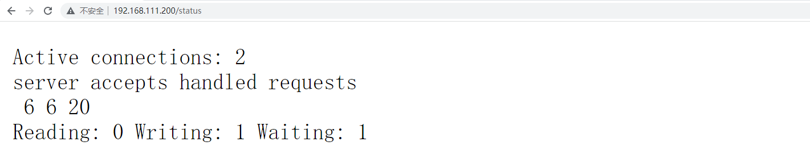

# Nginx服务器配置


##  linux安装

安装centOS7 serve版

> 安装 ：yum -y install net-tools

- 查看ip地址 `ifconfig`

配置IP地址自己百度

## 第一章 基础及安装

### 一、nginx 功能介绍

Nginx ("engine x") 是一款开源的，支持高性能、高并发的 Web 服务和代理服务软件。它是由俄罗斯人 Igor Sysoev 开发的，最初被应用在俄罗斯的大型网站 www.rambler.ru 上。后来作者将源代码以类 BSD 许可的形式开源出来供全球使用。因为它的`稳定性`、`丰富的模块库`、`灵活的配置`和`低系统资源`的消耗而闻名。

目前，市场上还有很多的同类竞品，如大名鼎鼎的apache，Lighttpd。目前，Nginx的市场份额和域数量双双稳居世界第一，并以 4.12 亿的总数遥遥领先其它竞争对手。

**小知识：**

> BSD许可证的条款

使用BSD协议，需要遵守以下规则

1. 如果再发布的产品中包含源代码，则在源代码中必须带有原来代码中的BSD协议；
2. 如果再发布的只是二进制类库/软件，则需要在类库/软件的文档和版权声明中包含原来代码中的BSD协议；
3. 不可以用开源代码的“作者/机构的名字”或“原来产品的名字”做市场推广。

现今存在的开源协议很多，而经过Open Source Initiative（开放源代码倡议）通过批准的开源协议目前有60多种（http://www.opensource.org/licenses/alphabetical ）。我们在常见的开源协议如BSD, GPL, LGPL,MIT等都是OSI批准的协议。

我们可以在这网网站，


我们摘取几个和大家分享一下：

- Apache License 2.0：它是对商业应用友好的许可。使用者也可以在需要的时候修改代码来满足需要并作为开源或商业产品发布/销售。
- BSD开源协议（Berkerley Software Distribution）：商业软件可以使用，也可以修改使用BSD协议的代码。
- MIT ( MIT license )：商业软件可以使用，也可以修改MIT协议的代码，甚至可以出售MIT协议的代码。
- MPL ( Mozilla Public License 1.1 )：商业软件可以使用，也可以修改MPL协议的代码，但修改后的代码版权归软件的发起者。
- CDDL (Common Development and Distribution License )：商业软件可以使用，也可以修改CDDL协议的代码。
- EPL (Eclipse Public License 1.0 )：商业软件可以使用，也可以修改EPL协议的代码，但要承担代码产生的侵权责任。
- GPL ( GNU General Public License )：商业软件不能使用GPL协议的代码。
- LGPL ( GNU Library or “Lesser” General Public License )：商业软件可以使用，但不能修改LGPL协议的代码。

### 二、nginx可以提供的服务

1. web 服务
2. 负载均衡 （反向代理）
3. web cache（web 缓存）

### 三、nginx 的优点

1. 比其他服务器响应更快。
2. 高扩展，nginx的设计极具扩展性，他是由多个功能不同且耦合性极低的模块组成。
3. 单机支持并发极高，理论上支持10万的并发连接，nginx支持的并发连接和内存相关，超过10万也是可以的。
4. 低内存消耗，10000个非活跃的http keep-alive链接在nginx中仅仅消耗2.5M的内存。
5. 支持热部署，如不用停止服务就能重新加载配置文件。
6. 极具自由的BSD许可协议。我们不仅可以直接阅读nginx的源代码、还能用来修改升级。

### 四、nginx应用场合

1. 静态服务器。用来存放我们的静态资源，如图片、静态页面、js、css等。
2. 反向代理，负载均衡。日pv2000W以下，都可以直接用nginx做代理。
3. 缓存服务。

### 五、nginx实战

我们的nginx测试都是在linux环境中进行的，所有首先你需要一个linux系统，可以是云服务器，也可以是自己的vmware。

#### 1、下载nginx安装包

进入nginx官网（http://nginx.org/en/）：


Nginx官网提供了三个类型的版本

- Mainline version：Mainline 是 Nginx 目前主力在做的版本，可以说是开发版
- Stable version：最新稳定版，生产环境上建议使用的版本
- Legacy versions：遗留的老版本的稳定版

我们下载这个最新的稳定版本：


#### 2、安装依赖包

nginx安装依赖GCC、openssl-devel、pcre-devel和zlib-devel软件库，他们的作用如下：

- zlib库用于对HTTP包的内容做gzip格式的压缩，并指定对于某些类型（content-type）的HTTP响应使用gzip来进行压缩以减少网络传输量，则在编译时就必须把zlib编译进Nginx。
- Pcre全称（Perl Compatible Regular Expressions），Perl库，包括 [perlopen in new window](https://baike.baidu.com/item/perl/851577) 兼容的[正则表达式open in new window](https://baike.baidu.com/item/正则表达式)库，如果我们在nginx中使用了正则表达式，那么在编译Nginx时就必须把PCRE库编译进Nginx。
- 如果服务器不只是要支持HTTP，还需要在更安全的SSL协议上传输HTTP，那么需要拥有OpenSSL。另外，如果我们想使用MD5、SHA1等散列函数，那么也需要安装它。可以这样安装：

我们使用一下的命令进行安装：

```bash
yum install gcc zlib-devel  pcre pcre-devel openssl openssl-devel -y 
```

1

小知识：

devel 包主要是供开发用，至少包括以下2个东西头文件和链接，有的还含有开发文档或演示代码。

以 glib 和 glib-devel 为例:

- 如果你安装基于 glib 开发的程序，只需要安装 glib 包就行了。
- 但是如果你要编译使用了 glib 的源代码，则需要安装 glib-devel。

#### 3、编译安装

下载nginx

```bash
wget http://nginx.org/download/nginx-1.22.0.tar.gz
```


解压：

```bash
tar -zvxf nginx-1.22.0.tar.gz
```

nginx最简单的编译安装方式，就是进入目录后，使用以下命令：

```bash
./configure
make
make install
```

- `./configure`命令做了很多幕后工作，包括检测操作系统内核和已经安装的软件，参数的解析，中间目录的生成，以及根据参数生成c源码文件和makefile文件等。
- make命令根据，configure命令生成的makefile文件编译nginx工程，并生成目标文件、最终的二进制文件。
- make install命令负责将nginx安装到指定的安装目录，包括相关目录的建立和二进制文件、位置文件的复制。

以上命令会将nginx按照默认配置（默认模块、默认安装路径）进行安装，如果需要自定义一些配置，则需要使用如下的方式。

具体的命令如下：

- 使用`./configure --help`查看各个模块的使用情况。
- 使用`--without-http_ssi_module`的方式关闭不需要的模块。
- 可以使用`--with-http_perl_modules`方式安装需要的模块。

> 编译命令

```bash
tar -zxf nginx-1.22.0.tar.gz 
cd nginx-1.22.0

mkdir /data/nginx -p

./configure --prefix=/data/nginx --user=nginx --group=nginx  --with-http_ssl_module  --with-http_stub_status_module

# -M ： 不创建主目录  -s ： 不允许登录 /sbin/nologin是一个有一个特殊的shell，不需要登陆
useradd nginx -M -s /sbin/nologin 
make && make install 
```

```nginx
--with-http_ssl_module  安装该模块，该模块是nginx支持ssl协议，提供https服务。
--with-http_stub_status_module  #是一个监视模块，可以查看目前的连接数等一些信息，因为是非核心模块，所以我们使用nginx -V默认是没有安装的
```


> 测试nginx配置文件是否正常

```bash
/data/nginx/sbin/nginx -t 
nginx: the configuration file /data/nginx-1.10.1/conf/nginx.conf syntax is ok
nginx: configuration file /data/nginx-1.10.1/conf/nginx.conf test is successful
```

> 启动nginx服务器

```bash
/data/nginx/sbin/nginx  -t      ## 检查配置文件
/data/nginx/sbin/nginx          ## 确定nginx服务
netstat -lntup |grep nginx      ## 检查进程是否正常
curl http://localhost           ## 确认结果
```


> nginx其他命令

```bash
nginx -s signal
signal：
stop — 立马关闭
quit — 优雅关闭，处理完没处理好的请求后关闭
reload — 重新加载配置文件
reopen — reopening the log files
用来打开日志文件，这样nginx会把新日志信息写入这个新的文件中
```


安装net-tools来查看端口使用情况：

```text
yum -y install net-tools
```


net-tools工具箱包括[arpopen in new window](https://so.csdn.net/so/search?q=arp&spm=1001.2101.3001.7020), hostname, ifconfig, netstat, rarp, route, plipconfig, slattach, mii-tool and iptunnel and ipmaddr等命令。

```bash
netstat -nplt
```


在浏览器输入服务器地址：


### 六、nginx配置文件

nginx安装目录，如下：


> 配置基础配置文件

```nginx
worker_processes  1;
events {
    worker_connections  1024;
}
http {
    include       mime.types;
    default_type  application/octet-stream;
    sendfile        on;
    keepalive_timeout  65;
    server {
        listen       80;
        server_name  localhost;
        location / {
            root   html;
            index  index.html index.htm;
        }
        error_page   500 502 503 504  /50x.html;
        location = /50x.html {
            root   html;
        }
    }
}
### 测试配置文件是否正常
shell> /data/nginx/sbin/nginx -t 
nginx: the configuration file /data/nginx-1.10.3/conf/nginx.conf syntax is ok
nginx: configuration file /data/nginx-1.10.3/conf/nginx.conf test is successful
shell> curl -I http://localhost      # -I代表只显示头信息
HTTP/1.1 200 OK
```

我们不妨先思考一个问题，我们看到的网页是在哪里呢，我们通过`root html`配置结合安装目录中有html目录，大概能猜出来，首页的文件就在html文件夹：


```bash
curl 127.0.0.1
```


### 七、配置文件解读

nginx配置文件主要分为四个部分：

```nginx
main{ #（全局设置）
    http{ #服务器配置
        upstream{} #（负载均衡服务器设置）
        server{ #（主机设置：主要用于指定主机和端口）
            location{} #（URL匹配的设置）
        }
    }
}
```

server继承自main，location继承自server，upstream即不会继承其他设置也不会被继承。 

#### 1、main 全局配置

nginx在运行时与具体业务功能无关的一些参数，比如工作进程数，运行的身份等。

```nginx
user ydlclass;
worker_processes 4;
worker_cpu_affinity 0001 0010 0100 1000;
error_log  /data/nginx/logs/error.log  crit;
pid        /data/nginx/logs/nginx.pid;
worker_rlimit_nofile 65535;
```

1
2
3
4
5
6

- `user nginx;`: 指定nginx进程使用什么用户启动
- `worker_processes 4;` : 指定启动多少进程来处理请求，一般情况下设置成CPU的核数，如果开启了ssl和gzip应该设置成与逻辑CPU数量一样甚至为2倍，可以减少I/O操作。使用`grep ^processor /proc/cpuinfo | wc -l`查看CPU核数。
- `worker_cpu_affinity 0001 0010 0100 1000;`: 在高并发情况下，通过设置将CPU和具体的进程绑定来降低由于多核CPU切换造成的寄存器等现场重建带来的性能损耗。如worker_cpu_affinity 0001 0010 0100 1000; （四核）。
- `error_log logs/error.log;`: error_log是个主模块指令，用来定义全局错误日志文件。日志输出级别有debug、info、notice、warn、error、crit可供选择，其中，debug输出日志最为最详细，而crit输出日志最少。
- `pid logs/nginx.pid;`: 指定进程pid文件的位置。

我们可以使用`ps -ef | grep nginx`查看master和worker的进程，这里有一个master和四个worker：


#### 2、events模块

events 模块主要是nginx 和用户交互网络连接优化的配置内容，我们主要看一下两个配置：

```nginx
events{
  use epoll;
  worker_connections  65536;
}
```


- `use epoll;`是使用事件模块指令，用来指定Nginx的工作模式。Nginx支持的工作模式有select、poll、kqueue、epoll、rtsig和/dev/poll。其中select和poll都是标准的工作模式，kqueue和epoll是高效的工作模式，不同的是epoll用在Linux平台上，而kqueue用在BSD系统中。对于Linux系统，epoll工作模式是首选。在操作系统不支持这些高效模型时才使用select。
- `use epoll;`是使用事件模块指令，用来指定Nginx的工作模式。Nginx支持的工作模式有select、poll、kqueue、epoll、rtsig和/dev/poll。其中select和poll都是标准的工作模式，kqueue和epoll是高效的工作模式，不同的是epoll用在Linux平台上，而kqueue用在BSD系统中。对于Linux系统，epoll工作模式是首选。在操作系统不支持这些高效模型时才使用select。
- `worker_connections 65536;`每一个worker进程能并发处理（发起）的最大连接数。

#### 3、http服务器

```nginx
http{
  include       mime.types;
  default_type  application/octet-stream;
  #charset  gb2312;
  sendfile        on;
  keepalive_timeout  60s;
}
```


- include是个主模块指令，实现对配置文件所包含的文件的设定，可以减少主配置文件的复杂度。该文件也在conf目录中。
- default_type属于HTTP核心模块指令，这里设定默认类型为二进制流，也就是当文件类型未定义时使用这种方式。
- charset gb2312; 指定客户端编码格式。
- sendfile实际上是 Linux2.0+以后的推出的一个系统调用，web服务器可以通过调整自身的配置来决定是否利用 sendfile这个系统调用。sendfile是个比 read 和 write 更高性能的系统接口。 当 Nginx 是一个静态文件服务器的时候，开启 SENDFILE 配置项能大大提高 Nginx 的性能。 但是当 Nginx 是作为一个反向代理来使用的时候，SENDFILE 则没什么用。
- Nginx 使用 keepalive_timeout 来指定 KeepAlive 的超时时间（timeout）。指定每个 TCP 连接最多可以保持多长时间。Nginx 的默认值是 75 秒，有些浏览器最多只保持 60 秒，所以可以设定为 60 秒。若将它设置为 0，就禁止了 keepalive 连接。

## 第二章 实战-部署前后分离项目

本章节我们会演示日常的工作中，我们是怎么利用nginx部署项目的。我们以部署一套前后分离的项目为本次讲述的内容。

### 一、搭建后端项目

创建一个最简单的springboot项目：


只需要依赖一个web模块即可：


提供一个api接口，可以获取服务端的主机地址和服务端口：

```java
@RestController
public class NginxController implements ApplicationListener<WebServerInitializedEvent> {

    private int port;

    @Override
    public void onApplicationEvent(WebServerInitializedEvent event) {
        this.port = event.getWebServer().getPort();
    }

    @GetMapping("host")
    public String getHost(HttpServletRequest request){
        InetAddress address;
        try {
            address = InetAddress.getLocalHost();
            return  address.getHostAddress() + ":" + port;
        } catch (UnknownHostException e) {
            e.printStackTrace();
        }
        return "error：Network card information is not available！";
    }

}
```

测试接口：


### 二、搭建前端项目

搭建前端工程，使用vue官方提供的脚手架搭建一个基础工程：

```http
https://cli.vuejs.org/guide/creating-a-project.html
```


使用`vue ui`搭建脚手架，选择安装vue-router：


启动项目，打开项目：


安装axios：

```bash
npm install axios
```


使用axios访问后端的api接口，修改app.vue如下：

```vue
<template>
  
  <br>服务器的ip和端口是：{{ host }}
</template>

<script>
import axios from 'axios'
export default {
  name: 'App',
  data(){
    return {
      host: ""
    }
  },
  mounted(){
    var ip_addr = document.location.hostname
    axios.get('http://'+ip_addr+':8080/host').then(res=>{
      this.host = res.data
    })
  }
  
}
</script>
```


浏览器访问，发生了跨域问题：


添加配置项，新建`vue.config.js`位置文件，配置代理如下:

```javascript
module.exports = {
  devServer: {
    port: 80,
    proxy: 'http://127.0.0.1:8080'
  }
}
```

同时修改axiso的请求地址：

```javascript
mounted(){
    var ip_addr = document.location.hostname
    axios.get('http://'+ip_addr+'/host').then(res=>{
        this.host = res.data
    })
}
```


再次访问前端工程，发现跨域问题解决：


### 三、nginx做静态服务器

我们都知道，nginx的安装目录中有这样一个文件夹：


我们再结合nginx的基础配置文件中的以下内容：

```nginx
server {
    listen       80;
    server_name  localhost;

    location / {
        root   html;
        index  index.html index.htm;
    }
}
```

我们不妨猜想一下当url为`/`时（当然这是错的），会去html目录寻找index.html文件作为首页。

我们不妨修改一下index.html文件看看，修改是否可以生效。


确实可以生效，于是我们可以得出，结论只需要将我们的q前端文件放在html目录即可（事实上放在哪里都可以）。

我们尝试将构建的结果放入html文件夹：

前端工程产物如下：


上传至nginx：


他真的可以访问了，但是，此时却出现了问题，ngixn无法判断哪些是静态资源，哪些是需要访问api接口的：


问题如下，此问题按下不表，后续处理：


### 四、虚拟主机配置详解

http服务上支持【若干虚拟主机】。每个虚拟主机对应一个server配置项，配置项里面包含该虚拟主机相关的配置。

```nginx
server{
    listen 80 default;
    server_name www.ydlclass.com;
    index index.html index.htm index.php;
    root /data/www;

    location ~ .*\.(gif|jpg|jpeg|png|bmp|swf)${
        expires      30d;
    }

    location ~ .*\.(js|css)?${
        expires      1h;
    }
}
```


- `listen 80;` 监听端口，默认80，小于1024的要以root启动。可以为listen :80、listen 127.0.0.1:80等形式。
- `server_name www.ydlclass.com` 用于设置虚拟主机服务名称，如：127.0.0.1 、 localhost 、域名[www.baidu.com | www.jd.com]，也可以进行正则匹配。
- `root /data/www` 定义服务器的默认网站根目录位置。可以是linux的绝对路径（/xxx/xx），也可以是nginx安装目录的相对路径（html）。
- `index index.jsp index.html index.htm` ：定义路径下默认访问的文件名，一般跟着root放。

#### 1、location 常见的配置项：

location通常用来匹配uri，其基本语法如下：

```nginx
location [=|~|~*|^~] /uri/ {}
```


（1）=表示匹配uri时必须做到完全匹配，如

```nginx
location = /index {}
```


（2）~表示匹配URI时是字母大小写敏感的，可以使用正则表达式。

（3）~*表示匹配URI时是忽略字母大小敏感的，可以使用正则表达式。

（4）^~表示匹配uri时只需满足前缀匹配即可

```nginx
# 所有 /./img/开头的uri会全部匹配
location ^~ /./img/ {}
```

（5）uri参数中是可以使用正则表达式的，如匹配以 .gif .jpg和.jpeg结尾的uri，如下:

```nginx
location ~* \.(gif|jpg|jpeg)$ {}
```


（6）以下方式可以匹配所有的uri

```nginx
location / {}
```

（7）`@` 指定一个命名的location，一般用于内部重定义请求：

```nginx
location @name {…}
```


结果总结： 匹配的优先顺序，`=`>`^~`（匹配固定字符串，忽略正则）>`~*`>`/` ，工作中尽量将‘=’放在前面。

http://192.168.111.201/1.png

#### 2、文件路径的定义

（1）以root方式设置资源路径

语法 root path ，默认 root html，可以在http、server、location模块中配置。

```nginx
location ^~ /backend {
	root /data/www/backend
}
```


如果url为` /backend/index/test.html`则会返回/data/www/backend/backend/index/test.html这个文件。

（2）以alias方式设置资源路径

alias也是用来设置文件资源的，它和root不同点在于如何解读紧跟location后面的uri参数，可以在location中配置：

```nginx
location ^~ /backend {
	alias /data/www/backend
}
```


如果url为 `/backend/index/test.html`则会返回/data/www/backend/index/test.html文件。

alias会将location后的url部分丢弃掉，而root不会。

（3）访问首页

可以在http、server、location中配置。

```nginx
index index.html index.htm index.php
```

nginx会依次访问index中定义的文件，知道访问成功为止。

（4）根据http返回码重定向页面

可以在http、server、location中配置。

```text
error_page 404 /404.html
error_page 502 503 504 /50x.html
```


（5）try_files

```text
try_files path1 path2 ... uri
```


该配置项可以配置在server、location模块。

try_files后边会跟若干路径，nginx会尝试按照顺序访问每一个path，如果可以有效的读取，就直接访问当下path资源，否则继续向下访问，如果都读取不到就重定向到uri参数上

```nginx
try_files /a/b.html $uri $uri/index.html $uri.html @other;
location @other {
    proxy_pass http://backend
}
```


#### 3、解决前端的路由问题

我们在前端直接点击路由的按钮可以访问，因为这种情况并未再次向nginx发送请求，仅仅是前端的路由切换：


但是，如果直接访问`/about`就GG了，这个url直接访问nginx时，nginx会认为你要查找about这个资源，当然是404了：


所以我们要通过一些配置来解决这个问题，vue工程都是单页面的，所以无论哪个路由都应该使用唯一的index.html，所以我们可以做如下的配置，该配置的意思就是将其他的所有请求，都强制使用/index.html：

```nginx
location / {
    root /data/www/ui;
    try_files /index.html;
}
```


但是这个有问题的，比如下边的请求，也会强制使用index.html，我明明需要js，你却给我一个HTML：

```http
http://192.168.111.201/js/app.aa11d15b.js
```


所以配置要改成下边的内容，$uri是一个变量，他就是具体的url，对一`/js/app.aa11d15b.js`这个请求，首先会访问`/data/www/ui/js/app.aa11d15b.js`这个资源，当然存在，就直接返回了，而其他的路由资源会使用index.html：

```nginx
location / {
    root /data/www/ui;
    try_files $uri $uri/ $uri/index.html $uri.html /index.html;
}
```


#### 4、对图片开启gzip压缩

在http模块中添加如下内容：

```nginx
gzip on;
gzip_min_length 1k;
gzip_buffers    4 16k;
gzip_http_version 1.1;
gzip_comp_level 5;
gzip_types image/png;
gzip_vary on;
```


解释如下：

- gzip on;使用"gzip on;"参数来启用压缩，默认是关闭的。
- gzip_min_length 1k;gzip压缩的最小文件，小于设置值的文件将不会压缩#指定Nginx服务需要向服务器申请的缓存空间的个数*大小，默认32 4k|16 8k;
- gzip_buffers 4 16k;设置压缩缓冲区大小，此处设置为4个16K内存作为压缩结果流缓存
- gzip_http_version 1.1;启用压缩功能时，协议的最小版本，默认HTTP/1.1
- gzip_comp_level 5;压缩比例由低到高从1到9，默认为1。但需要注意的是压缩比设置的越高就会越消耗CPU的资源，因此在生产环境中我们会设置该参数的值在3~5之间，最好不要超过5，因为随着压缩比的增大的确会降低传输的带宽成本但发送数据前会占用更多的CPU时间分片。
- gzip_types image/png;指明仅对哪些类型的资源执行压缩操作；默认为gzip_types text/html，不用显示指定，否则出错。
- gzip_vary on;该指令用于设置在使用Gzip功能时是否发送带有“Vary: Accept-Encoding”头域的响应头部。该头域的主要功能是告诉接收方发送的数据经过了压缩处理。开启后的效果是在响应头部添加了Accept-Encoding: gzip，这对于本身不支持Gzip压缩的客户端浏览器是有用的。

这一次没有设置图片压缩：


设置图片压缩后，响应多了如下的首部信息：


### 五、反向代理解决跨域

#### 1、配置nginx反向代理

我们可以通过proxy_pass参数设置反向代理的服务器，语法如下：

```nginx
location / {
    proxy_pass http://ydl.com;
}
```


我们的实现逻辑很简单，就是将以`/api`为前缀的uri全部反向代理到真正的后端服务即可。

安装java环境：


后台启动成功：


我们为了区分前端页面和api接口，将所有访问后端api的url统一加上前缀 /api

```javascript
mounted(){
  var ip_addr = document.location.hostname
  axios.get('http://'+ip_addr+'/api/host').then(res=>{
   this.host = res.data
  })
}
```


现在我们想的是将前端发送的以api打头的url全部代理到，后端8080端口：

前端访问的接口：http://192.168.111.200:80/api/host

后端的接口：http://192.168.111.200:8080/host

在实现代理的过程中，我们需要将/api这个前缀删除掉，有以下两种方法，一种是重写url，如下：

```nginx
location ^~ /api/ {
    rewrite ^/api(.*)$ $1 break;
    proxy_pass http://127.0.0.1:8080;
}
```

更简单的做法是，在代理地址的后边加`/`，这样做也会去掉前缀，但不如以上方式灵活：

```nginx
location ^~ /api/ {
    proxy_pass http://127.0.0.1:8080/;
}
```


小知识：location中的rewirte：

1. rewrite break：url重写后，直接使用当前资源，不再执行location里余下的语句，完成本次请求，地址栏url不变
2. rewrite last：url重写后，马上发起一个新的请求，再次进入server块，重试location匹配，超过10次匹配不到报500错误，地址栏url不变
3. rewrite redirect：返回302临时重定向，地址栏显示重定向后的url。

### 六、为后端工程做负载均衡

有时候，我们的后端工程压力太大，可能需要将后端工程部署在多台服务器上，此时就需要使用负载均衡了，在学习负载均衡的时候我们不妨先了解一下upstream模块。

#### 1、upstream模块解读

nginx 的负载均衡功能依赖于 ngx_http_upstream_module模块。upstream 模块应该放于http{}标签内。

模块写法如下：

```nginx
upstream backend {
    ip_hash; 
    server backend1.example.com;
    server backend2.example.com:8080;
    server 127.0.0.1:8080;
    server backup2.example.com:8080;
}
```


然后在location处使用如下写法：

```nginx
location / {
    proxy_pass http://backend;
}
```


以上写法的意思就是，将来同一个url访问我们的服务时，服务可以由backend中的服务器按照某种特定规则轮流提供。

> ngixn负载均衡的五种算法

（1）round robin 轮询 （默认） 按时间顺序依次将请求分配到各个后台服务器中，挂掉的服务器自动从列表中剔除

```nginx
upstream bakend {  
   server 192.168.0.1 down;    
   server 192.168.0.2;  
}
```

（2）weight 轮询权重 weight的值越大分配到的访问概率越高，主要用于后端每台服务器性能不均衡的情况下，或在主从的情况下设置不同的权值，达到合理有效的地利用主机资源。

```nginx
upstream bakend {  
    server 192.168.0.1 weight=20;  
    server 192.168.0.2 weight=10;  
}
```


（3）ip_hash：每个请求按访问IP的哈希结果分配，使来自同一个IP的访客固定访问一台后端服务器，并且可以有效解决动态网页存在的session共享问题。

```nginx
upstream bakend {  
    ip_hash;  
    server 192.168.0.1:88;  
    server 192.168.0.2:80;  
} 
```


（4）url_hash：按访问的URL的哈希结果来分配请求，使每个URL定向到同一台后端服务器，可以进一步提高后端服务器缓存的效率。Nginx本身不支持url_hash，需要安装Nginx的hash软件包。

```nginx
upstream backend {  
    server 192.168.0.1:88;     //使用hash语句时，不能在使用weight等其他参数
    server 192.168.0.2:80;  
    hash $request_uri;  
    hash_method crc32;    //使用hash算法
}
```


（5）fair算法：可以根据页面大小和加载时间长短智能地进行负载均衡，根据后端服务器的响应时间来分配请求，响应时间短的优先分配。Nginx本身不支持fair，要安装upstream_fair模块才能使用。

```nginx
upstream backend {  
    server 192.168.0.1:88;  
    server 192.168.0.2:80;  
    fair;  
}
```


#### 2、项目配置

首先我们需要将我们的后端项目在服务器中启动两份或多份，可以是同一台服务器，也可以是多台服务器，只要可以互联互通即可。

同一台服务器可以使用如下命令，重新指定一个端口即可：

```text
java -jar ydl-nginx.jar --server.port=8081
```

我们需要定义一个upstream，将都有的后端服务配置在其中：

```nginx
upstream ydlclass {
    server 127.0.0.1:8080 weight 10;
    server 127.0.0.1:8081 weight 20;
}
```

修改location的proxy_pass：

```nginx
location ^~ /api/ {
    proxy_pass http://ydlclass/;
}
```


在浏览器中不停的刷新，发现端口在不停的变化，说明我们的多次请求确实落在了不同服务上。


### 七、其他的跨域问题

如果现在本机的前端项目（也就是其他服务器的前端项目）也想要访问虚拟机中ngixn代理的api接口。这是一个典型的不同的项目之间进行访问的问题，这必然存在跨域问题，如下图：


我们将本地的vue工程进行如下修改：

```javascript
mounted(){
    axios.get('http://192.168.111.200/api/host').then(res=>{
      this.host = res.data
    })
  }
```


此时，确实发生了跨域问题：


根据我们学习过的知识要解决跨域问题。其实，只需要在客户端发送【预检请求】时指定对应的响应头即可，nginx可以很方便的给响应增加一些首部信息，方法如下，在：

```nginx
location ^~ /api/ {
    add_header 'Access-Control-Allow-Origin' '*';
	add_header 'Access-Control-Allow_Credentials' 'true';
	add_header 'Access-Control-Allow-Headers' 'Authorization,Accept,Origin,DNT,X-CustomHeader,Keep-Alive,User-Agent,X-Requested-With,If-Modified-Since,Cache-Control,Content-Type,Content-Range,Range';
	add_header 'Access-Control-Allow-Methods' 'GET,POST,OPTIONS,PUT,DELETE,PATCH';
    proxy_pass http://ydlclass/;
}
```


访问本地地址，本次访问跨域的问题被解决了：


我们也能看到对应的响应首部信息，多了如下内容：


### 八、nginx监控

开启nginx的监控服务

#### 1、开启状态页

```nginx
#设定查看Nginx状态的地址   
location = /status {  
  stub_status on;   	#表示开启stubStatus的工作状态统计功能。
}
```


#### 2、访问URL

```bash
curl http://127.0.0.1/status

Active connections:  1
server accepts handled requests
 16 16 18
Reading: 0 Writing: 1 Waiting: 0

# active connections – 活跃的连接数量
# server accepts handled reque
```


我们可以访问/status查看当前nginx的状态：



| 状态码             | 表示的意义                                                   |
| ------------------ | ------------------------------------------------------------ |
| Active connections | 当前所有处于打开状态的连接数                                 |
| accepts            | 总共处理了多少个连接                                         |
| handled            | 成功创建多少握手                                             |
| requests           | 总共处理了多少个请求                                         |
| Reading            | 表示正处于接收请求状态的连接数                               |
| Writing            | 表示请求已经接收完成，且正处于处理请求或发送响应的过程中的连接数 |
| Waiting            | 开启keep-alive的情况下，这个值等于active - (reading + writing)，意思就是Nginx已处理完正在等候下一次请求指令的驻留连接 |

### 五、其它nginx配置

#### 1、访问控制 allow/deny

Nginx 的访问控制模块默认就会安装，而且写法也非常简单，可以分别有多个allow,deny，允许或禁止某个ip或ip段访问，依次满足任何一个规则就停止往下匹配。如：

```nginx
location /status {
  stub_status on;
  access_log off;
  allow 192.168.10.100;
  allow 172.29.73.0/24;
  deny all;
}
```

#### 2、列出目录 autoindex

Nginx默认是不允许列出整个目录的。如需此功能，打开nginx.conf文件，在location，server 或 http段中加入如下参数：这个功能我们可以做一个资源下载站。

```nginx
location ^~ /file {
    root   /data/www;
    autoindex on;
    autoindex_exact_size off;
    autoindex_localtime on;
    charset utf-8,gbk;
}
```

- `autoindex on;`运行列出目录内容。另外两个参数最好也加上去。
- `autoindex_exact_size off;` 默认为on，显示出文件的确切大小，单位是bytes。改为off后，显示出文件的大概大小，单位是kB或者MB或者GB。
- `autoindex_localtime on;` 默认为off，显示的文件时间为GMT时间。改为on后，显示的文件时间为文件的服务器时间。