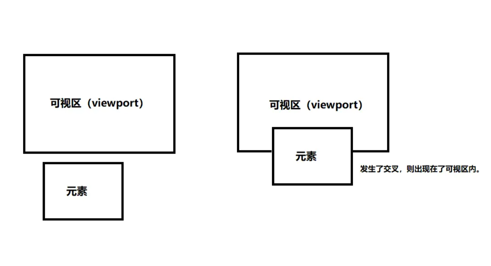
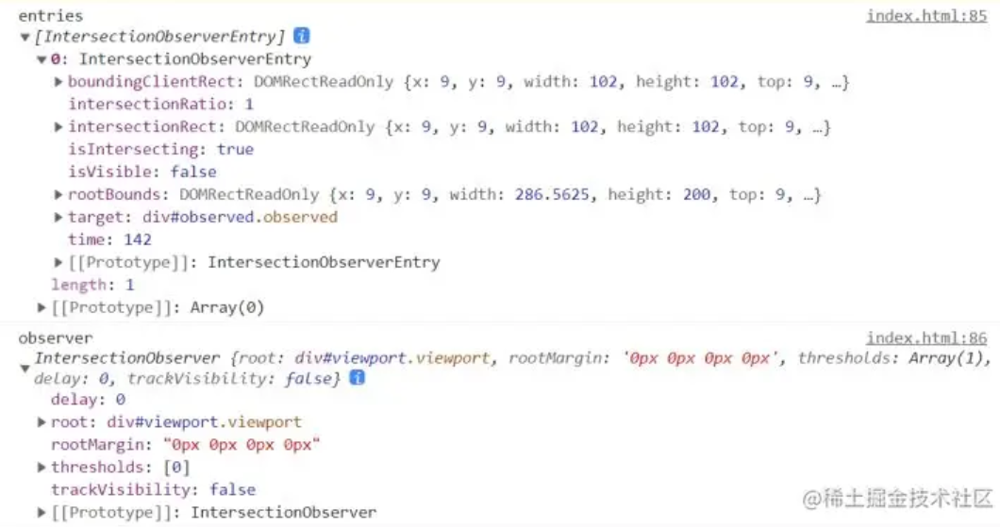

# IntersectionObserver使用总结


## 1.认识 IntersectionObserve

IntersectionObserve 是浏览器提供的一个原生构造函数，它也被称作**交叉观察器。** 它可以观察我们的元素是否可见，也就是是否和可视区发生**交叉。**

**官网的解释：**

> IntersectionObserver 接口提供了一种异步观察目标元素与其祖先元素或顶级文档视窗(viewport)交叉状态的方法。祖先元素与视窗(viewport)被称为根(root)。

官网说的稍微晦涩一点，我们通俗的给大家解释一下，结合一张图应该就很好里面了。

**通俗的解释：**

> 我们可以使用 IntersectionObserver 接口观察一个元素，观察它是否进入了可视区，这个可视区可以相对于视窗或者祖先元素。

**看图理解：**



上面的图就很形象的描述了一个元素逐步出现在可视区内的过程，当元素和可视区发生交叉时，则代表进入可视区内了。而我们的 **“交叉观察器”** IntersectionObserve 就和名字一样，专门用来观察何时交叉。

## 2.基本使用

IntersectionObserve 使用起来很简单，我们了解了它接收的参数以及携带的方法如何使用后，便可以很快的上手。

### **2.1 初始化实例**

因为它是一个构造函数，所以我们可以使用 new 的方式实例化它，**代码如下：**

```js
<script>
  let IO = new IntersectionObserver(callback, options);
</script>
```

该构造函数接收两个参数：

- callback：回调函数，当元素的可见性发生变化，即元素与目标元素相交发生改变时会触发该回调函数。
- options：一些配置项参数，如果不传会有默认值，它可以用来配置可视区元素、什么时候触发回调等等，默认就是浏览器视口。

### **2.2 回调函数参数**

callback 会接收两个参数，主要解释如下：

**entries：**

它是一个 IntersectionObserverEntry 对象数组 ，IntersectionObserverEntry 主要存储的是一些观察元素的信息，主要有以下 7 个属性：

> time：可见性发生变化的时间，是一个高精度时间戳，单位为毫秒
>  target：被观察的目标元素，是一个 DOM 节点对象
>  rootBounds：根元素的矩形区域的信息，getBoundingClientRect()方法的返回值，如果没有根元素（即直接相对于视口滚动），则返回 null
>  boundingClientRect：目标元素的矩形区域的信息
>  isIntersecting：目标元素当前是否可见 Boolean 值 可见为 true
>  intersectionRect：目标元素与视口（或根元素）的交叉区域的信息
>  intersectionRatio：目标元素的可见比例，即 intersectionRect 占 boundingClientRect 的比例，完全可见时为 1，完全不可见时小于等于 0

**observer：**

> 它返回的是被调用的 IntersectionObserve 实例，我们通常无需操作。


### 2.3 options 配置

options 是构造函数的第二个参数，是一个对象的形式，它主要一些配置信息，主要配置项有如下几个：

**root：**

主要用来配置被观察元素是相对于谁可见和不可见，如果不配置，则默认的是浏览器视口。

**threshold：**

主要用来配置两个元素的交叉比例，它是一个数组，用于决定在什么时候触发回调函数。

**rootMargin：**

用来改变可视区域的范围，假如我们可视区域大小是 300x300，可以通过该参数改变可视区域大小，但是实际像素值并没有变，优点类似于我们上拉加载更多场景：当距离底部多少多少像素的时候就加载。

看图理解：


**示例代码：**

```js
let viewport = document.getElementById("viewport"); // 可视区域
let options = {
  root: viewport,
  threshold: [0, 0.5, 1],
  rootMargin: '30px 100px 20px'
}
```

### **2.4 实例方法**

初始化实例后，我们就可以调用实例方法了。IntersectionObserver 实例常用的方法常主要有下面几个：

- IO.observe([element])：使用该方法后代表我们开始观察某个元素了，它接收一个元素节点作为参数，也就是被观察元素。
- IO.unobserve([element])：该方法用于停止观察某元素，同样接收一个元素节点作为参数。
- IO.disconnect()：该方法用于关闭观察器。

可以先简单演示一下，看看何时触发 callback。

## **3.代码演示**

### **3.1 查看 entries 和 observe**

我们先来看一下回调函数里面默认传递的参数打印出来是什么：entries 和 observe。

**示例代码：**

```js
<head>
  <style>
    .viewport {
      width: 300px;
      height: 200px;
      border: 1px solid blue;
      overflow: auto;
    }


    .box1 {
      height: 600px;
      width: 100%;
    }


    .observed {
      width: 100px;
      height: 100px;
      border: 1px solid green;
    }
  </style>
</head>


<body>
  <div class="viewport" id="viewport">
    <div class="box1">
      <div class="observed" id="observed"></div>
    </div>
  </div>
</body>
<script>
  let viewport = document.getElementById("viewport"); // 可视区域
  let observed = document.getElementById("observed"); // 被观察元素
  let options = {
    root: viewport, // 指定可视区元素
  }
  let IO = new IntersectionObserver(IOCallback, options); // 初始化实例
  IO.observe(observed); // 开始观察


  // 回调函数
  function IOCallback(entries, observer) {
    console.info("entries", entries);
    console.info("observer", observer);
  }
</script>
```

**界面显示：**


**输出结果：**



这里的代码还比较简单，我们这里设置了视图窗口为我们指定的 id 为 viewport 的元素，被观察元素为 id 为 observed 的元素。当我们刷新页面的时候，IOCallback 回调函数便会执行，且打印了 entries 和 observe，至于它们中每个参数代表的意义大家可以参照上一节。

### 3.2 实现图片懒加载

图片懒加载是我们非常常见的一个场景了，这里我们拿这个场景距离相信大家可以更加容易理解。

**需求背景：**

我们有非常多的图片，如果一次性全部渲染，非常消耗性能。所以我们需要实现图片出现在可视区域内后在进行渲染加载。

**实现思路：**

- 先确定可视区窗口
- 为所有 img 标签添加一个自定义 data-src 属性，用来存放图片真正路径
- 利用 IntersectionObserve 观察每一张图片是否进入可视区内
- 如果进入可视区内，则将图片的 src 路径替换为真正的 data-src 路径 

**示例代码：**

```js
<head>
  <style>
    .viewport {
      width: 300px;
      height: 200px;
      border: 1px solid blue;
      overflow: auto;
    }


    .box1 {
      height: 600px;
      width: 100%;
    }


    .observed {
      width: 100px;
      height: 100px;
      border: 1px solid green;
    }


    .imgs {
      width: 100px;
      height: 100px;
    }
  </style>
</head>


<body>
  <div class="viewport" id="viewport">
    <div class="box1">
      
      
      
      
      
      
      
      
      
      
      
      
      
      
      
      
    </div>
  </div>
</body>
<script>
  let viewport = document.getElementById("viewport"); // 可视区域
  let imgList = document.querySelectorAll(".imgs"); // 被观察元素


  let options = {
    root: viewport
  }
  let IO = new IntersectionObserver(IOCallback, options);


  // 循环所有 img 标签，使它被观察
  imgList.forEach((item) => {
    IO.observe(item)
  })


  // 回调函数
  function IOCallback(entries, observer) {
    // 循环所有观察元素
    entries.forEach(item => {
      // 如果出现在可视区内，则替换 src
      if (item.isIntersecting) {
        console.info("出现在可视区内")
        item.target.src = item.target.dataset.src  // 替换 src
        IO.unobserve(item.target)  // 停止观察当前元素 避免不可见时候再次调用 callback 函数
      }
    });
  }
</script>

```

上段代码中我们定义了很多图片标签，每张图片都设置了一个默认 src，这个 src 不是真实的图片地址，data-src 属性存放的真实图片地址。在实际项目中，./place.jpg 应该是图片未加载出来时显示的默认效果，这里为了简单，我直接使用了一张图片，项目中可以用 icon 替换。

## 4.兼容性

IntersectionObserve 在前几年似乎没有被重视，因为它存在兼容性问题，但是随着浏览器的更新升级，我们可以放心的使用它了。


## 总结

IntersectionObserve 在有些场景下可以说是非常的方便了，这个 API 并不难，主要是里面的属性和参数不太好记，但是只要我们理解了原理，记忆起来应该也不难。

它的使用场景总结：

- 广告推销：只有广告进入用户的可视区内，广告才自动播放。比如“某乎”。
- 列表上拉加载：在移动端比较常见，可以减少列表的卡顿。
- 图片懒加载：很多场景里面都会遇到。