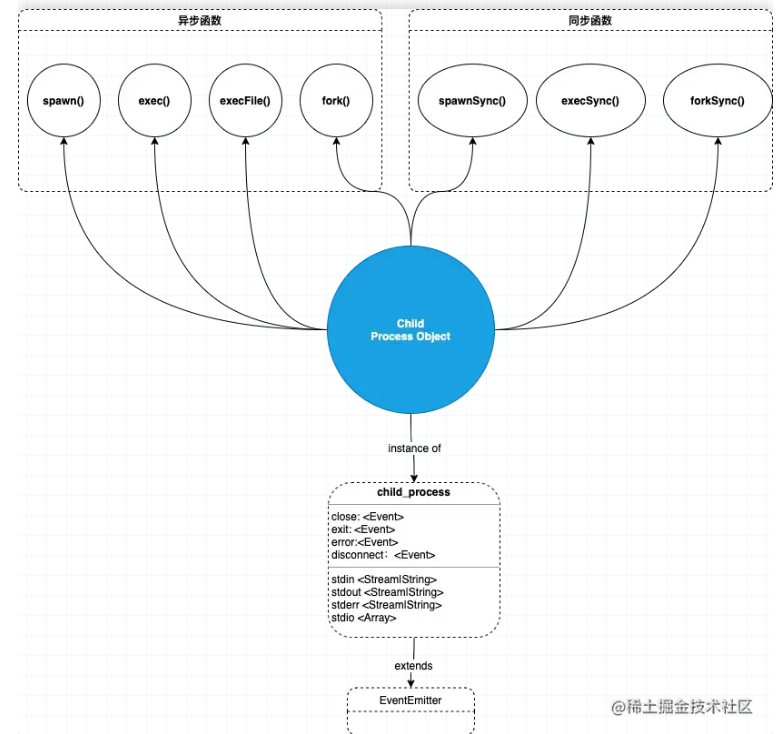

# child_process

我们知道，`node` 是单线程的，当有密集计算时就会出现性能瓶颈，`child_process`就是该性能瓶颈的一个解决方法。他能创建多个子进程分别处理，可以有效的提高程序的执行效率。

利用`node`提供的`child_process`模块，可以很容易的衍生出一个子进程，而且子进程之间可以通过事件消息系统进行互相通信。

`node`的`child_process`模块提供四种异步函数和三种同步函数的方式创建子进程：



### spawn(command,[args],[options])

`spawn`启动一个子进程，并执行命令。

该方法参数如下：

- command, 需要运行的命令
- args, 运行命令的参数, 是一个字符串数组
- options, 配置项
  - shell `<boolean>|<string>` 如果是 `true`，则在 shell 内运行 `command`
  - stdio `<Array>|<string>` 子进程的标准输入输出配置
  - cwd `<string>` 子进程的当前工作目录
  - env `<object>` 环境变量键值对，默认值：process.env
- 返回值 ChildProcess, 返回 ChildProcess 的实例

下面我们举个简单的例子，创建一个子进程并执行`ls -al`命令。

```js
const childProcess = require("child_process");
const ls = childProcess.spawn("ls", ["-al"]);

ls.stdout.on("data", function (data) {
  console.log("data from child: " + data);
});

// 错误
ls.stderr.on("data", function (data) {
  console.log("error from child: " + data);
});

ls.on("close", function (code) {
  console.log("child exists with code: " + code);
});
```


### exec(command[, options][, callback])

`exec`方法将会生成一个子`shell`，然后在该 `shell` 中执行命令，并缓冲产生的数据，当子流程完成后，并将子进程的输出以回调函数参数的形式一次性返回。`exec`方法会从子进程中返回一个完整的`buffer`。

默认情况下，这个`buffer`的大小应该是200k。如果子进程返回的数据大小超过了200k，程序将会崩溃，同时显示错误信息“Error：maxBuffer exceeded”。你可以通过在exec的可选项中设置一个更大的buffer体积来解决这个问题，但是你不应该这样做，因为exec本来就不是用来返回很多数据的方法。

该方法参数如下：

- command, 需要运行的命令
- options
  - `cwd`：当前工作路径。
  - `env`：环境变量。
  - `encoding`：编码，默认是`utf8`。
  - `shell`：用来执行命令的shell，unix上默认是`/bin/sh`，windows上默认是`cmd.exe`。
  - `timeout`：默认是0。
  - `killSignal`：默认是`SIGTERM`。
  - `uid`：执行进程的uid。
  - `gid`：执行进程的gid。
  - `maxBuffer`： 标准输出、错误输出最大允许的数据量（单位为字节），如果超出的话，子进程就会被杀死。默认是200*1024（就是200k啦）
- callback 回调函数，

下面我们举个简单的例子，创建一个子进程并执行`ls -al`命令。

```js
const childProcess = require("child_process");

childProcess.exec("ls -al", {encoding: 'utf8'}, function (error, stdout, stderr) {
  if (error) {
    console.error("error: " + error);
    return;
  }
  console.log("stdout: " + stdout);
});
```

### execFile(file[, args][, options][, callback])

`child_process.execFile()` 函数与 `child_process.exec()`类似，不同之处在于它默认不衍生 shell。 而是指定的可执行文件 `file` 直接作为新进程衍生，使其比 `child_process.exec()` 略有效率。

支持与 `child_process.exec()`相同的`options`。 由于未衍生 shell，因此不支持 I/O 重定向和文件通配等行为。

该方法参数如下：

- file, 可以是执行文件的名字，或者路径。
- args, 运行命令的参数, 是一个字符串数组
- options
  - `cwd`：当前工作路径。
  - `env`：环境变量。
  - `encoding`：编码，默认是`utf8`。
  - `shell`：用来执行命令的shell，unix上默认是`/bin/sh`，windows上默认是`cmd.exe`。
  - `timeout`：默认是0。
  - `killSignal`：默认是`SIGTERM`。
  - `uid`：执行进程的uid。
  - `gid`：执行进程的gid。
  - `maxBuffer`： 标准输出、错误输出最大允许的数据量（单位为字节），如果超出的话，子进程就会被杀死。默认是200*1024（就是200k啦）
- callback 回调函数

下面我们举个简单的例子，创建一个子进程并执行`node --version`命令。

```js
const childProcess = require("child_process");

childProcess.execFile("node", ["--version"], function (error, stdout, stderr) {
  if (error) {
    throw error;
  }
  console.log("execFile", stdout); // execFile v14.21.1
});
```

### fork(modulePath[, args][, options])

`child_process.fork` 是 `spawn()` 的特殊形式，用于在子进程中运行的模块，如 `fork('./connectedChild.js')` 相当于 `spawn(‘node’, ['./connectedChild.js'])` 。与`spawn`方法不同的是，`fork`会在父进程与子进程之间，建立一个通信管道，用于进程之间的通信。

该方法参数如下：

- modulePath, 需要在子进程中运行的模块地址
- args, 字符串参数列表
- options 配置项
  - `execPath`： 用来创建子进程的可执行文件，默认是`/usr/local/bin/node`。也就是说，你可通过`execPath`来指定具体的node可执行文件路径。（比如多个node版本）
  - `execArgv`： 传给可执行文件的字符串参数列表。默认是`process.execArgv`，跟父进程保持一致。
  - `silent`： 默认是`false`，即子进程的`stdio`从父进程继承。如果是`true`，则直接`pipe`向子进程的`child.stdin`、`child.stdout`等。
  - `stdio`： 如果声明了`stdio`，则会覆盖`silent`选项的设置。

下面我们举个简单的例子，创建一个子进程，并完成父子进程的通信。

```js
// connectedChild.js

// 监听主进程传递来的数据
process.on("message", (msg) => {
  console.log("Message from parent:", msg);
  // 如果当前进程是子进程，且与父进程之间通过IPC通道连接着，则process.connected为true
  console.log("process.connected: " + process.connected);
});

// 发送数据给主进程
setTimeout(() => {
  process.send({ name: "child message" });
  // 断开与父进程之间的IPC通道，此时会将 process.connected 置为false
  process.disconnect();
  console.log("process.connected: " + process.connected);
}, 1000);
```

主进程通过`fork`创建一个子进程执行`connectedChild.js`。

```js
const childProcess = require("child_process");

const forked = childProcess.fork("./connectedChild.js");
// 发送数据给子进程
forked.send({ hello: "world" });
// 监听子进程发送来的数据
forked.on("message", (msg) => {
  console.log("Message from child", msg);
});
```

### 总结

1. fork 和 spawn 方法返回的是一个stream
2. exec 和 execFile 方法会把执行结果放在callback中
3. execFile 会执行一个文件，跟exec不一样的地方在于，他不创建一个shell。

   4 . fork 是 spawn 的一种变体，在创建子进程的时候，进程之间会建立IPC通信channel，并通过 on('message', callbak), send(jsonobject) 来交换数据。

5. fork、exec、execFile都是基于spawn的封装。

