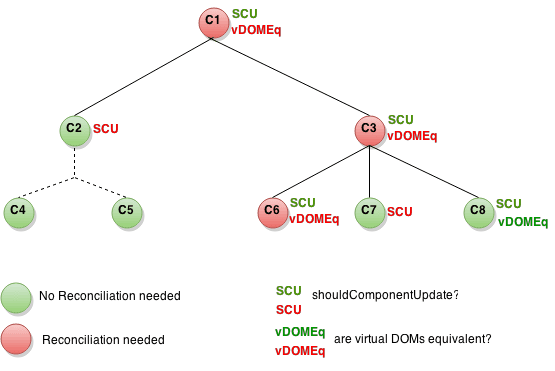

# immer(不可变数据)

## Immer 是什么？

Immer 是一个不可变数据的 Javascript 库，让你更方便的处理不可变数据。

## 什么是不可变数据？

不可变数据概念来源于函数式编程。函数式编程中，对已初始化的“变量”是不可以更改的，每次更改都要创建一个新的“变量”。

Javascript 在语言层没有实现不可变数据，需要借助第三方库来实现。Immer 就是其中一种实现（类似的还有 immutable.js）。

## 为什么使用不可变数据？

在 React 性能优化一节中用了很长篇幅来介绍 `shouldComponentUpdate`，不可变数据也是由此引出。使用不可变数据可以解决性能优化引入的问题，所以重点介绍这一部分背景。

### React 中的性能优化

#### 避免调停（Avoid Reconciliation）

当一个组件的 `props` 或 `state` 变更，React 会将最新返回的元素与之前渲染的元素进行对比，以此决定是否有必要更新真实的 DOM。当它们不相同时，React 会更新该 DOM。虽然 React 已经保证未变更的元素不会进行更新，但即使 React 只更新改变了的 DOM 节点，重新渲染仍然花费了一些时间。在大部分情况下它并不是问题，不过如果它已经慢到让人注意了，你可以通过覆盖生命周期方法 `shouldComponentUpdate` 来进行提速。该方法会在重新渲染前被触发。其默认实现总是返回 `true`，让 React 执行更新：

```jsx
shouldComponentUpdate(nextProps, nextState) {
  return true;
}
```

如果你知道在什么情况下你的组件不需要更新，你可以在 `shouldComponentUpdate` 中返回 `false` 来跳过整个渲染过程。其包括该组件的 `render` 调用以及之后的操作。

#### shouldComponentUpdate 的作用

这是一个组件的子树。每个节点中，`SCU` 代表 `shouldComponentUpdate` 返回的值，而 `vDOMEq` 代表返回的 React 元素是否相同。最后，圆圈的颜色代表了该组件是否需要被调停（Reconciliation）。

节点 C2 的 `shouldComponentUpdate` 返回了 `false`，React 因而不会调用 C2 的 `render`，也因此 C4 和 C5 的 `shouldComponentUpdate` 不会被调用到。

对于 C1 和 C3，`shouldComponentUpdate` 返回了 `true`，所以 React 需要继续向下查询子节点。这里 C6 的 `shouldComponentUpdate` 返回了 `true`，同时由于 `render` 返回的元素与之前不同使得 React 更新了该 DOM。

最后一个有趣的例子是 C8。React 需要调用这个组件的 `render`，但是由于其返回的 React 元素和之前相同，所以不需要更新 DOM。

显而易见，你看到 React 只改变了 C6 的 DOM。对于 C8，通过对比了渲染的 React 元素跳过了真实 DOM 的渲染。而对于 C2 的子节点和 C7，由于 `shouldComponentUpdate` 使得 `render` 并没有被调用。因此它们也不需要对比元素了。

#### 示例

上一小节有一个有趣的例子 C8，它完全没有发生改变，React 却还是对它进行了调停（Reconciliation）。我们完全可以通过条件判断来避免此类问题，避免调停（Reconciliation），优化性能。

如果你的组件只有当 `props.color` 或者 `state.count` 的值改变才需要更新时，你可以使用 `shouldComponentUpdate` 来进行检查：

```jsx
class CounterButton extends React.Component {
  constructor(props) {
    super(props);
    this.state = {count: 1};
  }

  shouldComponentUpdate(nextProps, nextState) {
    if (this.props.color !== nextProps.color) {
      return true;
    }
    if (this.state.count !== nextState.count) {
      return true;
    }
    return false;
  }

  render() {
    return (
      <button
        color={this.props.color}
        onClick={() => this.setState(state => ({count: state.count + 1}))}>
        Count: {this.state.count}
      </button>
    );
  }
}
```

在这段代码中，`shouldComponentUpdate` 仅检查了 `props.color` 或 `state.count` 是否改变。如果这些值没有改变，那么这个组件不会更新。如果你的组件更复杂一些，你可以使用类似“浅比较”的模式来检查 `props` 和 `state` 中所有的字段，以此来决定是否组件需要更新。React 已经提供了一位好帮手来帮你实现这种常见的模式 - 你只要继承 `React.PureComponent` 就行了（函数组件使用 `React.memo`）。所以这段代码可以改成以下这种更简洁的形式：

```jsx
class CounterButton extends React.PureComponent {
  constructor(props) {
    super(props);
    this.state = {count: 1};
  }

  render() {
    return (
      <button
        color={this.props.color}
        onClick={() => this.setState(state => ({count: state.count + 1}))}>
        Count: {this.state.count}
      </button>
    );
  }
}
```

但 `React.PureComponent` 只进行浅比较，所以当 `props` 或者 `state` 某种程度是可变的话，浅比较会有遗漏，那你就不能使用它了。比如使用了数组或对象：（以下代码是错误的）

```jsx
class ListOfWords extends React.PureComponent {
  render() {
    return <div>{this.props.words.join(',')}</div>;
  }
}

class WordAdder extends React.Component {
  constructor(props) {
    super(props);
    this.state = {
      words: ['marklar']
    };
    this.handleClick = this.handleClick.bind(this);
  }

  handleClick() {
    // 这部分代码很糟，而且还有 bug
    const words = this.state.words;
    words.push('marklar');
    this.setState({words: words});
  }

  render() {
    return (
      <div>
        <button onClick={this.handleClick} />
        <ListOfWords words={this.state.words} />
      </div>
    );
  }
}
```

`words` 数组使用 `push` 方法添加了一个元素，但 `state` 持有的 `words` 的引用并没有发生变化。`push` 直接改变了数据本身，并没有产生新的数据，浅比较无法感知到这种变化。React 会产生错误的行为，不会重新执行 `render`。为了性能优化，引入了另一个问题。

### 不可变数据的力量

避免该问题最简单的方式是避免更改你正用于 `props` 或 `state` 的值。例如，上面 `handleClick` 方法可以用 `concat` 重写：

```jsx
handleClick() {
  this.setState(state => ({
    words: state.words.concat(['marklar'])
  }));
}
```

或者使用 ES6 数组扩展运算符：

```jsx
handleClick() {
  this.setState(state => ({
    words: [...state.words, 'marklar'],
  }));
};
```

但是当处理深层嵌套对象时，以 immutable（不可变）的方式更新它们令人费解。比如可能写出这样的代码：

```jsx
handleClick() {
  this.setState(state => ({
    objA: {
      ...state.objA,
      objB: {
        ...state.objA.objB,
        objC: {
          ...state.objA.objB.objC,
          stringA: 'string',
        }
      },
    },
  }));
};
```

我们需要一个更友好的库帮助我们直观的使用 immutable（不可变）数据。

## 为什么不使用深拷贝/比较？

深拷贝会让所有组件都接收到新的数据，让 `shouldComponentUpdate` 失效。深比较每次都比较所有值，当数据层次很深且只有一个值变化时，这些比较是对性能的浪费。

视图层的代码，我们希望它更快响应，所以使用 immutable 库进行不可变数据的操作，也算是一种空间换时间的取舍。

## 为什么是 Immer？

### immutable.js

- 自己维护了一套数据结构，Javascript 的数据类型和 `immutable.js` 的类型需要相互转换，对数据有侵入性。
- 库的体积比较大（63KB），不太适合包体积紧张的移动端。
- API 极其丰富，学习成本较高。
- 兼容性非常好，支持 IE 较老的版本。

### immer

- 使用 Proxy 实现，兼容性差。
- 体积很小（12KB），移动端友好。
- API 简洁，使用 Javascript 自己的数据类型，几乎没有理解成本。

优缺点对比之下，immer 的兼容性缺点在我们的环境下完全可以忽略。使用一个不带来其他概念负担的库还是要轻松很多的。

## Immer 概览

Immer 基于 [copy-on-write](https://www.wikiwand.com/en/Copy-on-write) 机制。

Immer 的基本思想是，所有更改都应用于临时的 *draftState*，它是 *currentState* 的代理。一旦完成所有变更，Immer 将基于草稿状态的变更生成 *nextState*。这意味着可以通过简单地修改数据而与数据进行交互，同时保留不可变数据的所有优点。


本节围绕 `produce` 这个核心 API 做介绍。Immer 还提供了一些辅助性 API，详见[官方文档](https://immerjs.github.io/immer/docs/api)。

### 核心 API：produce

语法1：

```
produce(currentState, recipe: (draftState) => void | draftState, ?PatchListener): nextState
```

语法2：

```
produce(recipe: (draftState) => void | draftState, ?PatchListener)(currentState): nextState
```

#### 使用 produce

```jsx
import produce from "immer"

const baseState = [
    {
        todo: "Learn typescript",
        done: true
    },
    {
        todo: "Try immer",
        done: false
    }
]

const nextState = produce(baseState, draftState => {
    draftState.push({todo: "Tweet about it"})
    draftState[1].done = true
})
```

上面的示例中，对 `draftState` 的修改都会反映到 `nextState` 上，并且不会修改 `baseState`。而 immer 使用的结构是共享的，`nextState` 在结构上与 `currentState` 共享未修改的部分。

```jsx
// the new item is only added to the next state,
// base state is unmodified
expect(baseState.length).toBe(2)
expect(nextState.length).toBe(3)

// same for the changed 'done' prop
expect(baseState[1].done).toBe(false)
expect(nextState[1].done).toBe(true)

// unchanged data is structurally shared
expect(nextState[0]).toBe(baseState[0])
// changed data not (dûh)
expect(nextState[1]).not.toBe(baseState[1])
```

#### 柯理化 produce

给 `produce` 第一个参数传递函数时将会进行柯理化。它会返回一个函数，该函数接收的参数会被传递给 `produce` 柯理化时接收的函数。
示例：

```jsx
// mapper will be of signature (state, index) => state
const mapper = produce((draft, index) => {
    draft.index = index
})

// example usage
console.dir([{}, {}, {}].map(mapper))
// [{index: 0}, {index: 1}, {index: 2}])
```

可以很好的利用这种机制简化 `reducer`：

```jsx
import produce from "immer"

const byId = produce((draft, action) => {
    switch (action.type) {
        case RECEIVE_PRODUCTS:
            action.products.forEach(product => {
                draft[product.id] = product
            })
            return
    }
})
```

#### recipe 的返回值

通常，`recipe` 不需要显示的返回任何东西，`draftState` 会自动作为返回值反映到 `nextState`。你也可以返回任意数据作为 `nextState`，前提是 `draftState` 没有被修改。

```jsx
const userReducer = produce((draft, action) => {
    switch (action.type) {
        case "renameUser":
            // OK: we modify the current state
            draft.users[action.payload.id].name = action.payload.name
            return draft // same as just 'return'
        case "loadUsers":
            // OK: we return an entirely new state
            return action.payload
        case "adduser-1":
            // NOT OK: This doesn't do change the draft nor return a new state!
            // It doesn't modify the draft (it just redeclares it)
            // In fact, this just doesn't do anything at all
            draft = {users: [...draft.users, action.payload]}
            return
        case "adduser-2":
            // NOT OK: modifying draft *and* returning a new state
            draft.userCount += 1
            return {users: [...draft.users, action.payload]}
        case "adduser-3":
            // OK: returning a new state. But, unnecessary complex and expensive
            return {
                userCount: draft.userCount + 1,
                users: [...draft.users, action.payload]
            }
        case "adduser-4":
            // OK: the immer way
            draft.userCount += 1
            draft.users.push(action.payload)
            return
    }
})
```

很显然，这样的方式无法返回 `undefined`。

```jsx
produce({}, draft => {
    // don't do anything
})
produce({}, draft => {
    // Try to return undefined from the producer
    return undefined
})
```

因为在 Javascript 中，不返回任何值和返回 `undefined` 是一样的，函数的返回值都是 `undefined` 。如果你希望 immer 知道你确实想要返回 `undefined` 怎么办？
使用 immer 内置的变量 `nothing`：

```jsx
import produce, {nothing} from "immer"

const state = {
    hello: "world"
}

produce(state, draft => {})
produce(state, draft => undefined)
// Both return the original state: { hello: "world"}

produce(state, draft => nothing)
// Produces a new state, 'undefined'
```

### Auto freezing（自动冻结）

Immer 会自动冻结使用 `produce` 修改过的状态树，这样可以防止在变更函数外部修改状态树。这个特性会带来性能影响，所以需要在生产环境中关闭。可以使用 `setAutoFreeze(true / false)` 打开或者关闭。在开发环境中建议打开，可以避免不可预测的状态树更改。

### 在 setState 中使用 immer

使用 immer 进行深层状态更新很简单：

```jsx
/**
 * Classic React.setState with a deep merge
 */
onBirthDayClick1 = () => {
    this.setState(prevState => ({
        user: {
            ...prevState.user,
            age: prevState.user.age + 1
        }
    }))
}

/**
 * ...But, since setState accepts functions,
 * we can just create a curried producer and further simplify!
 */
onBirthDayClick2 = () => {
    this.setState(
        produce(draft => {
            draft.user.age += 1
        })
    )
}
```

基于 `produce` 提供了柯理化的特性，直接将 `produce` 柯理化的返回值传递给 `this.setState` 即可。在 `recipe` 内部做你想要做的状态变更。符合直觉，不引入新概念。

### 以 hook 方式使用 immer

Immer 同时提供了一个 React hook 库 `use-immer` 用于以 hook 方式使用 immer。

#### useImmer

`useImmer` 和 `useState` 非常像。它接收一个初始状态，返回一个数组。数组第一个值为当前状态，第二个值为状态更新函数。状态更新函数和 `produce` 中的 `recipe` 一样运作。

```jsx
import React from "react";
import { useImmer } from "use-immer";


function App() {
  const [person, updatePerson] = useImmer({
    name: "Michel",
    age: 33
  });

  function updateName(name) {
    updatePerson(draft => {
      draft.name = name;
    });
  }

  function becomeOlder() {
    updatePerson(draft => {
      draft.age++;
    });
  }

  return (
    <div className="App">
      <h1>
        Hello {person.name} ({person.age})
      </h1>
      <input
        onChange={e => {
          updateName(e.target.value);
        }}
        value={person.name}
      />
      <br />
      <button onClick={becomeOlder}>Older</button>
    </div>
  );
}
```

很显然，对这个例子来讲，无法体现 immer 的作用：)。只是个展示用法的例子。

#### useImmerReducer

对 `useReducer` 的封装：

```jsx
import React from "react";
import { useImmerReducer } from "use-immer";

const initialState = { count: 0 };

function reducer(draft, action) {
  switch (action.type) {
    case "reset":
      return initialState;
    case "increment":
      return void draft.count++;
    case "decrement":
      return void draft.count--;
  }
}

function Counter() {
  const [state, dispatch] = useImmerReducer(reducer, initialState);
  return (
    <>
      Count: {state.count}
      <button onClick={() => dispatch({ type: "reset" })}>Reset</button>
      <button onClick={() => dispatch({ type: "increment" })}>+</button>
      <button onClick={() => dispatch({ type: "decrement" })}>-</button>
    </>
  );
}
```