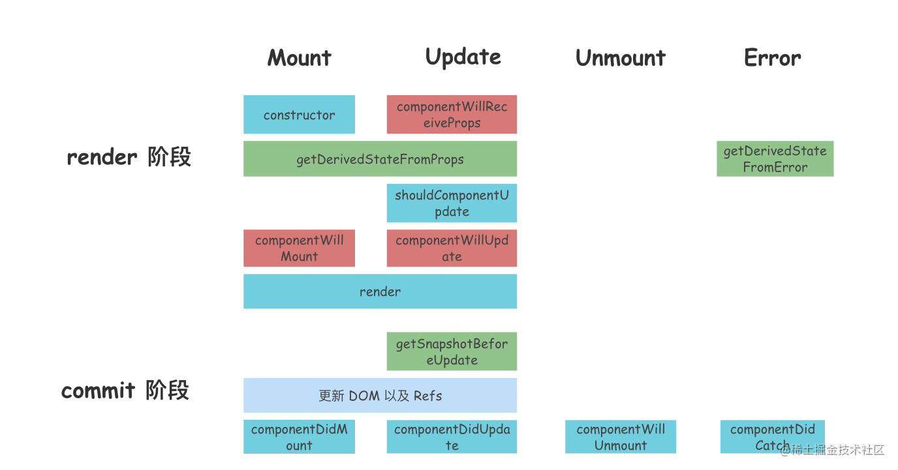
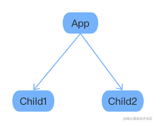
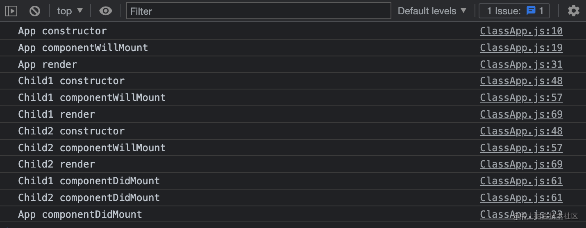
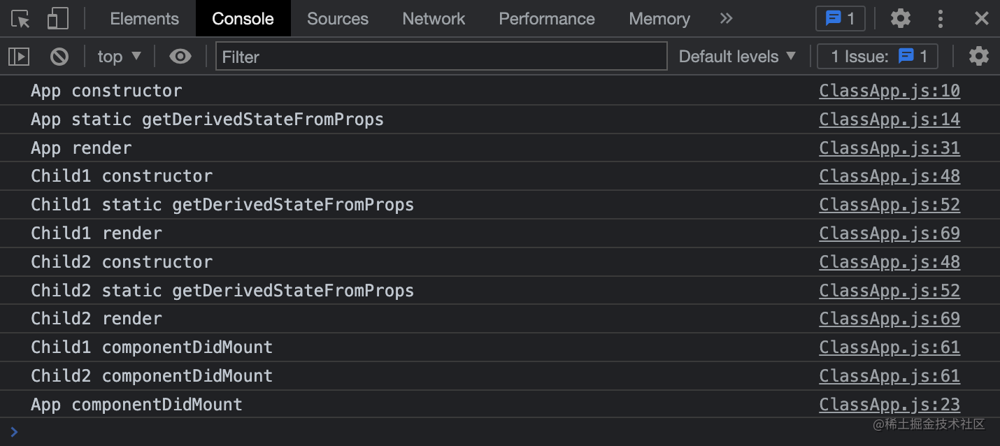
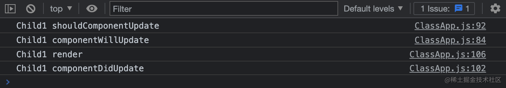
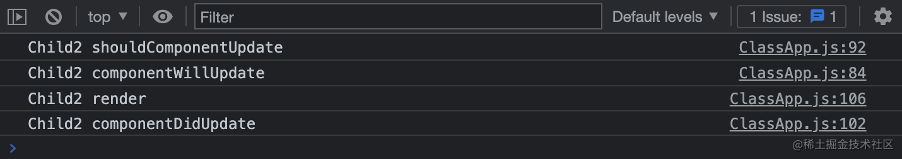
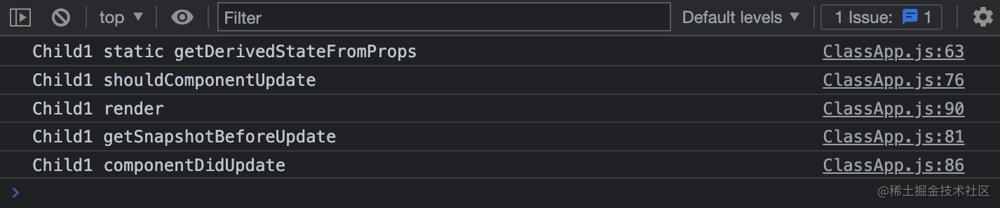
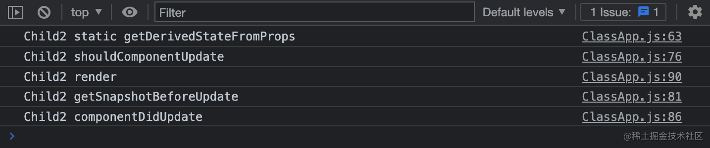
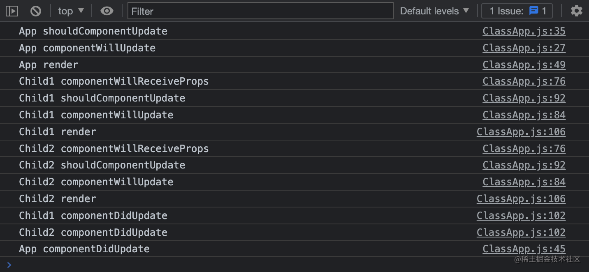
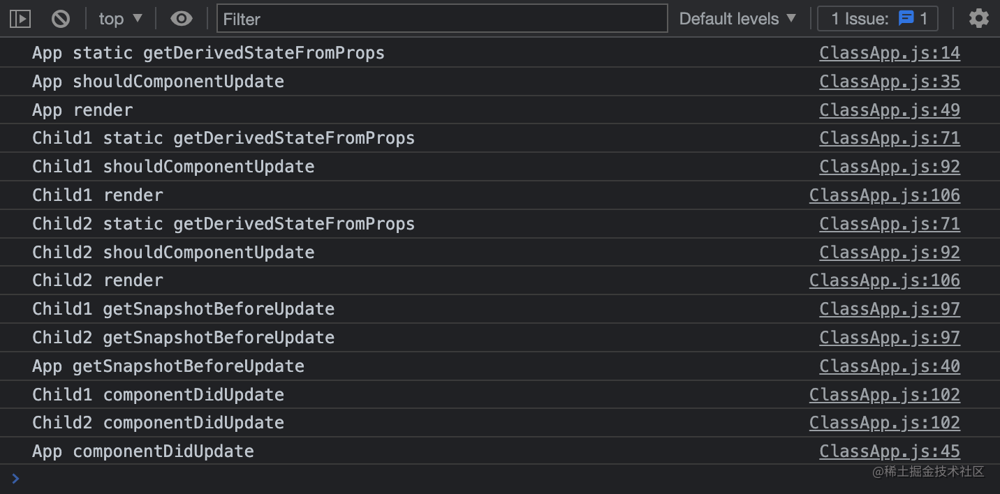

# React 生命周期

在 React 中，对于每一次由状态改变导致页面视图的改变，都会经历两个阶段：`render 阶段`、`commit 阶段`。

只有 class 组件才有生命周期，因为 class 组件会创建对应的实例，而函数组件不会。组件实例从被创建到被销毁的过程称为**组件的生命周期**。

由 class 组件创建的实例具有生命周期，它的 render 函数在 render 阶段执行，并在此阶段进行 DOM 节点的 diff（diff 算法就是在此阶段进行的），找出需要改变的 DOM 操作。然后在 commit 阶段将对应的 DOM 操作提交至视图中。

而 class 组件实例的所有生命周期函数，都会在 render 阶段和 commit 阶段执行。

 *注：红色为 React 17 已经废弃的生命周期钩子，绿色为新增的生命周期钩子*

在首次渲染页面时，会调用 Mount 相关生命周期钩子；在之后的页面渲染中，会调用 Update 相关生命周期钩子。所以与 Mount 相关的生命周期钩子只会被调用一次。

# render 阶段

render 阶段会执行众多生命周期钩子，例如：在首次渲染时执行 constructor、getDerivedStateFromProps、componentWillMount、render，在更新时执行 componentWillReceiveProps、shouldComponentUpdate、componentWillUpdate、render，在渲染阶段捕捉到了后代组件中的错误时会执行 getDerivedStateFromError。

接下来，看看这些生命周期钩子的调用时机，以及它们的作用。

## constructor

该方法只会执行一次，调用该方法会返回一个组件实例。

在初始化阶段执行，可直接对 `this.state` 赋值。其他生命周期函数中只能通过 `this.setState` 修改 state，不能直接为 `this.state` 赋值。

**使用场景：**

一般在 constructor 中做一些组件的初始化工作，例如：初始化组件的 state。

## componentWillReceiveProps

在已挂载组件接收到新的 props 之前调用。你可以在这个函数中比较新旧 props，并根据新旧 props 更改 state。但是它会**破坏 props 数据的单一数据源**。

在首次渲染组件时，不会调用此生命周期钩子；使用 `this.setState` 触发组件更新时，也不会调用此生命周期钩子。

不过要**注意**：如果是父组件渲染导致了组件的重新渲染，即使传给该组件的 props 没变，该组件中的这个生命周期函数也会被调用。

我们一般不使用此生命周期函数，因为它通常会破坏数据源的单一性。

## getDerivedStateFromProps

它是一个**静态方法**，接收 props 和 state两个参数。它会在调用 render 方法之前被调用，不管是在初始挂载时还是在后续组件更新时都会被调用。

它的调用时机和 componentWillMount、componentWillUpdate、componentWillReceiveProps 一样都是在 render 方法被调用之前，它可以作为 componentWillMount、componentWillUpdate 和 componentWillReceiveProps 的替代方案。

当然，它的作用不止如此，它可以返回一个对象，用来更新 state，就像它的名字一样，从 props 中获取衍生的 state。如果不需要更新 state 则可以返回 null。

需要**注意**的是：这个生命周期函数是类的**静态方法**，并不是原型中的方法，所以在其内部使用 this 访问到的不是组件实例。

此生命周期钩子不常用，如果可以的话，我们也尽可能不会使用它。

关于为什么要废弃 componentWillMount、componentWillUpdate、componentWillReceiveProps 三个生命周期钩子而新增 getDerivedStateFromProps 生命周期钩子，后面会说明原因。

## shouldComponentUpdate

在组件准备更新之前调用，但是首次渲染或者使用 forceUpdate 函数时不会被调用。跟它的名字一样，它用来判断一个组件是否应该更新。

默认情况下，当组件的 props 或者 state 变化时，都会导致组件更新。它在 render 方法之前执行，如果它的返回值为 false，则不会更新组件，也不会执行后面的 render 方法。

它接收两个参数，nextProps 和 nextState，即下一次更新的 props 和下一次更新的 state。我们可以将 `this.props` 和 nextProps 比较，以及将 `this.state` 与 nextState 比较，并返回 false，让组件跳过更新。不过**注意**：它并不会阻止子组件因为 state 改变而导致的更新。

**使用场景：**

这个生命周期方法通常用来做性能优化。

## componentWillMount（UNSAFE）

在组件挂载至 DOM 之前调用，并且只会调用一次。它在 render 方法之前调用，因此在 componentWillMount 中调用 `this.setState` 不会触发额外的渲染。

这个生命周期钩子使用频率较小，因为我们一般在 constructor 中**初始化 state**，在 componentDidMount 中**引入副作用**或者**订阅内容**。

## componentWillUpdate（UNSAFE）

在组件即将更新之前执行，如果 shouldComponentUpdate 函数返回 false，则不会调用 componentWillUpdate 方法。

这个生命周期钩子和 componentWillMount 类似，执行的时机是相同的，只不过 componentWillMount 在组件首次渲染时执行，而 componentWillUpdate 在组件后续更新时执行。这两个生命周期函数都不经常使用。

## render

render 方法是类组件中唯一必须实现的方法，它的返回值将作为页面渲染的视图。render 函数应该为纯函数，也就是对于相同的 state 和 props，它总是返回相同的渲染结果。

render 函数被调用时，会返回以下四种类型之一：

- React 元素：通常为 JSX 语法。例如：`<div />`、`<MyComponent>` 等等。
- 数组或者 fragments：render 方法可以通过数组返回多个元素。
- Portals：渲染子节点至不同的子树中。
- 字符串或者数值：会作为文本节点被渲染。
- boolean 类型或者 null：什么都不渲染。

需要**注意**的是：如果 shouldComponentUpdate 生命周期钩子返回 false，则 render 方法（render 阶段后续生命周期钩子）不会执行。

# commit 阶段

commit 阶段在首次渲染时会执行 componentDidMount，在组件更新时会执行 getSnapshotBeforeUpdate 和 componentDidUpdate。

## componentDidMount

该生命周期方法会在组件挂载之后执行，也只会执行一次，也就是将组件对应的 DOM 插入 DOM 树中之后调用。它会在浏览器更新视图之前调用，如果在 componentDidMount 中**直接调用** `this.setState`，它会触发额外的渲染，会再一次调用 render 函数，但是浏览器中视图的更新只会执行一次。

**使用场景：**

**依赖于 DOM 的初始化**操作应该放在这里，此外，我们一般在这个生命周期方法中**发送网络请求**、**添加订阅**等。

## getSnapshotBeforeUpdate

此生命周期函数在最近一次渲染提交至 DOM 树之前执行，此时 DOM 树还未改变，我们可以在这里获取 DOM 改变前的信息，例如：更新前 DOM 的滚动位置。

它接收两个参数，分别是：prevProps、prevState，上一个状态的 props 和上一个状态的 state。它的返回值将会传递给 componentDidUpdate 生命周期钩子的第三个参数。

**使用场景：**

需要**获取更新前 DOM 的信息**时。例如：需要以特殊方式处理滚动位置的聊天线程等。

## componentDidUpdate

在组件更新后立即调用，首次渲染不会调用该方法。它的执行时机和 componentDidMount 一致，只是 componentDidMount 在首次渲染时调用，而 componentDidUpdate 在后续的组件更新时调用。可以在这个生命周期中直接调用 `this.setState`，但是必须包裹在一个条件语句中，否则会导致死循环。

componentDidUpdate 接收三个参数，分别是 prevProps、prevState、snapshot，即：前一个状态的 props，前一个状态的 state、getSnapshotBeforeUpdate 的返回值。

如果组件实现了 getSnapshotBeforeUpdate 生命周期函数，则 getSnapshotBeforeUpdate 的返回值将作为 componentDidUpdate 的第三个参数。

**使用场景：**

在这个生命周期方法中，可以**对 DOM 进行操作**或者进行**网络请求**。

## componentWillUnmount

这个生命周期函数会在组件卸载以及销毁之前调用。

**使用场景：**

通常用来执行组件的**清理操作**，例如：清除 timer、取消网络请求、清除订阅等。

# 为什么废弃三个生命周期函数

React 在 16.3 版本中：

- 将 componentWillMount、componentWillReceiveProps、componentWillUpdate 三个生命周期钩子加上了 UNSAFE 前缀，变为 UNSAFE_componentWillMount、UNSAFE_componentWillReceiveProps 和 UNSAFE_componentWillUpdate。
- 并引入了一个新的生命周期钩子：getDerivedStateFromProps。

并在 17.0 以及之后的版本中：

- 删除了 componentWillMount、componentWillReceiveProps、componentWillUpdate 这三个生命周期钩子。
- 不过 UNSAFE_componentWillMount、UNSAFE_componentWillReceiveProps 和 UNSAFE_componentWillUpdate 还是可以用的。

**为什么**要废弃这三个生命周期钩子？它们有哪些问题呢？React 又是**如何解决**的呢？

我们知道 React 的更新流程分为：render 阶段和 commit 阶段。componentWillMount、componentWillReceiveProps、componentWillUpdate 这三个生命周期钩子都是在 render 阶段执行的。

在 fiber 架构被应用之前，render 阶段是不能被打断的。当页面逐渐复杂之后，就有可能会阻塞页面的渲染，于是 React 推出了 fiber 架构。在应用 fiber 架构之后，低优先级任务的 render 阶段可以被高优先级任务打断。

而这导致的**问题**就是：**在 render 阶段执行的生命周期函数可能被执行多次**。像 componentWillMount、componentWillReceiveProps、componentWillUpdate 这三个生命周期钩子，如果我们在其中执行一些具有副作用的操作，例如发送网络请求，就有可能导致一个同样的网络请求被执行多次，这显然不是我们想看到的。

而 React 又没法强迫开发者不去这样做，因为怎么样使用 React 是开发者的自由，所以 React 就新增了一个静态的生命周期 getDerivedStateFromProps，来解决这个问题。

用一个**静态函数** getDerivedStateFromProps 来取代被废弃的几个生命周期函数，这样开发者就无法通过 this 获取到组件的实例，也不能**发送网络请求**以及**调用** `this.setState`。它就是强制开发者在 render 之前只做无副作用的操作，间接强制我们无法进行这些不合理不规范的操作，从而避免对生命周期的滥用。

# 父子组件生命周期函数调用顺序

接下来我们来探究一下 React 中父子组件生命周期函数的执行顺序。由不同的原因导致的组件渲染，React 会执行不同的生命周期函数。例如：在首次渲染的时候，会执行与 mount 相关的生命周期函数；触发子组件的 `this.setState` 只会调用子组件中与 update 相关的生命周期函数；触发父组件的 `this.setState` 则会调用父子组件中与 update 相关的生命周期函数等。

为了探究父子组件以及不同子组件之间生命周期函数的执行顺序，我初始化了三个组件分别是父组件 AppAppApp、子组件 Child1Child1Child1、子组件 Child2Child2Child2。它们的结构如下：



## 首次渲染

在首次渲染中，我们探究图中 Mount 阶段生命周期钩子的执行顺序。


*注：红色为 React 17 已经废弃的生命周期钩子，绿色为新增的生命周期钩子*

因为**被废弃**的生命周期钩子和**新增**的生命周期钩子不能同时出现在代码中，所以我们分情况进行：

### 旧的生命周期函数调用顺序

```jsx
import React from 'react';

class App extends React.Component {

  constructor(props) {
    super(props);
    console.log('App constructor');
  }

  UNSAFE_componentWillMount() {
    console.log('App componentWillMount');
  }

  componentDidMount() {
    console.log('App componentDidMount');
  }

  render() {
    console.log('App render');
    return (
      <div>
        <Child order={1} />
        <Child order={2} />
      </div>
    )
  }
}

class Child extends React.Component {

  constructor(props) {
    super(props);
    console.log(`Child${this.props.order} constructor`);
  }

  UNSAFE_componentWillMount() {
    console.log(`Child${this.props.order} componentWillMount`);
  }

  componentDidMount() {
    console.log(`Child${this.props.order} componentDidMount`);
  }

  render() {
    console.log(`Child${this.props.order} render`);
    return (
      <div>
        Child{this.props.order}
      </div>
    )
  }
}

export default App;
```

其执行结果如下：



其中 constructor、componentWillMount、render 为 `render` 阶段执行的生命周期函数，componentDidMount 为 `commit` 阶段执行的生命周期函数。

- 首先**依次**执行父组件 render 阶段的生命周期函数；
- 然后**依次**执行子组件 render 阶段的生命周期函数；
- 最后**交叉**执行子组件和父组件 commit 阶段的生命周期函数。

React Fiber 树的构建、更新类似于树的先序遍历（深度优先搜索）。在“递归”时，执行 render 阶段的生命周期函数；在“回溯”时，执行 commit 阶段的生命周期函数。

对于 render 阶段的生命周期函数，其顺序是 `父组件` -> `子组件`；而对于 commit 阶段的生命周期函数，其顺序是 `子组件` -> `父组件`。

需要**注意**的是：这里的执行顺序并不是真正的树的先序遍历。在“回溯”时，是交叉执行各子组件和父组件 commit 阶段的生命周期函数。

### 新的生命周期函数调用顺序

```jsx
import React from 'react';

class App extends React.Component {

  constructor(props) {
    super(props);
    this.state = {
      count: 0,
    }
    console.log('App constructor');
  }

  static getDerivedStateFromProps() {
    console.log('App static getDerivedStateFromProps');
    return null;
  }

  componentDidMount() {
    console.log('App componentDidMount');
  }

  render() {
    console.log('App render');
    return (
      <div>
        <Child order={1} />
        <Child order={2} />
      </div>
    )
  }
}

class Child extends React.Component {

  constructor(props) {
    super(props);
    this.state = {
      count: 0,
    };
    console.log(`Child${this.props.order} constructor`);
  }

  static getDerivedStateFromProps(props) {
    console.log(`Child${props.order} static getDerivedStateFromProps`);
    return null;
  }

  componentDidMount() {
    console.log(`Child${this.props.order} componentDidMount`);
  }

  render() {
    console.log(`Child${this.props.order} render`);
    return (
      <div>
        Child{this.props.order}
      </div>
    )
  }
}

export default App;
```

其执行结果如下：



可以看到，在首次渲染时，getDerivedStateFromProps 的执行顺序基本上替代了 componentWillMount 的执行顺序。

但是需要**注意**：getDerivedStateFromProps 是一个**静态方法**，不能通过 this 获取到组件实例，如果我们要拿到组件的 props 和 state，必须要通过参数才能拿到。而在 componentWillMount 中，则是通过 this.props 拿到 props。

## 子组件状态改变

接下来，我们分别为父组件和子组件加上 onClick 事件，当点击子组件对应的文字时，让子组件更新，调用其 `this.setState` 方法，再来看看各生命周期的执行顺序。

### 旧的生命周期函数调用顺序

```jsx
import React from 'react';

class App extends React.Component {

  constructor(props) {
    super(props);
    this.state = {
      count: 0,
    }
    console.log('App constructor');
  }

  UNSAFE_componentWillReceiveProps() {
    console.log('App componentWillReceiveProps');
  }

  UNSAFE_componentWillUpdate() {
    console.log('App componentWillUpdate');
  }

  shouldComponentUpdate(nextProps) {
    console.log('App shouldComponentUpdate');
    return true;
  }

  componentDidUpdate() {
    console.log('App componentDidUpdate');
  }

  render() {
    console.log('App render');
    return (
      <div>
        <div onClick={() => this.setState((count) => ({ count: count + 1 }))}>App</div>
        <Child order={1} />
        <Child order={2} />
      </div>
    )
  }
}

class Child extends React.Component {

  constructor(props) {
    super(props);
    this.state = {
      count: 0,
    };
    console.log(`Child${this.props.order} constructor`);
  }

  UNSAFE_componentWillReceiveProps(nextProps) {
    console.log(`Child${nextProps.order} componentWillReceiveProps`);
  }

  UNSAFE_componentWillUpdate() {
    console.log(`Child${this.props.order} componentWillUpdate`);
  }

  componentDidMount() {
    console.log(`Child${this.props.order} componentDidMount`);
  }

  shouldComponentUpdate(nextProps) {
    console.log(`Child${nextProps.order} shouldComponentUpdate`);
    return true;
  }

  componentDidUpdate() {
    console.log(`Child${this.props.order} componentDidUpdate`);
  }

  render() {
    console.log(`Child${this.props.order} render`);
    return (
      <div onClick={() => this.setState((count) => ({ count: count + 1 }))}>
        Child{this.props.order}
      </div>
    )
  }
}

export default App;
```

当点击文字 Child1 时，其执行结果如下：



当点击文字 Child2 时，其执行结果如下：



上面的结果中，**并没有**执行 componentWillReceiveProps 生命周期函数，因为使用 `this.setState` 触发组件更新时，并不会调用此生命周期钩子，只有 **props 改变**或者**父组件更新导致子组件重新渲染**时，才会执行这个生命周期钩子，看它的名字也知道它仅和 props 有关。

- 由于组件的 state 改变导致组件更新**不会执行** `componentWillReceiveProps`；
- 执行 `shouldComponent` 判断组件是否需要更新，需要则执行后续生命周期函数，否则不执行后续生命周期函数；
- 在渲染之前，执行 `componentWillUpdate`；
- 执行渲染方法 `render`；
- 将更改提交至 DOM 树之后，执行 `componentDidUpdate`；

**注意**：这里没有使用 getSnapshotBeforeUpdate 这个新增的生命周期函数，因为新增的生命周期函数与被废弃的生命周期函数同时写入代码中，React 会报错。

### 新的生命周期函数调用顺序

```jsx
import React from 'react';

class App extends React.Component {

  constructor(props) {
    super(props);
    this.state = {
      count: 0,
    }
    console.log('App constructor');
  }

  static getDerivedStateFromProps() {
    console.log('App static getDerivedStateFromProps');
    return null;
  }

  shouldComponentUpdate(nextProps) {
    console.log('App shouldComponentUpdate');
    return true;
  }

  getSnapshotBeforeUpdate(prevProps) {
    console.log('App getSnapshotBeforeUpdate');
    return null;
  }

  componentDidUpdate() {
    console.log('App componentDidUpdate');
  }

  render() {
    console.log('App render');
    return (
      <div>
        <div onClick={() => this.setState((count) => ({ count: count + 1 }))}>App</div>
        <Child order={1} />
        <Child order={2} />
      </div>
    )
  }
}

class Child extends React.Component {

  constructor(props) {
    super(props);
    this.state = {
      count: 0,
    };
    console.log(`Child${this.props.order} constructor`);
  }

  static getDerivedStateFromProps(props) {
    console.log(`Child${props.order} static getDerivedStateFromProps`);
    return null;
  }

  shouldComponentUpdate(nextProps) {
    console.log(`Child${nextProps.order} shouldComponentUpdate`);
    return true;
  }

  getSnapshotBeforeUpdate(prevProps) {
    console.log(`Child${prevProps.order} getSnapshotBeforeUpdate`);
    return null;
  }

  componentDidUpdate() {
    console.log(`Child${this.props.order} componentDidUpdate`);
  }

  render() {
    console.log(`Child${this.props.order} render`);
    return (
      <div onClick={() => this.setState((count) => ({ count: count + 1 }))}>
        Child{this.props.order}
      </div>
    )
  }
}

export default App;
```

当点击文字 Child1 时，其执行结果如下：



当点击文字 Child2 时，其执行结果如下：



可以看到，子组件的状态发生改变，只会执行该子组件对应的生命周期函数，而不会执行其父组件或其兄弟组件的生命周期函数。

- 首先执行 `getDerivedStateFromProps`，在这里可以根据 props 更新 state；
- 然后判断该组件是否需要更新，即执行 `shouldComponentUpdate`；
- 需要更新则执行 `render` 函数以及后续生命周期函数，否则跳过后面生命周期函数的执行；
- 在将更改提交至 DOM 树之前执行 `getSnapshotBeforeUpdate`，在这里可以获取 DOM 被更改前的最后一次快照；
- 最后在将更改提交至 DOM 树之后执行 `componentDidUpdate`。

## 父组件状态改变

知道了子组件更新时，生命周期函数的执行顺序。我们点击父组件中对应文字，让其调用父组件的 `this.setState` 方法，触发父组件和子组件的重新渲染，看看父子组件生命周期函数的执行顺序。

### 旧的生命周期函数调用顺序

```jsx
import React from 'react';

class App extends React.Component {

  constructor(props) {
    super(props);
    this.state = {
      count: 0,
    }
    console.log('App constructor');
  }

  UNSAFE_componentWillReceiveProps() {
    console.log('App componentWillReceiveProps');
  }

  UNSAFE_componentWillUpdate() {
    console.log('App componentWillUpdate');
  }

  shouldComponentUpdate(nextProps) {
    console.log('App shouldComponentUpdate');
    return true;
  }

  componentDidUpdate() {
    console.log('App componentDidUpdate');
  }

  render() {
    console.log('App render');
    return (
      <div>
        <div onClick={() => this.setState((count) => ({ count: count + 1 }))}>App</div>
        <Child order={1} />
        <Child order={2} />
      </div>
    )
  }
}

class Child extends React.Component {

  constructor(props) {
    super(props);
    this.state = {
      count: 0,
    };
    console.log(`Child${this.props.order} constructor`);
  }

  UNSAFE_componentWillReceiveProps(nextProps) {
    console.log(`Child${nextProps.order} componentWillReceiveProps`);
  }

  UNSAFE_componentWillUpdate() {
    console.log(`Child${this.props.order} componentWillUpdate`);
  }

  shouldComponentUpdate(nextProps) {
    console.log(`Child${nextProps.order} shouldComponentUpdate`);
    return true;
  }

  componentDidUpdate() {
    console.log(`Child${this.props.order} componentDidUpdate`);
  }

  render() {
    console.log(`Child${this.props.order} render`);
    return (
      <div onClick={() => this.setState((count) => ({ count: count + 1 }))}>
        Child{this.props.order}
      </div>
    )
  }
}

export default App;
```

父子组件生命周期函数调用顺序为：



我们知道 componentWillReceiveProps、shouldComponentUpdate、componentWillUpdate、render 这四个生命周期函数是在 **render 阶段**调用的，而 componentDidUpdate 生命周期函数是在 **commit 阶段**调用的。

它们的执行顺序和**首次渲染**中得到的结论一样，还是满足如下特点：

- 首先**依次**执行父组件 render 阶段的生命周期函数；
- 然后**依次**执行子组件 render 阶段的生命周期函数；
- 最后**交叉**执行子组件和父组件 commit 阶段的生命周期函数。

因为是在父组件中调用 `this.setState` 方法触发的更新，并**不会执行**它的 componentWillReceiveProps 生命周期函数，而由于父组件更新导致的子组件更新，是**会执行**子组件的 componentWillReceiveProps 生命周期函数的，这点也在**子组件状态改变**中提到了。

### 新的生命周期函数调用顺序

```jsx
import React from 'react';

class App extends React.Component {

  constructor(props) {
    super(props);
    this.state = {
      count: 0,
    }
    console.log('App constructor');
  }

  static getDerivedStateFromProps() {
    console.log('App static getDerivedStateFromProps');
    return null;
  }

  shouldComponentUpdate(nextProps) {
    console.log('App shouldComponentUpdate');
    return true;
  }

  getSnapshotBeforeUpdate(prevProps) {
    console.log('App getSnapshotBeforeUpdate');
    return null;
  }

  componentDidUpdate() {
    console.log('App componentDidUpdate');
  }

  render() {
    console.log('App render');
    return (
      <div>
        <div onClick={() => this.setState((count) => ({ count: count + 1 }))}>App</div>
        <Child order={1} />
        <Child order={2} />
      </div>
    )
  }
}

class Child extends React.Component {

  constructor(props) {
    super(props);
    this.state = {
      count: 0,
    };
    console.log(`Child${this.props.order} constructor`);
  }

  static getDerivedStateFromProps(props) {
    console.log(`Child${props.order} static getDerivedStateFromProps`);
    return null;
  }

  shouldComponentUpdate(nextProps) {
    console.log(`Child${nextProps.order} shouldComponentUpdate`);
    return true;
  }

  getSnapshotBeforeUpdate(prevProps) {
    console.log(`Child${prevProps.order} getSnapshotBeforeUpdate`);
    return null;
  }

  componentDidUpdate() {
    console.log(`Child${this.props.order} componentDidUpdate`);
  }

  render() {
    console.log(`Child${this.props.order} render`);
    return (
      <div onClick={() => this.setState((count) => ({ count: count + 1 }))}>
        Child{this.props.order}
      </div>
    )
  }
}

export default App;
```

父子组件生命周期函数调用顺序为：



可以看到，换成 getDerivedStateFromProps 后，不管是不是通过调用 `this.setState` 导致的组件更新，都会执行 getDerivedStateFromProps 生命周期函数。

这里还是符合前面说的规律：

- 首先**依次**执行父组件 render 阶段的生命周期函数；
- 然后**依次**执行子组件 render 阶段的生命周期函数；
- 最后**交叉**执行子组件和父组件 commit 阶段的生命周期函数。

## 关于其执行顺序原因的理解

**为什么在 commit 阶段要先执行父组件的 getSnapshotBeforeUpdate，再执行子组件的 componentDidUpdate？而在 render 阶段却是先执行父组件的 render，再执行子组件的 constructor 呢？**

因为 getSnapshotBeforeUpdate 是为了获取 DOM 更新前的一次快照，而 componentDidUpdate 是在 DOM 更新之后执行的。自然要在 DOM 更新之前才能获取每一个组件的 DOM 快照，在 DOM 更新之后才能调用 componentDidUpdate。

如果已经调用了 componentDidUpdate，说明 DOM 已经更新完了，此时再调用 getSnapshotBeforeUpdate 还能获取 DOM 更新前的快照吗？显然不行！

至于先执行父组件的 render 再执行子组件的 constructor 是因为：先执行父组件的 render 函数之后，才知道父组件有哪些子组件，接着才能调用对应子组件的 constructor 去构造子组件。这一切都是如此的合理！