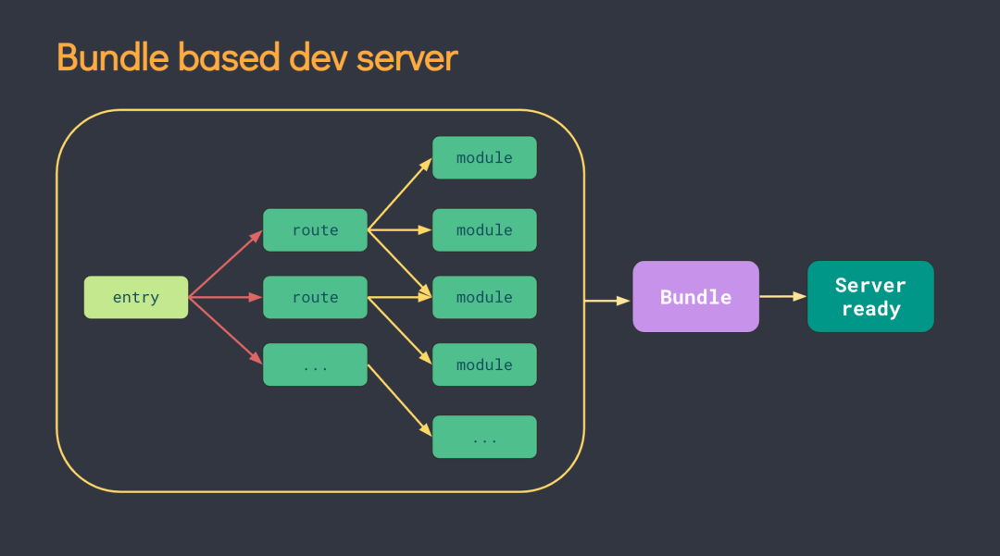
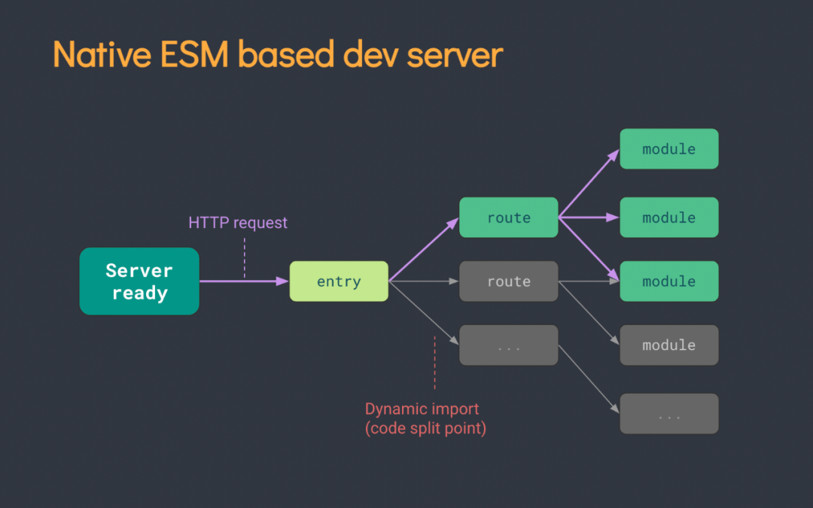

# Vite 和 Webpack 的核心差异

## 写在开头

- 最近的`vite`比较火，而且发布了 2.0 版本，vue 的作者也是在极力推荐
- 在之前的文章里面我提到过，`vite`的缺点在于目前的生态不够`webpack`成熟，但是只要能弥补这个缺点，便有很大概率能替代目前`webpack`的大部分市场

## 全方位对比 vite 和 webpack

### webpack 打包过程

- 1.识别入口文件
- 2.通过逐层识别模块依赖。（Commonjs、amd 或者 es6 的 import，webpack 都会对其进行分析。来获取代码的依赖）
- 3.webpack 做的就是分析代码。转换代码，编译代码，输出代码
- 4.最终形成打包后的代码

#### webpack 打包原理

- 1.`先逐级递归识别依赖，构建依赖图谱`
- 2.将代码转化成 AST 抽象语法树
- 3.在 AST 阶段中去处理代码
- 4.把 AST 抽象语法树变成浏览器可以识别的代码， 然后输出



- 当声明一个 script 标签类型为 module 时

如：

```go
 <script type="module" src="/src/main.js"></script>
```

- 浏览器就会像服务器发起一个 GET

```go
http://localhost:3000/src/main.js请求main.js文件： // /src/main.js:import { createApp } from 'vue'import App from './App.vue'createApp(App).mount('#app')
```

- 浏览器请求到了 main.js 文件，检测到内部含有 import 引入的包，又会对其内部的 import 引用发起 HTTP 请求获取模块的内容文件
- 如：`GET http://localhost:3000/@modules/vue.js`
- 如：`GET http://localhost:3000/src/App.vue`
- `Vite` 的主要功能就是通过劫持浏览器的这些请求，并在后端进行相应的处理将项目中使用的文件通过简单的分解与整合，然后再返回给浏览器，vite 整个过程中没有对文件进行打包编译，所以其运行速度比原始的`webpack`开发编译速度快出许多！

### webpack 缺点一。缓慢的服务器启动

- 当冷启动开发服务器时，基于打包器的方式是在提供服务前去急切地抓取和构建你的整个应用。

### vite 改进

- Vite 通过在一开始将应用中的模块区分为 依赖 和 源码 两类，改进了开发服务器启动时间。
- 依赖 大多为纯 JavaScript 并在开发时不会变动。一些较大的依赖（例如有上百个模块的组件库）处理的代价也很高。依赖也通常会以某些方式（例如 ESM 或者 CommonJS）被拆分到大量小模块中。
- Vite 将会使用 esbuild 预构建依赖。Esbuild 使用 Go 编写，并且比以 JavaScript 编写的打包器预构建依赖快 10-100 倍。
- 源码 通常包含一些并非直接是 JavaScript 的文件，需要转换（例如 JSX，CSS 或者 Vue/Svelte 组件），时常会被编辑。同时，并不是所有的源码都需要同时被加载。（例如基于路由拆分的代码模块）。
- Vite 以 原生 ESM 方式服务源码。这实际上是让浏览器接管了打包程序的部分工作：Vite 只需要在浏览器请求源码时进行转换并按需提供源码。根据情景动态导入的代码，即只在当前屏幕上实际使用时才会被处理。

### webpack 缺点 2.使用的是 node.js 去实现



### vite 改进

- Vite 将会使用 `esbuild` 预构建依赖。Esbuild 使用 Go 编写，并且比以 `Node.js` 编写的打包器预构建依赖快 10-100 倍。

### webpack 致命缺点 3.热更新效率低下

- 当基于打包器启动时，编辑文件后将重新构建文件本身。显然我们不应该重新构建整个包，因为这样更新速度会随着应用体积增长而直线下降。
- 一些打包器的开发服务器将构建内容存入内存，这样它们只需要在文件更改时使模块图的一部分失活[1]，但它也仍需要整个重新构建并重载页面。这样代价很高，并且重新加载页面会消除应用的当前状态，所以打包器支持了动态模块热重载（HMR）：允许一个模块 “热替换” 它自己，而对页面其余部分没有影响。这大大改进了开发体验 - 然而，在实践中我们发现，即使是 HMR 更新速度也会随着应用规模的增长而显著下降。

### vite 改进

- 在 Vite 中，HMR 是在原生 ESM 上执行的。当编辑一个文件时，`Vite 只需要精确地使已编辑的模块与其最近的 HMR 边界之间的链失效（大多数时候只需要模块本身），使 HMR 更新始终快速，无论应用的大小`。
- Vite 同时利用 HTTP 头来加速整个页面的重新加载（再次让浏览器为我们做更多事情）：源码模块的请求会根据 304 Not Modified 进行协商缓存，而依赖模块请求则会通过 Cache-Control: max-age=31536000,immutable 进行强缓存，因此一旦被缓存它们将不需要再次请求。

### vite 缺点 1.生态，生态，生态不如 webpack

- wepback 牛逼之处在于 loader 和 plugin 非常丰富,不过我认为生态只是时间问题，现在的 vite,更像是当时刚出来的 M1 芯片 Mac，我当时非常看好 M1 的 Mac，毫不犹豫买了，现在也没什么问题

### vite 缺点 2.prod 环境的构建，目前用的 Rollup

- 原因在于 esbuild 对于 css 和代码分割不是很友好

### vite 缺点 3.还没有被大规模使用,很多问题或者诉求没有真正暴露出来

- vite 真正崛起那一天，是跟 vue3 有关系的,当 vue3 广泛开始使用在生产环境的时候，vite 也就大概率意味着被大家慢慢开始接受了

## 总结

- Vite，就像刚出来的`M1`芯片`Mac`,都说好，但是一开始买的人不多，担心生态问题，后面都说真香
- 相信 vue3 作者的大力支持下，`vite`即将大放异彩！
- 我已经在我自己项目的生产环境中，开始使用 vite!
