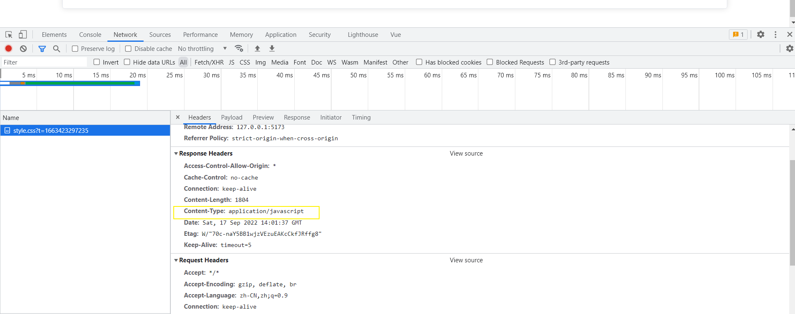
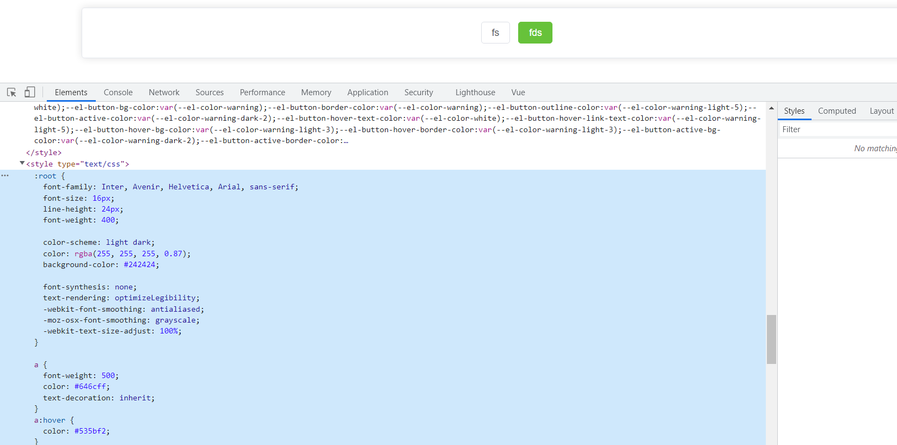
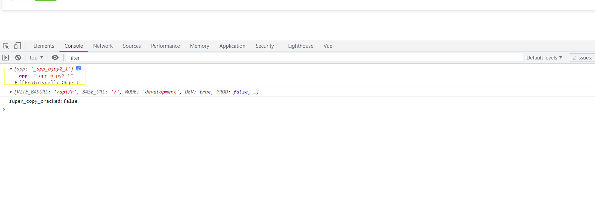

# vite 使用

## 什么是构建工具

企业级项目里面都具有哪些功能

1. typescript
2. React/Vue 安装 react-complier / Vue-complier 将我们写的 jsx 文件或者.vue 转换为 render 函数
3. less/sass/postcss/component-style
4. 语法降级 :babel ---> 将新语法装换为旧版浏览器可以支持的语法
5. 体积优化 : uglifyjs ---> 代码压缩
6. 。。。。。。。。

而帮我们把这些东西集成到一起，这就是构建工具

## vite 相较于 webpack 有什么优势

可以看我之前写的这篇文章[Vite 和 Webpack 的核心差异](./20220915-Vite%20%E5%92%8CWebpack%20%E7%9A%84%E6%A0%B8%E5%BF%83%E5%B7%AE%E5%BC%82.md)

::: note 安装

安装 vite `推荐使用pnpm安装`

> pnpm create vite

:::

## vite 环境变量配置

> 根据当前代码环境产生值的变化叫做环境变量

- vite 环境变量主要使用了 dotenv 这个第三方库

1. 开发环境
2. 测试环境
3. 预发布环境
4. 灰度环境
5. 生成环境

[vite 环境变量配置](https://www.vitejs.net/guide/env-and-mode.html)

## css 模块处理

vite 天生支持 css 模块导入

`基本原理`

1. vite 在读到使用 import 导入 css 文件的时候，直接使用 fs 模块去读取 css 文件中的内容
2. 直接创建的一个 style 标签将 css 文件里面的内容复制到标签内，然后追加到 index.html 的头部
3. 将 css 文件的内容直接替换为 js 脚本，同时设置`content-type:appliction/javascript`，从而让浏览器已 js 脚本执行该 css

> 直接引入 css 会导致 全局污染





### 引入 cssmodule

::: tip

module 后缀是一个约定俗成

它会生成一个映射对象 类名为 key 值会 hash

:::

```javascript
import styles from './style.module.css'
```



### 配置 css 的行为

> 在 vite.config.ts 中配置

```typescript
interface CSSModulesOptions {
  scopeBehaviour?: 'global' | 'local'
  globalModulePaths?: RegExp[]
  generateScopedName?:
    | string
    | ((name: string, filename: string, css: string) => string)
  hashPrefix?: string
  /**
   * 默认：'camelCaseOnly'
   */
  localsConvention?: 'camelCase' | 'camelCaseOnly' | 'dashes' | 'dashesOnly'
}
```

::: details 详解

localsConvention: 配置生成对象的 key 形式 是驼峰还是中划线

scopeBehaviour: 配置模块生成规则是全局还是模块化

generateScopedName: 生成的类名规则 例:[name]_[local]_ [hash:5][格式详情](https://github.com/webpack/loader-utils#interpolatename)

globalModulePaths: 不参与模块化的 css 文件路径

:::

### 配置 css 预处理器行为

> css.preprocessorOptions 可以注入全局参数

```typescript
export default defineConfig({
  css: {
    preprocessorOptions: {
      scss: {
        additionalData: `$injectedColor: orange;`,
      },
    },
  },
})
```

## vite 的配置细节

## vite 配置

::: info 提示

在项目根目录下创建 vite.config.ts

:::

### base

- 配置静态文件的基准路径

### alias

```json
  resolve: {
    alias: {
      '@': path.join(__dirname, 'src'),
    },
  },
```

### 去除 console

```json
 build: {
    minify: 'terser',
    terserOptions: {
      compress: {
        drop_console: true,
        drop_debugger: true,
      },
    },
  },
```

### ElementPulus 按需加载

```javascript
import AutoImport from 'unplugin-auto-import/vite'
import Components from 'unplugin-vue-components/vite'
import { ElementPlusResolver } from 'unplugin-vue-components/resolvers'

 plugins: [
    vue(),
    AutoImport({
      resolvers: [ElementPlusResolver()],
    }),
    Components({
      resolvers: [ElementPlusResolver()],
    }),
  ],
```

### Vite-Compression-Plugin 代码压缩

:::info 安装
yarn add vite-compression-plugin -D
:::

```javascript
import { defineConfig } from 'vite'

import Compression from 'vite-compression-plugin'

export default defineConfig({
  plugins: [
    // ...your plugin
    Compression(),
  ],
})
```

### 依赖预构建

```javascript
 optimizeDeps: {
    exclude: [], // 将指定数组中的依赖不进行依赖预构建
  }
```

### 生成环境和开发环境配置

```javascript
const envResolver = {
  build: () => Object.assign(baseConfig, prodConfig),
  serve: () => Object.assign(baseConfig, devConfig),
}

export default defineConfig(({ command, mode }) => {
  return envResolver[command]
})
```

### 自定义分包策略

> build.rollupOptions.output.manualChunks [详情阅读](https://github.com/laoyutong/blog/issues/27)

## 插件介绍

