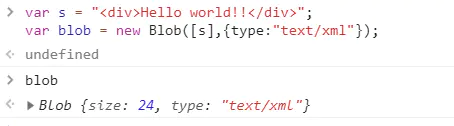
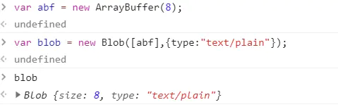
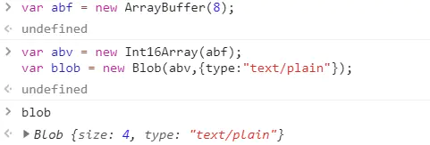
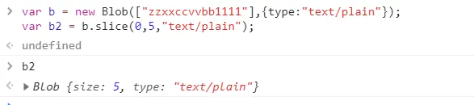

# blob 对象的使用

## 1、【[HTML5](https://so.csdn.net/so/search?q=HTML5&spm=1001.2101.3001.7020)】Blob 对象

**（1）写在前面**：本小节主要介绍 Blob 对象属性及作用，通过 demo 介绍 blob 对象的应用场景。

blob 对象：一直以来，JS 都没有比较好的可以直接处理[二进制](https://so.csdn.net/so/search?q=二进制&spm=1001.2101.3001.7020)的方法。而 blob 的存在，允许我们可以通过 js 直接操作二进制数据。

> “一个 blob 对象就是一个包含有只读原始数据的类文件对象。blob 对象中的数据并不一定得是 JavaScript 中的原生形式。file 接口基于 blob，继承了 blob 的功能，并且扩展支持了用户计算机上的本地文件”

Blob 对象可以看作是存放二进制数据的容器，此外还可以通过 blob 设置二进制数据的 MIME 类型。

**（2）创建 blob**

**方法一：通过构造函数**

---

var blob = new Blob(**dataArr**:Array\<any\>,**opt**:{type:string});

**dataArr**：数组，包含了要添加到 blob 对象中的数据，数据可以是任意多个 ArrayBuffer，ArrayBufferView，blob 或者 DOMString 对象

**opt**：对象，用于设置 Blob 对象的属性（如[MIME](https://links.jianshu.com/go?to=https%3A%2F%2Fwww.cnblogs.com%2Fscolia%2Fp%2F5578623.html)类型）

> MIME：每一个 URL 都代表着一个资源对象，而当我们请求一个网页的时候，看似只请求了一个 URI（统一资源标识符），实际上这个网页可能包含多个 URI，例如图片资源的 URI 和视频资源的 URI 等。此时有些浏览器为了加快访问速度，可能会同时开多个线程去请求 URI。也就是说其实每一个 URI 都发送了一个请求报文。而当我们的浏览器要显示或处理这些资源的时候，我们并不知道其响应的数据是什么类型的，为了区分这些资源类型，就需要用到 MIME 了。HTTP 会为每一个通过 web 传输的对象添加上 MIME 类型的数据格式标签。浏览器在读取到对应的信息后，会调用相应的程序去处理它，任何得到我们想要的结果。

第一种：创建一个装填 DOMString 对象的 blob 对象



第二种：创建一个装填 ArrayBuffer 对象的 Blob 对象



第三种：创建一个装填 ArrayBufferView 对象的 Blob 对象（ArrayBufferView 可基于 ArrayBuffer 创建，返回值是一个类数组。如下，创建一个 8 字节的 ArrayBuffer，在其上创建一个每个数组元素为 2 字节的“视图”）



image

**方法二：通过 Blob.slice()**

---

此方法返回一个新的 Blob 对象，包含了原 blob 对象中指定范围内的数据

Blob.[slice](https://so.csdn.net/so/search?q=slice&spm=1001.2101.3001.7020)(**start**:number,**end**:number,**contentType**:string)

start：开始索引，默认为 0

end：截止结束索引（不包括 end）

contentType：新 blob 的 MIME 类型，默认为空字符串



image

**方法三：通过 canvas.toBlob()**

---

> var canvas = document.getElementById("canvas");
>
> canvas.toBlob(function(blob){
>
> ```sql
> console.log(blob);
> ```
>
> });

## 2、应用场景

前面提到，file 接口继承 blob，继承了 blob 的功能并进行了扩展，故我们可以像使用 Blob 一样使用 File 对象

### 分片上传

---

通过 Blob.slice 方法，可以将大文件分片，轮循向后台提交各文件片段，即可实现文件的分片上传。

**分片上传逻辑如下:**

获取要上传文件的**File 对象**，根据**chunk**（每片大小）对文件进行分片

通过 post 方法轮循上传每片文件，其中 url 中拼接 querystring 用于描述当前上传的文件信息；post body 中存放本次要上传的二进制数据片段

接口每次返回 offset，用于执行下次上传

下面是分片上传的简单实现：

```javascript
initUpload();//初始化上传functioninitUpload(){

    var chunk = 100 * 1024;  //每片大小
    var input = document.getElementById("file");    //input file
    input.onchange = function(e){
        var file = this.files[0];
        var query = {};
        var chunks = [];
        if (!!file) {
            var start = 0;
            //文件分片
            for (var i = 0; i < Math.ceil(file.size / chunk); i++) {
                var end = start + chunk;
                chunks[i] = file.slice(start , end);
                start = end;
            }
            // 采用post方法上传文件
            // url query上拼接以下参数，用于记录上传偏移
            // post body中存放本次要上传的二进制数据
            query = {
                fileSize: file.size,
                dataSize: chunk,
                nextOffset: 0
                }
            upload(chunks, query, successPerUpload);
        }
    }
}
// 执行上传
function upload(chunks, query, cb){
    var queryStr = Object.getOwnPropertyNames(query).map(key=> {
        return key + "=" + query[key];
    }).join("&");
    var xhr = new XMLHttpRequest();
    xhr.open("POST", "http://xxxx/opload?" + queryStr);
    xhr.overrideMimeType("application/octet-stream");
    //获取post body中二进制数据    var index = Math.floor(query.nextOffset / query.dataSize);
    getFileBinary(chunks[index], function(binary){
        if (xhr.sendAsBinary) {
            xhr.sendAsBinary(binary);
        } else {
            xhr.send(binary);
        }
    });
    xhr.onreadystatechange = function(e){
        if (xhr.readyState === 4) {
            if (xhr.status === 200) {
                var resp = JSON.parse(xhr.responseText);
                if (typeof cb === "function") {
                    cb.call(this, resp, chunks, query)
                }
            }
        }
    }
}
// 每片上传成功后执行
function successPerUpload(resp, chunks, query){
    if (resp.isFinish === true) {
        alert("上传成功");
    } else {
        //未上传完毕
        query.offset = resp.offset;
        upload(chunks, query, successPerUpload);
    }
}
// 获取文件二进制数据
function getFileBinary(file, cb){
    var reader = new FileReader();

    reader.readAsArrayBuffer(file);

    reader.onload = function(e){

        if (typeof cb === "function") {
            cb.call(this, this.result);
        }
    }
}
```
