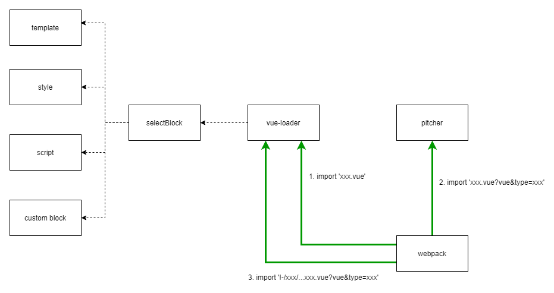

# vue-loader 原理分析

> **两个问题：**
>
> 1. Vue SFC 文件包含多种格式的内容：style、script、template 以及自定义 block，vue-loader 如何分别处理这些内容？
> 2. 针对不同内容块，vue-loader 如何复用其他 loader？比如针对 less 定义的 style 块，vue-loader 是怎么调用 less-loader 加载内容的？

OK，如果你不是特别清楚，那接着往下看吧，下面我们会拆开 vue-loader 的代码，看看 SFC 内容具体是怎么流转转换，顺便还能学学 webpack loader 的编写套路。

## **概述**

**vue-loader** 主要包含三部分：

1. lib/index.js 定义的 normal loader
2. lib/loaders/pitcher.js 定义的 pitcher loader
3. lib/plugin.js 定义的插件

三者协作共同完成对 SFC 的处理，使用时需要用户同时注册 normal loader 和 plugin，简单示例：

```js
const VueLoaderPlugin = require('vue-loader/lib/plugin')

module.exports = {
  module: {
    rules: [
      {
        test: /.vue$/,
        use: [{ loader: 'vue-loader' }],
      },
    ],
  },
  plugins: [new VueLoaderPlugin()],
}
```

运行过程可以粗略总结为两个阶段：

1. 预处理阶段：在插件 apply 函数动态修改 webpack 配置，注入 vue-loader 专用的 rules
2. 内容处理阶段：normal loader 配合 pitcher loader 完成文件内容转换

## **插件预处理阶段**

vue-loader 插件会在 apply 函数中扩展 webpack 配置信息核心代码如下：

```js
class VueLoaderPlugin {
  apply(compiler) {
    // ...

    const rules = compiler.options.module.rules
    // ...

    const clonedRules = rules
      .filter((r) => r !== rawVueRules)
      .map((rawRule) => cloneRule(rawRule, refs))

    // ...

    // global pitcher (responsible for injecting template compiler loader & CSS
    // post loader)
    const pitcher = {
      loader: require.resolve('./loaders/pitcher'),
      resourceQuery: (query) => {
        if (!query) {
          return false
        }
        const parsed = qs.parse(query.slice(1))
        return parsed.vue != null
      },
      // ...
    }

    // replace original rules
    compiler.options.module.rules = [pitcher, ...clonedRules, ...rules]
  }
}

function cloneRule(rawRule, refs) {
  // ...
}

module.exports = VueLoaderPlugin
```

> 注意，代码中 pitcher 对象的 **resourceQuery** 属性是后续匹配的关键点，文章后面会展开讨论，这里先理解为“与 test 类似，用于匹配特定路径的函数”即可。

拆开来看，插件主要完成两个任务：

1. 初始化 pitcher

如代码第 16 行，定义 pitcher 对象，指定 loader 路径为 require.resolve('./loaders/pitcher') ，并将 pitcher 注入到 rules 数组首位。

这种动态注入的好处是用户不用关注 —— 不去看源码根本不知道还有一个 pitcher loader，而且能保证 pitcher 能在其他 rule 之前执行，确保运行顺序。

2. 复制 rules 列表

如代码第 8 行，plugin 中遍历 compiler.options.module.rules 数组，也就是用户提供的 webpack 配置中的 module.rules 项，对每个 rule 执行 cloneRule 方法复制规则对象。之后，将 webpack 配置修改为 [pitcher, ...clonedRules, ...rules] 。

感受一下实际效果，例如对于 rules 配置：

```js
module.exports = {
  module: {
    rules: [
      {
        test: /.vue$/i,
        use: [{ loader: 'vue-loader' }],
      },
      {
        test: /.css$/i,
        use: [MiniCssExtractPlugin.loader, 'css-loader'],
      },
      {
        test: /.js$/i,
        exclude: /node_modules/,
        use: {
          loader: 'babel-loader',
          options: {
            presets: [['@babel/preset-env', { targets: 'defaults' }]],
          },
        },
      },
    ],
  },
  plugins: [
    new VueLoaderPlugin(),
    new MiniCssExtractPlugin({ filename: '[name].css' }),
  ],
}
```

这里定义了三个 rule，分别对应 vue、js、css 文件。经过 plugin 转换之后的结果大概为：

```js
module.exports = {
  module: {
    rules: [
      {
        loader: '/node_modules/vue-loader/lib/loaders/pitcher.js',
        resourceQuery: () => {},
        options: {},
      },
      {
        resource: () => {},
        resourceQuery: () => {},
        use: [
          {
            loader: '/node_modules/mini-css-extract-plugin/dist/loader.js',
          },
          { loader: 'css-loader' },
        ],
      },
      {
        resource: () => {},
        resourceQuery: () => {},
        exclude: /node_modules/,
        use: [
          {
            loader: 'babel-loader',
            options: {
              presets: [['@babel/preset-env', { targets: 'defaults' }]],
            },
            ident: 'clonedRuleSet-2[0].rules[0].use',
          },
        ],
      },
      {
        test: /.vue$/i,
        use: [
          { loader: 'vue-loader', options: {}, ident: 'vue-loader-options' },
        ],
      },
      {
        test: /.css$/i,
        use: [
          {
            loader: '/node_modules/mini-css-extract-plugin/dist/loader.js',
          },
          { loader: 'css-loader' },
        ],
      },
      {
        test: /.vue$/i,
        exclude: /node_modules/,
        use: [
          {
            loader: 'babel-loader',
            options: {
              presets: [['@babel/preset-env', { targets: 'defaults' }]],
            },
            ident: 'clonedRuleSet-2[0].rules[0].use',
          },
        ],
      },
    ],
  },
}
```

转换之后生成 6 个 rule，按定义的顺序分别为：

1. 针对 xx.vue&vue 格式路径生效的规则，只用了 Vue-loader 的 pitcher 作为 loader
2. 被复制的 css 处理规则，use 数组与开发者定义的规则相同
3. 被复制的 js 处理规则，use 数组也跟开发者定义的规则相同
4. 开发者原始定义的 vue-loader 规则，内容及配置都不变
5. 开发者原始定义的 css 规则，用到 css-loader、mini-css-extract-plugin loader
6. 开发者原始定义的 js 规则，用到 babel-loader

可以看到，第 2、3 项是从开发者提供的配置中复制过来的，内容相似，只是 cloneRule 在复制过程会给这些规则重新定义 resourceQuery 函数：

```js
function cloneRule(rawRule, refs) {
  const rules = ruleSetCompiler.compileRules(
    `clonedRuleSet-${++uid}`,
    [
      {
        rules: [rawRule],
      },
    ],
    refs
  )

  const conditions = rules[0].rules
    .map((rule) => rule.conditions)
    // shallow flat
    .reduce((prev, next) => prev.concat(next), [])

  // ...

  const res = Object.assign({}, rawRule, {
    resource: (resources) => {
      currentResource = resources
      return true
    },
    resourceQuery: (query) => {
      if (!query) {
        return false
      }
      const parsed = qs.parse(query.slice(1))
      if (parsed.vue == null) {
        return false
      }
      if (!conditions) {
        return false
      }
      // 用import路径的lang参数测试是否适用于当前rule
      const fakeResourcePath = `${currentResource}.${parsed.lang}`
      for (const condition of conditions) {
        // add support for resourceQuery
        const request =
          condition.property === 'resourceQuery' ? query : fakeResourcePath
        if (condition && !condition.fn(request)) {
          return false
        }
      }
      return true
    },
  })
  // ...

  return res
}
```

cloneRule 内部定义的 resourceQuery 函数对应 **module.rules.resourceQuery** [https://webpack.js.org/configuration/module/#ruleresourcequery](https://link.zhihu.com/?target=https%3A//webpack.js.org/configuration/module/%23ruleresourcequery) 配置项，与我们经常用的 test 差不多，都用于判断资源路径是否适用这个 rule。这里 resourceQuery 核心逻辑就是取出路径中的 lang 参数，伪造一个以 lang 结尾的路径，传入 rule 的 condition 中测试路径名对该 rule 是否生效，例如下面这种会命中 /.js$/i 规则：

```js
import script from './index.vue?vue&type=script&lang=js&'
```

Vue-loader 正是基于这个规则，为不同内容块 (css/js/template) 匹配、复用用户所提供的 rule 设置。

## **SFC 内容处理阶段**

### **概述**

插件处理完配置，webpack 运行起来之后，vue SFC 文件会被多次传入不同的 loader，经历多次中间形态变换之后才产出最终的 js 结果，大致上可以分为如下步骤：

1. 路径命中 /.vue$/i 规则，调用 vue-loader 生成中间结果 A
2. 结果 A 命中 xx.vue?vue 规则，调用 vue-loader pitcher 生成中间结果 B
3. 结果 B 命中具体 loader，直接调用 loader 做处理

过程大致为：



举个转换过程的例子：

```js
// 原始代码
import xx from './index.vue'
// 第一步，命中 vue-loader，转换为：
import {
  render,
  staticRenderFns,
} from './index.vue?vue&type=template&id=2964abc9&scoped=true&'
import script from './index.vue?vue&type=script&lang=js&'
export * from './index.vue?vue&type=script&lang=js&'
import style0 from './index.vue?vue&type=style&index=0&id=2964abc9&scoped=true&lang=css&'

// 第二步，命中 pitcher，转换为：
export * from '-!../../node_modules/vue-loader/lib/loaders/templateLoader.js??vue-loader-options!../../node_modules/vue-loader/lib/index.js??vue-loader-options!./index.vue?vue&type=template&id=2964abc9&scoped=true&'
import mod from '-!../../node_modules/babel-loader/lib/index.js??clonedRuleSet-2[0].rules[0].use!../../node_modules/vue-loader/lib/index.js??vue-loader-options!./index.vue?vue&type=script&lang=js&'
export default mod
export * from '-!../../node_modules/babel-loader/lib/index.js??clonedRuleSet-2[0].rules[0].use!../../node_modules/vue-loader/lib/index.js??vue-loader-options!./index.vue?vue&type=script&lang=js&'
export * from '-!../../node_modules/mini-css-extract-plugin/dist/loader.js!../../node_modules/css-loader/dist/cjs.js!../../node_modules/vue-loader/lib/loaders/stylePostLoader.js!../../node_modules/vue-loader/lib/index.js??vue-loader-options!./index.vue?vue&type=style&index=0&id=2964abc9&scoped=true&lang=css&'

// 第三步，根据行内路径规则按序调用loader
```

每一步的细节，请继续往下看。

1. 第一次执行 vue-loader

在运行阶段，根据配置规则， webpack 首先将原始的 SFC 内容传入 vue-loader，例如对于下面的代码：

```js
// main.js
import xx from 'index.vue';

// index.vue 代码
<template>
  <div class="root">hello world</div>
</template>

<script>
export default {
  data() {},
  mounted() {
    console.log("hello world");
  },
};
</script>

<style scoped>
.root {
  font-size: 12px;
}
</style>
```

此时**第一次**执行 vue-loader ，执行如下逻辑：

1. 调用 @vue/component-compiler-utils 包的 parse 函数，将 SFC 文本解析为 AST 对象
2. 遍历 AST 对象属性，转换为特殊的引用路径
3. 返回转换结果

对于上述 index.vue 内容，转换结果为：

```js
import { render, staticRenderFns } from "./index.vue?vue&type=template&id=2964abc9&scoped=true&"
import script from "./index.vue?vue&type=script&lang=js&"
export * from "./index.vue?vue&type=script&lang=js&"
import style0 from "./index.vue?vue&type=style&index=0&id=2964abc9&scoped=true&lang=css&"


/* normalize component */
import normalizer from "!../../node_modules/vue-loader/lib/runtime/componentNormalizer.js"
var component = normalizer(
  script,
  render,
  staticRenderFns,
  false,
  null,
  "2964abc9",
  null

)

...
export default component.exports
```

注意，这里并没有真的处理 block 里面的内容，而是简单地针对不同类型的内容块生成 import 语句：

1.Script:./index.vue?vue&type=script&lang=js

2.Template:./index.vue?vue&type=template&
id=2964abc9&scoped=true

3.Style:./index.vue?vue&type=style&index=0
&id=2964abc9&scoped=true&lang=css&

这些路径都对应原始的 .vue 路径基础上增加了 vue 标志符及 type、lang 等参数。

2. 执行 pitcher

如前所述，vue-loader 插件会在预处理阶段插入带 resourceQuery 函数的 pitcher 对象：

```js
const pitcher = {
  loader: require.resolve('./loaders/pitcher'),
  resourceQuery: (query) => {
    if (!query) {
      return false
    }
    const parsed = qs.parse(query.slice(1))
    return parsed.vue != null
  },
}
```

其中， resourceQuery 函数命中 xx.vue?vue 格式的路径，也就是说上面 vue-loader 转换后的 import 路径会被 pitcher 命中，做进一步处理。pitcher 的逻辑比较简单，做的事情也只是转换 import 路径：

```js
const qs = require('querystring')
...

const dedupeESLintLoader = loaders => {...}

const shouldIgnoreCustomBlock = loaders => {...}

// 正常的loader阶段，直接返回结果
module.exports = code => code

module.exports.pitch = function (remainingRequest) {
  const options = loaderUtils.getOptions(this)
  const { cacheDirectory, cacheIdentifier } = options
  // 关注点1： 通过解析 resourceQuery 获取loader参数
  const query = qs.parse(this.resourceQuery.slice(1))

  let loaders = this.loaders

  // if this is a language block request, eslint-loader may get matched
  // multiple times
  if (query.type) {
    // if this is an inline block, since the whole file itself is being linted,
    // remove eslint-loader to avoid duplicate linting.
    if (/.vue$/.test(this.resourcePath)) {
      loaders = loaders.filter(l => !isESLintLoader(l))
    } else {
      // This is a src import. Just make sure there's not more than 1 instance
      // of eslint present.
      loaders = dedupeESLintLoader(loaders)
    }
  }

  // remove self
  loaders = loaders.filter(isPitcher)

  // do not inject if user uses null-loader to void the type (#1239)
  if (loaders.some(isNullLoader)) {
    return
  }

  const genRequest = loaders => {
    ...
  }

  // Inject style-post-loader before css-loader for scoped CSS and trimming
  if (query.type === `style`) {
    const cssLoaderIndex = loaders.findIndex(isCSSLoader)
    if (cssLoaderIndex > -1) {
      ...
      return query.module
        ? `export { default } from  ${request}; export * from ${request}`
        : `export * from ${request}`
    }
  }

  // for templates: inject the template compiler & optional cache
  if (query.type === `template`) {
    ...
    // console.log(request)
    // the template compiler uses esm exports
    return `export * from ${request}`
  }

  // if a custom block has no other matching loader other than vue-loader itself
  // or cache-loader, we should ignore it
  if (query.type === `custom` && shouldIgnoreCustomBlock(loaders)) {
    return ``
  }

  const request = genRequest(loaders)
  return `import mod from ${request}; export default mod; export * from ${request}`
}
```

核心功能是遍历用户定义的 rule 数组，拼接出完整的行内引用路径，例如：

```js
// 开发代码：
import xx from 'index.vue'
// 第一步，通过vue-loader转换成带参数的路径
import script from './index.vue?vue&type=script&lang=js&'
// 第二步，在 pitcher 中解读loader数组的配置，并将路径转换成完整的行内路径格式
import mod from '-!../../node_modules/babel-loader/lib/index.js??clonedRuleSet-2[0].rules[0].use!../../node_modules/vue-loader/lib/index.js??vue-loader-options!./index.vue?vue&type=script&lang=js&'
```

3. 第二次执行 vue-loader

通过上面 vue-loader -> pitcher 处理后，会得到一个新的行内路径，例如：

```js
import mod from '-!../../node_modules/babel-loader/lib/index.js??clonedRuleSet-2[0].rules[0].use!../../node_modules/vue-loader/lib/index.js??vue-loader-options!./index.vue?vue&type=script&lang=js&'
```

以这个 import 语句为例，之后 webpack 会按照下述逻辑运行：

- 调用 vue-loader 处理 index.js 文件
- 调用 babel-loader 处理上一步返回的内容

这就给了 vue-loader 第二次执行的机会，再回过头来看看 vue-loader 的代码：

```js
module.exports = function (source) {
  // ...

  const {
    target,
    request,
    minimize,
    sourceMap,
    rootContext,
    resourcePath,
    resourceQuery = '',
  } = loaderContext
  // ...

  const descriptor = parse({
    source,
    compiler: options.compiler || loadTemplateCompiler(loaderContext),
    filename,
    sourceRoot,
    needMap: sourceMap,
  })

  // if the query has a type field, this is a language block request
  // e.g. foo.vue?type=template&id=xxxxx
  // and we will return early
  if (incomingQuery.type) {
    return selectBlock(
      descriptor,
      loaderContext,
      incomingQuery,
      !!options.appendExtension
    )
  }
  //...
  return code
}

module.exports.VueLoaderPlugin = plugin
```

第二次运行时由于路径已经带上了 type 参数，会命中上面第 26 行的判断语句，进入 selectBlock 函数，这个函数的逻辑很简单：就只是根据 type 参数返回不能内容。

```js
module.exports = function selectBlock(
  descriptor,
  loaderContext,
  query,
  appendExtension
) {
  // template
  if (query.type === `template`) {
    if (appendExtension) {
      loaderContext.resourcePath += '.' + (descriptor.template.lang || 'html')
    }
    loaderContext.callback(
      null,
      descriptor.template.content,
      descriptor.template.map
    )
    return
  }

  // script
  if (query.type === `script`) {
    if (appendExtension) {
      loaderContext.resourcePath += '.' + (descriptor.script.lang || 'js')
    }
    loaderContext.callback(
      null,
      descriptor.script.content,
      descriptor.script.map
    )
    return
  }

  // styles
  if (query.type === `style` && query.index != null) {
    const style = descriptor.styles[query.index]
    if (appendExtension) {
      loaderContext.resourcePath += '.' + (style.lang || 'css')
    }
    loaderContext.callback(null, style.content, style.map)
    return
  }

  // custom
  if (query.type === 'custom' && query.index != null) {
    const block = descriptor.customBlocks[query.index]
    loaderContext.callback(null, block.content, block.map)
    return
  }
}
```

## **总结**

OK，到这里我们可以解答文章最开始提到的问题：

1. Vue SFC 文件包含多种格式的内容：style、script、template 以及自定义 block，vue-loader 如何分别处理这些内容？

> 在 vue-loader 中，给原始文件路径增加不同的参数，后续配合 resourceQuery 函数就可以分开处理这些内容，这样的实现相比于一次性处理，逻辑更清晰简洁，更容易理解

2. 针对不同内容块，vue-loader 如何复用其他 loader？比如针对 less 定义的 style 块，vue-loader 是怎么调用 less-loader 加载内容的？

> 经过 normal loader、pitcher loader 两个阶段后，SFC 内容会被转化为 import xxx from '!-babel-loader!vue-loader?xxx' 格式的引用路径，以此复用用户配置。

此外，从 vue-loader 可以学到一些 webpack 插件、loader 的套路：

- 可以在插件中动态修改 webpack 的配置信息
- Loader 并不一定都要实实在在的处理文件的内容，也可以是返回一些更具体，更有指向性的新路径，以复用 webpack 的其他模块
- 灵活使用 resourceQuery ，能够在 loader 中更精准地命中特定路径格式
