# 谈谈 JS 二进制：File、Blob、FileReader、ArrayBuffer、Base64

JavaScript 提供了一些 API 来处理文件或原始文件数据，例如：File、Blob、FileReader、ArrayBuffer、base64 等。下面就来看看它们都是如何使用的，它们之间又有何区别和联系。

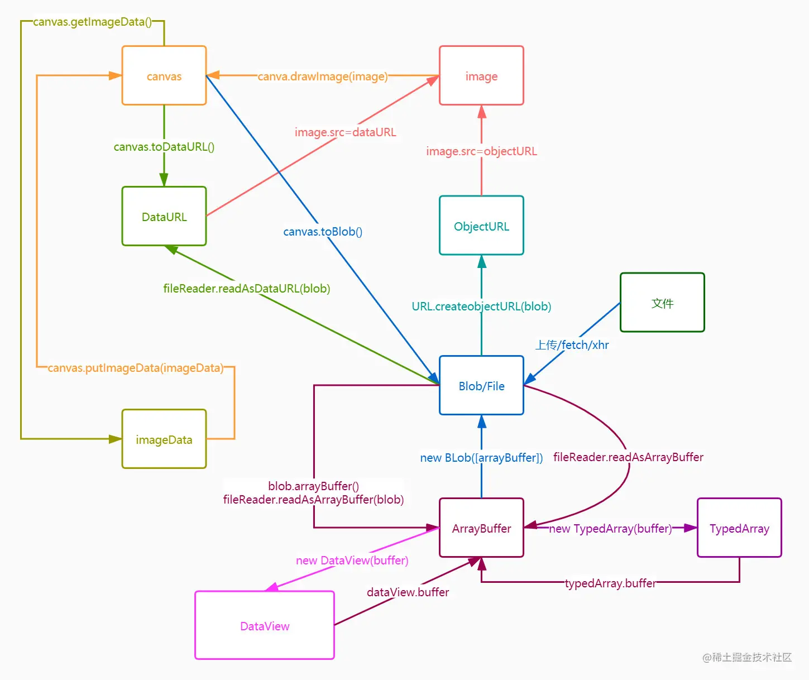

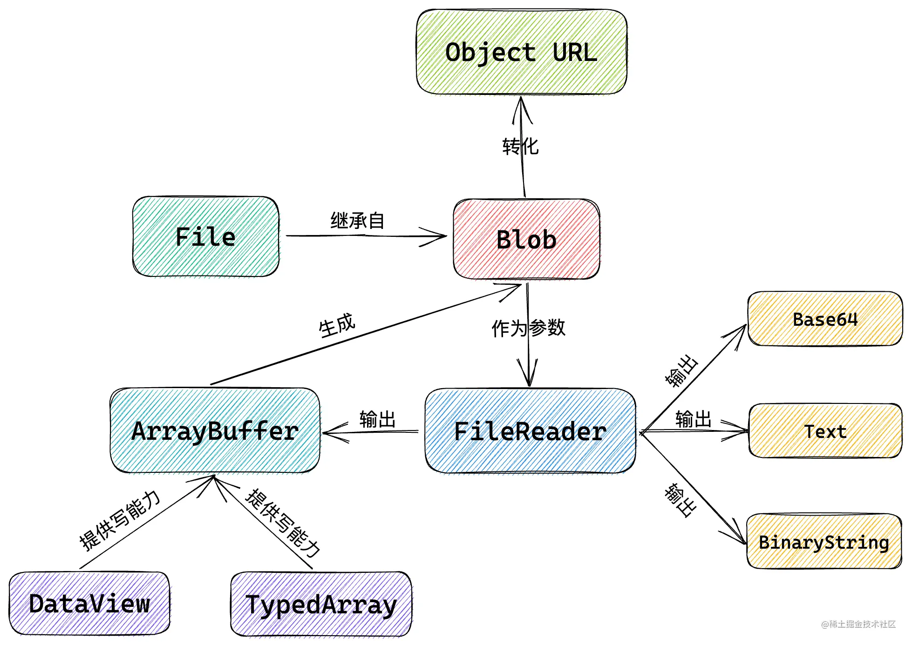

## 1. Blob

Blob 全称为 binary large object ，即二进制大对象，它是 JavaScript 中的一个对象，表示原始的类似文件的数据。下面是 MDN 中对 Blob 的解释：

> Blob 对象表示一个不可变、原始数据的类文件对象。它的数据可以按文本或二进制的格式进行读取，也可以转换成 [ReadableStream](https://link.juejin.cn?target=https%3A%2F%2Fdeveloper.mozilla.org%2Fzh-CN%2Fdocs%2FWeb%2FAPI%2FReadableStream) 来用于数据操作。

实际上，Blob 对象是包含有只读原始数据的类文件对象。简单来说，Blob 对象就是一个不可修改的二进制文件。

### （1）Blob 创建

可以使用 Blob() 构造函数来创建一个 Blob：

```javascript
new Blob(array, options)
```

其有两个参数：

- `array`：由 `ArrayBuffer`、`ArrayBufferView`、`Blob`、`DOMString` 等对象构成的，将会被放进 `Blob`；

- options：可选的 BlobPropertyBag

  字典，它可能会指定如下两个属性

  - `type`：默认值为 ""，表示将会被放入到 `blob` 中的数组内容的 MIME 类型。

- `endings`：默认值为"`transparent`"，用于指定包含行结束符`\n`的字符串如何被写入，不常用。

常见的 MIME 类型如下：

| **MIME 类型**    | **描述**        |
| ---------------- | --------------- |
| text/plain       | 纯文本文档      |
| text/html        | HTML 文档       |
| text/javascript  | JavaScript 文件 |
| text/css         | CSS 文件        |
| application/json | JSON 文件       |
| application/pdf  | PDF 文件        |
| application/xml  | XML 文件        |
| image/jpeg       | JPEG 图像       |
| image/png        | PNG 图像        |
| image/gif        | GIF 图像        |
| image/svg+xml    | SVG 图像        |
| audio/mpeg       | MP3 文件        |
| video/mpeg       | MP4 文件        |

下面来看一个简单的例子：

```javascript
const blob = new Blob(['Hello World'], { type: 'text/plain' })
```

这里可以成为动态文件创建，其正在创建一个类似文件的对象。这个 blob 对象上有两个属性：

- `size`：Blob 对象中所包含数据的大小（字节）；
- `type`：字符串，认为该 Blob 对象所包含的 MIME 类型。如果类型未知，则为空字符串。

下面来看打印结果：

```javascript
const blob = new Blob(['Hello World'], { type: 'text/plain' })

console.log(blob.size) // 11
console.log(blob.type) // "text/plain"
```

注意，字符串"Hello World"是 UTF-8 编码的，因此它的每个字符占用 1 个字节。

到现在，Blob 对象看起来似乎我们还是没有啥用。那该如何使用 Blob 对象呢？可以使用 URL.createObjectURL() 方法将将其转化为一个 URL，并在 Iframe 中加载：

```javascript
;<iframe></iframe>

const iframe = document.getElementsByTagName('iframe')[0]

const blob = new Blob(['Hello World'], { type: 'text/plain' })

iframe.src = URL.createObjectURL(blob)
```

### （2）Blob 分片

除了使用`Blob()`构造函数来创建 blob 对象之外，还可以从 blob 对象中创建 blob，也就是将 blob 对象切片。Blob 对象内置了 slice() 方法用来将 blob 对象分片，其语法如下：

```javascript
const blob = instanceOfBlob.slice([start [, end [, contentType]]]};
```

其有三个参数：

- `start`：设置切片的起点，即切片开始位置。默认值为 0，这意味着切片应该从第一个字节开始；
- `end`：设置切片的结束点，会对该位置之前的数据进行切片。默认值为`blob.size`；
- `contentType`：设置新 blob 的 MIME 类型。如果省略 type，则默认为 blob 的原始值。

下面来看例子：

```javascript
const iframe = document.getElementsByTagName('iframe')[0]

const blob = new Blob(['Hello World'], { type: 'text/plain' })

const subBlob = blob.slice(0, 5)

iframe.src = URL.createObjectURL(subBlob)
```

此时页面会显示"Hello"。

## 2. File

文件（File）接口提供有关文件的信息，并允许网页中的 JavaScript 访问其内容。实际上，File 对象是特殊类型的 Blob，且可以用在任意的 Blob 类型的 context 中。Blob 的属性和方法都可以用于 File 对象。

> 注意：File 对象中只存在于浏览器环境中，在 Node.js 环境中不存在。

在 JavaScript 中，主要有两种方法来获取 File 对象：

- `<input>` 元素上选择文件后返回的 FileList 对象；
- 文件拖放操作生成的 `DataTransfer` 对象；

### （1）input

首先定义一个输入类型为 file 的 `input` 标签：

```javascript
<input type="file" id="fileInput" multiple="multiple">
```

这里给 `input` 标签添加了三个属性：

- `type="file"`：指定 `input` 的输入类型为文件；
- `id="fileInput"`：指定 `input` 的唯一 id；
- `multiple="multiple"`：指定 `input` 可以同时上传多个文件；

下面来给 `input` 标签添加 `onchange` 事件，当选择文件并上传之后触发：

```javascript
const fileInput = document.getElementById('fileInput')

fileInput.onchange = (e) => {
  console.log(e.target.files)
}
```

当点击上传文件时，控制台就会输出一个 FileList 数组，这个数组的每个元素都是一个 File 对象，一个上传的文件就对应一个 File 对象： 每个 `File` 对象都包含文件的一些属性，这些属性都继承自 Blob 对象：

- `lastModified`：引用文件最后修改日期，为自 1970 年 1 月 1 日 0:00 以来的毫秒数；
- `lastModifiedDate`：引用文件的最后修改日期；
- `name`：引用文件的文件名；
- `size`：引用文件的文件大小；
- `type`：文件的媒体类型（MIME）；
- `webkitRelativePath`：文件的路径或 URL。

通常，我们在上传文件时，可以通过对比 size 属性来限制文件大小，通过对比 type 来限制上传文件的格式等。

### （2）文件拖放

另一种获取 File 对象的方式就是拖放 API，这个 API 很简单，就是将浏览器之外的文件拖到浏览器窗口中，并将它放在一个成为拖放区域的特殊区域中。拖放区域用于响应放置操作并从放置的项目中提取信息。这些是通过 `ondrop` 和 `ondragover` 两个 API 实现的。

下面来看一个简单的例子，首先定义一个拖放区域：

```javascript
<div id="drop-zone"></div>
```

然后给这个元素添加 `ondragover` 和 `ondrop` 事件处理程序：

```javascript
const dropZone = document.getElementById('drop-zone')

dropZone.ondragover = (e) => {
  e.preventDefault()
}

dropZone.ondrop = (e) => {
  e.preventDefault()
  const files = e.dataTransfer.files
  console.log(files)
}
```

**注意**：这里给两个 API 都添加了 `e.preventDefault()`，用来阻止默认事件。它是非常重要的，可以用来阻止浏览器的一些默认行为，比如放置文件将显示在浏览器窗口中。

当拖放文件到拖放区域时，控制台就会输出一个 FileList 数组，该数组的每一个元素都是一个 `File` 对象。这个 FileList 数组是从事件参数的 `dataTransfer` 属性的 `files` 获取的： 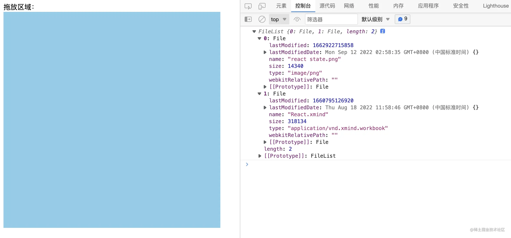 可以看到，这里得到的 `File` 对象和通过 `input` 标签获得的 `File` 对象是完全一样的。

## 3. FileReader

FileReader 是一个异步 API，用于读取文件并提取其内容以供进一步使用。FileReader 可以将 Blob 读取为不同的格式。

> 注意：FileReader 仅用于以安全的方式从用户（远程）系统读取文件内容，不能用于从文件系统中按路径名简单地读取文件。

### （1）基本使用

可以使用 FileReader 构造函数来创建一个 FileReader 对象：

```javascript
const reader = new FileReader()
```

这个对象常用属性如下：

- `error`：表示在读取文件时发生的错误；

- `result`：文件内容。该属性仅在读取操作完成后才有效，数据的格式取决于使用哪个方法来启动读取操作。

- readyState：表示 FileReader 状态的数字。取值如下：
  | **常量名** | **值** | **描述**               |
  | ---------- | ------ | ---------------------- |
  | EMPTY      | 0      | 还没有加载任何数据。   |
  | LOADING    | 1      | 数据正在被加载。       |
  | DONE       | 2      | 已完成全部的读取请求。 |

FileReader 对象提供了以下方法来加载文件：

- `readAsArrayBuffer()`：读取指定 Blob 中的内容，完成之后，`result` 属性中保存的将是被读取文件的 `ArrayBuffer` 数据对象；
- `FileReader.readAsBinaryString()`：读取指定 Blob 中的内容，完成之后，`result` 属性中将包含所读取文件的原始二进制数据；
- `FileReader.readAsDataURL()`：读取指定 Blob 中的内容，完成之后，`result` 属性中将包含一个`data: URL` 格式的 Base64 字符串以表示所读取文件的内容。
- `FileReader.readAsText()`：读取指定 Blob 中的内容，完成之后，`result` 属性中将包含一个字符串以表示所读取的文件内容。

可以看到，上面这些方法都接受一个要读取的 blob 对象作为参数，读取完之后会将读取的结果放入对象的 `result` 属性中。

### （2）事件处理

FileReader 对象常用的事件如下：

- `abort`：该事件在读取操作被中断时触发；
- `error`：该事件在读取操作发生错误时触发；
- `load`：该事件在读取操作完成时触发；
- `progress`：该事件在读取 Blob 时触发。

当然，这些方法可以加上前置 on 后在 HTML 元素上使用，比如`onload`、`onerror`、`onabort`、`onprogress`。除此之外，由于`FileReader`对象继承自`EventTarget`，因此还可以使用 `addEventListener()` 监听上述事件。

下面来看一个简单的例子，首先定义一个 `input` 输入框用于上传文件：

```html
<input type="file" id="fileInput" />
```

接下来定义 `input` 标签的 `onchange` 事件处理函数和`FileReader`对象的`onload`事件处理函数：

```javascript
const fileInput = document.getElementById('fileInput')

const reader = new FileReader()

fileInput.onchange = (e) => {
  reader.readAsText(e.target.files[0])
}

reader.onload = (e) => {
  console.log(e.target.result)
}
```

这里，首先创建了一个 `FileReader` 对象，当文件上传成功时，使用 `readAsText()` 方法读取 `File` 对象，当读取操作完成时打印读取结果。

使用上述例子读取文本文件时，就是比较正常的。如果读取二进制文件，比如 png 格式的图片，往往会产生乱码，如下：

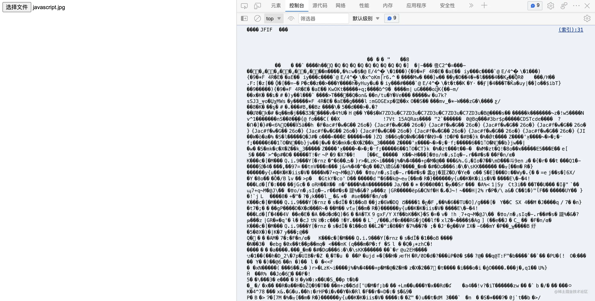

那该如何处理这种二进制数据呢？`readAsDataURL()` 是一个不错的选择，它可以将读取的文件的内容转换为 base64 数据的 URL 表示。这样，就可以直接将 URL 用在需要源链接的地方，比如 img 标签的 src 属性。

对于上述例子，将 readAsText 方法改为 `readAsDataURL()`：

```javascript
const fileInput = document.getElementById('fileInput')

const reader = new FileReader()

fileInput.onchange = (e) => {
  reader.readAsDataURL(e.target.files[0])
}

reader.onload = (e) => {
  console.log(e.target.result)
}
```

这时，再次上传二进制图片时，就会在控制台打印一个 base64 编码的 URL，如下：

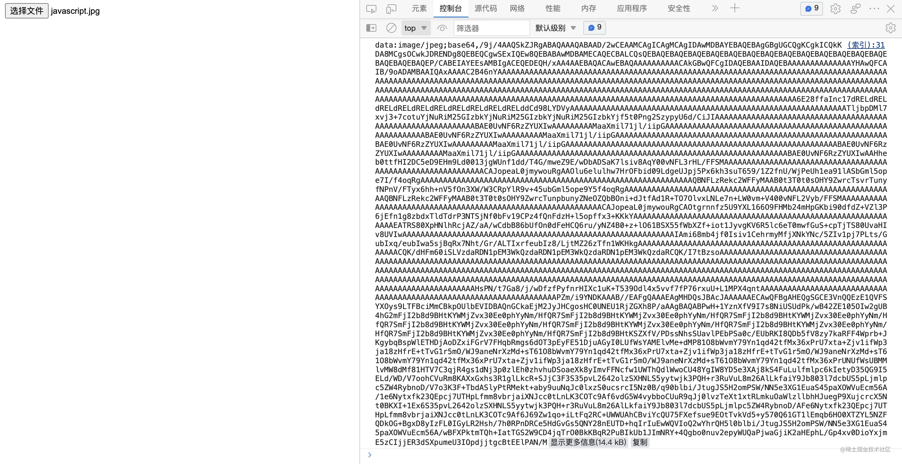

下面来修改一下这个例子，将上传的图片通过以上方式显示在页面上：

```javascript
<input type="file" id="fileInput" />


const fileInput = document.getElementById("fileInput");
const preview = document.getElementById("preview");
const reader = new FileReader();

fileInput.onchange = (e) => {
  reader.readAsDataURL(e.target.files[0]);
};

reader.onload = (e) => {
  preview.src = e.target.result;
  console.log(e.target.result);
};
```


当上传大文件时，可以通过 `progress` 事件来监控文件的读取进度：

```javascript
const reader = new FileReader();

reader.onprogress = (e) => {
  if (e.loaded && e.total) {
    const percent = (event.loaded / event.total) * 100;
    console.log(`上传进度: ${Math.round(percent)} %`);
  }
});
```

`progress` 事件提供了两个属性：`loaded`（已读取量）和`total`（需读取总量）。

## 4. ArrayBuffer

### （1）ArrayBuffer

ArrayBuffer 对象用来表示通用的、固定长度的**原始二进制数据缓冲区**。ArrayBuffer 的内容不能直接操作，只能通过 DataView 对象或 TypedArrray 对象来访问。这些对象用于读取和写入缓冲区内容。

ArrayBuffer 本身就是一个黑盒，不能直接读写所存储的数据，需要借助以下视图对象来读写：

- **TypedArray**：用来生成内存的视图，通过 9 个构造函数，可以生成 9 种数据格式的视图。
- **DataViews**：用来生成内存的视图，可以自定义格式和字节序。

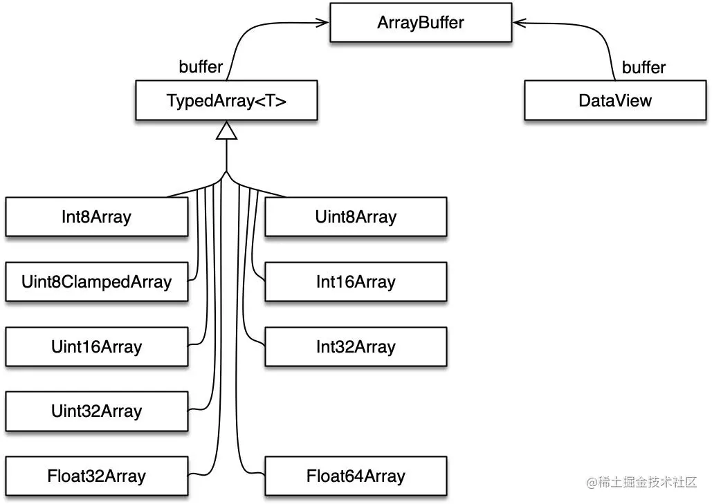

TypedArray 视图和 DataView 视图的区别主要是**字节序**，前者的数组成员都是同一个数据类型，后者的数组成员可以是不同的数据类型。

那 ArrayBuffer 与 Blob 有啥区别呢？根据 ArrayBuffer 和 Blob 的特性，Blob 作为一个整体文件，适合用于传输；当需要对二进制数据进行操作时（比如要修改某一段数据时），就可以使用 ArrayBuffer。

下面来看看 ArrayBuffer 有哪些常用的方法和属性。

#### ① new ArrayBuffer()

ArrayBuffer 可以通过以下方式生成：

```javascript
new ArrayBuffer(bytelength)
```

`ArrayBuffer()`构造函数可以分配指定字节数量的缓冲区，其参数和返回值如下：

- **参数**：它接受一个参数，即 bytelength，表示要创建数组缓冲区的大小（以字节为单位。）；
- **返回值**：返回一个新的指定大小的 ArrayBuffer 对象，内容初始化为 0。

#### ② ArrayBuffer.prototype.byteLength

ArrayBuffer 实例上有一个 byteLength 属性，它是一个只读属性，表示 ArrayBuffer 的 byte 的大小，在 ArrayBuffer 构造完成时生成，不可改变。来看例子：

```javascript
const buffer = new ArrayBuffer(16)
console.log(buffer.byteLength) // 16
```

#### ③ ArrayBuffer.prototype.slice()

ArrayBuffer 实例上还有一个 slice 方法，该方法可以用来截取 ArrayBuffer 实例，它返回一个新的 ArrayBuffer ，它的内容是这个 ArrayBuffer 的字节副本，从 begin（包括），到 end（不包括）。来看例子：

```javascript
const buffer = new ArrayBuffer(16)
console.log(buffer.slice(0, 8)) // 16
```

这里会从 buffer 对象上将前 8 个字节生成一个新的 ArrayBuffer 对象。这个方法实际上有两步操作，首先会分配一段指定长度的内存，然后拷贝原来 ArrayBuffer 对象的置顶部分。

#### ④ ArrayBuffer.isView()

ArrayBuffer 上有一个 isView()方法，它的返回值是一个布尔值，如果参数是 ArrayBuffer 的视图实例则返回 true，例如类型数组对象或 DataView 对象；否则返回 false。简单来说，这个方法就是用来判断参数是否是 TypedArray 实例或者 DataView 实例：

```javascript
const buffer = new ArrayBuffer(16)
ArrayBuffer.isView(buffer) // false

const view = new Uint32Array(buffer)
ArrayBuffer.isView(view) // true
```

### （2）TypedArray

TypedArray 对象一共提供 9 种类型的视图，每一种视图都是一种构造函数。如下：

| **元素** | **类型化数组**    | **字节** | **描述**        |
| -------- | ----------------- | -------- | --------------- |
| Int8     | Int8Array         | 1        | 8 位有符号整数  |
| Uint8    | Uint8Array        | 1        | 8 位无符号整数  |
| Uint8C   | Uint8ClampedArray | 1        | 8 位无符号整数  |
| Int16    | Int16Array        | 2        | 16 位有符号整数 |
| Uint16   | Uint16Array       | 2        | 16 位无符号整数 |
| Int32    | Int32Array        | 4        | 32 位有符号整数 |
| Uint32   | Uint32Array       | 4        | 32 位无符号整数 |
| Float32  | Float32Array      | 4        | 32 位浮点       |
| Float64  | Float64Array      | 8        | 64 位浮点       |

来看看这些都是什么意思：

- **Uint8Array：**将 ArrayBuffer 中的每个字节视为一个整数，可能的值从 0 到 255 （一个字节等于 8 位）。 这样的值称为“8 位无符号整数”。
- **Uint16Array**：将 ArrayBuffer 中任意两个字节视为一个整数，可能的值从 0 到 65535。 这样的值称为“16 位无符号整数”。
- **Uint32Array：**将 ArrayBuffer 中任何四个字节视为一个整数，可能值从 0 到 4294967295，这样的值称为“32 位无符号整数”。

这些构造函数生成的对象统称为 TypedArray 对象。它们和正常的数组很类似，都有`length` 属性，都能用索引获取数组元素，所有数组的方法都可以在类型化数组上面使用。

那类型化数组和数组有什么区别呢？

- 类型化数组的元素都是连续的，不会为空；
- 类型化数组的所有成员的类型和格式相同；
- 类型化数组元素默认值为 0；
- 类型化数组本质上只是一个视图层，不会存储数据，数据都存储在更底层的 ArrayBuffer 对象中。

下面来看看 TypedArray 都有哪些常用的方法和属性。

#### ① new TypedArray()

TypedArray 的语法如下（TypedArray 只是一个概念，实际使用的是那 9 个对象）：

```javascript
new Int8Array(length);
new Int8Array(typedArray);
new Int8Array(object);
new Int8Array(buffer [, byteOffset [, length]]);

```

可以看到，TypedArray 有多种用法，下面来分别看一下。

- **TypedArray(length)**：通过分配指定长度内容进行分配

```javascript
let view = new Int8Array(16)
view[0] = 10
view[10] = 6
console.log(view)
```

输出结果如下： 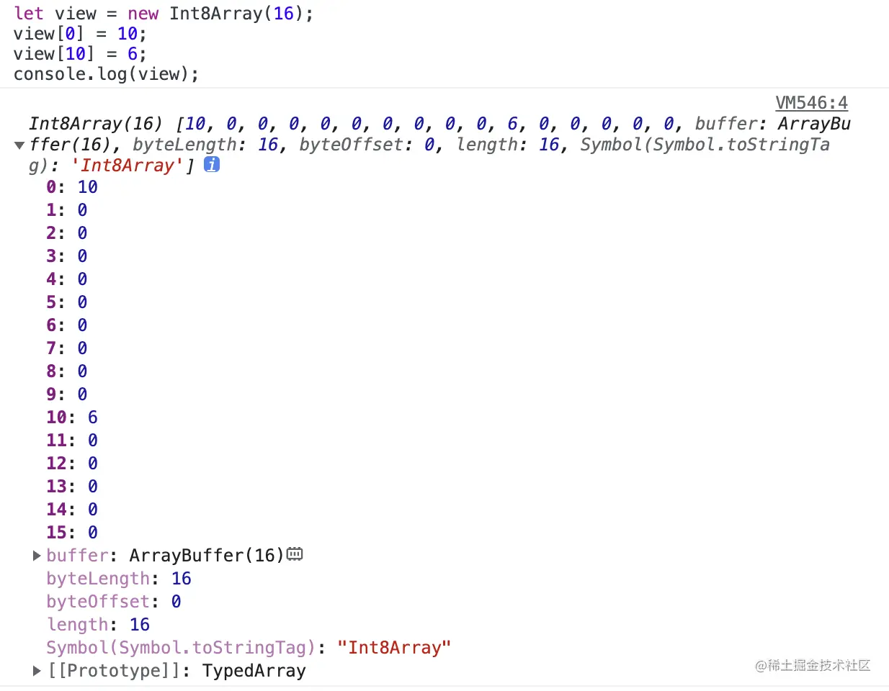 这里就生成了一个 16 个元素的 Int8Array 数组，除了手动赋值的元素，其他元素的初始值都是 0。

- **TypedArray(typeArray)**：接收一个视图实例作为参数

```javascript
const view = new Int8Array(new Uint8Array(6))
view[0] = 10
view[3] = 6
console.log(view)
```

输出结果如下： 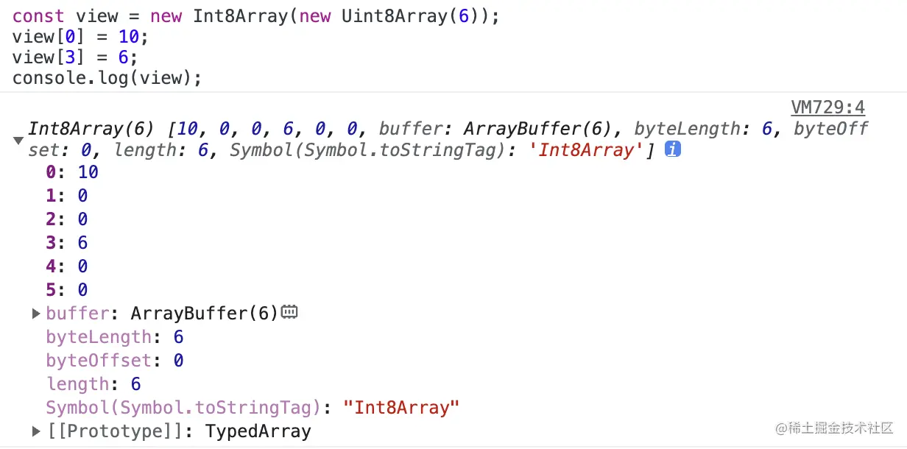

- **TypedArray(object)**：参数可以是一个普通数组

```javascript
const view = new Int8Array([1, 2, 3, 4, 5])
view[0] = 10
view[3] = 6
console.log(view)
```

输出结果如下： 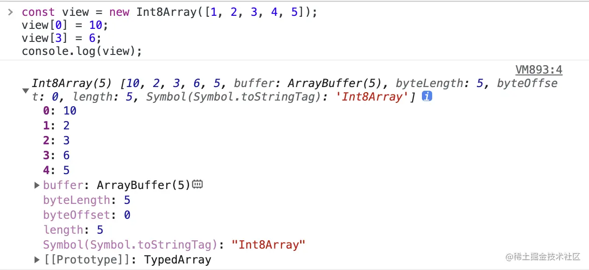 需要注意，TypedArray 视图会开辟一段新的内存，不会在原数组上建立内存。当然，这里创建的类型化数组也能转换回普通数组：

```javascript
Array.prototype.slice.call(view) // [10, 2, 3, 6, 5]
```

- **TypeArray(buffer [, byteOffset [, length]])**：

这种方式有三个参数，其中第一个参数是一个 ArrayBuffer 对象；第二个参数是视图开始的字节序号，默认从 0 开始，可选；第三个参数是视图包含的数据个数，默认直到本段内存区域结束。

```javascript
const buffer = new ArrayBuffer(8)
const view1 = new Int32Array(buffer)
const view2 = new Int32Array(buffer, 4)
console.log(view1, view2)
```

输出结果如下： 

#### ② **BYTES_PER_ELEMENT**

每种视图的构造函数都有一个 `BYTES_PER_ELEMENT` 属性，表示这种数据类型占据的字节数：

```javascript
Int8Array.BYTES_PER_ELEMENT // 1
Uint8Array.BYTES_PER_ELEMENT // 1
Int16Array.BYTES_PER_ELEMENT // 2
Uint16Array.BYTES_PER_ELEMENT // 2
Int32Array.BYTES_PER_ELEMENT // 4
Uint32Array.BYTES_PER_ELEMENT // 4
Float32Array.BYTES_PER_ELEMENT // 4
Float64Array.BYTES_PER_ELEMENT // 8
```

`BYTES_PER_ELEMENT` 属性也可以在类型化数组的实例上获取：

```javascript
const buffer = new ArrayBuffer(16)
const view = new Uint32Array(buffer)
console.log(Uint32Array.BYTES_PER_ELEMENT) // 4
```

#### ③ **TypedArray.prototype.buffer**

TypedArray 实例的 buffer 属性会返回内存中对应的 ArrayBuffer 对象，只读属性。

```javascript
const a = new Uint32Array(8)
const b = new Int32Array(a.buffer)
console.log(a, b)
```

输出结果如下： 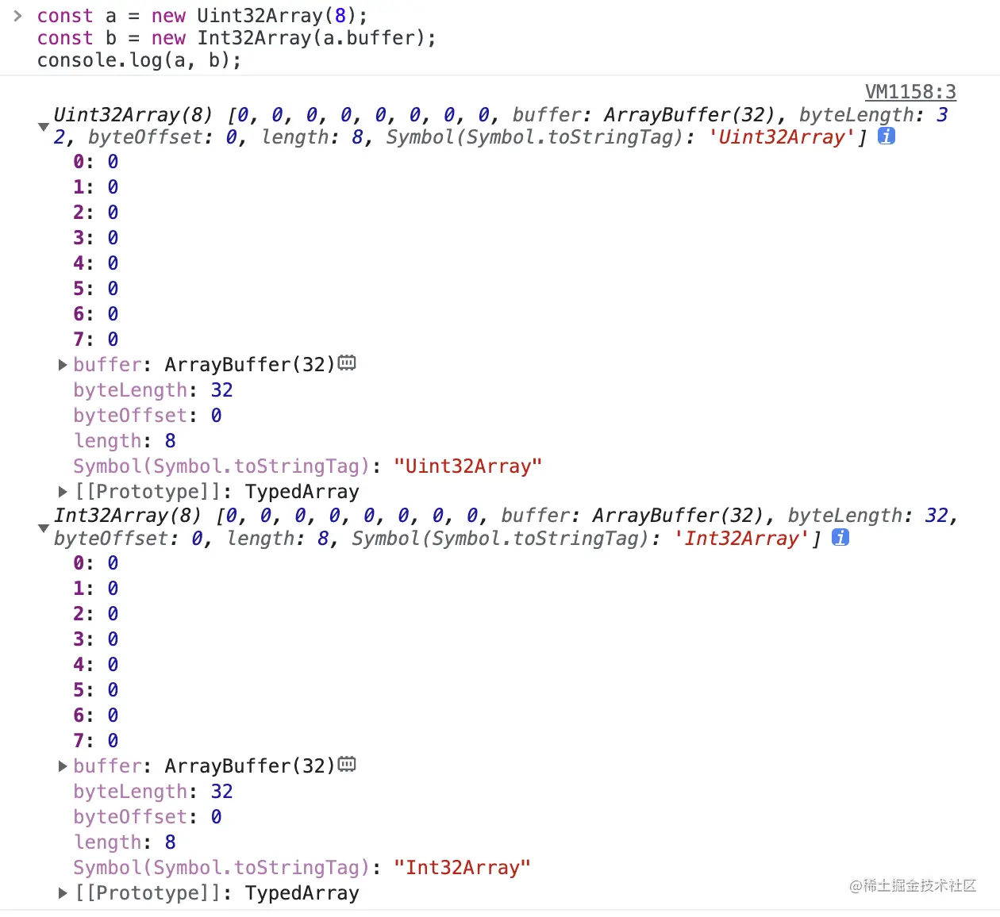

#### ④ **TypedArray.prototype.slice()**

TypeArray 实例的 slice 方法可以返回一个指定位置的新的 TypedArray 实例。

```javascript
const view = new Int16Array(8)
console.log(view.slice(0, 5))
```

输出结果如下： 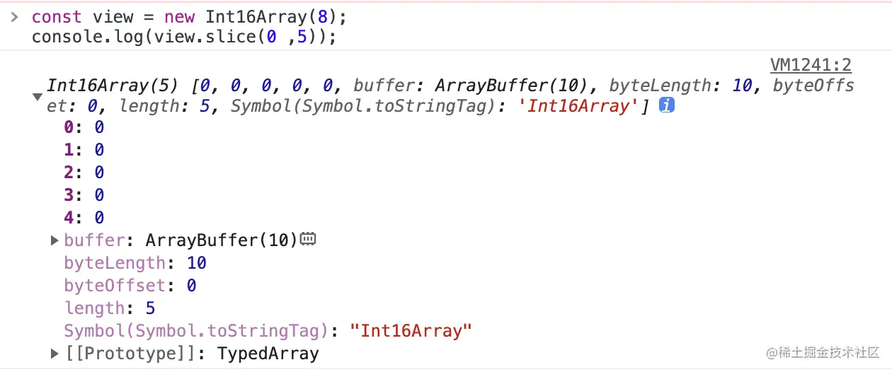

#### **⑤ byteLength 和 length**

- `byteLength`：返回 TypedArray 占据的内存长度，单位为字节；
- `length`：返回 TypedArray 元素个数；

```javascript
const view = new Int16Array(8)
view.length // 8
view.byteLength // 16
```

### （3）DataView

说完 ArrayBuffer，下面来看看另一种操作 ArrayBuffer 的方式：DataView。**DataView** 视图是一个可以从 二进制 ArrayBuffer 对象中读写多种数值类型的底层接口，使用它时，不用考虑不同平台的字节序问题。

DataView 视图提供更多操作选项，而且支持设定字节序。本来，在设计目的上，ArrayBuffer 对象的各种 TypedArray 视图，是用来向网卡、声卡之类的本机设备传送数据，所以使用本机的字节序就可以了；而 DataView 视图的设计目的，是用来处理网络设备传来的数据，所以大端字节序或小端字节序是可以自行设定的。

#### ① new DataView()

DataView 视图可以通过构造函数来创建，它的参数是一个 ArrayBuffer 对象，生成视图。其语法如下：

```javascript
new DataView(buffer [, byteOffset [, byteLength]])
```

其有三个参数：

- `buffer`：一个已经存在的 ArrayBuffer 对象，DataView 对象的数据源。
- `byteOffset`：可选，此 DataView 对象的第一个字节在 buffer 中的字节偏移。如果未指定，则默认从第一个字节开始。
- `byteLength`：可选，此 DataView 对象的字节长度。如果未指定，这个视图的长度将匹配 buffer 的长度。

来看一个例子：

```javascript
const buffer = new ArrayBuffer(16)
const view = new DataView(buffer)
console.log(view)
```

打印结果如下： 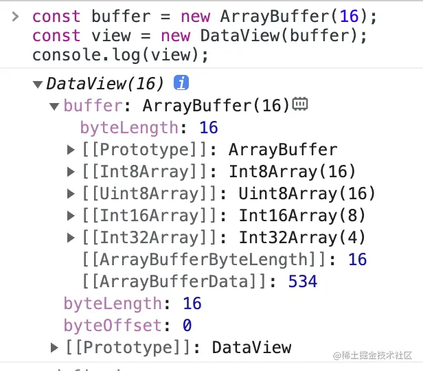

#### ② buffer、byteLength、byteOffset

DataView 实例有以下常用属性：

- `buffer`：返回对应的 ArrayBuffer 对象；
- `byteLength`：返回占据的内存字节长度；
- `byteOffset`：返回当前视图从对应的 ArrayBuffer 对象的哪个字节开始。

```javascript
const buffer = new ArrayBuffer(16)
const view = new DataView(buffer)
view.buffer
view.byteLength
view.byteOffset
```

打印结果如下： 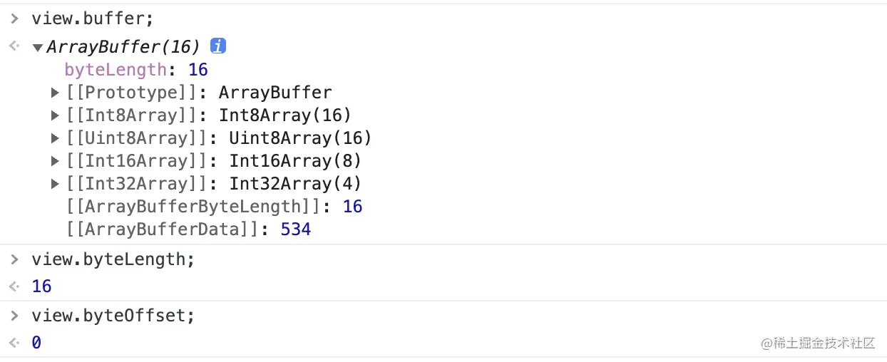

#### ③ 读取内存

DataView 实例提供了以下方法来读取内存，它们的参数都是一个字节序号，表示开始读取的字节位置：

- getInt8：读取 1 个字节，返回一个 8 位整数。
- getUint8：读取 1 个字节，返回一个无符号的 8 位整数。
- getInt16：读取 2 个字节，返回一个 16 位整数。
- getUint16：读取 2 个字节，返回一个无符号的 16 位整数。
- getInt32：读取 4 个字节，返回一个 32 位整数。
- getUint32：读取 4 个字节，返回一个无符号的 32 位整数。
- getFloat32：读取 4 个字节，返回一个 32 位浮点数。
- getFloat64：读取 8 个字节，返回一个 64 位浮点数。

下面来看一个例子：

```javascript
const buffer = new ArrayBuffer(24)
const view = new DataView(buffer)

// 从第1个字节读取一个8位无符号整数
const view1 = view.getUint8(0)

// 从第2个字节读取一个16位无符号整数
const view2 = view.getUint16(1)

// 从第4个字节读取一个16位无符号整数
const view3 = view.getUint16(3)
```

#### ④ 写入内存

DataView 实例提供了以下方法来写入内存，它们都接受两个参数，第一个参数表示开始写入数据的字节序号，第二个参数为写入的数据：

- setInt8：写入 1 个字节的 8 位整数。
- setUint8：写入 1 个字节的 8 位无符号整数。
- setInt16：写入 2 个字节的 16 位整数。
- setUint16：写入 2 个字节的 16 位无符号整数。
- setInt32：写入 4 个字节的 32 位整数。
- setUint32：写入 4 个字节的 32 位无符号整数。
- setFloat32：写入 4 个字节的 32 位浮点数。
- setFloat64：写入 8 个字节的 64 位浮点数。

## 5. Object URL

Object URL（MDN 定义名称）又称 Blob URL（W3C 定义名称），是 HTML5 中的新标准。它是一个用来表示 File Object 或 Blob Object 的 URL。在网页中，我们可能会看到过这种形式的 Blob URL： 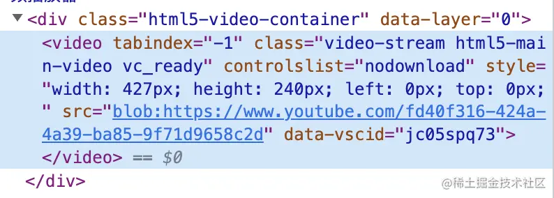 其实 Blob URL/Object URL 是一种伪协议，允许将 Blob 和 File 对象用作图像、二进制数据下载链接等的 URL 源。

对于 Blob/File 对象，可以使用 URL 构造函数的 `createObjectURL()` 方法创建将给出的对象的 URL。这个 URL 对象表示指定的 File 对象或 Blob 对象。我们可以在``、`<script>` 标签中或者 `<a>` 和 `<link>` 标签的 `href` 属性中使用这个 URL。

来看一个简单的例子，首先定义一个文件上传的 input 和一个 图片预览的 img：

```javascript
<input type="file" id="fileInput" />


```

再来使用 `URL.createObjectURL()` 将 File 对象转化为一个 URL：

```javascript
const fileInput = document.getElementById('fileInput')
const preview = document.getElementById('preview')

fileInput.onchange = (e) => {
  preview.src = URL.createObjectURL(e.target.files[0])
  console.log(preview.src)
}
```

可以看到，上传的图片转化成了一个 URL，并显示在了屏幕上：  那这个 API 有什么意义呢？可以将 Blob/File 对象转化为 URL，通过这个 URL 就可以实现文件下载或者图片显示等。

当我们使用`createObjectURL()`方法创建一个 data URL 时，就需要使用`revokeObjectURL()`方法从内存中清除它来释放内存。虽然浏览器会在文档卸载时自动释放 Data URL，但为了提高性能，我们应该使用`createObjectURL()`来手动释放它。`revokeObjectURL()`方法接受一个 Data URL 作为其参数，返回`undefined`。下面来看一个例子：

```javascript
const objUrl = URL.createObjectURL(new File([''], 'filename'))
console.log(objUrl)
URL.revokeObjectURL(objUrl)
```

## 6. Base64

Base64 是一种基于 64 个可打印字符来表示二进制数据的表示方法。Base64 编码普遍应用于需要通过被设计为处理文本数据的媒介上储存和传输二进制数据而需要编码该二进制数据的场景。这样是为了保证数据的完整并且不用在传输过程中修改这些数据。

在 JavaScript 中，有两个函数被分别用来处理解码和编码 _base64_ 字符串：

- `atob()`：解码，解码一个 Base64 字符串；
- `btoa()`：编码，从一个字符串或者二进制数据编码一个 Base64 字符串。

```javascript
btoa('JavaScript') // 'SmF2YVNjcmlwdA=='
atob('SmF2YVNjcmlwdA==') // 'JavaScript'
```

那 base64 的实际应用场景有哪些呢？其实多数场景就是基于 Data URL 的。比如，使用`toDataURL()`方法把 canvas 画布内容生成 base64 编码格式的图片：

```javascript
const canvas = document.getElementById('canvas')
const ctx = canvas.getContext('2d')
const dataUrl = canvas.toDataURL()
```

除此之外，还可以使用`readAsDataURL()`方法把上传的文件转为 base64 格式的 data URI，比如上传头像展示或者编辑：

```javascript
<input type="file" id="fileInput" />


const fileInput = document.getElementById("fileInput");
const preview = document.getElementById("preview");
const reader = new FileReader();

fileInput.onchange = (e) => {
  reader.readAsDataURL(e.target.files[0]);
};

reader.onload = (e) => {
  preview.src = e.target.result;
  console.log(e.target.result);
};
```

效果如下，将图片（二进制数据）转化为可打印的字符，也便于数据的传输：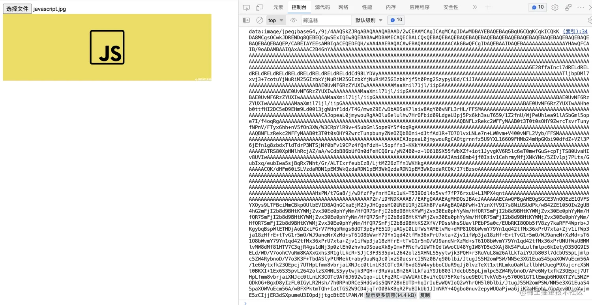 另外，一些小的图片都可以使用 base64 格式进行展示，`img`标签和`background`的 `url` 属性都支持使用 base64 格式的图片，这样做也可以减少 HTTP 请求。

## 7. 格式转化

看完这些基本的概念和使用，下面就来看看常用的格式之间是如何转换的。

### （1）ArrayBuffer → blob

```javascript
const blob = new Blob([new Uint8Array(buffer, byteOffset, length)])
```

### （2）ArrayBuffer → base64

```javascript
const base64 = btoa(
  String.fromCharCode.apply(null, new Uint8Array(arrayBuffer))
)
```

### （3）base64 → blob

```javascript
const base64toBlob = (base64Data, contentType, sliceSize) => {
  const byteCharacters = atob(base64Data)
  const byteArrays = []

  for (let offset = 0; offset < byteCharacters.length; offset += sliceSize) {
    const slice = byteCharacters.slice(offset, offset + sliceSize)

    const byteNumbers = new Array(slice.length)
    for (let i = 0; i < slice.length; i++) {
      byteNumbers[i] = slice.charCodeAt(i)
    }

    const byteArray = new Uint8Array(byteNumbers)
    byteArrays.push(byteArray)
  }

  const blob = new Blob(byteArrays, { type: contentType })
  return blob
}
```

### （4）blob → ArrayBuffer

```javascript
function blobToArrayBuffer(blob) {
  return new Promise((resolve, reject) => {
    const reader = new FileReader()
    reader.onload = () => resolve(reader.result)
    reader.onerror = () => reject
    reader.readAsArrayBuffer(blob)
  })
}
```

### （5）blob → base64

```javascript
function blobToBase64(blob) {
  return new Promise((resolve) => {
    const reader = new FileReader()
    reader.onloadend = () => resolve(reader.result)
    reader.readAsDataURL(blob)
  })
}
```

### （6）blob → Object URL

```javascript
const objectUrl = URL.createObjectURL(blob)
```
