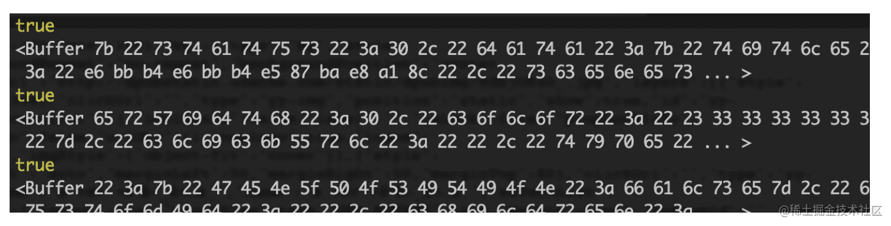
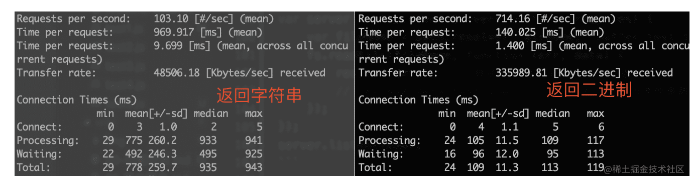

## 流的概念

> - 流是一组有序的，有起点和终点的字节数据传输手段
> - 它不关心文件的整体内容，只关注是否从文件中读到了数据，以及读到数据之后的处理
> - 流是一个抽象接口，被 Node 中的很多对象所实现。比如HTTP 服务器request和response对象都是流。

### Node.js 中有四种基本的流类型

1. Readable - 可读的流 (例如 fs.createReadStream())。
2. Writable - 可写的流 (例如 fs.createWriteStream()).
3. Duplex - 可读写的流(双工流) (例如 net.Socket).
4. Transform - 转换流 在读写过程中可以修改和变换数据的 Duplex 流 (例如 zlib.createDeflate())

### 为什么使用流

如果读取一个文件，使用fs.readFileSync同步读取，程序会被阻塞，然后所有数据被写到内存中。使用fs.readFile读取，程序不会阻塞，但是所有数据依旧会一次性全被写到内存，然后再让消费者去读取。如果文件很大，内存使用便会成为问题。 这种情况下流就比较有优势。流相比一次性写到内存中，它会先写到到一个缓冲区，然后再由消费者去读取，不用将整个文件写进内存，节省了内存空间。

### 视频播放例子

小伙伴们肯定都在线看过电影，对比定义中的图-`水桶管道流转图`，`source`就是服务器端的视频，`dest`就是你自己的播放器(或者浏览器中的flash和h5 video)。大家想一下，看电影的方式就如同上面的图管道换水一样，一点点从服务端将视频流动到本地播放器，一边流动一边播放，最后流动完了也就播放完了。

说明：视频播放的这个例子，如果我们不使用管道和流动的方式，直接先从服务端加载完视频文件，然后再播放。会造成很多问题

1. 因内存占有太多而导致系统卡顿或者崩溃
2. 因为我们的网速 内存 cpu运算速度都是有限的，而且还要有多个程序共享使用，一个视频文件加载完可能有几个g那么大。

1.不使用流时文件会全部写入内存，再又内存写入目标文件


 2.使用流时可以控制流的读取及写入速率


### stream从哪里来-soucre

`stream`的常见来源方式有三种：

1. 从控制台输入
2. `http`请求中的`request`
3. 读取文件

这里先说一下`从控制台输入`这种方式，2和3两种方式`stream应用场景`章节会有详细的讲解。

看一段`process.stdin`的代码

```javascript
process.stdin.on('data', function (chunk) {
    console.log('stream by stdin', chunk)
    console.log('stream by stdin', chunk.toString())
})
//控制台输入koalakoala后输出结果
stream by stdin <Buffer 6b 6f 61 6c 61 6b 6f 61 6c 61 0a>
stream by stdin koalakoala
```

运行上面代码：然后从控制台输入任何内容都会被`data` 事件监听到，`process.stdin`就是一个`stream`对象,data 是`stream`对象用来监听数据传入的一个自定义函数，通过输出结果可看出`process.stdin`是一个stream对象。

说明： `stream`对象可以监听`"data"`,`"end"`,`"opne"`,`"close"`,`"error"`等事件。`node.js`中监听自定义事件使用`.on`方法，例如`process.stdin.on(‘data’,…)`, `req.on(‘data’,…)`,通过这种方式，能很直观的监听到`stream`数据的传入和结束

### 连接水桶的管道-pipe

从水桶管道流转图中可以看到，在`source`和`dest`之间有一个连接的管道`pipe`,它的基本语法是`source.pipe(dest)`，`source`和`dest`就是通过pipe连接，让数据从`source`流向了`dest`。

### stream到哪里去-dest

stream的常见输出方式有三种：

1. 输出控制台
2. `http`请求中的`response`
3. 写入文件

## stream应用场景

### get请求中应用stream

这样一个需求：

使用node.js实现一个http请求，读取data.txt文件，创建一个服务，监听8000端口，读取文件后返回给客户端，讲get请求的时候用一个常规文件读取与其做对比，请看下面的例子。

- 常规使用文件读取返回给客户端response例子 ，文件命名为`getTest1.js`

```javascript
// getTest.js
const http = require('http');
const fs = require('fs');
const path = require('path');

const server = http.createServer(function (req, res) {
    const method = req.method; // 获取请求方法
    if (method === 'GET') { // get 请求方法判断
        const fileName = path.resolve(__dirname, 'data.txt');
        fs.readFile(fileName, function (err, data) {
            res.end(data);
        });
    }
});
server.listen(8000);
```

- 使用stream返回给客户端response 将上面代码做部分修改，文件命名为`getTest2.js`

```javascript
// getTest2.js
// 主要展示改动的部分
const server = http.createServer(function (req, res) {
    const method = req.method; // 获取请求方法
    if (method === 'GET') { // get 请求
        const fileName = path.resolve(__dirname, 'data.txt');
        let stream = fs.createReadStream(fileName);
        stream.pipe(res); // 将 res 作为 stream 的 dest
    }
});
server.listen(8000);
```

对于下面get请求中使用stream的例子，会不会有些小伙伴提出质疑，难道response也是一个stream对象，是的没错,对于那张`水桶管道流转图`,response就是一个dest。

虽然get请求中可以使用stream，但是相比直接file文件读取`·res.end(data)`有什么好处呢？这时候我们刚才推荐的压力测试小工具就用到了。`getTest1`和`getTest2`两段代码，将`data.txt`内容增加大一些，使用`ab`工具进行测试，运行命令`ab -n 100 -c 100 http://localhost:8000/`，其中`-n 100`表示先后发送100次请求，`-c 100`表示一次性发送的请求数目为100个。对比结果分析使用stream后，有非常大的性能提升，小伙伴们可以自己实际操作看一下。

### post中使用stream

一个通过post请求微信小程序的地址生成二维码的需求。

```javascript
/*
* 微信生成二维码接口
* params src 微信url / 其他图片请求链接
* params localFilePath: 本地路径
* params data: 微信请求参数
* */
const downloadFile=async (src, localFilePath, data)=> {
    try{
        const ws = fs.createWriteStream(localFilePath);
        return new Promise((resolve, reject) => {
            ws.on('finish', () => {
                resolve(localFilePath);
            });
            if (data) {
                request({
                    method: 'POST',
                    uri: src,
                    json: true,
                    body: data
                }).pipe(ws);
            } else {
                request(src).pipe(ws);
            }
        });
    }catch (e){
        logger.error('wxdownloadFile error: ',e);
        throw e;
    }
}
```

看这段使用了stream的代码，为本地文件对应的路径创建一个stream对象，然后直接`.pipe(ws)`,将post请求的数据流转到这个本地文件中，这种stream的应用在node后端开发过程中还是比较常用的。

### post与get使用stream总结

request和reponse一样，都是stream对象，可以使用stream的特性，二者的区别在于，我们再看一下`水桶管道流转图`，


 request是source类型，是图中的源头，而response是dest类型，是图中的目的地。


### 在文件操作中使用stream

一个文件拷贝的例子

```javascript
const fs = require('fs')
const path = require('path')

// 两个文件名
const fileName1 = path.resolve(__dirname, 'data.txt')
const fileName2 = path.resolve(__dirname, 'data-bak.txt')
// 读取文件的 stream 对象
const readStream = fs.createReadStream(fileName1)
// 写入文件的 stream 对象
const writeStream = fs.createWriteStream(fileName2)
// 通过 pipe执行拷贝，数据流转
readStream.pipe(writeStream)
// 数据读取完成监听，即拷贝完成
readStream.on('end', function () {
    console.log('拷贝完成')
})
```

看了这段代码，发现是不是拷贝好像很简单，创建一个可读数据流`readStream`，一个可写数据流`writeStream`,然后直接通过`pipe`管道把数据流转过去。这种使用stream的拷贝相比存文件的读写实现拷贝，性能要增加很多，所以小伙伴们在遇到文件操作的需求的时候，尽量先评估一下是否需要使用`stream`实现。

### 逐行读取的最佳方案 readline

上一章讲解了用 stream 操作文件，会来带很大的性能提升。但是**原生的 stream 却对"行"无能为力**，它只是把文件当做一个数据流、简单粗暴的流动。很多文件格式都是分行的，例如 csv 文件、日志文件，以及其他一些自定义的文件格式。

node.js 提供了非常简单的按行读取的 API —— readline ，它本质上也是 stream ，只不过是以"行"作为数据流动的单位。

### readline 的使用

相比于 stream 的 `data` 和 `end` 自定义事件， readline 需要监听 `line` 和 `close` 两个自定义事件。readline 的基本使用示例如下：

```js
var fs = require('fs')
var path = require('path')
var readline = require('readline') // 引用 readline
// 文件名
var fileName = path.resolve(__dirname, 'readline-data.txt')
var readStream = fs.createReadStream(fileName)

// 创建 readline 对象
var rl = readline.createInterface({
    // 输入，依赖于 stream 对象
    input: readStream
})

// 监听逐行读取的内容
rl.on('line', function (lineData) {
    console.log(lineData)
})
// 监听读取完成
rl.on('close', function () {
    console.log('readline end')
})
```

### 应用场景

对于处理按行为单位的文件，如日志文件，使用 readline 是最佳选择。接下来会使用 readline 演示一个日志文件的分析，最终得出在 `2018-10-23 14:00` 这一分钟内，访问 `user.html` 的日志数量。日志格式和上文的示例一样，但是日志的内容我制造了 10w 行（文件体积 11.4M ），为了能更加真实的演示效果。

```js
var fs = require('fs')
var path = require('path')
var readline = require('readline') // 引用 readline

var memeye = require('memeye')
memeye()

function doReadLine() {
    var fileName = path.resolve(__dirname, 'readline-data.txt')
    var readStream = fs.createReadStream(fileName)
    var rl = readline.createInterface({
        input: readStream
    })
    var num = 0

    // 监听逐行读取的内容
    rl.on('line', function (lineData) {
        if (lineData.indexOf('2018-10-30 14:00') >= 0 && lineData.indexOf('user.html') >= 0) {
            num++
        }
    })
    // 监听读取完成
    rl.on('close', function () {
        console.log('num', num)
    })
}

setTimeout(doReadLine, 5000);
```

### 前端一些打包工具的底层实现

目前一些比较火的`前端打包构建工具`，都是通过`node.js`编写的，打包和构建的过程肯定是文件频繁操作的过程，离不来`stream`,例如现在比较火的`gulp`,有兴趣的小伙伴可以去看一下源码。

## stream的种类

- `Readable Stream` 可读数据流
- `Writeable Stream` 可写数据流
- `Duplex Stream` 双向数据流，可以同时读和写
- `Transform Stream` 转换数据流，可读可写，同时可以转换（处理）数据(不常用)

之前的文章都是围绕前两种可读数据流和可写数据流，第四种流不太常用，需要的小伙伴网上搜索一下，接下来对第三种数据流Duplex Stream 说明一下。

`Duplex Stream` 双向的，既可读，又可写。 `Duplex streams`同时实现了 `Readable`和`Writable` 接口。 `Duplex streams`的例子包括

- `tcp sockets`
- `zlib streams`
- `crypto streams` 我在项目中还未使用过双工流，一些Duplex Stream的内容可以参考这篇文章[NodeJS Stream 双工流](https://link.juejin.cn?target=https%3A%2F%2Fwww.cnblogs.com%2FdolphinX%2Fp%2F6376615.html)

## stream有什么弊端

- 用 `rs.pipe(ws)` 的方式来写文件并不是把 rs 的内容 `append` 到 ws 后面，而是直接用 rs 的内容覆盖 ws 原有的内容
- 已结束/关闭的流不能重复使用，必须重新创建数据流
- `pipe` 方法返回的是目标数据流，如 `a.pipe(b)` 返回的是 b，因此监听事件的时候请注意你监听的对象是否正确
- 如果你要监听多个数据流，同时你又使用了 `pipe` 方法来串联数据流的话，你就要写成： 代码实例：

```javascript
 data
        .on('end', function() {
            console.log('data end');
        })
        .pipe(a)
        .on('end', function() {
            console.log('a end');
        })
        .pipe(b)
        .on('end', function() {
            console.log('b end');
        });
```

## 流的使用及实现

### 可读流createReadStream

#### 可读流的使用

1. 创建可读流

   ```javascript
   var rs = fs.createReadStream(path,[options]);
   ```

   1.)path读取文件的路径

   2.)options

   - flags打开文件要做的操作,默认为'r'
   - encoding默认为null
   - start开始读取的索引位置
   - end结束读取的索引位置(包括结束位置)
   - highWaterMark读取缓存区默认的大小64kb

   > 如果指定utf8编码highWaterMark要大于3个字节

2. 监听data事件

   流切换到流动模式,数据会被尽可能快的读出

   ```javascript
   rs.on('data', function (data) {
       console.log(data);
   });
   ```

3. 监听end事件

   该事件会在读完数据后被触发

   ```javascript
   rs.on('end', function () {
       console.log('读取完成');
   });
   ```

4. 监听error事件

   ```javascript
   rs.on('error', function (err) {
       console.log(err);
   });
   ```

5. 监听close事件

   与指定{encoding:'utf8'}效果相同，设置编码

   ```arduino
   rs.setEncoding('utf8');
   ```

6. 暂停和恢复触发data

   通过pause()方法和resume()方法

   ```javascript
   rs.on('data', function (data) {
       rs.pause();
       console.log(data);
   });
   setTimeout(function () {
       rs.resume();
   },2000);
   ```

#### 可读流的简单实现

1. 仿写可读流

   ```kotlin
   let fs = require('fs');
   let EventEmitter = require('events');
   class ReadStream extends EventEmitter {
     constructor(path, options = {}) {
       super();
       this.path = path;
       this.highWaterMark = options.highWaterMark || 64 * 1024;
       this.autoClose = options.autoClose || true;
       this.start = options.start || 0; 
       this.pos = this.start; // pos会随着读取的位置改变
       this.end = options.end || null; // null表示没传递
       this.encoding = options.encoding || null;
       this.flags = options.flags || 'r';
   
       // 参数的问题
       this.flowing = null; // 非流动模式
       // 弄一个buffer读出来的数
       this.buffer = Buffer.alloc(this.highWaterMark);
       this.open(); 
       // {newListener:[fn]}
       // 次方法默认同步调用的
       this.on('newListener', (type) => { // 等待着 它监听data事件
         if (type === 'data') {
           this.flowing = true;
           this.read();// 开始读取 客户已经监听了data事件
         }
       })
     }
     pause(){
       this.flowing = false;
     }
     resume(){
       this.flowing =true;
       this.read();
     }
     read(){ // 默认第一次调用read方法时还没有获取fd，所以不能直接读
       if(typeof this.fd !== 'number'){
          return this.once('open',() => this.read()); // 等待着触发open事件后fd肯定拿到了，拿到以后再去执行read方法
       }
       // 当获取到fd时 开始读取文件了
       // 第一次应该读2个 第二次应该读2个
       // 第二次pos的值是4 end是4
       // 一共4个数 123 4
       let howMuchToRead = this.end?Math.min(this.end-this.pos+1,this.highWaterMark): this.highWaterMark;
       fs.read(this.fd, this.buffer, 0, howMuchToRead, this.pos, (error, byteRead) => { // byteRead真实的读到了几个
         // 读取完毕
         this.pos += byteRead; // 都出来两个位置就往后搓两位
         // this.buffer默认就是三个
         let b = this.encoding ? this.buffer.slice(0, byteRead).toString(this.encoding) : this.buffer.slice(0, byteRead);
         this.emit('data', b);
         if ((byteRead === this.highWaterMark)&&this.flowing){
           return this.read(); // 继续读
         }
         // 这里就是没有更多的逻辑了
         if (byteRead < this.highWaterMark){
           // 没有更多了
           this.emit('end'); // 读取完毕
           this.destroy(); // 销毁即可
         }
       });
     }
     // 打开文件用的
     destroy() {
       if (typeof this.fd != 'number') { return this.emit('close'); }
       fs.close(this.fd, () => {
         // 如果文件打开过了 那就关闭文件并且触发close事件
         this.emit('close');
       });
     }
     open() {
       fs.open(this.path, this.flags, (err, fd) => { //fd标识的就是当前this.path这个文件，从3开始(number类型)
         if (err) {
           if (this.autoClose) { // 如果需要自动关闭我在去销毁fd
             this.destroy(); // 销毁(关闭文件，触发关闭事件)
           }
           this.emit('error', err); // 如果有错误触发error事件
           return;
         }
         this.fd = fd; // 保存文件描述符
         this.emit('open', this.fd); // 触发文件的打开的方法
       });
     }
   }
   module.exports = ReadStream;
   ```

2. 验证

   ```javascript
   let ReadStream = require('./ReadStream');
   let rs = new ReadStream('./2.txt', {
     highWaterMark: 3, // 字节
     flags:'r',
     autoClose:true, // 默认读取完毕后自动关闭
     start:0,
     //end:3,// 流是闭合区间 包start也包end
     encoding:'utf8'
   });
   // 默认创建一个流 是非流动模式，默认不会读取数据
   // 我们需要接收数据 我们要监听data事件，数据会总动的流出来
   rs.on('error',function (err) {
     console.log(err)
   });
   rs.on('open',function () {
     console.log('文件打开了');
   });
   // 内部会自动的触发这个事件 rs.emit('data');
   rs.on('data',function (data) {
     console.log(data);
     rs.pause(); // 暂停触发on('data')事件，将流动模式又转化成了非流动模式
   });
   setTimeout(()=>{rs.resume()},5000)
   rs.on('end',function () {
     console.log('读取完毕了');
   });
   rs.on('close',function () {
     console.log('关闭')
   });
   ```

### 可写流createWriteStream

#### 可写流的使用

1. 创建可写流

   ```JavaScript
   var ws = fs.createWriteStream(path,[options]);
   ```

   1.)path写入的文件路径

   2.)options

   - flags打开文件要做的操作,默认为'w'
   - encoding默认为utf8
   - highWaterMark写入缓存区的默认大小16kb

2. write方法

   ```javascript
   ws.write(chunk,[encoding],[callback]);
   ```

   1.)chunk写入的数据buffer/string

   2.)encoding编码格式chunk为字符串时有用，可选

   3.)callback 写入成功后的回调

   > 返回值为布尔值，系统缓存区满时为false,未满时为true

3. end方法

   ```javascript 
   ws.end(chunk,[encoding],[callback]);
   ```

   > 表明接下来没有数据要被写入 Writable 通过传入可选的 chunk 和 encoding 参数，可以在关闭流之前再写入一段数据 如果传入了可选的 callback 函数，它将作为 'finish' 事件的回调函数

4. drain方法

   - 当一个流不处在 drain 的状态， 对 write() 的调用会缓存数据块， 并且返回 false。 一旦所有当前所有缓存的数据块都排空了（被操作系统接受来进行输出）， 那么 'drain' 事件就会被触发
   - 建议， 一旦 write() 返回 false， 在 'drain' 事件触发前， 不能写入任何数据块

   ```javascript
   let fs = require('fs');
   let ws = fs.createWriteStream('./2.txt',{
     flags:'w',
     encoding:'utf8',
     highWaterMark:3
   });
   let i = 10;
   function write(){
    let  flag = true;
    while(i&&flag){
         flag = ws.write("1");
         i--;
        console.log(flag);
    }
   }
   write();
   ws.on('drain',()=>{
     console.log("drain");
     write();
   });
   ```

5. finish方法

   在调用了 stream.end() 方法，且缓冲区数据都已经传给底层系统之后， 'finish' 事件将被触发

   ```javascript
   var writer = fs.createWriteStream('./2.txt');
   for (let i = 0; i < 100; i++) {
     writer.write(`hello, ${i}!\n`);
   }
   writer.end('结束\n');
   writer.on('finish', () => {
     console.error('所有的写入已经完成!');
   });
   ```

#### 可写流的简单实现

1. 仿写可写流

   ```kotlin
   let fs = require('fs');
   let EventEmitter = require('events');
   class WriteStream extends EventEmitter {
     constructor(path, options = {}) {
       super();
       this.path = path;
       this.flags = options.flags || 'w';
       this.encoding = options.encoding || 'utf8';
       this.start = options.start || 0;
       this.pos = this.start;
       this.mode = options.mode || 0o666;
       this.autoClose = options.autoClose || true;
       this.highWaterMark = options.highWaterMark || 16 * 1024;
       this.open(); // fd 异步的  触发一个open事件当触发open事件后fd肯定就存在了
   
       // 写文件的时候 需要的参数有哪些
       // 第一次写入是真的往文件里写
       this.writing = false; // 默认第一次就不是正在写入
       // 缓存我用简单的数组来模拟一下
       this.cache = [];
       // 维护一个变量 表示缓存的长度
       this.len = 0;
       // 是否触发drain事件
       this.needDrain = false;
     }
     clearBuffer() {
       let buffer = this.cache.shift();
       if (buffer) { // 缓存里有
         this._write(buffer.chunk, buffer.encoding, () => this.clearBuffer());
       } else {// 缓存里没有了
         if (this.needDrain) { // 需要触发drain事件
           this.writing = false; // 告诉下次直接写就可以了 不需要写到内存中了
           this.needDrain = false;
           this.emit('drain');
         }
       }
     }
     _write(chunk, encoding, clearBuffer) { // 因为write方法是同步调用的此时fd还没有获取到，所以等待获取到再执行write操作
       if (typeof this.fd != 'number') {
         return this.once('open', () => this._write(chunk, encoding, clearBuffer));
       }
       fs.write(this.fd, chunk, 0, chunk.length, this.pos, (err, byteWritten) => {
         this.pos += byteWritten;
         this.len -= byteWritten; // 每次写入后就要再内存中减少一下
         clearBuffer(); // 第一次就写完了
       })
     }
     write(chunk, encoding = this.encoding) { // 客户调用的是write方法去写入内容
       // 要判断 chunk必须是buffer或者字符串 为了统一，如果传递的是字符串也要转成buffer
       chunk = Buffer.isBuffer(chunk) ? chunk : Buffer.from(chunk, encoding);
       this.len += chunk.length; // 维护缓存的长度 3
       let ret = this.len < this.highWaterMark;
       if (!ret) {
         this.needDrain = true; // 表示需要触发drain事件
       }
       if (this.writing) { // 正在写入应该放到内存中
         this.cache.push({
           chunk,
           encoding,
         });
       } else { // 第一次
         this.writing = true;
         this._write(chunk, encoding, () => this.clearBuffer()); // 专门实现写的方法
       }
       return ret; // 能不能继续写了，false表示下次的写的时候就要占用更多内存了
     }
     destroy() {
       if (typeof this.fd != 'number') {
         this.emit('close');
       } else {
         fs.close(this.fd, () => {
           this.emit('close');
         });
       }
     }
     open() {
       fs.open(this.path, this.flags, this.mode, (err, fd) => {
         if (err) {
           this.emit('error', err);
           if (this.autoClose) {
             this.destroy(); // 如果自动关闭就销毁文件描述符
           }
           return;
         }
         this.fd = fd;
         this.emit('open', this.fd);
       });
     }
   }
   module.exports = WriteStream;
   ```

2. 验证

   ```javascript
   let WS = require('./WriteStream')
   let ws = new WS('./2.txt', {
     flags: 'w', // 默认文件不存在会创建
     highWaterMark: 1, // 设置当前缓存区的大小
     encoding: 'utf8', // 文件里存放的都是二进制
     start: 0,
     autoClose: true, // 自动关闭
     mode: 0o666, // 可读可写
   });
   // drain的触发时机，只有当highWaterMark填满时，才可能触发drain
   // 当嘴里的和地下的都吃完了，就会触发drain方法
   let i = 9;
   function write() {
     let flag = true;
     while (flag && i >= 0) {
       i--;
       flag = ws.write('111'); // 987 // 654 // 321 // 0
       console.log(flag)
     }
   }
   write();
   ws.on('drain', function () {
     console.log('干了');
     write();
   });
   ```

### pipe方法

pipe方法是管道的意思，可以控制速率

- 会监听rs的on('data'),将读取到的内容调用ws.write方法
- 调用写的方法会返回一个boolean类型
- 如果返回了false就调用rs.pause()暂停读取
- 等待可写流写入完毕后 on('drain')在恢复读取 pipe方法的使用

```javascript
let fs = require('fs');
let rs = fs.createReadStream('./2.txt',{
  highWaterMark:1
});
let ws = fs.createWriteStream('./1.txt',{
  highWaterMark:3
});
rs.pipe(ws); // 会控制速率(防止淹没可用内存)
```

## buffer 的概念

现代计算机之父 冯.诺依曼 提出了“冯.诺依曼结构”，其中最核心的内容之一就是：计算式使用二进制形式进行存储了计算。这种设计一直沿用至今，而且在未来也会一直用下去。

计算机内存由若干个存储单元组成，每个存储单元只能存储 0 或者 1 （因为内存是硬件，计算机硬件本质上就是一个一个的电子元件，只能识别充电和放电的状态，充电代表 1 ，放电代表 0 ，可以先这么简单理解），即二进制单元（英文叫 bit）。但是这一个单元所能存储的信息太少，因此约定将 8 个二进制单元为一个基本存储单元，叫做字节（英文是 byte）。一个字节所能存储的最大整数就是 `2^8 = 256` ，也正好是 `16^2` ，因此也尝尝使用两位的 16 进制数代表一个字节。例如 CSS 中常见的颜色值 `#CCCCCC` 就是 6 位 16 进制数字，它占用 3 个字节的空间。

二进制是计算机最底层的数据格式，也是一种通用格式。计算机中的任何数据格式，字符串、数字、视频、音频、程序、网络包等，在最底层都是用二进制来进行存储。**这些高级格式和二进制之间，都可通过固定的编码格式进行相互转换**。

例如，C 语言中 int32 类型的十进制整数（无符号的），就占用 32 bit 即 4 byte ，十进制的 `3` 对应的二进制就是 `00000000 00000000 00000000 00000011` 。**字符串也同理，可以根据 ASCII 编码规则或者 unicode 编码规则（如 utf-8）等和二进制进行相互转换**。

总之，计算机底层存储的数据都是二进制格式，各种高级类型都有对应的编码规则，和二进制进行相互转化。

### nodejs 表示二进制

Buffer 就是 nodejs 中二进制的表述形式。

```js
var str = '学习 nodejs stream'
var buf = Buffer.from(str, 'utf-8')
console.log(buf) 
// <Buffer e5 ad a6 e4 b9 a0 20 6e 6f 64 65 6a 73 20 73 74 72 65 61 6d>
console.log(buf.toString('utf-8'))  
// 学习 nodejs stream
```

以上代码中，先通过 `Buffer.from` 将一段字符串转换为二进制形式，其中 `utf-8` 是一个编码规则。二进制打印出来之后是一个类似数组的对象（但它不是数组），每个元素都是两位的 16 进制数字，即代表一个 byte ，打印出来的 `buf` 一共有 20 byte 。**即根据 utf-8 的编码规则，这段字符串需要 20 byte 进行存储**。最后，再通过 `utf-8` 规则将二进制转换为字符串并打印出来。

在node中，Buffer是用于存储二进制数据的，在内存中新开辟一块天地，在堆以外的内存

一个关于buffer很典型的例子，就是你在线看视频的时候。如果你的网络足够快，数据流(stream)就可以足够快，可以让buffer迅速填满然后发送和处理，然后处理另一个，再发送，再另一个，再发送，然后整个stream完成。。。。。。

### 流动的数据是二进制格式

先在之前的示例中分别打印一下 `chunk instanceof Buffer` 和 `chunk` ，看看结果。

```js
var readStream = fs.createReadStream('./file1.txt')
readStream.on('data', function (chunk) {
    console.log(chunk instanceof Buffer)
    console.log(chunk)
})
```

打印结果如下图:



可以看到 stream 中流动的数据就是 Buffer 类型，就是二进制。因此，在使用 stream chunk 的时候，需要将这些二进制数据转换为相应的格式。例如之前讲解 post 请求，从 request 中接收数据就是这样。

```js
var dataStr = '';
req.on('data', function (chunk) {
    var chunkStr = chunk.toString()  // 这里，将二进制转换为字符串
    dataStr += chunkStr
});
```

**stream 中为何要“流动”二进制格式的数据呢？**

回答这个问题得再次考虑一下 stream 的设计目的 —— **为了优化 IO 操作**。无论是文件 IO 还是网络 IO ，其中包含的数据格式是未可知的，如字符串、音频、视频、网络包等。即便都是字符串，其编码规则也是未可知的，如 ASC 编码、utf-8 编码。在这么多未可知的情况下，只能是以不变应万变，直接用最通用的二进制格式，谁都能认识。

而且，用二进制格式进行流动和传输，是效率最高的。

补充一点，按照上面的说法，那无论是用 stream 读取文件还是 `fs.readFile` 读取文件，读出来的都应该是二进制格式？—— 答案是正确的。

```js
var fileName = path.resolve(__dirname, 'data.txt');
fs.readFile(fileName, function (err, data) {
    console.log(data instanceof Buffer)  // true
    console.log(data)  // <Buffer 7b 0a 20 20 22 72 65 71 75 69 72 65 ...>
});
```

### Buffer 带来的性能提升

前面的文章中讲解 get 请求，用 stream 可以提升性能。下面我们抛开 stream 这个因素不谈，只看 Buffer 对 get 请求性能的影响。

在之前的文件夹中新建 `buffer-test.txt` 文件，多粘贴一些文字进去，让文件大小 `500kb` 左右。

```js
var http = require('http');
var fs = require('fs');
var path = require('path');

var server = http.createServer(function (req, res) {
    var fileName = path.resolve(__dirname, 'buffer-test.txt');
    fs.readFile(fileName, function (err, data) {
        res.end(data)   // 测试1 ：直接返回二进制数据
        // res.end(data.toString())  // 测试2 ：返回字符串数据
    });
});
server.listen(8000);
```

对以上代码中两个需要测试的情况，使用 ab 工具运行 `ab -n 100 -c 100 http://localhost:8000/` 分别进行测试。



从测试结果可以看出，无论是从吞吐量（Requests per second）还是连接时间上，返回二进制格式比返回字符串格式效率提高很多。为何字符串格式效率低？—— 因为网络请求的数据本来就是二进制格式传输，虽然代码中写的是 response 返回字符串，最终还得再转换为二进制进行传输，多了一步操作，效率当然低了。

### Buffer应用场景

当数据流很大的时候，进行buffer缓存一下，进行进一步获取

buffer不在node进程内存里面，所以可以用于存储大的文件，但是还是有限制 的32位系统的大约是1G，64位的系统 大约是2G

### 如何使用

在stream中，Node.js会自动帮你创建buffer之外，你也可以创建自己的buffer并操作它：

#### 手动创建buffer

##### Buffer存储数据未确定

```javascript
// 创建一个大小为10的空buffer
// 这个buffer只能承载10个字节的内容
const buf1 = Buffer.alloc(10);

// 根据内容直接创建buffer
const buf2 = Buffer.from("hello buffer");
复制代码
// 创建一个大小为2的空buffer
// 这个buffer只能承载2个字节的内容
const buf1 = Buffer.alloc(2,'abcd');

//解码buffer  toString
console.log(buf1.toString())  // ab 

// 检查buffer的大小  length
console.log(buf1.length)

// toJSON 方法可以将数据进行Unicode编码并展示
console.log(buf1.toJSON())
```

#####  Buffer存储数据确定

Buffer.from(obj) // obj支持的类型string, buffer, arrayBuffer, array, or array-like object

若要传入数字可以采用传入数组的方式：

```javascript
const buf = Buffer.from([1, 2, 3, 4]);
console.log(buf); //  <Buffer 01 02 03 04>

// 根据内容直接创建buffer,不指定缓存大小,根据数据自动盛满并创建
const buf2 = Buffer.from("hello buffer");

//写入数据到buffer
buf2.write("Buffer really rocks!")
console.log(buf2.toString())  //     //从缓冲区读取数据
```

#####	操作buffer：

```javascript
// 检查下buffer的结构

buf1.toJSON()
// { type: 'Buffer', data: [ 0, 0, 0, 0, 0, 0, 0, 0, 0, 0 ] }
// 一个空的buffer

buf2.toJSON()
// { type: 'Buffer',data: [ 104, 101, 108, 108, 111, 32, 98, 117, 102, 102, 101, 114 ] }
// the toJSON() 方法可以将数据进行Unicode编码并展示
   
// 检查buffer的大小

buf1.length // 10
buf2.length //12 

//写入数据到buffer
buf1.write("Buffer really rocks!")

//解码buffer

buf1.toString() // 'Buffer rea'
```