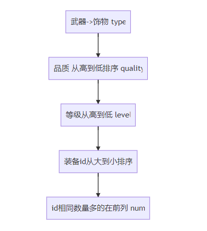

# js多重排序

js有一个sort排序函数，使用array.sort（function）传入排序函数就可以很做到排序

```javascript
array.sort((a,b)=>{
return a-b;
})

```

注意一点就是返回结果决定了a和b的位置，

- 如果返回结果<0 ,那么a排在b的前面
- 返回结果 = 0 a 和b的相对位置不变
- 返回结果>0 b排在a的前面

## 游戏中的背包列表排序
对游戏中的背包来说，背包里有武器和饰物，先按照类型，（武器还是饰物），然后按照武器一类下按品质，然后按照等级，等级一样按照id，最后是按照数量进行排序
`类型 =>品质 =>等级 =>id =>num`
例如类型有两种 3是武器，4是饰物 武器在前，饰物在后
品质有5个等级 1到5，从高到低排序
id相同时，数量多的在前列



```javascript
sortZhuangBei(a,b){
//先判断类型
	if(a.type ==b.type){
	//类型一样就继续判断品质是否相同
		if(a.quality==b.quality){
		//==同理 等级相同就继续判断id是否相同
			if(a.level ==b.level){
				//==同理 id相同就继续判断数量是否相同
				if(a.id ==b.id){
					return b.num-a.num;
				}else{
				return  a.id-b.id;
				}
			}
			else{
			return b.level -a.level;
			}
		
}else{
	//	品质从高到低排序 a.quality= 4，b.quality=5 返回结果>0
	// 返回结果>0 b排在a的前面
	return b.quality -a.quality; 
	}
}
else{
/*类型不一样就安照从小到大   如果返回结果<0 ,那么a排在b的前面，
如果a.type =3, b.type =4 返回值小于0 武器会排在饰物前面*/
return a.type-b.type
}
}
```

上面的写法，if else嵌套过深，需要优化一下，去除else

```javascript
sortByZhuangBei(a: any, b: any) {
    if (a.type != b.type) return a.type - b.type;
    if (a.quality != b.quality) return b.quality - a.quality;
    if (a.level != b.level) return a.level - b.level;
    if (a.id !== b.id) return a.id - b.id;
    return b.num - a.num;
}
```
