# 彻底搞定 vertical-align 垂直居中不起作用疑难杂症

原本我的文章标题是**深入探讨 line-height 与 vertical-align 的疑难杂症**，但这样似乎没能针对性的抛出一个问题，故改成“**彻底搞定 vertical-align 垂直居中不起作用疑难杂症**”。因此，本文讲解的还是`line-height`和`vertical-align`。至于各种垂直居中的方法，网上包括掘金里已有不少文章介绍，本文仅讲解针对`vertical-align`对齐的方式。

本文所有例子的现象分析和解决思路均来自张鑫旭的博文[《CSS 深入理解 vertical-align 和 line-height 的基友关系》](https://link.juejin.cn?target=http%3A%2F%2Fwww.zhangxinxu.com%2Fwordpress%2F2015%2F08%2Fcss-deep-understand-vertical-align-and-line-height%2F)。文章借助该博文附加上自己的理解后，配上一些概念描述和利于理解的辅助图整合而成。。

以下部分为正文：

在实际项目中，`line-height`和`vertical-align`是使用频率非常高的两个 CSS 属性。其中`line-height`用于指定文字的行高，`vertical-align`用于指定元素的垂直方向对其方式。但是，我们常常在应用两个属性的过程中，遇到许多预想不到的结果，比如使用`vertical-align:middile`不能实现垂直居中（**vertical-align 无效**这个问题是高频提问的问题）。这两个属性关系非常密切，随时随地都存在它们共同作用的结果，要使用好这两个属性，只有深入的理解了他们的作用机理，才能解决实际使用过程中遇到的种种疑惑。

### 一、 几个概念

1. **行高**: 两行文字基线之间的距离。
2. **基线**: 英语字母中的概念，是指书写英语字母时，字母 x 底部所在的位置，即我们用英语字母本子书写时从上往下，格子中的倒数第二条线。在 CSS 中值为 baseline。以下图为行高，基线，以及`vertical-align`属性中，`baseline`,`bottom`,`middle`,`top`几个值的关系。

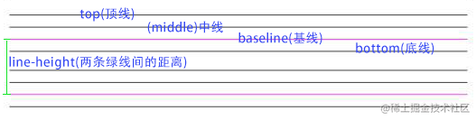

> **纠正：上图中的 middle 描述有错，正确应该为 baseline 往上二分之一 x-height 所在的位置**，其中 x-height 指的是字母 x 的高度，关于 x-height，具体你[可以点击这里](https://link.juejin.cn?target=http%3A%2F%2Fwww.zhangxinxu.com%2Fwordpress%2F2015%2F06%2Fabout-letter-x-of-css%2F)了解

1. **四种内联盒子**

   在 CSS 中有四种内联盒子，分别是`containing box`, `inline boxes`, `line box`, `content area`。分别如下：

(1) **containing box**: 外层盒子模型,包含了其他的 boxes

(2) **line boxes**: 由一个一个的 inline boxes 组成，一行即为一个 line box，单个 line box 的高度由其包含的所有 inline boxes 中，高度最大的那个决定（由`line-height`起作用，后面解释），而一个一个的 line box 的高度就堆叠成了 containing box 的高度。

(3) **inline boxes**: 不会成块显示，而是并排显示在一行的 boxes，如`span`,`a`,`em`等标签以及匿名 inline boxes（即不含把标签的裸露的文字）。

(4) **content area**: 围绕文字看不见的 box，其大小与 font-size 有关，其高度可以认为鼠标选中文字时背景色的高度(后面解释)。 以下为几种 boxes 的关系(图片中，粉红色为鼠标选中的文字部分)

```css
<div>
 这里是一个div，里面包含了独立的文字，
 <span>span标签</span>
 <em>em标签</em>，
 以及其他的一些文字。
</div>

```

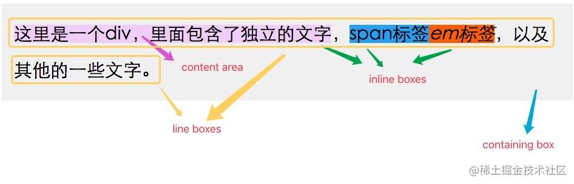

理解四种 box 非常重要，平时的使用浮动，定位，父级高度自动撑开等表现都是与 boxes 的作用有很大的关系。

### 二、深入理解行高 line-height

1. **line-height 与 line boxes 的高度关系**

   现在不少人认为，line boxes 的高度是由内部文字撑开的，但是实际上并不是文字撑开，而是由`line-height`来决定的。通过以下的比较，我们可以证明这个结论。

```arduino
<div class="div div1">我是一行文字大小为100px,但是line-height为0的文字</div>
<div class="div div2">我是一行文字大小为0,但是line-height为100px的文字</div>
<div class="div div3">我是一行文字大小和line-height都为100px的文字</div>

.div {
  background: #f0f0f0;
  border:  1px solid #e0e0e0;
  margin: 10px;
}
.div1 {
  font-size: 16px;
  line-height: 0;
}
.div2 {
  font-size: 0;
  line-height: 100px;
}
.div3{
  font-size: 16px;
  line-height: 100px;
}

结果表现为：

```

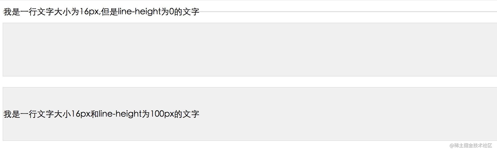

结果显而易见，当文字的行高为 0 时，就算它的字号大小很大，line box 的高度为 0。相反，即使字体大小为 0，但如果行高不会 0，则会撑开标签的高度。同时，我们发现，行高还有一个特性就是垂直居中性，无论 line boxes 的高度是多少，其里面的文字都是公用一条垂直居中线，利用这一个特性，我们还可以实现一些近似的垂直居中效果。（为什么近似，后面解释）。

1. **文本间距**

   两行文本之间的间距为文本间距，在 CSS 中，文本上下的间距均为文本间距的一半，即通过设置行高后，行高与字体大小差值将等分于文本上下。设文本顶部和底部的间距为 x，行高为 y，字体大小为 z，则满足： `2x + z = y`.也就是 `x = (y - z) / 2`.这就是为什么有时候我们在设置样式的时候文本的大小大于行高，导致多行文本之间会重叠在一起的现象。

2. **line-height 值为 1.5,150%和 1.5em 的区别**

   我们在给 line-height 赋值时，经常设置类似`1.5`,`1.5em`,`150%`的值。但是弄懂几个属性值的区别非常重要。line-height 属性值具有继承性，即上级设置的属性值会在子级中继承。几个属性的区别在于 1.5 是在子级继承后会重新根据自身的字体大小重新计算行高值，而 1.5em 和 150%则会在父级计算完行高值后，原封不动的作用于子级元素。看以下例子，可以形象的说明这一特点。

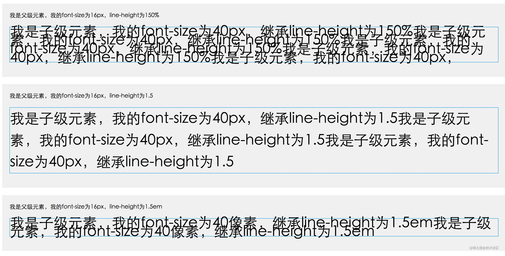

上图可以看到，当父级元素为的字体为 16px，行高为 150%`（即16x150%=24px）`时，最终行高 24px 将会被子元素继承，由于子元素的字体大小为 40px，行高小于字体大小，根据上面第 2 点的公式我们可以得到，两行文字之间的距离为`2x = 24 - 40 = -16px`，所以两行文字重叠在了一起；而当 line-height 为 1.5 时，由于子元素会根据自身字体的大小重新计算行高，即`2x = (40 * 1.5) - 40 = 20px`，得到两行文字之间的距离为 20px，文本将不会重叠在一起。1.5em 与 150%同理。 因此，我们在实际使用的过程中，绝大部分场景应该尽量的少用 em 和百分比值作为 line-height 的值，而使用 1.5,2 等不带单位的值替代。

### 三、深入理解 vertical-align

初学者使用`vertical-align`属性时，经常会发现最终的表现结果并不能如愿，“vertical-align 无效”也是 CSS 问题里搜索频率比较高的一个。大部分是因为对于该属性理解不够透彻引起的，只有理解了该属性的特点，表现行为以及与其他属性（`如line-height`）的共同作用机制和效果，才能很好的解决 vertical-align 带来的一些问题，并有效的利用它。

1. **起作用的前提**

   vertical-align 起作用的前提是元素为 inline 水平元素或 table-cell 元素，包括`span`, `img`,`input`, `button`, `td` 以及通过 display 改变了显示水平为 inline 水平或者 table-cell 的元素。这也意味着，默认情况下，`div`, `p`等元素设置 vertical-align 无效。

2. **取值**

   vertical-align 可以有以下取值方式：

   **（1）关键字：** 如 `top`, `middle`, `baseline(默认值)`, `bottom`, `super`, `sub`, `text-bottom`, `text-top`

   **（2）长度值：** 如 10px，-10px(均为相对于 baseline 偏移)

   **（3）百分比值：** 如 10%，根据`line-height`作为基数进行计算(**_重要_**)后的值。

3. **各种属性设置后的表现形式**

   平时，我们用得最多的应该是`top`,`bottom`,`middle`,`baseline`等几个关键字。而长度值等用得比较少。以下通过例子展示一下各个值的表现形式，并做解析。

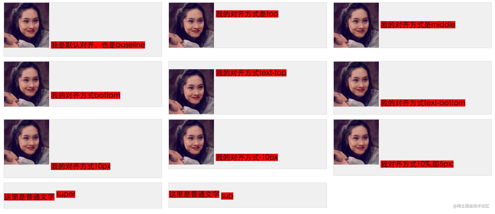

以上所有外层标签的行高为 50px,背景为灰色，所有的对齐方式为对图片进行设置,红色背景文字为图片的兄弟标签 span,[完整源码请看这里](https://link.juejin.cn?target=..demos%2Fverical-align.html)。通过观察我们可以看到，各个属性值的表现如下：

（1）**baseline：** 默认的对齐方式，基线对齐，与父元素的基线对齐；

（2）**top：** 与行中的最高元素的顶端对齐，一般是父级元素的最顶端对齐；

（3）**middle：** 与父元素中线对齐（近似垂直居中）；

（4）**bottom：** 与`top`相反，与父级元素的最低端对齐 ；

（5）**text-top：** 与父级元素`content area`的顶端对齐，不受行高以及周边其他元素的影响。（如图，由于行高为 50，但为了保证与`content area`顶部对齐，故图片上面有空隙，可以与`top`进行对比）；

（6）**text-bottom：** 与`text-top`相反，始终与父级元素`content area`的低端对齐。同理可以与`bottom`进行对比区分。注意，从图中可以看到，貌似该值的表现行为与`baseline`一致，但仔细观察，可以看到，实际上`text-bottom`所在的线会比`baseline`低一点。

（7）**数值与百分比：** 当数值为正值时，对齐方式将以基线为基准，往上偏移响应的大小，当为负值时，往下偏移。而百分比则是根据行高的大小，计算出响应的数值，再以数值表现的方式进行偏移。（百分比根据行高计算偏移值这一点很重要，对后面讲解的一些奇怪的现象可以做出解释并找到解决的办法）。

（8）**super 与 sub：** 这两个值均是找到合适的基线作为对齐的基线进行对齐，类似`super`标签和`sub`标签,但不缩放字体大小。

### 四、line-height 与 vertical-align 的密切关系与应用

咋一看，我们很难看到这两个属性之间的关系，但是实际上，这两个属性的关系非常密切，而且无处不在。引用张鑫旭的话讲就是“令人发指的断背基友关系”。我们在处理内联元素的对齐，排列等，很多令人捉摸不透的奇怪现象都和 vertical-align 和 line-height 之间有很大的关系，基本上都能从它们身上找到原因和解决办法。

1. **几个定义**

   在讲两个属性之间的关系和应用之前，先来了解几个定义。

**（1）inline-block 基线：** 在 CSS2 可视化格式模型文档中，指出了 inline-block 的基线是正常流中最后一个 line box 的基线，但是，如果这个 line box 里面没有 inline boxes 或者其 overflow 属性值不是 visible，那么其基线就是 margin bottom 的边缘。什么意思呢？我们用一张图片说明一下：

**纠正：图片上面描述文字中的“红色线为设置了 middle”改为“黄色线为设置了 middle”**

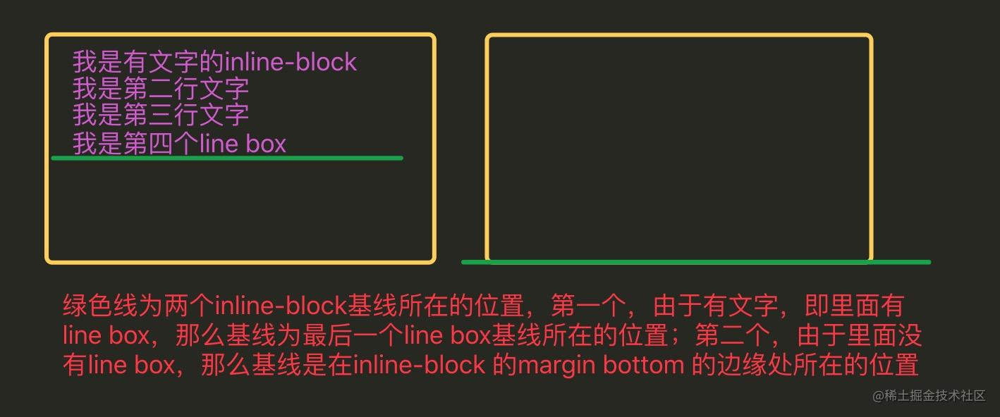

**（2）middle 对齐：** 指元素的垂直中心线与父级基线往上二分之一 X 所在的位置的线对齐。有点绕，看下图：

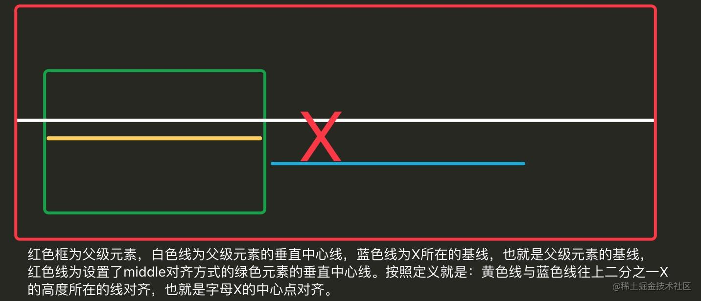

**（3）文字下沉特性：** 文字是具有下沉特性的，就是文字的垂直中心点在文字所在区域的中线往下沉一点，不同字体的文字下沉的幅度不同，同时，文字大小越大，下沉越明显。如上图，X 的中线点相对白色中线往下沉。

1. **几个现象**

   我们先通过例子来看看几个现象。

```xml
<div class="wrap">
  
</div>
<div class="wrap">
  <span></span>
  <span>我有内容</span>
</div>
<div class="wrap" style="height:200px;">
  
</div>

.wrap {
  background: #249ff1;
}
span {
  display: inline-block;
  width: 100px;
  height: 100px;
  border: 1px solid #f00;
}
img {
  width: 100px;
}
.middle {
  vertical-align: middle;
}

```

以上代码最后结果如下:

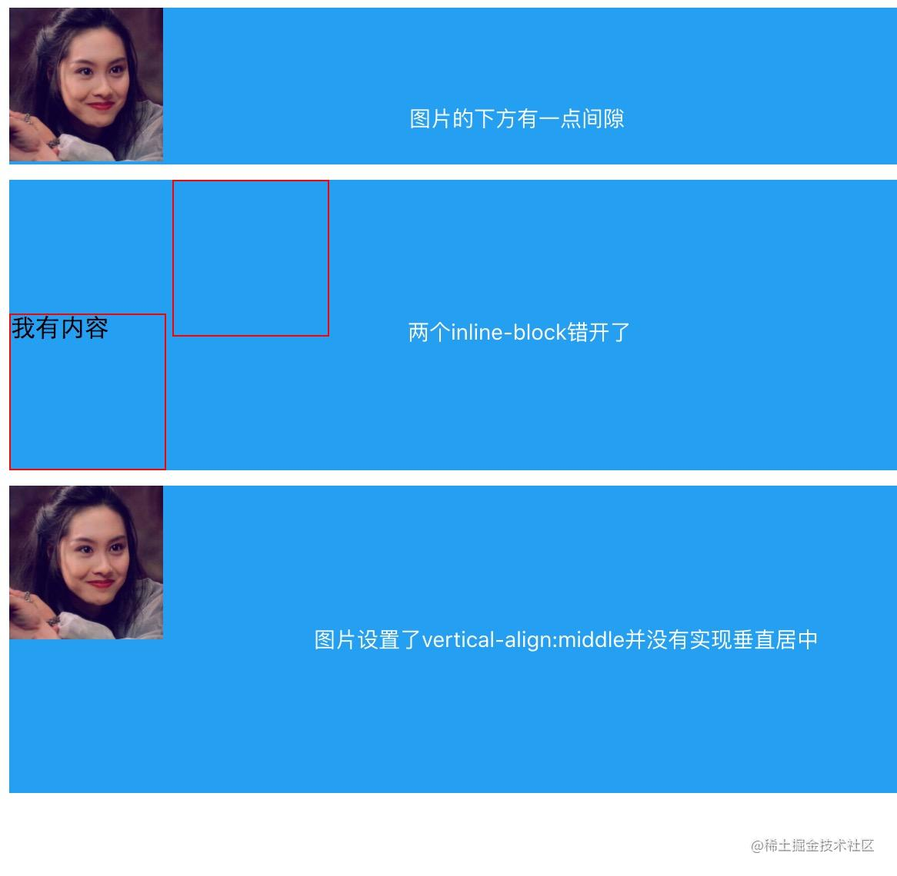

我们发现，放在 div 里面的图片，在底部会多出一点空白间隙，而第二个例子两个样式一样的 span，一个有文字一个没有文字，我们的意愿是想让两个 span 并排显示，但结果错位十分严重。至于第三个例子，图片设置了居中对齐，但似乎没有生效。那究竟空白间隙从何而来？为什么两个 span 会错位？图片确实是没有居中对齐吗？要解释清楚这个现象，必须弄清楚 vertical-align 和 line-height 之间的关系。我们从第一个例子开始，一步一步的分析。

首先，通过前面两个属性的表现特点分析我们知道，元素默认情况下的对齐方式是基线对齐，即 baseline。而在浏览器中，都有默认的字体的大小，这个空隙就是来源于这两个。为了便于我们观察，我们把 wrap 的行高设置为一个相对大的值，在这里我们设置为 50px。设置后表现如下：

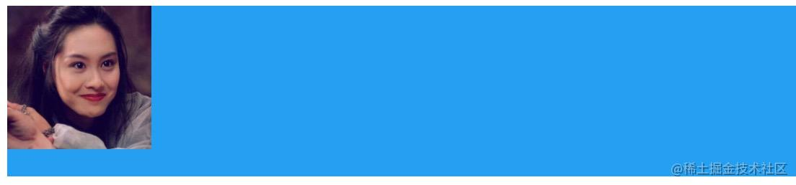

可以看到，此时图片底部的空白间隙变得更大。实际上，在 wrap 里面虽然只有一个 img 标签，但其实存在一个我们看不见的空白节点。这个特殊的空白节点与普通文节点一样，具有文字大小，行高。因此，我们可以利用普通文本来代替这个节点来观察现象。我们在图片的后面输入一串 XXX。如下：

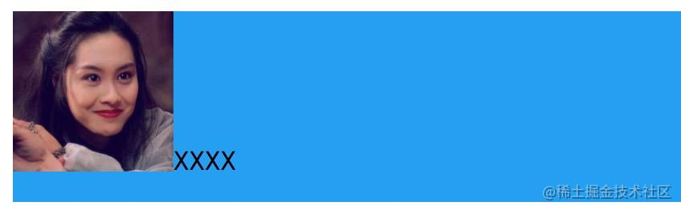

接着，我们再用一个 inline-block 化的 span 标签将文字包裹并设置文字背景色。如下：

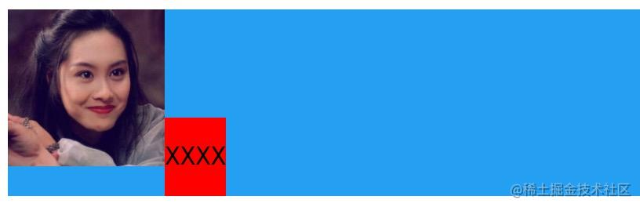

经过以上两步改变，我们发现，图片的位置没有发生任何的变化，底部的间隙大小也没有变化。此时，已经足以解释为什么只有一个 img 标签的情况下，图片底部会出现间隙：由于空白节点的存在，图片后面相当于跟了一个文本节点。而默认情况下，图片的对齐方式是以父级元素的基线对齐，为了保持与基线对齐，图片底部必须留出间隙，大小为上面提到的半倍文本间距[即(`line-height` - `font-size`) / 2]。而且 line-height 的值越大，间隙将越大。到此为止，结合我们上面对属性值特点的一些分析，要找到问题的解决办法就变得相当简单了。要去除图片底部的间隙，只需要将`line-height`和`vetical-align`属性的其中一个给干掉就可以了。可以有以下几种方法：

```arduino
（1）将图片设置为display:block（利用vertical-align的生效前提）；

（2）将vertical-align设置为top，bottom，或者middle等值（利用属性值的表现行为）；

（3）将line-height设置为0（利用line-height为0时，基线上移）；

（4）将font-size设置为0 （如果line-height的值为相对值，如1.5）；

（5）将img设置浮动或者绝对定位（如果布局允许的话）

```

现在，利用第二种方法，将 vertical-align 设置我 bottom，设置后结果如下：

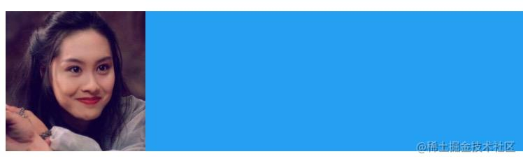

第二个例子，由前面的对于 inline-block 基线的定义可知，对于有内容的 inline-block，其基线为最后一行文本基线所在的位置，而对于空白的 inline-block，其基线为 margin bottom 边缘所在位置，即底部边缘。因为默认情况下为基线对齐，这两条基线对齐后就形成了上图那种错位的现象。知道了错位的原因，要解决也方便了。我们仅需将对齐方式设置为 bottom，middle，top 等值就可以了。现在设置为 middle。效果如下：

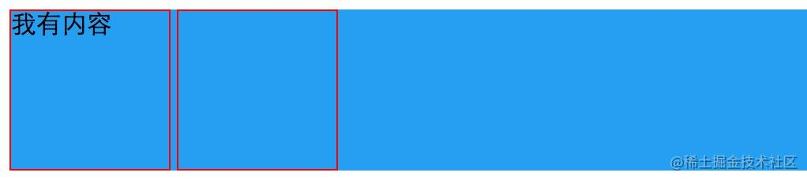

至于第三个例子，有点让人摸不着头脑，这也是 vertical-align 无效被提问的最多的一种现象。按照 vertical-align 生效个条件可知，给 img 设置 middle 对齐后理论上应该是居中对齐才对，但为什么没有起作用呢？是真的没有起作用吗？答案是：起作用了。实际上，vertical-align:middle 是起作用的了，但至于最后图片为什么没有在父级里面垂直居中，是因为后面的空白节点高度不足，导致基线偏上。按照中线的定义，中线也是偏上。我们可以用一个字母 x 代替后面的空白节点，来观察现象。

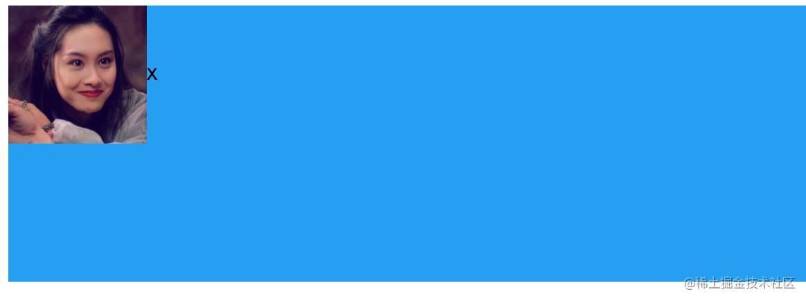

从图中可以看到，实际上图片与文字确实是垂直居中对齐了。我们给父级的行高设置为父级的高度，从而使基线往下偏移。效果如下：

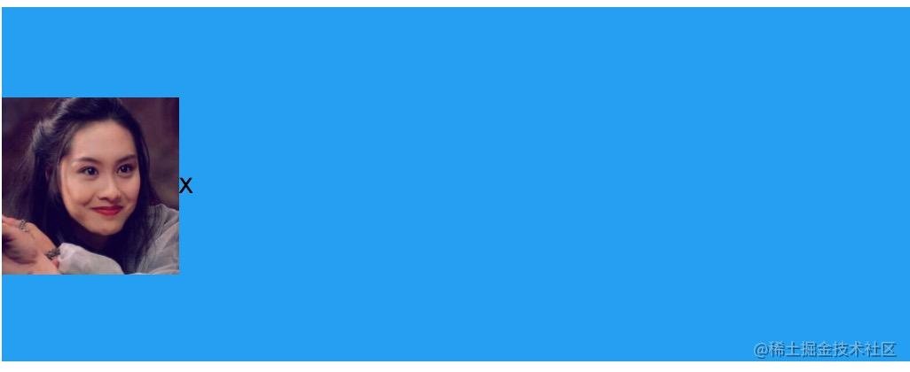

此时，我们可以看到，图片“近似”垂直居中在了父级元素。这是因为设置行高后，根据之前分析的`line-height`等于`font-size`+`2倍的文字上下间距`可知，父级基线往下。中线为基线往上二分之一 x 高度，此时图片的中线就与后面的 x 中线点对齐，实现了近似垂直居中的效果。

1. **应用**

   利用空白节点这个特性，以及行高和 vertical-align 的关系，我们可以做一些实际的应用。

   (1) **实现垂直居中**

   由于空白节点存在，当我们给外层标签设置一个较高的行高值时，由于行高的上下间距平分的性质，可以实现近似垂直居中的效果。此时，也不需要给父级标签设置具体的高度值（因为 line-height 会撑开父级）。

```ini
<div class="wrap">
  
</div>

.wrap {
  background: #249ff1;
  margin: 10px;
}
.wrap1 {
  line-height: 200px;
  text-align: center;
}
.middle {
  vertical-align:  middle;
}

```

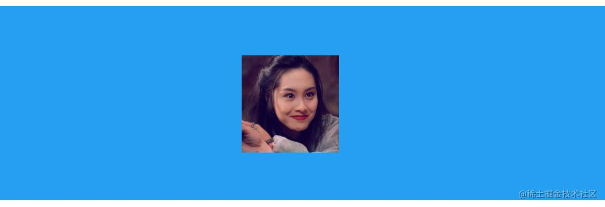

(2) **任意父级高度的垂直居中**

在上面的提到的三种现象中，第三个例子，我们给父级设置 line-height 的值等于 height 的值，实现了近似垂直居中的效果。那如果父级的高度是随着内容的变化而变化的怎么办？此时无法给父级设置一个特定的值，也不能使用百分比，因为 line-height 是根据字体的大小来计算的。换个角度想，空白节点我们看不见，但是如果可以给它设置一个高度，让它与父级高度一致，就解决了这个问题。怎么给高度呢？答案是借助辅助元素，我们可以在父级最后面增加一个 inline-block 化的 span 标签,高度为 100%，font-size 为 0，接着让居中的元素居中对齐即可。

```css
<div class="wrap" style="height:200px;text-align:center;">
  
  <span style="display:inline-block;height:100%;vertical-align:middle;font-size:0;"></span>
</div>


```


**当然，这个 span 标签也可以通过伪元素的来实现**

(3) **实现多图列表的两端对齐**

在做类似商品列表的布局时，我们时常需要每一行列表的实现两端对齐。实现的方法有很多，这里我们用`display:inline-block`+`辅助元素`来实现。如下：

```xml
<ul>
  <li></li>
  <li></li>
  <li></li>
  <li></li>
  <li></li>
  <li></li>
  <li></li>
  <span class="fix"></span>
  <span class="fix"></span>
  <span class="fix"></span>
</ul>

li{
  list-style-type: none;
  border:  1px solid red;
  display: inline-block;
  width: 28%;
  text-align: center;
}
.fix {
  display: inline-block;
  width: 28%;
  text-align: center;
}
ul {
  width:  720px;
  border:  1px solid #a7a7a7;
  text-align: justify;
  margin: 20px auto;
}
li img {
  width: 95%;
}

```

结果如下：


每个图片的下方会有一个空白，前面已经解释过空白的来源，我们给 ul 设置 line-height:0 即可解决。效果如下：

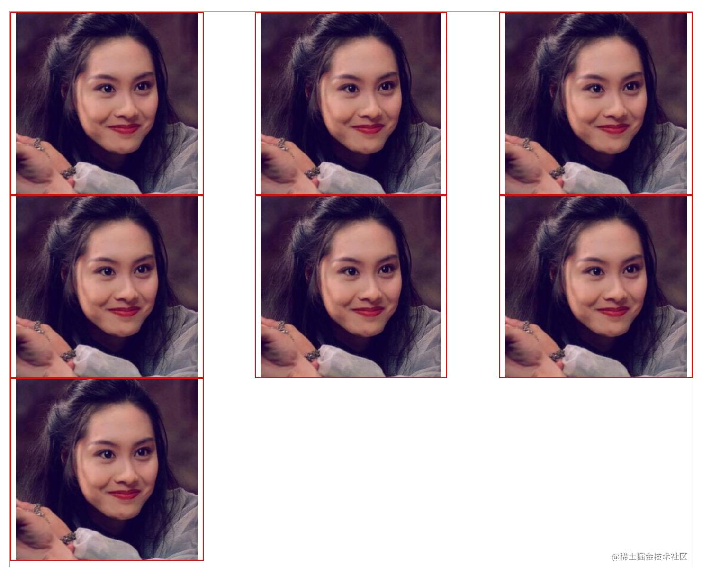

去除了空白后，发现在最后一个图片的底部也有一个相对较大的空白，为什么呢？来源于哪里？为了方便观察，我们给每一个 span.fix 增加一个边框，并在最后一个 span.fix 增加几个字母。结果如下：

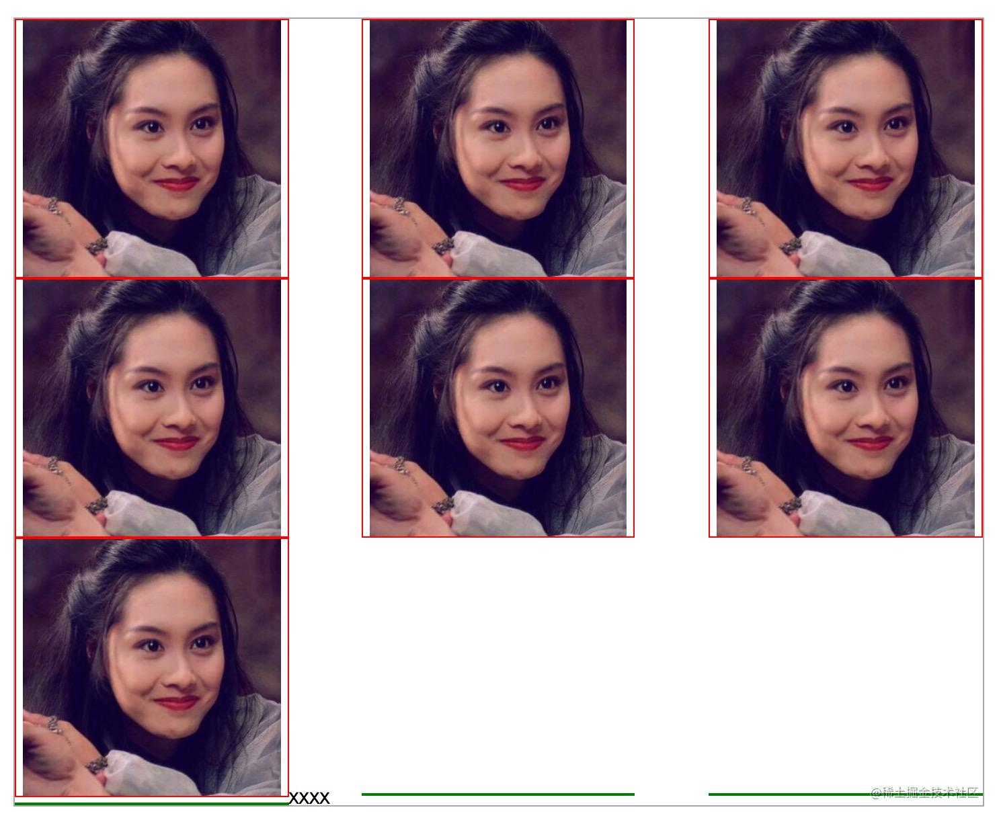

从结果可以知道，最后一个 span 与文字节点的基线对齐。还记得前面说过的两个 inline-block 排列错位的例子吗？这就是和那个是一样的道理。由于前面一个 span 是没有 inline boxes 的节点，那么它的基线就是元素底部，加上默认情况下是基线对齐，从而空白的 span 将往下掉。那怎么办呢？一种方法改变基线的位置，另一种方法是改变对齐的方式。改变基线的方式就是在空白的 span 里面加入内容，如空格。我们把 xxxx 挪到 span 里面，结果如下：

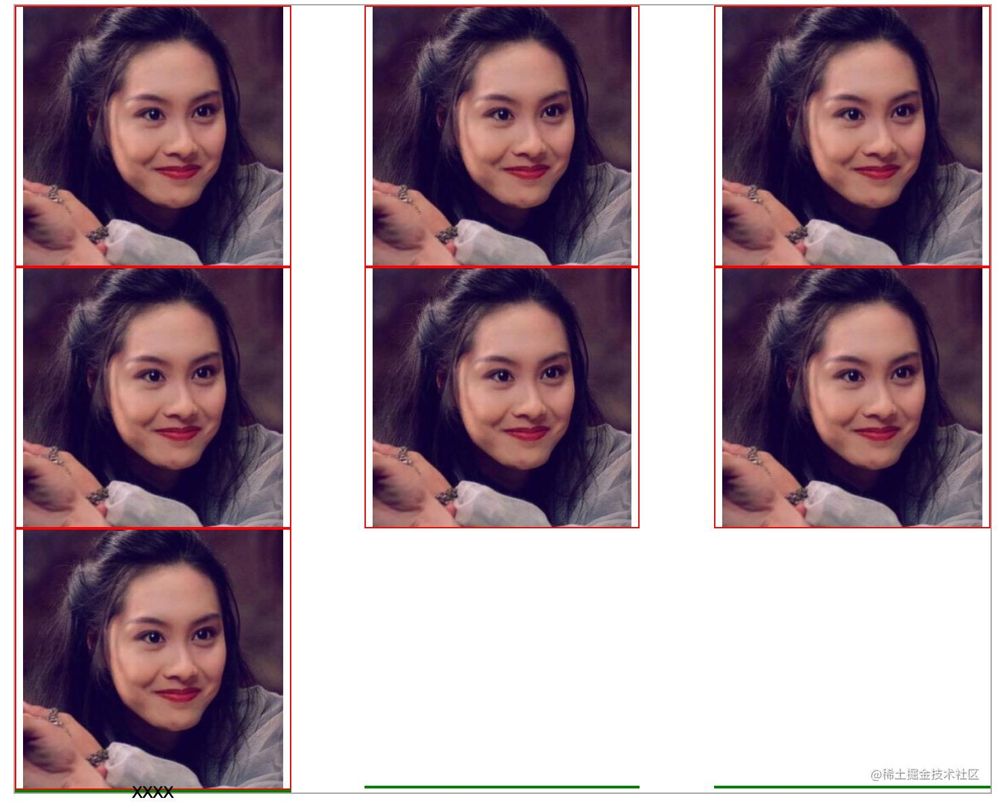

发现此时，空白奇迹般的不见了。原因正是我们改变了基线的位置。同时由于设置了 line-height 为 0，所以就对齐了。另一种方法是改变对齐的方式，我们设置为 top，并去除所有的辅助线和字符，结果如下：

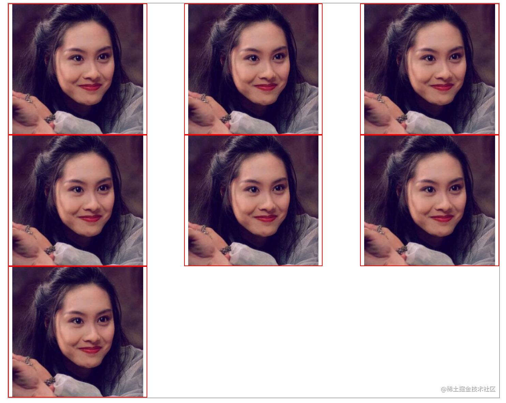

到此，完成了我们的应用。

1. **为什么是近似垂直居中**

前面我们多次提到“**近似垂直居中**”这个词。为什么是近似，而不是绝对呢？问题还得回到这张图。


当设置元素的对齐方式为 middle 时，指的是：**元素的垂直中心线与父级元素基线的位置往上二分之一 x 高度所在线对齐**。换句话说，就是图中的黄色线与红色字母 x 的中心处对齐。但是文字具有下沉特性，原本 x 的中心点应该与图中的白色线对齐，但是文字的下沉特性使字母往下掉了一点。从而导致黄色线无法绝对与白色线对齐。这个下沉的大小与文字的大小和字体有关。当文字大小足够小时，我们可以忽略，近似的，白色线就与黄色线对齐，实现居中效果。但是文字大小很大时，就不能很好的实现了。我们还是以上面的例子：

```ini
<div class="wrap" style="height:200px;line-height:200px">
  x
</div>

img {
  width:  100px;
}
.wrap {
  background: #249ff1;
  margin: 10px;
}
.middle {
  vertical-align:  middle;
}

```


当我们设置 line-height 与 height 大小一直时，实现了垂直居中的效果。我们借助画图工具往图中做一些辅助线。

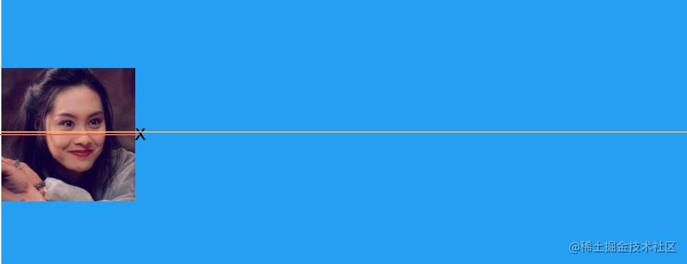

结果显示，图片的中线（红色）并没有与父级元素中线（橙色）完全重合。由于字符下沉的大小与文字的大小有关系，我们把父级的 font-size 设置为 100px,结果如下:

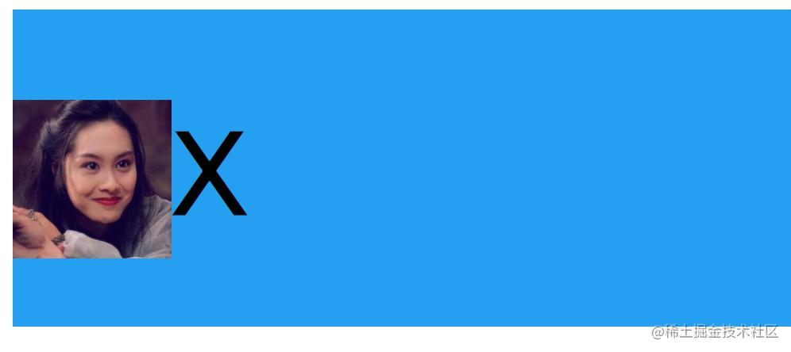

此时可以明显的观察到，图片的上部空白比下部空白要大。其偏差正好是文字下沉的偏差。用图片工具做辅助线观察如下：

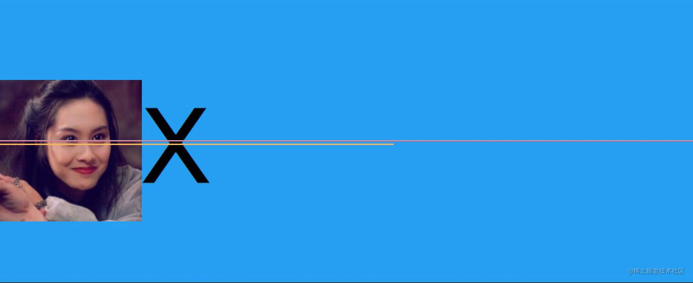

问题的根源找到了，那么有没有办法实现绝对居中呢？答案是有的。解决办法很明显，如果我们让父级元素的各种线重合在一起，也就是 font-size 设置为 0，就可以实现绝对居中了。给父级元素设置`font-size:0`,结果如下：

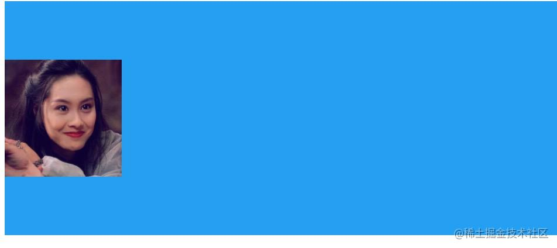

### 五、总结

要掌握彻底`line-height`和`vertical-align`两个属性有很多细节需要去分析去发现，是有点难度的。但是我们如果弄清楚了常见的几个特性和行为，就能避免实践的过程中遇到的一些坑。从而提高工作效率。通过以上的一些分析，总结以下几点：

1. **理清 line-height 与 height 之前的关系；**
2. **理清 vertical-align 不同值的表现行为；**
3. **理解四种内联盒子的关系；**
4. **理解基线的定义，包括 inline-block 的基线定义；**
5. **理解中线的定义，理清 middle 真正的表现方式；**
6. **知道字符有下沉特性**
7. **综合掌握 vertical-align 和 line-height 之间的关系。**
