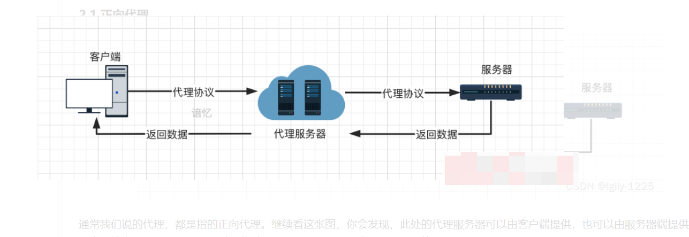

# 正向代理和反向代理

## 一、代理
### 1.1 什么是代理
代理也被叫做网络代理，是一种比较特殊的网络服务，允许一个终端（通常指客户端）通过这个服务与另一个终端（通常指服务器端）进行非直接的连接。例如：一些网关、路由器等网络设备都具备网络代理的功能。代理服务有利于保障网络终端的隐私或者安全，可以在一定程度上阻止网络攻击（因为通过代理，可以隐藏真正的服务器端/客户端）。

### 1.2 代理服务器

左边和右边的电脑在通讯时候，需要经过中间的电脑中转，而中间的那部电脑就是代理服务器。

### 1.3 代理请求过程

客户端首先根据代理服务器所使用的代理协议，与代理服务器创建连接，接着按照协议请求对目标服务器创建连接、或者获得目标服务器的指定资源（如：文件）。

### 1.4 代理协议
此处的协议指的是网络传输协议。
主要是两种：
Socks
HTTP
网络传输协议在本篇就不做过多介绍。

## 二、正向代理
### 2.1 正向代理

通常我们说的代理，都是指的正向代理。继续看这张图，你会发现，此处的代理服务器可以由客户端提供，也可以由服务器端提供。
当客户端主动使用代理服务器时，此时的代理叫正向代理。比如：一些网络代理工具（加速器/VPN…）

### 2.2 正向代理完整流程
正向代理时，由客户端发送对某一个目标服务器的请求，代理服务器在中间将请求转发给该目标服务器，目标服务器将结果返回给代理服务器，代理服务器再将结果返回给客户端。
使用正向代理时，客户端是需要配置代理服务的地址、端口、账号密码（如有）等才可使用的。

通过上图可以看到，客户端并没有直接与服务器相连。正向代理隐藏了真实的客户端地址。可以很好地保护客户端的安全性。

### 2.3 正向代理的适用场景
- **访问被禁止的资源**（让客户端访问原本不能访问的服务器。可能是由于路由的原因，或者策略配置的原因，客户端不能直接访问某些服务器。为了访问这些服务器，可通过代理服务器来访问）
  - 突破网络审查
  - 再比如客户端IP被服务器封禁，可以绕过IP封禁
  - 也可以突破网站的区域限制

- **隐藏客户端的地址**（对于被请求的服务器而言，代理服务器代表了客户端，所以在服务器或者网络拓扑上，看不到原始客户端）

- **进行客户访问控制**
  - 可以集中部署策略，控制客户端的访问行为（访问认证等）
  - 记录用户访问记录（上网行为管理）
  - 内部资源的控制（公司、教育网等）

- **加速访问资源**
  使用缓冲特性减少网络使用率（代理服务器设置一个较大的缓冲区，当有外界的信息通过时，同时也将其保存到缓冲区中，当其他用户再访问相同的信息时， 则直接由缓冲区中取出信息，传给用户，以提高访问速度。）
- **过滤内容**（可以通过代理服务器统一过滤一些危险的指令/统一加密一些内容、防御代理服务器两端的一些攻击性行为）

## 三、反向代理
### 3.1 反向代理（Reverse Proxy）
服务器根据客户端的请求，从其关系的一组或多组后端服务器（如Web服务器）上获取资源，然后再将这些资源返回给客户端，客户端只会得知代理服务器的IP地址，而不知道在代理服务器后面的服务器集群的存在。

反向代理整个流程：由客户端发起对代理服务器的请求，代理服务器在中间将请求转发给某一个服务器，服务器将结果返回给代理服务器，代理服务器再将结果返回给客户端。

###  3.2 反向代理的适用场景

- **负载均衡**
  如果服务器集群中有负荷较高者，反向代理通过URL重写，根据连线请求从负荷较低者获取与所需相同的资源或备援。可以有效降低服务器压力，增加服务器稳定性
- 提升服务器安全性
  - 可以对客户端隐藏服务器的IP地址
  - 也可以作为应用层防火墙，为网站提供对基于Web的攻击行为（例如DoS/DDoS）的防护，更容易排查恶意软件等
- **加密/SSL加速**：将SSL加密工作交由配备了SSL硬件加速器的反向代理来完成提供
- **缓存服务，加速客户端访问**
  - 对于静态内容及短时间内有大量访问请求的动态内容提供缓存服务
- **数据统一压缩**
  - 节约带宽
  - 为网络带宽不好的网络提供服务
- **统一的访问权限控制**
- **统一的访问控制**
- **突破互联网的封锁**
- **为在私有网络下（如局域网）的服务器集群提供NAT穿透及外网发布服务**
- **上传下载减速控制**

## 四、正向代理与反向代理

### 4.1 正向代理与反向代理的区别
当前面的内容理解后，对于正向代理和反向代理的区别就很好理解了。
最核心的不同在于代理的对象不同。
正向代理是代理客户端，反向代理是代理服务器。
而根据这核心的区别，我们也可以记住：代理哪端便可以隐藏哪端。
也就是说：
正向代理隐藏真实客户端，反向代理隐藏真实服务端。

### 4.2 反向代理为什么叫反向代理
从我们用户的角度来看：
代理我们发出请求的客户端被称为正向代理。而代理我们访问的服务器，则被称为反向代理。

从代理结构的角度来看（代理服务器在两种代理中的作用均为收发请求与响应）：

客户端与代理服务器属于一个局域网（看图左边），称为正向代理。

服务器端与代理服务器属于一个局域网时（看图右边），称为反向代理。

## 五、总结
最后，请记住：
**正向代理为客户端服务。**
**反向代理为服务器端服务。**
