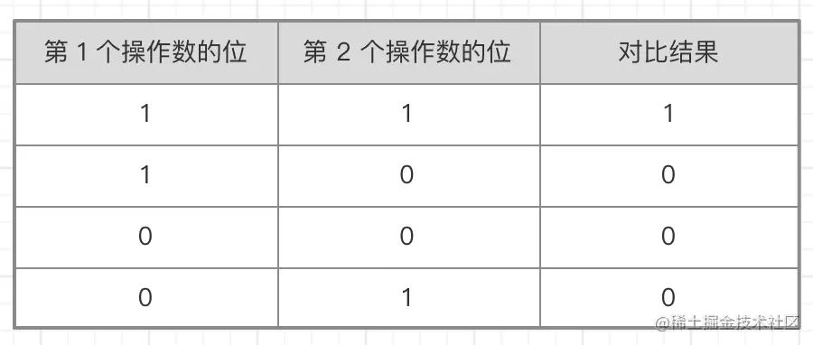
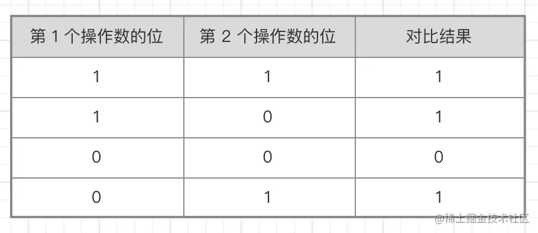
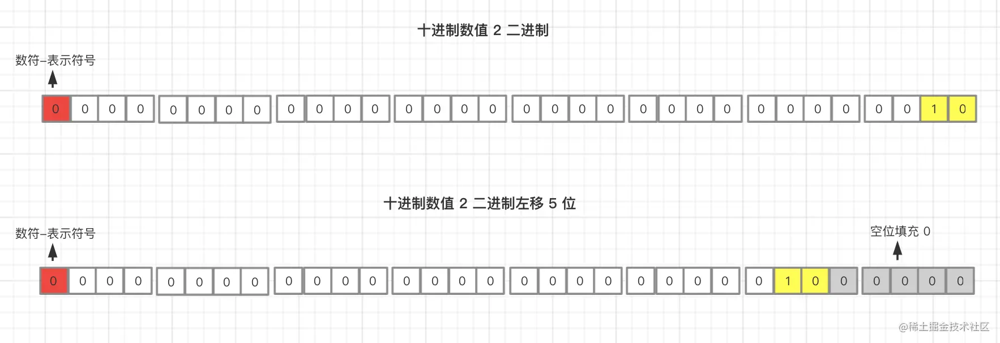
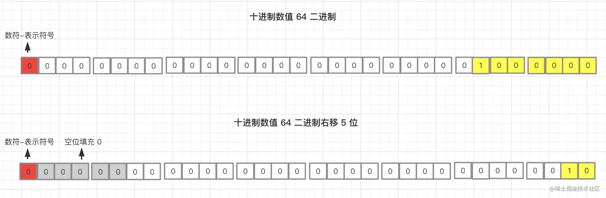

# js 位运算的运用

来回顾一下，我们都知道，平常我们用来计算的是十进制的数值 `0~9` ，但是计算机是个机器，它只能识别二进制

根据国际 IEEE 754 标准，`JavaScript` 在存储数字时是始终以双精度浮点数来存储的，这种格式用 64 位二进制存储数值，64 位也就是 64 比特（bit），相当于 8 个字节，其中 0 到 51 存储数字（片段），52 到 62 存储指数，63 位存储符号

而在 JS 位运算中，并不会用 64 位来计算，它会先在后台把值转换为 32 位数值，再进行位运算操作，位运算计算完成后再将 32 位转为 64 位存储，整个过程就像在处理 32 位数值一样，所以我们了解位运算时，只需要关注这 32 位二进制整数就可以，因为 64 位存储格式是不可见的，但是也正是因为后台这个默认转换操作，给 JS 这门语言产生了一个副作用，即特殊值 NaN 和 Infinity 在位运算中都会直接被当作 0 来处理

其实不止是 JS ，很多语言的位运算都是如此

### 有符号&无符号

穿插一个小知识点， `ECMAScript` 整数有两种类型，即有符号整数（允许用正数和负数）和无符号整数（只允许用正数）

在 ECMAScript 中，所有整数字面量默认都是有符号整数

有符号整数也就是上文所说，二进制左侧首位是符号位来表明该数字正负

而无符号整数就是没有符号位，没有了符号位置也就说它表达不了负数，同时因为没有了符号位置，它的存储范围也会比有符号整数存储范围大

现在我们我们正式开始说位运算符了，位运算符号一共分 7 个，我们一个个道来

### 按位非 NOT（~）

#### 简述

按位非操作符也可以叫按位取反，它使用 `~` 符号表示，作用是对位取反，1 变成 0 ，0 变成 1

看过上文的小伙伴们可能就会发现，这好像是取的反码？

是的，我们就可以直接理解为按位非就是取其二进制的反码，只不过，反码是符号位不变其余位置取反，而按位非则是取反码后符号位也取反

**例如：**

我们以 8 位（bit）数字存储为例

求十进制数字 2 的按位非，十进制数字 2 的二进制是 `0000 0010`，那么它的二进制反码就是 `0111 1101`，符号位也取反则变成了 `1111 1101`，当然你也可以直接将数字 2 的二进制每一位取反，结果都是 `1111 1101`

我们知道符号位为 1 代表是负数，而计算机中存储负数是以补码的方式来存储的，所以我们对补码 `1111 1101` 求原码再转成十进制即可，对补码求原码就是使用此补码再求一遍补码，也就是先取反码再补 1 ，过程自算，得到了负数的二进制原码 `1000 00 11`，即十进制 `-3`

同上所述

十进制数字 1 的按位非即十进制 `-2`

十进制数字 0 的按位非即十进制 `-1`

上面说的都是正数，我们看一个负数的例子

十进制数字 -1 由于是负数，上文我们说过计算机中二进制存储负数为补码方式，所以我们要先求 -1 的补码，-1 二进制原码是 `1000 0001`，再求原码的反码即 `1111 1110` ，接着补 1 即可求补码即 `1111 1111`，那么我们得到了 -1 在二进制中存储的的最终补码形态即为 `1111 1111` ，最终我们将此二进制每一位都取反得到 `0000 0000 `，即十进制数字 0

诶！好像有规律，我们试了几次之后发现按位非的最终结果始终是对原数值取反并减一，如下

```js
let a = 1
console.log(~a == (-a) - 1) // true

// 得到
~x = (-x) - 1
```

知道这个之后，我们遇到按位非操作符后可以根据这个规律来算结果，会比转二进制计算那样方便些

那么又有人说了，既然和 `(-x) - 1` 是一致的，那么为什么还要用按位非呢

很简单，原因有二，第一是位运算的操作是在数值底层表示上完成的，速度快。第二是因为它只用 2 个字符，比较方便。。。

#### 使用按位非 ~ 判断是否等于-1

按位非在项目中的使用频率还是蛮高的

相信大家经常看到下面这种写法

```js
let str = "abcdefg"

if(!~str.indexOf("n")){
	console.log("字符串 str 中不存在字符 n")
}

// 等同于

if(str.indexOf("n") == "-1"){
  console.log("字符串 str 中不存在字符 n")
}
```

如上所示，我们知道 `indexOf` 方法在找不到相同值时返回 -1，而 `~-1 == 0 == false` ，所以 `!~-1 == 1 == true` ，一般来说我们使用按位非的写法来校验 -1 是用的最多，也是位运算中最容易令大家接受的了，是不是特别简单方便呢

#### 使用按位非 ~ 取整

按位非的骚操作中，还有一个比较普遍的就是位运算双非取整了，如下所示

```js
~~3.14 == 3
```

很多人知道这样可以取整，但是由于不知道具体是为什么而不敢用，所以我们来解释下为什么它为什么可以取整

上面我们说过，在 JS 位运算中，并不会用 64 位来计算，它会先在后台把值转换为 32 位整数，再进行位运算操作，位运算计算完成后再将 32 位转为 64 位存储，整个过程就像在处理 32 位数值一样，所以我们了解位运算时，只需要关注这 32 位二进制整数就可以

这里我们可以看到，32 位 `整数`，位运算操作的是整数，后台在进行 64 位到 32 位转换时，会忽略掉小数部分，只关注整数、整数、整数，记住了

```js
~3.14 == ~3
~5.89 == ~5
```

如上所示，接着我们再按照上面的公式

```js
~x == (-x) - 1

~~x == -((-x) - 1) -1 == -(-x) + 1 -1 == x
```

所以位运算中的双非 `~~` 即可取整，此取整是完全忽略小数部分

### 按位与 AND（&）

#### 简述

按位与操作符也就是符号 `&` ，它有两个操作数，其实就是将两个操作数的二进制每一位进行对比，两个操作数相应的位都为 1 时，结果为 1，否则都为 0，如下

作数相应的位都为 1 时，结果为 1，否则都为 0，如下



**例如：**

求 `25 & 3` ，即求十进制 25 和 十进制 3 的与操作值

我们分别求出 25 和 3 的二进制进行比对即可

```js
25 = 0000 0000 0000 0000 0000 0000 0001 1001
 3 = 0000 0000 0000 0000 0000 0000 0000 0011
--------------------------------------------
&  = 0000 0000 0000 0000 0000 0000 0000 0001
```

如上所示，最终我们比对的二进制结果为 `0000 ... 0001`，即十进制数字 1

#### 使用按位与 & 判断奇偶数

按位与这个东西平常用的不太多，我一般只会在判断奇偶数的才会用到，如下：

```js
偶数 & 1 // 0
奇数 & 1 // 1
```

因为十进制数字 1 的二进制为 `0000 ... 0001`，只有最后一位为 1，其余位都是 0 ，所以任何数字和它对比除最后一位其余都是 0，那么当这个数字末位为 1 时，也就是奇数，那么结果就是 1，这个数字末位为 0 时，也就是偶数，那么结果就是 0，毕竟二进制只有 0 和 1

#### 使用按位与 & 判断数字是否为2的整数幂

判断数字是否为 2 的整数幂，使用 `n & (n - 1) `

```js
let a = 20;
let b = 32;

a & (a - 1) // 16 a不是2的整数幂
b & (b - 1) // 0 	b是2的整数幂
```

如上所示，套用这个小公式，当结果等于 0 时，数值就是 2 的整数幂

其实原理也很简单，首先我们来看数值 2 的幂对应的二进制

```js
0000 0001  -> 1  	// 2^0
0000 0010  -> 2		// 2^1
0000 0100  -> 4		// 2^2
0000 1000  -> 8		// 2^3
0001 0000  -> 16	// 2^4
```

如上，2 的幂在二进制中只有一个 1 后跟一些 0，那么我们在判断一个数字是不是 2 的幂时，用 `n & (n-1)`，如果 你是 2 的幂，n 减 1 之后的二进制就是原来的那一位 1 变成 0，后面的 0 全变成 1，这个时候再和自身做按位与对比时，每一位都不同，所以每一位都是 0，即最终结果为 0


### 按位或 OR（｜）

#### 简述

按位或用符号 `|` 来表示，它也有两个操作数，按位或也是将两个操作数二进制的每一位进行对比，只不过按位或是两边只要有一个 1 ，结果就是 1，只有两边都是 0 ，结果才为 0，如下



**例如：**

求 `25 ｜ 3` ，即求十进制 25 和 十进制 3 的或操作值

我们分别求出 25 和 3 的二进制进行比对即可

```js
25 = 0000 0000 0000 0000 0000 0000 0001 1001
 3 = 0000 0000 0000 0000 0000 0000 0000 0011
--------------------------------------------
|  = 0000 0000 0000 0000 0000 0000 0001 1011
```

如上所示，最终我们比对的二进制结果为 `0000 ... 0001 1011`，即十进制数字 27

#### 使用按位或 ｜ 取整

取整的时候我们也可以使用按位或取整

```js
1.111 | 0 // 1
2.234 | 0 // 2
```

如上所示，只需要将小数同 0 进行按位或运算即可

原理也简单，位运算操作的是整数，相当于数值的整数部分和 0 进行按位或运算

0 的二进制全是 0 ，按位或对比时 1 和 0 就是 1 ，0 和 0 就是 0，得出的二进制就是我们要取整数值的整数部分

#### 使用按位或 | 代替Math.round()

我们上面知道按位或可以取整，其实四舍五入也就那么回事了，即正数加 0.5，负数减 0.5 进行按位或取整即可，道理就是这么简单，如下

```js
let a1 = 1.1
let a2 = 1.6
a1 + 0.5 | 0 // 1
a2 + 0.5 | 0 // 2

let b1 = -1.1
let b2 = -1.6
b1 - 0.5 | 0 // -1
b2 - 0.5 | 0 // -2
```

### 按位异或 XOR（^）

#### 简述

按位异或使用字符 `^` 来表示，按位异或和按位或的区别其实就是在比对时，按位异或只在一位是 1 时返回 1，两位都是 1 或者两位都是 0 都返回 0，如下


异或的运算过程可以当作把两个数加起来，然后进位去掉，0 + 0 = 0，1 + 0 = 1，1 + 1 = 0，这样会好记些

**例如：**

求 `25 ^ 3` ，即求十进制 25 和 十进制 3 的异或值

我们分别求出 25 和 3 的二进制进行比对即可

```js
25 = 0000 0000 0000 0000 0000 0000 0001 1001
 3 = 0000 0000 0000 0000 0000 0000 0000 0011
--------------------------------------------
|  = 0000 0000 0000 0000 0000 0000 0001 1010
```

如上所示，最终我们比对的二进制结果为 `0000 ... 0001 1010`，即十进制数字 26

#### 使用按位异或 ^ 判断整数部分是否相等

按位异或可以用来判断两个整数是否相等，如下

```js
let a = 1
let b = 1
a ^ b // 0

1 ^ 1 // 0
2 ^ 2 // 0
3 ^ 3 // 0
```

这是因为按位异或只在一位是 1 时返回 1，两位都是 1 或者两位都是 0 都返回 0，两个相同的数字二进制都是一致的，所以都是 0

我们也可以用作判断两个小数的整数部分是否相等，如下

```js
2.1 ^ 2.5 // 0
2.2 ^ 2.6 // 0
2.1 ^ 3.1 // 1
```

这是为什么？牢记位运算操作的是整数、是整数、是整数，也就是说上面这几个对比完全可以理解为同下

```js
2 ^ 2 // 0
2 ^ 2 // 0
2 ^ 3 // 1
```

#### 使用按位异或 ^ 来完成值交换

我们也可以使用按位异或来进行两个变量的值交换，如下

```js
let a = 1
let b = 2
a ^= b
b ^= a
a ^= b
console.log(a)   // 2
console.log(b)   // 1
```

道理也很简单，我们先要了解一个东西

```js
// 如果
a ^ b = c
// 那么
c ^ b = a
c ^ a = b
```

现在你再品一下值交换为什么可以交换，细品

不过这里使用 `^` 来做值交换不如用 ES6 的解构，因为 ES6 解构更方便易懂

#### 使用按位异或 ^ 切换 0 和 1

切换 0 和 1，即当变量等于 0 时，将它变成 1，当变量等于 1 时，将它变成 0

常用于 `toggle ` 开关状态切换，做开关状态更改时，普通小伙伴会如下这样做

```js
let toggle = 0

if(toggle){
  toggle = 0
}else{
  toggle = 1
}
```

聪明点的小伙伴会用三目运算符

```js
let toggle = 0

toggle = toggle ? 0 : 1
```

使用按位异或更简单

```js
let toggle = 0

toggle ^= 1
```

原理也简单， `toggle ^= 1` 等同于 `toggle = toggle ^ 1`，我们知道 `0 ^ 1` 等于 1，而 `1 ^ 1` 则为 0

#### 使用按位异或 ^ 判断两数符号是否相同

我们可以使用 `(a ^ b) >= 0` 来判断两个数字符号是否相同，也就是说同为正或同为负

```js
let a = 1
let b = 2
let c = -2

(a ^ b) >= 0 // true
(a ^ c) >= 0 // false
```

原理也简单，正数二进制左首位也就是符号位是 0，而负数则是 1

按位异或在对比时，只有一正一负时才为 1，两位都是 0 或者都是 1 时结果为 0

所以，两个数值符号一样时按位异或对比后的二进制结果符号位肯定是 0，最终数值也就是 `>=0`，反之则 `<0`

### 左移（<<）

#### 简述

左移用符号 `<<` 来表示，正如它的名字，即将数值的二进制码按照指定的位数向左移动，符号位不变

**例如： **

求 `2 << 5`，即求十进制数 2 左移 5 位的操作

我们先将十进制数字 2 转二进制再左移 5 位后如下图



我们得到了一个新的二进制，转为 10 进制即为数值 64

数字 x 左移 y 位我们其实可以得到一个公式，如下

```js
x << y 

// 等同于

x * 2^y
```

#### 使用左移 << 取整

使用左移也可取整

```js
1.111 << 0 // 1
2.344 << 0 // 2
```

原理是位运算操作的是整数，忽略小数部分，等同于数值的整数部分，左移 0 位，结果还是整数部分

### 有符号右移（>>）

#### 简述

有符号右移用符号 `>>` 来表示，即将数值的二进制码按照指定的位数向右移动，符号位不变，它和左移相反

**例如：**

求 `64 >> 5`，即求十进制数 64 有符号右移 5 位的操作

我们先将十进制数字 64 转二进制再右移 5 位后如下图



有符号右移时移动数位后会同样也会造成空位，空位位于数字的左侧，但位于符号位之后，`ECMAScript` 中用符号位的值填充这些空位

随后，我们就得到了一个新的二进制，转为 10 进制即为数值 2，其实就是左移的逆运算

同样，数字 x 有符号右移 y 位我们也可以得到一个公式，如下

```js
x >> y 

// 等同于

x / 2^y
```

#### 使用右移 >> 取整

使用右移和左移一样都可以取整

```js
1.111 >> 0 // 1
2.344 >> 0 // 2
```

原理还是那一个，位运算操作的是整数，忽略小数部分，等同于数值的整数部分，右移 0 位，结果还是整数部分

### 无符号右移（>>>）

#### 简述

无符号右移使用 `>>>` 表示，和有符号右移区别就是它是三个大于号，它会将数值的所有 32 位字符都右移

对于正数，无符号右移会给空位都补 0 ，不管符号位是什么，这样的话正数的有符号右移和无符号右移结果都是一致的

负数就不一样了，当把一个负数进行无符号右移时也就是说把负数的二进制码包括符号为全部右移，向右被移出的位被丢弃，左侧用0填充，由于符号位变成了 0，所以结果总是非负的

那么可能就有人要问了，如果一个负数无符号右移 0 位呢，我们可以测试一下

让十进制 -1 进行无符号右移 0 位

-1 是负数，在内存中二进制存储是补码即 `1111 .... 1111 1111`，32 位都是 1，我们在程序中写入 `-1 >>> 0` 运行得到十进制数字 `4294967295` ，再使用二进制转换工具转为二进制得到的就是 32 位二进制 `1111 .... 1111 1111`，所以就算无符号右移 0 位，得出的依然是一个很大的正数

#### 使用无符号右移 >>> 取整（正数）

无符号右移和有符号右移以及左移都差不多，移 0 位都可取整，只不过无符号右移只能支持正数的取整，至于原理，说过无数遍了，相信你已经记住了，如下

```js
1.323 >>> 0 // 1
2.324 >>> 0 // 2
```

## 使用位运算管理权限

除了上文中每种位运算的使用场景外，还有一种稍微复杂那么一丢丢由多个位运算符组合使用的场景，那就是权限管理，本来没打算写着这个，但是应很多小伙伴要求，补充进来了

在我们熟知的 Vue 源码中，就用了位运算来做鉴权，那么我们就以 Vue 这部分源码为例子来解释

在 Vue 源码中，[patchFlags](https://github.com/vuejs/core/blob/main/packages/shared/src/patchFlags.ts)  文件是 `VisualDOM` 中对 `vnode` 的类型标记，作用是在更新 `DOM树` 的时候会根据 `vnode` 的类型来使用不同的更新策略（这块不懂不重要），我们来看这里对类型的定义

```js
// Patch flags can be combined using the | bitwise operator and can be checked
// using the & operator, e.g.
//
//   const flag = TEXT | CLASS
//   if (flag & TEXT) { ... }
//
// Check the `patchElement` function in './renderer.ts' to see how the
// flags are handled during diff.
export const enum PatchFlags {
  TEXT = 1, // 1 << 0
  CLASS = 1 << 1,
  STYLE = 1 << 2,
  PROPS = 1 << 3,
  FULL_PROPS = 1 << 4,
  HYDRATE_EVENTS = 1 << 5,
  STABLE_FRAGMENT = 1 << 6,
  KEYED_FRAGMENT = 1 << 7,
  UNKEYED_FRAGMENT = 1 << 8,
  NEED_PATCH = 1 << 9,
  DYNAMIC_SLOTS = 1 << 10,

  // SPECIAL FLAGS -------------------------------------------------------------

  // Special flags are negative integers. They are never matched against using
  // bitwise operators (bitwise matching should only happen in branches where
  // patchFlag > 0), and are mutually exclusive. When checking for a special
  // flag, simply check patchFlag === FLAG.
  HOISTED = -1,
  BAIL = -2
}
```

上面我们可以看到，`PatchFlags` 中定义了 `TEXT、CLASS` 等共计 11种 类型，除了最后两种特殊类型外，其余每一种类型的值都是依次将 1 左移一位得到的

其实文档开头的注释里作者很贴心的给出了用法，可能有部分同学不爱看或者看不太懂英文

简单来说就是下面这些类型我们可以使用 `|` 来进行组合类型权限赋予，使用 `&` 来进行类型权限校验

我们下面再从头理一遍

### 左移（<<）分配权限

首先，使用 1 的左移来分配各个类型权限，上文左移运算我们说过，左移就是将数值的二进制码按照指定的位数向左移动，符号位不变，那么这里即如下面这样

```js
// 1 的二进制为 00000001

1 << 0  // 00000001
1 << 1  // 00000010
1 << 2  // 00000100
1 << 3  // 00001000
1 << 4  // 00010000
1 << 5  // 00100000

...
```

如上所示，所有的权限类型都是唯一的，已满足权限分配要求，除此之外，上面经过左移之后的二进制中都只有 1 位数字是 1，你发现了吗😄

### 按位与AND（&）校验权限

接着我们看类型权限校验，我们先初始化几个不同的用户权限角色

```js
let permission1 = 0 	// 无任何权限
let permission2 = TEXT 	// 1 >> 0 
let permission3 = CLASS // 1 >> 1
```

假如我们的条件是判断该用户角色有没有 `CLASS` 权限，即可以用 按位与 AND（&）判断

```js
if(permission1 & CLASS) // 00000000 & 00000010 = 00000000 = 0 = false
if(permission2 & CLASS) // 00000001 & 00000010 = 00000000 = 0 = false
if(permission3 & CLASS) // 00000010 & 00000010 = 00000010 = 2 = true
```

为什么呢？因为我们上面说过，& 就是将两个操作数的二进制每一位进行对比，两个操作数相应的位都为 1 时，结果为 1，否则都为 0

### 按位或OR（｜）赋予权限

接下来看权限赋予以及组合类型权限

我们想要一个 `TEXT` 和 `CLASS` 的组合权限角色，按照 Vue 源码注释中所说，使用 `|` ，即按位或OR

按位或OR 我们上面也说过了，就是把二进制的每一位进行对比，两边只要有一个 1 ，结果就是 1，只有两边都是 0 ，结果才为 0

```js
// 初始化一个新的用户角色 permission4 并初始化，初始化角色即无权限状态 0 
let permission4 = 0

// 赋予 TEXT（1 >> 0） 权限
permission4 ｜= TEXT

// 赋予 CLASS（1 << 1） 权限
permission4 ｜= CLASS

// 新的组合类型的用户角色权限即 00000011 ，如下
permission4 = 0 ｜ TEXT ｜ CLASS

// 0           = 0000 0000
// TEXT        = 0000 0001
// CLASS       = 0000 0010
// -----------------------
// permission4 = 0000 0011


// 权限校验，& 对比二进制操作位
permission4 & TEXT  // 0000 0011 & 0000 0001 = 0000 0001 = 1 = true
permission4 & CLASS // 0000 0011 & 0000 0010 = 0000 0010 = 2 = true
permission4 & STYLE // 0000 0011 & 0000 0100 = 0000 0000 = 0 = false
```

### 按位异或（^）排除权限

```js

permission4 ^ TEXT  
permission4 ^ CLASS 
permission4 ^ STYLE 
```

