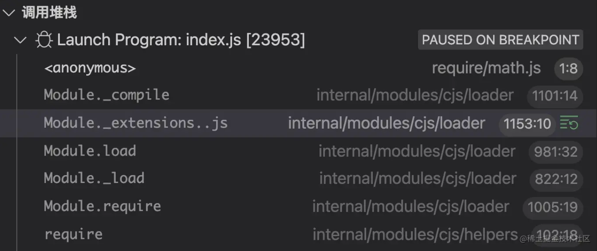

# require函数详解

## `require.cache`

需要时，模块会缓存在此对象中。通过从此对象中删除键值，下一个`require` 将重新加载模块。这不适用于 [native addons](https://nodejs.org/dist/latest-v18.x/docs/api/addons.html) ，重新加载将导致错误。

添加或替换条目也是可能的。此缓存在本机模块之前检查，如果将与本机模块匹配的名称添加到缓存中，则只有 `node:` -prefixed require 调用将接收本机模块。小心使用！

```js
const assert = require('node:assert');
const realFs = require('node:fs');

const fakeFs = {};
require.cache.fs = { exports: fakeFs };

assert.strictEqual(require('node:fs'), fakeFs);
assert.strictEqual(require('node:fs'), realFs);
```

## `require.main`

Module` 对象表示 Node.js 进程启动时加载的入口脚本，如果程序的入口点不是 CommonJS 模块，则为 `undefined

```js
require.main === moudles
```

## `require.extensions`

指导`require` 如何处理某些文件扩展名。

将扩展名为 `.sjs` 的文件处理为 `.js` 

nodejs默认支持三种加载器`.js`,`.json`,`node`

### node加载器

```js
// lib/internal/modules/cjs/loader.js
Module._extensions['.node'] = function(module, filename) {
  return process.dlopen(module, path.toNamespacedPath(filename));
};
```

### **json 文件加载器**

```js

// lib/internal/modules/cjs/loader.js
Module._extensions['.json'] = function(module, filename) {
 const content = fs.readFileSync(filename, 'utf8');
 try {
    module.exports = JSONParse(stripBOM(content));
 } catch (err) {
   err.message = filename + ': ' + err.message;
   throw err;
 }

```

### **js 文件加载器**

```javascript
// lib/internal/modules/cjs/loader.js
Module._extensions['.js'] = function(module, filename) {
  // If already analyzed the source, then it will be cached.
  const cached = cjsParseCache.get(module);
  let content;
  if (cached?.source) {
    content = cached.source;
    cached.source = undefined;
  } else {
    content = fs.readFileSync(filename, 'utf8');
  }
  // 省略部分代码
  module._compile(content, filename);
};
```

> 在自定义之前我们要了解nodejs里面require的加载过程
>
> Node.js 应用由模块组成，每个文件就是一个模块。对于 CommonJS 模块规范来说，我们通过 `require` 函数来导入模块。那么当我们使用 `require` 函数来导入模块的时候，该函数内部发生了什么？这里我们通过调用堆栈来了解一下 `require` 的过程：



由上图可知，在使用 `require` 导入模块时，会调用 `Module` 对象的 `load` 方法来加载模块，该方法的实现如下所示：

```javascript
// lib/internal/modules/cjs/loader.js
Module.prototype.load = function(filename) {
  this.filename = filename;
  this.paths = Module._nodeModulePaths(path.dirname(filename));
 
  const extension = findLongestRegisteredExtension(filename);
 
  Module._extensions[extension](this, filename);
  this.loaded = true;
  // 省略部分代码
};
```

通过这个钩子我们可以实现自定义加载器，实现加载ts如下

```js
const { transformSync } = require('esbuild')

const fs = require('fs')

const { code } = transformSync(fs.readFileSync('./test.ts', 'utf8'), {
  // sourcefile: 'test.js',
  sourcemap: false,
  loader: 'ts',
  format: 'cjs',
})

const loadModule = (code) => {
  // 保存默认加载器
  const defaultLoader = require.extensions['.ts']
  const file = require.resolve('./test.ts')

  require.extensions['.ts'] = function (module, filename) {
    if (filename === file) {
      module._compile(code, file)
    } else {
      defaultLoader(module,filename)
    }
  }
  let raw = require('./test.ts')
  delete require.cache[file]
  raw = raw.__esModule ? raw.default : raw

  return raw
}

console.log(loadModule(code)(1,3))
```

