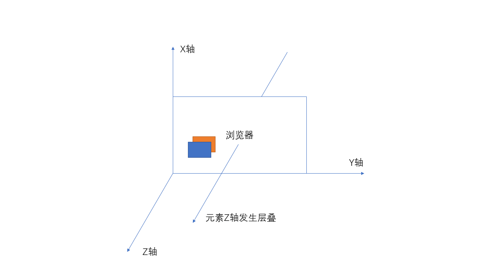
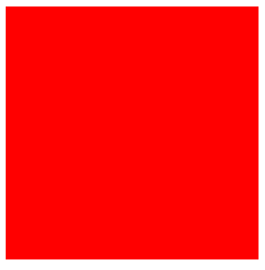
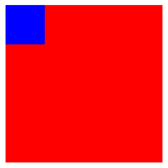
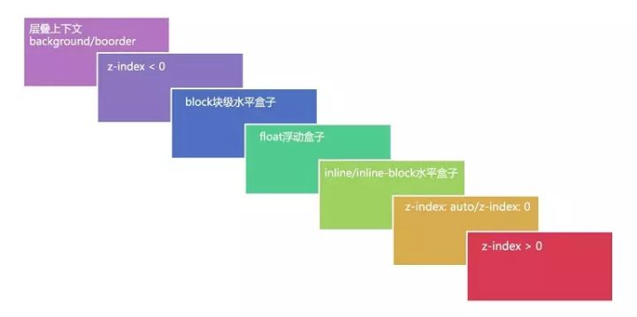
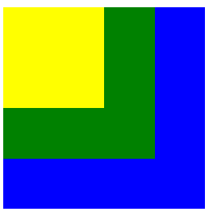
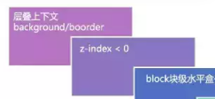
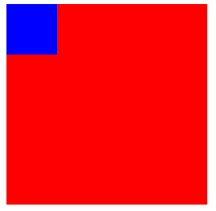

# 层叠上下文详解


## **前言**

目前前端大环境下，很多人越来越不注重学习 CSS 了，觉得太简单！但是事实并非如此，CSS 的复杂程度其实一点不亚于 JavaScript，只是你没深入了解才会觉得简单。

不知道你有没有遇到过这样的布局问题：我明明设置了 z-index，怎么没起作用？我设置了元素定位，最终效果怎么和我想象得不一样？

如果你遇到了上面得问题，说明你对 CSS 了解得还不够深入。上面问题的出现，都与 CSS 层叠上下文相关，所以今天我们决定彻底将 CSS 层叠上下文搞明白！

## **1.问题复现**

在我们的页面中，通常将元素的位置用 x 轴和 y 轴表示。但是如果一旦元素发生了重叠（比如设置了定位或者浮动）以后，我们就需要只用 z 轴来表示元素在垂直方向的层级，如下图所示：



相信很多小伙伴都知道一个概念：z-index 需要结合 position 属性使用。我们理解的 z-index 的数值就是决定元素在 z 轴方向的层级，但是事实果真如此吗？一起来看一段代码。

**示例代码：**

```html
<head>
  <style>
    .box1 {
      width: 200px;
      height: 200px;
      background-color: red;
      position: relative;
    }
    .box1-1 {
      width: 50px;
      height: 50px;
      background-color: blue;
      position: relative;
      z-index: -1;
    }
  </style>
</head>
<body>
  <!-- 父级盒子 -->
  <div class="box1">
    <div class="box1-1"></div>
  </div>
</body>
```

**输出结果：**



上段代码非常简单，我们就定义了两个 div，它们是父子关系。为了使用 z-index，我们给元素都加上了定位。然后我们为子元素设置了 z-index:-1，输出结果是子元素的确被父元素遮盖了，这也是我们想到的正常结果。但是我们修改一下代码，奇奇怪怪的事就发生了。

**修改后的代码：**

```css
.box1 {
  width: 200px;
  height: 200px;
  background-color: red;
  position: relative;
  z-index: 999;
}
```

**输出结果：**



上段代码我们就修改了一个地方，给父元素加上了 z-index:0，按照我们的常规思维，999 是大于-1 的，按道理父元素应该依旧把子元素遮住啊！可是结果啪啪打我们的脸，子元素没有被父元素遮盖！

上面的问题是我们经常遇到的，设置了 z-index 却没有用！不要着急，我们带着问题接着往下看，看到最后你一定就知道原因了。

## **2.什么是层叠上下文？**

有了问题我们去解决就好了，想要解决上一节的问题，我们就必须先要知道 CSS 中层叠上下文的概念，它的英文名称叫做：Stacking Context。

**官网解释：**

> 我们假定用户正面向（浏览器）视窗或网页，而 HTML 元素沿着其相对于用户的一条虚构的 z 轴排开，层叠上下文就是对这些 HTML 元素的一个三维构想。众 HTML 元素基于其元素属性按照优先级顺序占据这个空间。

官网的解释依旧是如此晦涩，其实层叠上下文并不复杂。

我们都知道 CSS 中有块级格式上下文（BFC）的概念，如果你还不知道 BFC，赶紧去学学。层叠上下文就和 BFC 类似，它不是一个什么实实在在的东西，而是一个概念。概念通常都比较抽象，比如算法中的链表、队列等，它们都是逻辑模型，而不是物理模型。

**通俗解释：**

> 层叠上下文是一个逻辑模型，一个概念，我们可以通过各种方式来实现这个模型，就好比我们可以用 JS 来实现链表一样。该模型有一些特点，比如它把我们的某一块（比如 div）构建成一个三维模型，处于该三维模型中的元素就会有层叠顺序，即 z 轴的层级。

上面说层叠上下文模型有一些特点，比如队列有先进先出的特点、栈有先进后出的特点。那么我们层叠上下文大致有以下**特点**：

- 层叠上下文可以嵌套，比如说我们有一个 div 元素是层叠上下文元素，那么它内部还可以继续嵌套层叠上下文元素。
- 层叠上下文元素之间相互独立，假如两个 div 都是层级上下文元素，那么它们的子元素的排序规则相互之间是没有关系的。
- 如果层叠上下文元素没有设置 z-index，那它也要比普通元素级别高，默认层叠等级为 z-index:0，比如我们给 div 设置定位后，它默认层级就比一般的元素高。

到这里我们应该就基本理解了 CSS 层叠上下文概念了，简单点说：如果这个元素是层叠上下文元素，那么它就和其它元素不一样，它先天就要厉害一点，层级默认就要比普通元素高！

## **3.如何创建层叠上下文？**

我们知道层叠上下文是一个逻辑模型，是一个概念。那么按道理来说可以有多种方式实现它，事实也确实如此，创建层叠上下文有很多种方式，主要有以下：

- **根节点**

根节点（<html\>）先天就要高人一等，它先天就是一个层叠上下文元素。

- **传统层叠上下文**

这里的传统主要是指 CSS3 之前创建层叠上下文元素的方式，主要有以下两种：

1. position 属性为 relative 或者 absolute，且 z-index 数值的元素。
2. position 属性为 fixed 或者 sticky 的元素。

- **CSS3 相关属性**

CSS3 提出了很多新属性，其中很多属性都可以将元素变为层叠上下文元素，大致有以下：

1. display 属性为 flex 或者 inline-flex，且 z-index 为具体数值的元素。
2. display 属性为 grid，且 z-index 为具体数值的元素。
3. opacity 属性值小于 1 的元素。
4. mix-blend-mode 属性值不为 normal 的元素
5. transform、filter、perspective、clip-path、mask / mask-image / mask-border 属性值不为 none。
6. isolation 属性值为 isolate 的元素。
7. -webkit-overflow-scrolling 属性值为 touch 的元素。
8. will-change 值设定了任一属性而该属性在 non-initial 值时会创建层叠上下文的元素。
9. contain 属性值为 layout、paint 或包含它们其中之一的合成值（比如 contain: strict、contain: content）的元素。

上面总体有 3 种方式可以创建层叠上下文，看起来非常多，但是我们重点需要关注的是前面两种，因为 CSS3 新增的一些属性可能我们常用的主要是那几个。

## **4.层叠等级**

但是为了更好的描述这样一个现象，我们又提出了一个新的概念：层叠等级。

**概念解释：**

> 层叠等级主要用来描述在同一个层叠上下文元素中，内部的层叠上下文元素在 z 轴的顺序。

这里我们需要重点关注：**在同一层叠上下文中**。

之所以要求限制在同一层叠上下文中，是因为这样才有比较的意义。比如说如果一个元素在一个层叠上下文中，另一个元素在另一个层叠上下文中，那么它们之间的比较毫无意义。就好比市长的秘书和省长的秘书比较，他们两个根本没有可比性，虽然都是秘书，但是他们的老板就先天决定了他们的级别。这儿市长和省长就好比是层叠上下文元素。

**综上所述，总结如下：**

1. 层叠等级的比较只有在同一个层叠上下文中才有意义。，
2. 不同层叠上下文之间比较层叠等级无意义。
3. 不同层叠上下文中的元素之间的层叠比较，优先比较的是两个层叠上下文元素。

**注意点：任何元素都有层叠等级，因为节点就是一个天生的层叠上下文元素，所以不能误认为设置 z-index 的元素才有层叠等级。**

## **5.层叠顺序**

前面我们说了层叠上下文以及层叠等级，它们都只是**概念**而已。概念顾名思义都是虚的东西，我们做项目要的是实实在在的东西，概念性的东西主要是用来推导出或者支撑实际的东西。

我们本篇文章出现最多的就是层叠两个字，那么到底这个层叠关系是什么？或者说层叠的顺序到底是什么？

这里我们就引出了实实在在的东西，层叠顺序：用来表示元素的层叠规则。比如我们有很多元素都位于层叠上下文元素中，而且这些元素发生了层叠，这个时候我们就有一套层叠规则来规定元素在 z 轴方向的顺序或层叠等级。

我们先来看一张非常经典的层叠顺序七层图：



在不考虑 CSS3 的情况下，我们的层叠顺序图就和上面的一致，因为 CSS3 新增了很多特性可以创建层叠上下文，这里暂时不考虑。

**图上有几个点需要注意一下：**

- background/border 表示的是层叠上下文元素的背景和边框。
- 虽然 z-index:auto 和 z-index:0 放在了同一层叠顺序，但是它们由本质区别，比如说我们利用 position 创建层叠上下文时，z-index 必须为数字。

接下来我们来看一个简单的例子加深一下印象：

```html
<head>
  <style>
    /* 创建层叠上下文 */
    .box1 {
      width: 200px;
      height: 200px;
      background-color: blue;
      position: relative;
      z-index: 0;
    }
    /* 设置 z-indedx */
    .box1-1 {
      width: 150px;
      height: 150px;
      background-color: green;
      position: absolute;
      z-index: -1;
    }
    /* 设置 float */
    .box1-2 {
      width: 100px;
      height: 100px;
      background-color: yellow;
      float: left;
    }
  </style>
</head>
<body>
  <!-- 层叠上文元素 -->
  <div class="box1">
    <!-- 设置 z-index：-1 -->
    <div class="box1-1"></div>
    <!-- float 元素 -->
    <div class="box1-2"></div>
  </div>
</body>
```

**输出结果：**



上段代码中我们将 box1 通过定位加 z-index 的方式创建为了一个层叠上下文元素，也就是说它的子元素都在同一个层叠上下文中。那么这些子元素都会遵守我们上面的七层层叠顺序图规则，出了一些新的 CSS3 属性外。

比如我们设置 box1-1 的 z-index 为-1 了，但是它以及位于 box1 的上方，就是因为下图的原因：



## **6.回归问题**

讲了这么多，你应该对层叠上下文有了一定的理解了吧，如果还不能理解，那就想得再简单点，BFC 是一种模型（布局模型）、CSS 里面有盒模型（元素模型）、层叠上下文（元素堆积模型）也是一种模型罢了，如果还不能理解，建议在通读一遍文章。

好了，我们回归到文章最初的问题上，为什么我们的 z-index 没有按照理想状态走了，我们再来看一下开局的代码：

```html
<head>
  <style>
    .box1 {
      width: 200px;
      height: 200px;
      background-color: red;
      position: relative;
      z-index: 999;
    }
    .box1-1 {
      width: 50px;
      height: 50px;
      background-color: blue;
      position: relative;
      z-index: -1;
    }
  </style>
</head>
<body>
  <!-- 父级盒子 -->
  <div class="box1">
    <div class="box1-1"></div>
  </div>
</body>
```

知道了层叠上下文的小伙伴应该一眼就能发现问题所在了，虽然我们的 box1-1 设置了 z-index 为-1，而且它的父元素 box1 设置了 z-index 为 999，但是输出结果却是 box1-1 在上面，如下图：



正是因为 box1 设置了 z-index 和 position 属性后，它变为了一个层叠上下文元素，根据我们七层层叠顺序表可以得出，层叠上下文元素始终是在最底部的。

如果我们吧 box1 的 z-index 去掉，那么 box1-1 便不是它的层叠上下文元素了，它和 box1-1 都属于层叠上下文元素的子元素了，所以 box1-1 将会被 box1 遮盖。

## **总结**

我们经常在项目中使用 z-index，很多人不管三七二十一，只认为 z-index 越大，则层叠级别越高。这就是典型的半罐水，一旦出现设置的 z-index 不生效，如果不了解 CSS 的层叠上下文模型，那可能找很久都不知道问题所在。