# 完美实现一个@功能


## text/textarea 文本输入框中操作光标选区

首先看这类操作方式，几乎可以不用 `Selection`和 `Range`相关 API，使用的是文本输入框元素原生方法。

### 主动选中某一区域

主动选中在文本输入框元素某一区域可以使用 [setSelectionRange](https://link.juejin.cn?target=https%3A%2F%2Fdeveloper.mozilla.org%2Fzh-CN%2Fdocs%2FWeb%2FAPI%2FHTMLInputElement%2FsetSelectionRange) 。

> element.setSelectionRange(selectionStart, selectionEnd [, selectionDirection]);

- selectionStart 被选中的第一个字符的位置索引，从 0 开始。
- selectionEnd 被选中的最后一个字符的 下一个 位置索引。
- selectionDirection 选择方向的字符串。

```javascript
javascript 代码解读复制代码$input.setSelectionRange(0, 6);
// $input.select() // 全部选中
$input.focus();
```

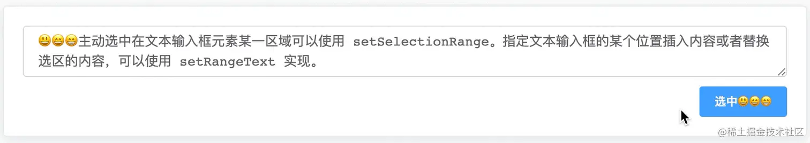

### 聚焦到某一位置

如果我们想把光标移动到 😃😄😁 后面，其实是将选区起始位置设置相同的效果

```javascript
javascript 代码解读复制代码$input.setSelectionRange(6, 6);
$input.focus();
```


### 还原之前的选区

有些场景，我们选择了当前`input`文本框选区，要去做别的操作，回来后要恢复选区，这时在做别的操作之前就要将选区位置存下来，会用到`selectionStart`和 `selectionEnd`两个属性。

```javascript
javascript 代码解读复制代码$input.addEventListener('mouseup', () => {
  this.pos = {
    start: $input.selectionStart,
    end: $input.selectionEnd,
  };
});

const { start, end } = this.pos;
$input.setSelectionRange(start, end);
$input.focus();
```


### 在指定选区插入（替换）内容

指定文本输入框的某个位置插入内容或者替换选区的内容，可以使用 [setRangeText](https://link.juejin.cn?target=https%3A%2F%2Fdeveloper.mozilla.org%2Fen-US%2Fdocs%2FWeb%2FAPI%2FHTMLInputElement%2FsetRangeText) 实现。

> setRangeText(replacement) setRangeText(replacement, start, end, selectMode)

这个方法有 2 种形式，第二种形式有 4 个参数：

- 第一个参数`replacement`是替换文本；
- `start`和 `end`是起始位置，默认值该元素当前选中的区域的位置；
- 最后一个参数`selectMode`是替换后选区的状态，它有 4 个状态：select（替换后选中）、start（替换后光标位于替换词之前）、end（替换后光标位于替换词之后）和 preserve（默认值，尝试保留选区）；

我们将光标或者选区位置插入或者替换文本 😂😂😂，可以这样

```javascript
javascript 代码解读复制代码$input.setRangeText('😂😂😂');
$input.focus();
```

 下面再来看看第二种有 4 个参数形式，发现会在我们指定的起始位置插入内容后，当前的选区和光标尝试保留。替换后选区的状态另外 3 种场景大家可以自行测试。

```javascript
javascript 代码解读复制代码$input.setRangeText('😂😂😂', 8, 8, 'preserve');
$input.focus();
```

 关于选区的操作在 input/textarea 输入框中的操作常用的差不多就这些，下面简单总结一下 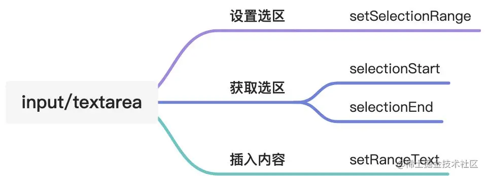

## 富文本中操作光标选区——Selection & Range

### 设置富文本

首先富文本元素是可编辑元素，可以在元素上看到光标，除了表单元素，还有给普通元素添加属性可以转换文富文本元素，可以通过一下三种方式转换。

- 给元素添加属性 `contenteditable="true"`；
- 添加 CSS 属性 `-webkit-user-modify: "read-write"`；
- 通过 js 的 `document.designMode="on"`方式设置；

### Selection & Range

在富文本中对光标及选区的操作，不得不提 JavaScript 的两个原生对象： [Selection](https://link.juejin.cn?target=https%3A%2F%2Fdeveloper.mozilla.org%2Fzh-CN%2Fdocs%2FWeb%2FAPI%2FSelection) 和 [Range](https://link.juejin.cn?target=https%3A%2F%2Fdeveloper.mozilla.org%2Fzh-CN%2Fdocs%2FWeb%2FAPI%2FRange%2FRange) 。

- **Selection** 对象表示用户选择的文本范围或插入符号的当前位置。它代表页面中的文本选区，可能横跨多个元素。文本选区由用户拖拽鼠标经过文字而产生。要获取用于检查或修改的 `Selection` 对象，请调用 [window.getSelection()](https://link.juejin.cn?target=https%3A%2F%2Fdeveloper.mozilla.org%2Fzh-CN%2Fdocs%2FWeb%2FAPI%2FWindow%2FgetSelection)。
- **Range** 对象表示包含节点和部分文本节点的文档片段。通过 `selection`对象获得的 `range`对象才是我们操作光标的重点。

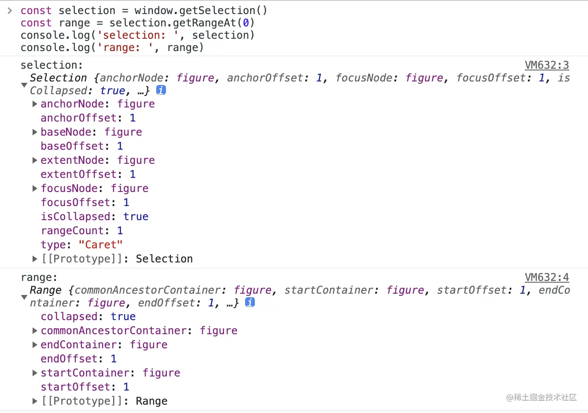 大家可能注意到 `getRangeAt(0)`，选区可能会有多个 `range`? 还真是，在 Firefox 支持多个选区，通过 `cmd`键（`windows`上是 `ctrl`键）可以实现多选区。 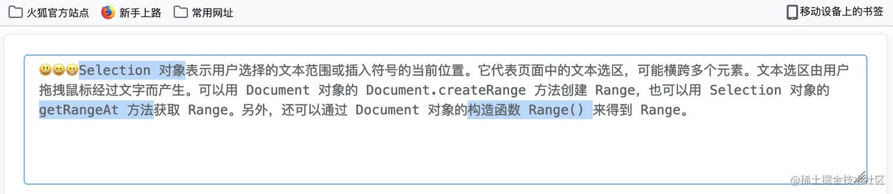 再看一个 range 返回的一个属性，`collapsed`，表示选区的起点与终点是否重叠。当`collapsed`为`true`时，选中区域被压缩成一个点，对于普通的元素，可能什么都看不到，如果是在可编辑元素上，那这个被压缩的点就变成了可以闪烁的光标。

### 主动选中富文本的某个节点

选中富文本中的某个独立标签，可以用到两个 API，[Range.selectNode()](https://link.juejin.cn?target=https%3A%2F%2Fdeveloper.mozilla.org%2Fzh-CN%2Fdocs%2FWeb%2FAPI%2FRange%2FselectNode) 和 [Range.selectNodeContent()](https://link.juejin.cn?target=https%3A%2F%2Fdeveloper.mozilla.org%2Fzh-CN%2Fdocs%2FWeb%2FAPI%2FRange%2FselectNodeContents)，两者不同的是前者包括节点自身，后者不包括自身。比如我们想独立选中富文本的第二个子元素`<span style="color: #00965e;">Selection</span>` ，使用 `Range.selectNode()` API 选中元素，删除的是整个元素，再输入内容是没有样式的。

```javascript
javascript 代码解读复制代码const $span = $input.childNodes[1];
range.selectNode($span);
selection.removeAllRanges();
selection.addRange(range);
```

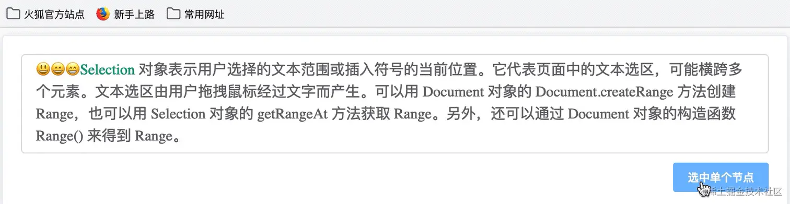 当然部分浏览器（比如 Chrome104）是有差异的，在删除整个节点后，新输入的内容时会插入一个标签（`font`）并集成之前的样式。 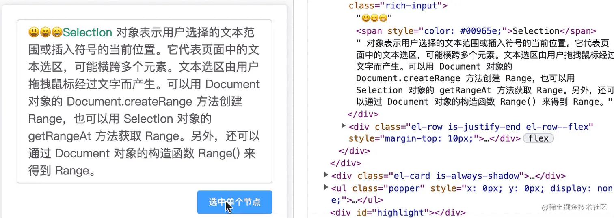 使用 `Range.selectNodeContents()` API 选中的是节点内部内容，当删除选中内容后，节点本身还在。

```javascript
javascript 代码解读复制代码const $span = $input.childNodes[1];
range.selectNodeContents($span);
selection.removeAllRanges();
selection.addRange(range);
```

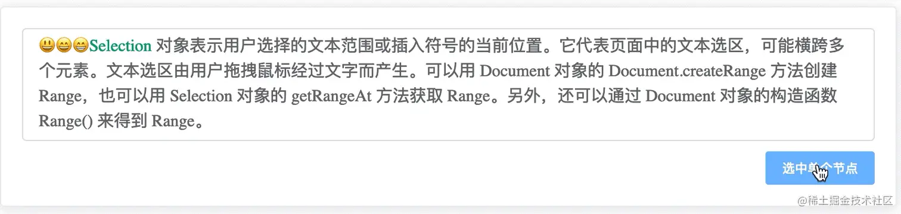 以上是对富文本中单个节点的选中操作，然而，实际上富文本中的节点可能是嵌套或者平行的，怎样跨多个元素去选中操作呢？

### 主动选中富文本的某一区域

表单输入框只有单一文本，而富文本元素或者普通元素包含多个元素。当主动选中页面某一区域，先要创建一个`Range`对象，可能会跨多个元素，所以要设置选区的起始节点，分别是 [Range.setStart()](https://link.juejin.cn?target=https%3A%2F%2Fdeveloper.mozilla.org%2Fzh-CN%2Fdocs%2FWeb%2FAPI%2FRange%2FsetStart) 和 [Range.setEnd()](https://link.juejin.cn?target=https%3A%2F%2Fdeveloper.mozilla.org%2Fzh-CN%2Fdocs%2FWeb%2FAPI%2FRange%2FsetEnd) 方法。

> range.setStart(startNode, startOffset); range.setEnd(endNode, endOffset);

- startNode 开始节点
- startOffset 从 startNode 的开始位置算起的偏移量
- endNode 结束节点
- endOffset 从 endNode 的结束位置算起的偏移量

上面是设置选区范围，然后将其添加到选区并选中 [Selection.addRange()](https://link.juejin.cn?target=https%3A%2F%2Fdeveloper.mozilla.org%2Fzh-CN%2Fdocs%2FWeb%2FAPI%2FSelection%2FaddRange)。不过，一般在添加前，会清除之前的选区，这时就要用到 [Selection.removeAllRanges()](https://link.juejin.cn?target=https%3A%2F%2Fdeveloper.mozilla.org%2Fzh-CN%2Fdocs%2FWeb%2FAPI%2FSelection%2FremoveAllRanges) 。

```javascript
javascript 代码解读复制代码const selection = document.getSelection();
const range = document.createRange();
range.setStart($input.firstChild, 0);
range.setEnd($input.firstChild, 4);
selection.removeAllRanges();
selection.addRange(range);
```

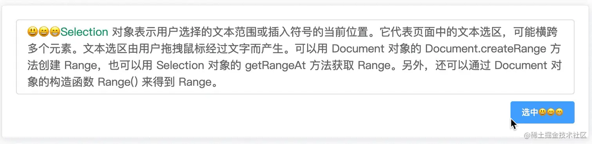 注意这里取富文本元素的第一个子节点（文本节点），而不是元素本身，否则就会超出偏移量，出现报错。因为在计算元素节点和文本节点偏移量是有差别的：

> 如果起始节点类型是 Text、Comment 或 CDATASection 之一，那么 startOffset 指的是从起始节点算起字符的偏移量。 对于其他 Node 类型节点，startOffset 是指从起始结点开始算起子节点的偏移量。

那么问题来了，如果我想选中富文本开头这一段 `😃😄😁<span style="color: #00965e;">Selection</span> 对象`，怎样实现呢？ 对于比较复杂的富文本元素结构，要实现任意区间选中，关键要找到起始节点和结束节点，以及它们各自的偏移量。 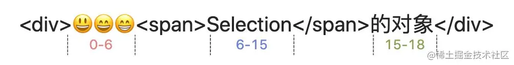

好像没有更好的原生方法可以借助，这里有一种方案，首先遍历出富文本包含所有的文本节点，然后记录每个节点边界的偏移量，查找出满足区间条件的起始和结束节点，最后从起始和结束节点中计算各自需要的文本偏移量。

```javascript
javascript 代码解读复制代码/**
 * 获取所有文本节点及其偏移量
 * @param {HTMLElement} wrapDom 最外层节点
 * @param {Number} start 开始位置
 * @param {Number} end 结束位置
 * @returns
 */
function getNodeAndOffset(wrapDom, start = 0, end = 0) {
  const txtList = [];
  const map = function (children) {
    [...children].forEach((el) => {
      if (el.nodeName === '#text') {
        txtList.push(el);
      } else {
        map(el.childNodes);
      }
    });
  };
  // 递归遍历，提取出所有 #text
  map(wrapDom.childNodes);
  // 计算文本的位置区间
  const clips = txtList.reduce((arr, item, index) => {
    const end =
      item.textContent.length + (arr[index - 1] ? arr[index - 1][2] : 0);
    arr.push([item, end - item.textContent.length, end]);
    return arr;
  }, []);
  // 查找满足条件的范围区间
  const startNode = clips.find((el) => start >= el[1] && start < el[2]);
  const endNode = clips.find((el) => end >= el[1] && end < el[2]);
  return [startNode[0], start - startNode[1], endNode[0], end - endNode[1]];
}
```

有了这个我们自己封装的工具方法，就可以选中任意文字区间，而不用考虑富文本的元素结构。

```javascript
javascript 代码解读复制代码const selection = document.getSelection();
const range = document.createRange();
const nodes = this.getNodeAndOffset($input, 4, 17);
range.setStart(nodes[0], nodes[1]);
range.setEnd(nodes[2], nodes[3]);
selection.removeAllRanges();
selection.addRange(range);
```

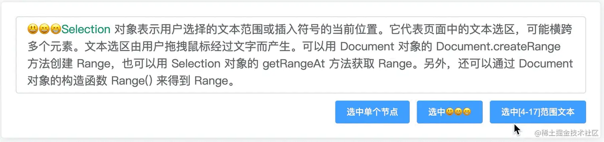

### 聚焦到某一位置

通过上面已实现选中任意区间文字，再来看将光标聚焦到某一位置，就简单多了，只选将起始和结束范围位置设置相同即可。

```javascript
javascript 代码解读复制代码const selection = document.getSelection();
const range = document.createRange();
const nodes = this.getNodeAndOffset($input, 7, 7);
range.setStart(nodes[0], nodes[1]);
range.setEnd(nodes[2], nodes[3]);
selection.removeAllRanges();
selection.addRange(range);
```

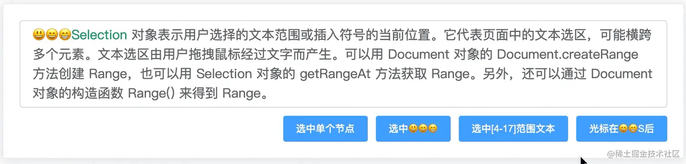

### 还原之前的选区

同文本输入框保存当前的光标位置，在富文本里，可以将整个选区都保存下来，然后在后面复原选区。

```javascript
javascript 代码解读复制代码// 保存光标
$input.addEventListener('mouseup', () => {
  const selection = document.getSelection();
  const range = selection.getRangeAt(0);
  this.lastRange = range;
});
// 还原光标
const selection = document.getSelection();
const range = document.createRange();
selection.removeAllRanges();
selection.addRange(this.lastRange);
```

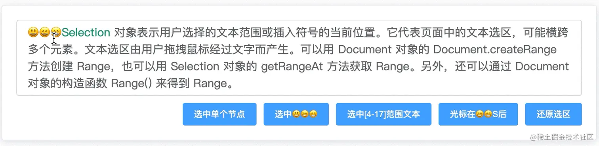

### 在指定选区插入（替换）内容

在选区插入内容，可以使用 [Range.insertNode()](https://link.juejin.cn?target=https%3A%2F%2Fdeveloper.mozilla.org%2Fzh-CN%2Fdocs%2FWeb%2FAPI%2FRange%2FinsertNode) 方法，它表示在选区的起点处插入一个节点，并且不会替换当前已经选中的，如果需要替换，可以先删除，删除选区可以用 [Range.deleteContent()](https://link.juejin.cn?target=https%3A%2F%2Fdeveloper.mozilla.org%2Fzh-CN%2Fdocs%2FWeb%2FAPI%2FRange%2FdeleteContents) 方法。

```javascript
javascript 代码解读复制代码const $text = document.createTextNode('😂😂😂');
this.lastRange.deleteContents();
this.lastRange.insertNode($text);
```

 从上面客服发现，插入内容后，内容是被选区选中状态，如果希望光标在插入的内容后面，可以使用 [Range.setStartAfter()](https://link.juejin.cn?target=https%3A%2F%2Fdeveloper.mozilla.org%2Fen-US%2Fdocs%2FWeb%2FAPI%2FRange%2FsetStartAfter) 设置选区的起点为元素的后面，默认选区的终点在元素的后面 [Range.setEndAfter()](https://link.juejin.cn?target=https%3A%2F%2Fdeveloper.mozilla.org%2Fen-US%2Fdocs%2FWeb%2FAPI%2FRange%2FsetEndAfter)，无须设置。

```javascript
javascript 代码解读复制代码this.lastRange.setStartAfter($text);
$input.focus();
```

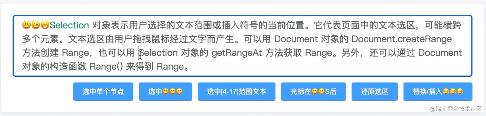 同样，也可以使用 [Range.setEndBefore](https://link.juejin.cn?target=https%3A%2F%2Fdeveloper.mozilla.org%2Fen-US%2Fdocs%2FWeb%2FAPI%2FRange%2FsetEndBefore) 和 [setStartBefore](https://link.juejin.cn?target=https%3A%2F%2Fdeveloper.mozilla.org%2Fen-US%2Fdocs%2FWeb%2FAPI%2FRange%2FsetStartBefore)将光标设置到内容的前面。

### 给指定选区包裹标签

还有一些比较高级的用法应用，比如给某句话加背景标记效果，类似 word 文档文字选中加背景色。可以通过 [Range.surroundContents()](https://link.juejin.cn?target=https%3A%2F%2Fdeveloper.mozilla.org%2Fzh-CN%2Fdocs%2FWeb%2FAPI%2FRange%2FsurroundContents) 方法实现。

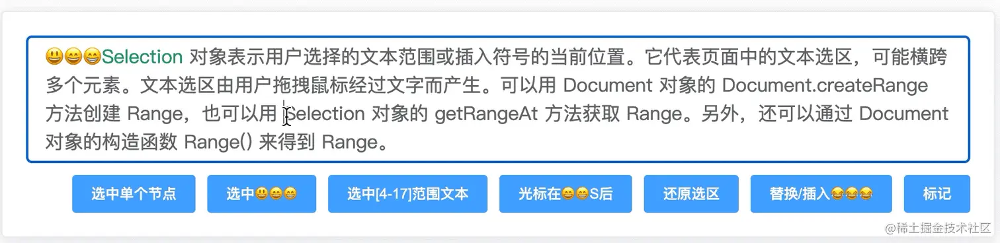 不过，当选区包含多个元素，也就是断开了一个非 text 节点，只包含了节点的其中一个边界，就会抛出异常。 那么怎样可以规避这个问题，实现跨多个节点选中标记呢？答案是 [extractContents()](https://link.juejin.cn?target=https%3A%2F%2Fdeveloper.mozilla.org%2Fzh-CN%2Fdocs%2FWeb%2FAPI%2FRange%2FextractContents)，它会将我们的选区多节点移动到 `DocumentFragment` 对象，需要注意的是

> 使用 DOM 事件添加的事件监听器在提取期间不会保留。HMTL 属性事件将按 [Node.cloneNode()](https://link.juejin.cn?target=https%3A%2F%2Fdeveloper.mozilla.org%2Fzh-CN%2Fdocs%2FWeb%2FAPI%2FNode%2FcloneNode) 方法原样保留和复制。HTML id 属性也会被克隆，如果提取了部分选定的节点并将其附加到文档中，则可能导致无效的文档。

用标签包裹该文档片段，然后插入。

```javascript
javascript 代码解读复制代码const $mark = document.createElement('mark');
// this.lastRange.surroundContents($mark)
const fragments = this.lastRange.extractContents();
$mark.append(fragments);
this.lastRange.insertNode($mark);
```


### 光标/选区的位置坐标

有时我们想确定文本区域中被选中的部分或者光标的视窗坐标，以此可以将类似备注或者悬浮框定位到附近。这里可以使用 [Range.getBoundingClientRect()](https://link.juejin.cn?target=https%3A%2F%2Fdeveloper.mozilla.org%2Fzh-CN%2Fdocs%2FWeb%2FAPI%2FRange%2FgetBoundingClientRect) API，它返回一个 DOMRect 对象，该对象将范围中的内容包围起来；即该对象是一个将范围内所有 元素包围起来的矩形。

```javascript
javascript 代码解读复制代码const pos = this.lastRange.getBoundingClientRect();
const highlight = document.getElementById('highlight');
highlight.style.left = `${pos.x}px`;
highlight.style.top = `${pos.y}px`;
highlight.style.width = `${pos.width}px`;
highlight.style.height = `${pos.height}px`;
css 代码解读复制代码#highlight {
  position: absolute;
  background-color: aqua;
}
```

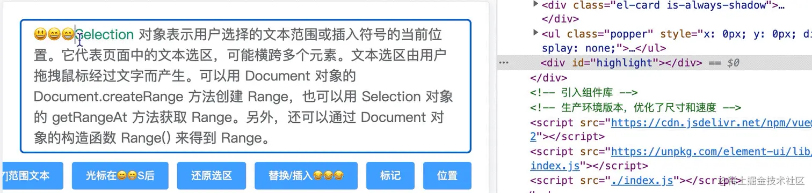 选中了 3 行，但不是完整的 3 行，给回的信息是一个最小包裹选区的矩形位置坐标，如果还需要知道选取中每个元素更详细的位置坐标，可以使用 [Range.getClientRects()](https://link.juejin.cn?target=https%3A%2F%2Fdeveloper.mozilla.org%2Fzh-CN%2Fdocs%2FWeb%2FAPI%2FRange%2FgetClientRects)，它返回的是一个 DOMRect 对象列表，表示 Range 在屏幕上所占的区域。这个列表相当于汇集了范围中所有元素调用 [Element.getClientRects()](https://link.juejin.cn?target=https%3A%2F%2Fdeveloper.mozilla.org%2Fzh-CN%2Fdocs%2FWeb%2FAPI%2FElement%2FgetClientRects)方法所得到的结果。

```javascript
javascript

 代码解读
复制代码this.lastRange.getClientRects();
```

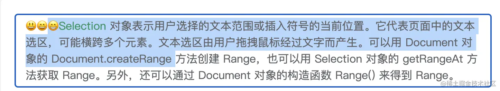 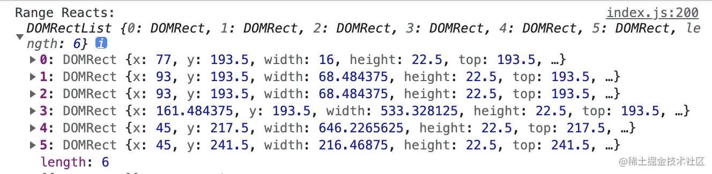 Selection&Range 的 API 很多，常用的大致以上列举的，同样简单总结一下 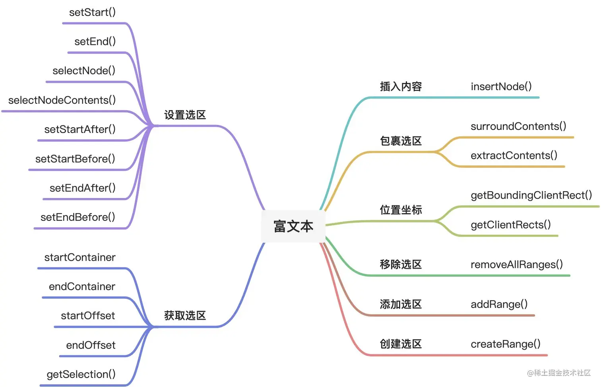

## @的功能实现

如果你已经熟悉了上面的「基操」，那么对于实现一个@功能已经成功了一半，剩下的一半就是思路了，大致分为如下几步：

1. 监听用户输入了`@`字符，展示用户列表；
2. 点击用户，导致输入框失焦，及时保存光标信息；
3. 点击完成，用户列表隐藏，恢复输入框的光标，然后在光标后插入用户名；

首先我们写好 `HTML`，`CSS` 部分在这里省略

```html
html 代码解读复制代码<!-- 富文本聊天消息输入框 -->
<div
  class="chat-input"
  ref="chatInput"
  contenteditable="true"
  placeholder="请输入内容"
  @input="inputChatContent"
  @blur="chatContentBlur"
  @mouseup="chatContentMouseup"
></div>
<!-- 用户列表浮窗 -->
<ul
  class="popper"
  v-show="isShowUserList"
  ref="popper"
  :style="popperStyle"
  v-click-out-hide
>
  <li v-for="(item, index) in userList" :key="index" @click="selectUser(item)">
    <el-row>{{item.name}}</el-row>
  </li>
</ul>
```

接着我们监听富文本的`input`事件，当监听到 @ 字符，展示用户列表，否则隐藏。于此同时，使用 Range.getBoundingClientRect() 获取光标的位置，这样才能将用户列表浮框定位到光标附近。

```javascript
javascript 代码解读复制代码/**
 * 输入聊天内容
 * @param {*} ev
 */
inputChatContent(ev) {
  if (ev.data === '@') {
    const pos = this.getCaretPos()
    this.showUserList()
    this.$nextTick(() => {
      this.setUserListPos(pos)
    })
  } else {
    this.hideUserList()
  }
},

/**
 * 获取光标位置
 * @returns
 */
getCaretPos() {
  const range = this.getRange()
  const pos = range.getBoundingClientRect()

  return pos
},

/**
 * 设置用户列表的位置
 * @param {*} pos
 */
setUserListPos(pos) {
  const $popper = this.$refs.popper
  const panelWidth = $popper.offsetWidth
  const panelHeight = $popper.offsetHeight
  const { x, y } = pos

  this.popperStyle = {
    top: y - panelHeight - 20 + 'px',
    left: x - panelWidth / 2 + 'px'
  }
},

hideUserList() {
  this.isShowUserList = false
},

showUserList() {
  this.isShowUserList = true
},
```

当点击用户列表时，输入框会失焦，此时先将光标保存起来，同时创建将要插入的用户名文本节点，然后恢复光标，再 `Range.insetNode()` 将用户名文本节点 `Range.insetNode()` 插入到选区，最后 `Selection.removeAllRanges()` 移除所有页面选区，`Selection.addRange()` 插入当前选区。

```javascript
javascript 代码解读复制代码 /**
 * 选择用户
 */
selectUser(user) {
  // 让失焦事件先执行
  setTimeout(() => {
    this.hideUserList()
    this.insertContent(user)
  })
},

/**
 * 恢复光标
 */
restoreCaret() {
  if (this.lastRange) {
    const selection = window.getSelection()
    selection.removeAllRanges()
    selection.addRange(this.lastRange)
  }
},

/**
 * 插入内容
 * @param {*} data
 */
insertContent(data) {
  this.restoreCaret() // 还原光标

  const selection = window.getSelection()
  const range = selection.getRangeAt(0)
  range.collapse(false) // 折叠选区，光标移到最后
  range.insertNode(data.content)
  range.collapse(false)

  selection.removeAllRanges()
  selection.addRange(range)
}
```

## 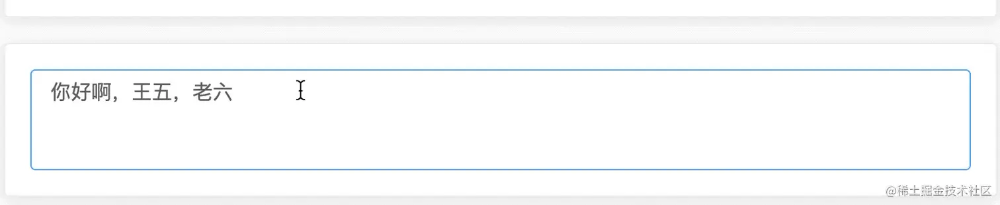

## @功能加强版

以上是简单实现了@ 功能，在实际应用中还有更多提升用户体验的地方

- 当前通过退回键删除用户名`@xxx`，发现删除的是逐个字符，而用户更多想要的是按一下退回键，删除整个用户名；
- 发送出去怎样解析成后端能识别的特定的数据结构，并且特定的数据结构怎样转换回富文本呢？

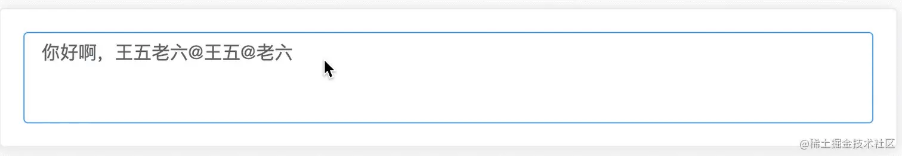 暂且带这两个问题，接着怎样解决呢？

### 实现整体删除用户名

首先想到的是用户名插入富文本是一个标签，按一下退回键，就能删除整个标签？答案是不能，富文本标签里的文字在没有选中情况下都是逐个删除。除非该元素是不可编辑元素 `span.contentEditable = false`。 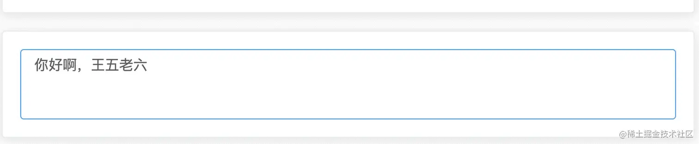 这里要将 `@xxx`放入不可编辑标签中，删除的时候才能一起删。此时会有一个问题，每次插入用户标签后，多出一个@ 字符，所以在之前已经输入的 @ 字符就需要在插入标签前需要删除掉。具体实现是找到选区所在的开始节点 `Range.startContainer`，再找到选区结束位置的偏移量 `Range.endOffset` ，正常情况下选区结束位置的前一个就是 @字符，选中删除即可。

```javascript
javascript 代码解读复制代码/**
 * 删除输入框中光标位置现有的@字符
 */
deleteCaretAtCode() {
  const range = this.getRange()
  // 光标开始节点和光标在节点上的偏移量，找到光标准确位置，选中光标位置前一个字符范围并删除，
  const node = range.startContainer
  const end = range.endOffset

  // 开始节点内容最后一个字符是@，删除，否则不删除
  if (node.textContent[end - 1] === '@') {
    range.setStart(node, end ? end - 1 : 0)
    range.deleteContents()
  }
},

/**
 * 转换要插入光标位置的内容
 * @param {*} data
 */
parseContent(data) {
  const { type = 'text', name } = data
  let content = null

  // type 是插入内容类型，可能是文本、@标签、图片、表情等
  if (type === 'text') {
    content = document.createTextNode(name)
  } else if (type === 'at') {
    // 删除输入框中光标位置现有的@字符
    this.deleteCaretAtCode()

    const $span = document.createElement('span')
    $span.contentEditable = false
    $span.classList.add('tag')
    $span.innerHTML = `@${name}`

    // 插入一个空格字符（\u0010）到@标签后面，可以解决部分浏览器上光标在聊天输入框后面
    const $space = document.createTextNode('\u0010')
    const frag = document.createDocumentFragment()

    frag.appendChild($span)
    frag.appendChild($space)

    content = frag
  }
  return content
},

 /**
 * 插入内容
 * @param {*} data
 */
insertContent(data) {
  this.restoreCaret() // 还原光标

  const selection = window.getSelection()
  const range = selection.getRangeAt(0)
  range.collapse(false) // 折叠选区，光标移到最后

  const pc = this.parseContent(data)
  range.insertNode(pc)
  range.collapse(false)

  selection.removeAllRanges()
  selection.addRange(range)
}
```

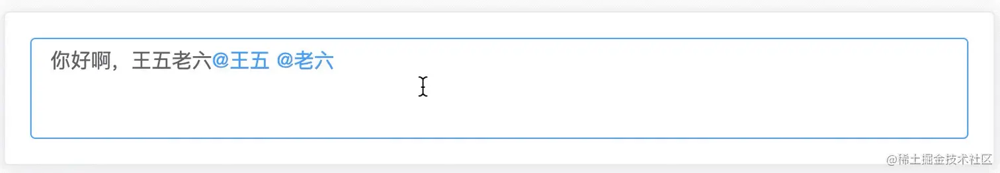

### 一些兼容处理

可能你已经注意到了，在用户标签`@xxx`后面追加了一个空格字符，这样光标可以显示出来，不过在用退格键需要按两次删除标签，这里具体的要看业务需要了。 注意的是在 Mac Chrome（V104）上，如果在标签后面不追加字符，光标会在外层富文本标签后面，在非编辑标签后加任意字符是正常的。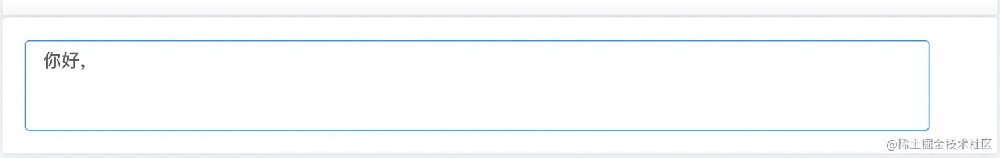 经过测试 Firefox 浏览器有这样的 bug：用户标签`@xxx`没有正确的插入到富文本输入框的位置，而是插入到了用户列表点击的那一项上了。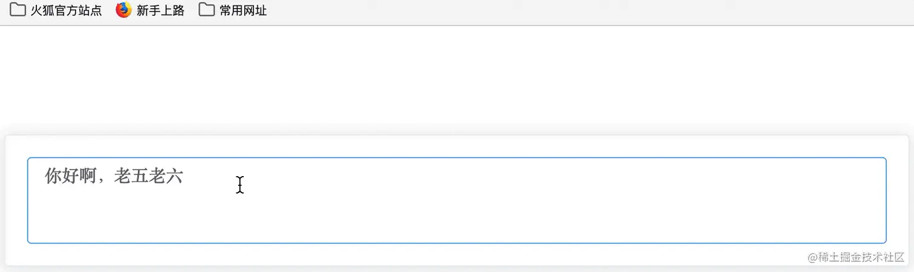 大胆推测 Firefox 将普通元素也可以设置光标，这样点击用户列表某一项元素时，该元素获得光标，再获取新选区 `selection.getRangeAt(0)`其实是在点击的这个元素上，非恢复的富文本输入框上，然后插入用户标签，也就是上面的情景。 这里我的解决方法是将用户列表项设置为不可选中的，自然就无法获取光标。

```css
css 代码解读复制代码.popper li {
  /* 用户不能选中文本 firfox 非编辑编辑元素也可选中 */
  user-select: none;
  -webkit-user-select: none;
  list-style: none;
  padding: 10px;
}
```

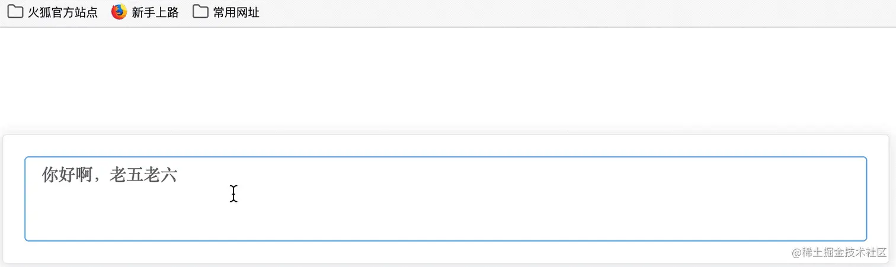 我们再看看再 Safari 上的表现 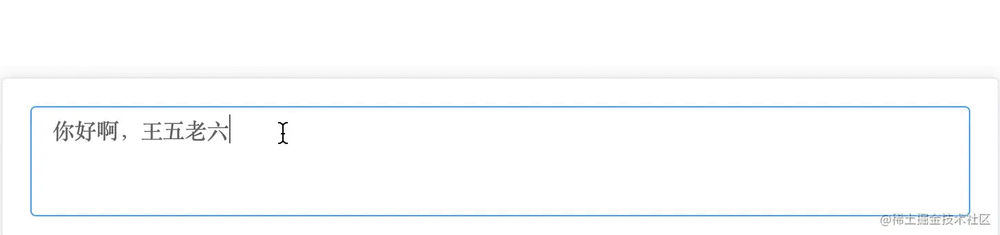 发现是没有按照预想的删除掉前置的`@`字符的，查看控制台有报错 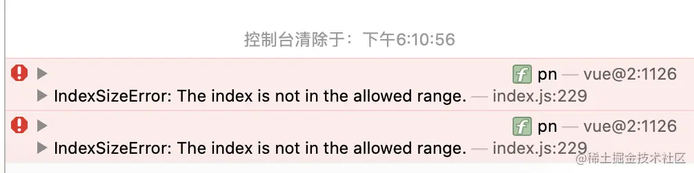 大致意思是 `selection.getRangeAt(0)`中第 0 位是超出允许的范围的，难道在输入框失去焦点的情景下，Safari 默认将选区给清空了？通过实验发现确实如此

```javascript
javascript 代码解读复制代码// 输入框失去焦点和获取焦点时打印选区个数
const selection = window.getSelection();
console.log('selection.rangeCount: ', selection.rangeCount);
```

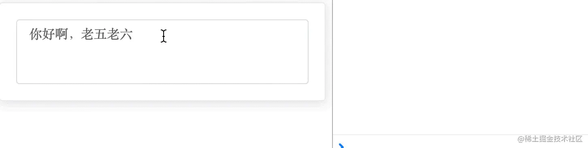 而正常其他浏览器选区个数保持不变 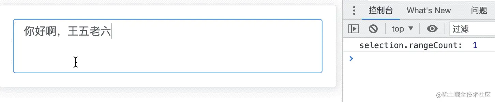 那怎样解决这种情景呢？我们是在输入框失焦的时候保存选区的，此时 Safari 已经清空了选区，导致这个时候保存的选区是空的，因此我们要将选区保存前置一下，在输入`@`字符时候就保存一下选区（光标），可以这样做

```javascript
javascript 代码解读复制代码/**
 * 输入聊天内容
 * @param {*} ev
 */
inputChatContent(ev) {
  if (ev.data === '@') {
    // 在输入@字符时候就保存一下光标
    this.saveCaret()
    const pos = this.getCaretPos()
    this.showUserList()
    this.$nextTick(() => {
      this.setUserListPos(pos)
    })
  } else {
    this.hideUserList()
  }
},
```

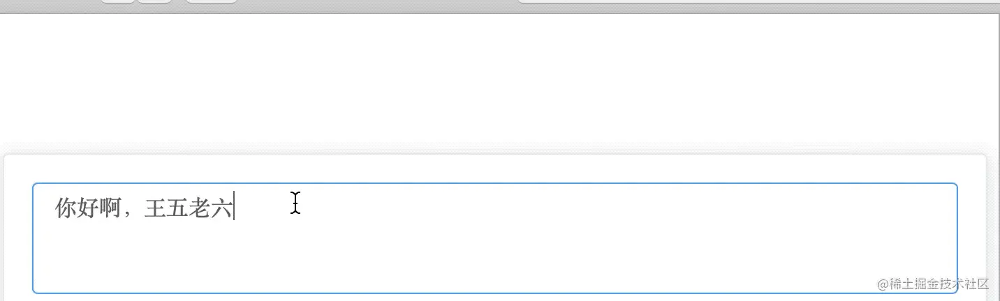


