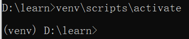

# python虚拟环境总结 

## requirements.txt

在开始学习虚拟环境之前我们要先知道`requirements.txt`的作用，`requirements.txt`的作用主要是统一我们python项目的软件版本，而``requirements.txt`也不需要我们手动去编写，可以借助一些工具来生成

### 1. freeze

直接执行下面这个命令来生成

> pip freeze > requirements.txt

### 2.pipreqs（推荐）

```shell
 # 安装
 pip install pipreqs
 # 在当前目录生成
 pipreqs . --encoding=utf8--force
```

::: info 注意

`--encoding=utf8 `为使用 utf8 编码，不然可能会报 UnicodeDecodeError: ‘gbk’ codec can’t decode byte 0xae in position 406: illegal multibyte sequence 的错误。

`--force` 强制执行，当 生成目录下的 requirements.txt 存在时覆盖。

:::


### 3.下载依赖

> pip install -r requirements.txt

::: tip

使用 `pipreqs `用于生成` requirements.txt` 文件可以根据需要导入的任何项目

为什么不使用pip的Freeze命令呢？

pip的`freeze`命令保存了保存当前Python环境下所有类库包，其它包括那些你没有在当前项目中使用的类库。 （如果你没有的`virtualenv`）。

pip的freeze命令只保存与安装在您的环境python所有软件包。

但有时你只想将当前项目使用的类库导出生成为` requirements.txt`；

:::


## 虚拟环境（venv）

### 1.什么是虚拟环境

- 当我们在创建项目的时候，经常会使用第三方包和模块。而这些包和模块往后也会经常更新版本。例如。在我们创建第1个应用程序时，使用的框架是Django 1.0。当我们开发第2个应用程序时，Django版本已经升级到2.0。这意味着安装一个python环境可能无法满足每个应用程序的要求，这就导致需求存在冲突，只安装版本1.0或2.0将导致某一个应用程序无法运行。
- 如何解决这种问题呢？Python提供的解决方案就是创建多个虚拟环境（`virtual environment`）。一个虚拟环境就是一个目录树，其中安装有特定的Python版本，以及许多其他包。
- 对于不同的应用可以使用不同的虚拟环境，这样就可以解决前面需求相冲突的问题。应用程序A拥有安装了1.0版本的虚拟环境，而应用程序B则拥有安装了2.0版本的另一个虚拟环境。如果应用程序B要求将某个库升级到3.0版本，也不会影响应用程序A的虚拟环境。多个虚拟环境的使用如图所示：


### 2.创建虚拟环境

### venv

`venv`是一个`python`自带的轻量级虚拟环境

在python项目的终端运行

```shell
python -m venv venv
```

（1）命令的第一个venv，是制定运行venv。第二个venv是指虚拟环境的文件夹的名字，这个可以根据需要来修改
（2）命令执行后，会在当前文件夹中，建立一个venv目录。 在这个venv目录中，会默认放置python.exe、pip.exe等与系统目录隔离的可执行文件

**激活虚拟环境**

在windows系统上，激活这个虚拟环境的命令是：

```shell
E:\test_venv\ml_project>venv\Scripts\activate
```

激活后，就能用python命令来了运行程序，也能用pip来安装第三方库，这些库的安装都是隔离在虚拟环境中的。

**退出虚拟环境**

```shell
venv\Scripts\deactivate.bat
```

在linux上的用法和windows类似，只是linux下激活venv的命令如下

```shell
$ source <venv>/bin/activate
```


### virtualenv

`Virtualenv `实际上是一个python包，它可以帮助我们搭建虚拟且独立的python环境。

**安装virtualenv**

```shell
pip install virtualenv
```

查看版本

```shell
virtualenv --version
```

**创建虚拟环境**

```shell
virtualenv venv

# virtualenv+虚拟环境名 。按照惯例，一般虚拟环境会被命名为venv
```

**激活和关闭虚拟环境**

windows系统激活虚拟环境命令：

```shell
venv\scripts\activate
```

macOS或Linux系统激活虚拟环境命令：

```shell
source venv/bin/activate
```

激活完成后，会在命令提示符前面新增venv标志。如下图所示：



## 多版本兼容（pyenv）

因为pyenv不支持windows，有需要自行查看[官网](https://github.com/pyenv/pyenv?tab=readme-ov-file)

教程如下

[https://blog.csdn.net/xhp312098226/article/details/137106947](https://blog.csdn.net/xhp312098226/article/details/137106947)

[https://cloud.tencent.com/developer/article/1415310](https://cloud.tencent.com/developer/article/1415310)

[https://blog.csdn.net/qq_41856663/article/details/124480323](https://blog.csdn.net/qq_41856663/article/details/124480323)

## 使用国内镜像源加速下载

在使用pip下载安装第三方包的时候，经常会因为下载超时而报错。这是由于下载包的服务器在国外，所以会出现访问超时的情况。可以使用国内镜像源来解决此类问题，比较常用的国内镜像源有

```shell
# 阿里云 http://mirrors.aliyun.com/pypi/simple/
# 中国科技大学 https://pypi.mirrors.ustc.edu.cn/simple/
# 豆瓣(douban) http://pypi.douban.com/simple/
# 清华大学 https://pypi.tuna.tsinghua.edu.cn/simple/
```

使用镜像源的方式有2种：临时使用和永久保存

**临时保存**

临时使用指的是每次安装包时设置一次，下次再安装新的包时，还需要再设置。例如临时使用清华大学镜像源安装beautifultable。

命令如下：

```shell
pip install -i https://pypi.tuna.tsinghua.edu.cn/simple/ beautifultable (其实我一般用阿里云)
# 上述命令中，"-i"参数是index的缩写，表示索引，后面紧接着是镜像源的地址
```

**永久保存（默认使用）**

如果将镜像源设置成配置文件，当使用pip下载包时，默认执行该配置文件，到指定镜像源中取下载包。

① 在windows平台下，以配置阿里云镜像源为例，配置信息如下：

 在windows文件管理器中,输入 **%APPDATA%**

在该目录下新建pip文件夹，然后到pip文件夹里面去新建个pip.ini文件,输入以下内容：

```tex
[global]
timeout = 6000
index-url = http://mirrors.aliyun.com/pypi/simple/
trusted-host = mirrors.aliyun.com
```

② 在Linux平台下：

在linux环境下的修改方式和在windows环境下修改方式基本相同，这里简单总结一下:

(1):在用户的家目录下面创建名为.pip文件夹

(2):在创建好的.pip文件夹中创建名为pip.conf的文件

(3):在pip.conf文件中输入以下内容：

```te
[global]
timeout = 6000
index-url = http://pypi.douban.com/simple
trusted-host = pypi.douban.com
```

