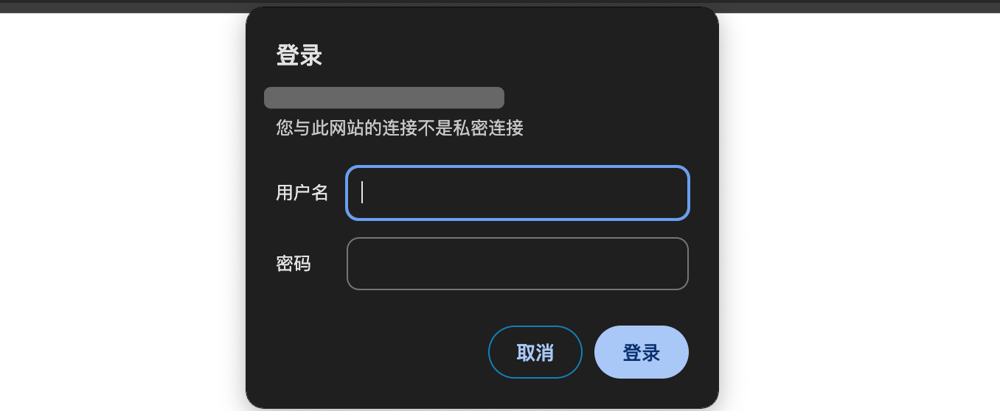
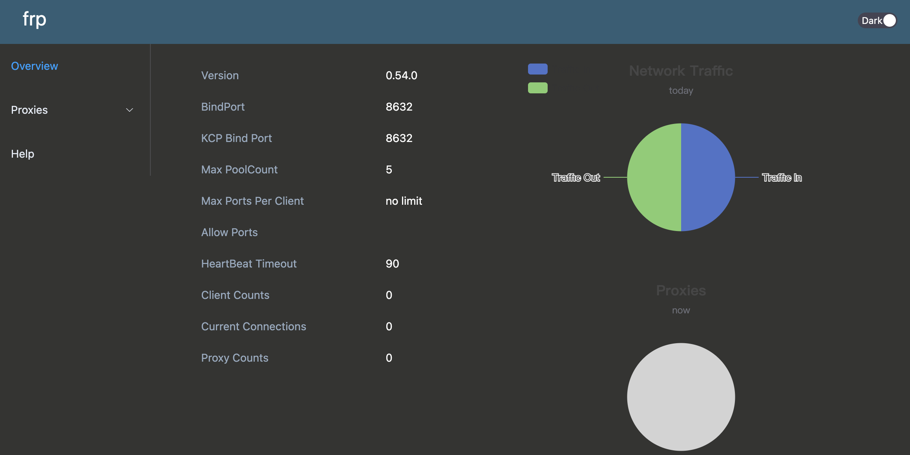

:::info 提示
 frp的内网转发主要通过server对client进行转发，也就是需要两个端，一个服务端，一个客户端，服务端就是公网的访问地址，客户端就是内网的访问.

在使用frp之前先对，使用工具进行一下说明

1. 需要一台可以访问暴露到外网的服务器，可以是本机电脑
2. 需要选择一个client进行，公网转发，我这边选择虚拟机，操作系统是 [ubuntu-24.04](https://mirrors.aliyun.com/ubuntu-releases/24.04/?spm=a2c6h.25603864.0.0.27f74ddazUCKKq)(虚拟机的使用这里不做过多阐述，自行安装，推荐-[**VirtualBox**](https://www.virtualbox.org/wiki/Downloads))
3. 我这边选择的服务端是阿里云服务器
4. 准备一个sftp工具，这边推荐[FinalShell](https://www.hostbuf.com/t/988.html)
5. 下载[frp](https://github.com/fatedier/frp/releases)推荐下载amd，frp使用[文档](https://gofrp.org/zh-cn/docs/)
:::

# frp 使用教程

## 配置文件

### 客户端

::: code-tabs

@tab frpc.toml

```text
serverAddr = "x.x.x.x"
serverPort = 7000
auth.token = "abc" # 设置密码以验证端到端安全通信

[[proxies]]
name = "ssh"
type = "tcp"
localIP = "192.168.56.101" # 虚拟机的本地ip
localPort = 22 # 本地暴露的端口
remotePort = 6000 # 服务端的转发端口

[[proxies]]
name = "status"
type = "tcp"
localIP = "127.0.0.1"
localPort = 6022
remotePort = 6022

[[proxies]]
name = "wflac"
type = "tcp"
localIP = "127.0.0.1"
localPort = 6023
remotePort = 6023

```
:::

### 服务端

::: code-tabs

@tab frps.toml

```text
bindPort = 7000
kcpBindPort = 7000 # 服务端监听KCP协议端口
auth.token = "abc" # 设置密码以验证端到端安全通信

# dashboard 管理页面
webServer.port = 9999 # 可以通过浏览器查看frp的状态信息
webServer.addr = "0.0.0.0" # 允许IP访问
# dashboard 用户名密码，可选，默认为空
webServer.user = "admin"
webServer.password = "admin" 
```
:::

上面设置的端口一定要在服务器暴露出来


## 启动服务(客户端同理)

```sh
sudo -i   #获取管理员权限

cd /root/frps  #进入frpc根目录

chmod +x ./frps #赋予权限以便执行 

./frps -c ./frps.toml  #启动frps可执行程序
```

验证frps服务端

- 输入密码登录图4，显示面板后，服务端已搭建完毕图5
- 如果显示错误，请自行服务器放行端口





## 安装Systemd

```sh
# 使用 apt 安装 systemd（Debian/Ubuntu）
apt install systemd
```

###  **创建 frps.service 文件**

```sh
sudo vim /etc/systemd/system/frps.service
```

```txt
[Unit]
# 服务名称，可自定义
Description = frp server
After = network.target syslog.target
Wants = network.target

[Service]
Type = simple
# 启动frps的命令，需修改为您的frps的安装路径
ExecStart = /path/to/frps -c /path/to/frps.toml

[Install]
WantedBy = multi-user.target

```

### **使用命令管理 frps 服务**

```sh
# 启动frp
sudo systemctl start frps
# 停止frp
sudo systemctl stop frps
# 重启frp
sudo systemctl restart frps
# 查看frp状态
sudo systemctl status frps
```

###  **设置 frps 开机自启动**

```sh
sudo systemctl enable frps
```

