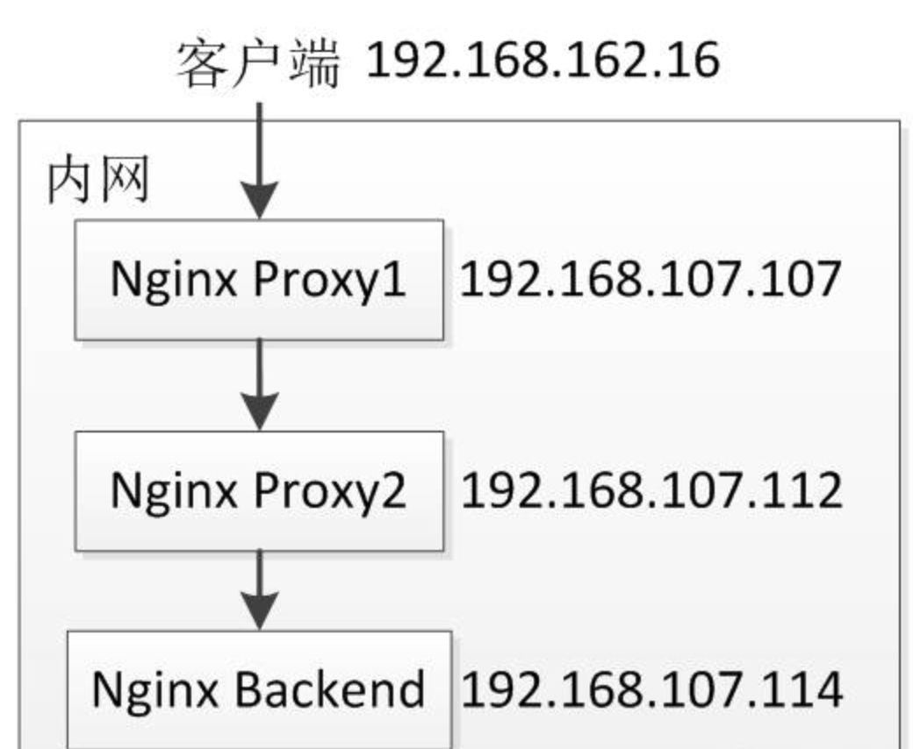

---
tag:
  - 技巧
category:
  - 运维
date: 2024-09-07
---

# Nginx获取真实IP

> HTTP 请求头中的 Remote_Addr，X-Forwarded-For，X-Real-IP

## REMOTE_ADDR

表示发出请求的远程主机的 IP 地址，remote_addr代表客户端的IP，但它的值不是由客户端提供的，而是服务端根据客户端的ip指定的，当你的浏览器访问某个网站时，假设中间没有任何代理，那么网站的web[服务器](https://www.baidu.com/s?wd=服务器&tn=24004469_oem_dg&rsv_dl=gh_pl_sl_csd)（[Nginx](https://www.baidu.com/s?wd=Nginx&tn=24004469_oem_dg&rsv_dl=gh_pl_sl_csd)，Apache等）就会把remote_addr设为你的机器IP，如果你用了某个代理，那么你的浏览器会先访问这个代理，然后再由这个代理转发到网站，这样web服务器就会把remote_addr设为这台代理机器的IP

## x_forwarded_for

简称XFF头，它代表客户端，也就是HTTP的请求端真实的IP，只有在通过了HTTP 代理或者负载均衡服务器时才会添加该项，正如上面所述,当你使用了代理时,web服务器就不知道你的真实IP了,为了避免这个情况,代理服务器通常会增加一个叫做x_forwarded_for的头信息,把连接它的客户端IP(即你的上网机器IP)加到这个头信息里,这样就能保证网站的web服务器能获取到真实IP

格式一般为：

```txt
X-Forwarded-For: 1.1.1.1, 2.2.2.2, 3.3.3.3
```

代表 请求由`1.1.1.1`发出，经过三层代理，第一层是`2.2.2.2`，第二层是`3.3.3.3`，而本次请求的来源IP`4.4.4.4`是第三层代理



## 场景1

是很简单的场景，Nginx Proxy直接把请求往后转发，没有做任何处理

```conf
Nginx Proxy
192.168.107.107 nginx.conf
location /test {
    proxy_pass http://192.168.107.112:8080;
}
192.168.107.112 nginx.conf
location /test {
    proxy_pass http://192.168.107.114:8080;
}
Nginx Proxy就是简单的把请求往后转发。
Nginx Backend
192.168.107.114 nginx.conf
location /test {
    default_type text/html;
    charset gbk;
    echo "$remote_addr || $http_x_forwarded_for";
}
```

Nginx Backend输出客户端IP（$remote_addr）和X-Forwarded-For请求头（$http_x_forwarded_for），当访问服务时输出结果如下所示：

```txt
192.168.107.112 ||
```

分析
1.$remote_addr代表客户端IP，当前配置的输出结果为最后一个代理服务器的IP，并不是真实客户端IP； 
2.在没有特殊配置情况下，X-Forwarded-For请求头不会自动添加到请求头中，即Nginx Backend的$http_x_forwarded_for输出为空。

## 场景2

通过添加X-Real-IP和X-Forwarded-For捕获客户端真实IP。

```txt
Nginx Proxy
192.168.107.107 nginx.conf
location /test {
    proxy_set_header X-Real-IP $remote_addr;
    proxy_set_header X-Forwarded-For $proxy_add_x_forwarded_for;
    proxy_pass http://192.168.107.112:8080;
}
192.168.107.112 nginx.conf
location /test {
    proxy_set_header X-Forwarded-For $proxy_add_x_forwarded_for;
    proxy_pass http://192.168.107.114:8080;
}
Nginx Backend
192.168.107.114 nginx.conf
location /test {
    default_type text/html;
    charset gbk;
    echo "$remote_addr ||$http_x_real_ip  ||$http_x_forwarded_for";
}
```

当访问服务时，输出结果为：

```txt
192.168.107.112 || 192.168.162.16 || 192.168.162.16, 192.168.107.107
```

分析
1.在离用户最近的反向代理NginxProxy 1，通过“proxy_set_header X-Real-IP $remote_addr”把真实客户端IP写入到请求头X-Real-IP，在NginxBackend输出$http_x_real_ip获取到了真实客户端IP；而Nginx Backend的“$remote_addr”输出为最后一个反向代理的IP； 
2.“proxy_set_headerX-Forwarded-For $proxy_add_x_forwarded_for”的是把请求头中的X-Forwarded-For与$remote_addr用逗号合起来，如果请求头中没有X-Forwarded-For则$proxy_add_x_forwarded_for为$remote_addr。 
X-Forwarded-For代表了客户端IP，反向代理如Nginx通过$proxy_add_x_forwarded_for添加此项，X-Forwarded-For的格式为X-Forwarded-For:real client ip, proxy ip 1, proxy ip N，每经过一个反向代理就在请求头X-Forwarded-For后追加反向代理IP。 
到此我们可以使用请求头X-Real-IP和X-Forwarded-For来获取客户端IP及客户端到服务端经过的反向代理IP了。这种方式还是很麻烦，$remote_addr并不是真实客户端IP。

## X-Real-IP

当有多个代理时候，可以在第一个反向代理上配置“proxy_set_header X-Real-IP $remote_addr” 获取真实客户端IP；

> X-Forwarded-For一般是每一个非[透明代理](https://www.baidu.com/s?wd=透明代理&tn=SE_PcZhidaonwhc_ngpagmjz&rsv_dl=gh_pc_zhidao)转发请求时会将上游服务器的IP地址追加到X-Forwarded-For的后面，使用英文逗号分割
> X-Real-IP一般是最后一级代理将上游IP地址添加到该头中
> X-Forwarded-For是多个IP地址，而X-Real-IP是一个
