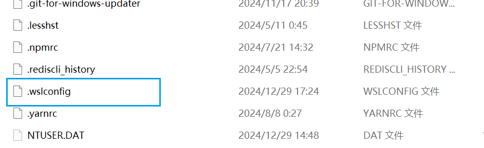

---
tag:
  - 技巧
category:
  - 运维
date: 2024-12-30
---

# WSL 安装指南

>wsl 是一个window的子系统

**前提**：

1. 需要开启CPU虚拟化
2. 开启window功能里面的两个选项，然后重启电脑


## setup

### 安装

:::info

右键使用管理员打开PowerShell

:::

输入`wsl --list --online` 可安装的虚拟机列表


选择一个版本进行安装，安装命令为(我这边选择Ubuntu-24.04这个版本)

`wsl --install -d  Ubuntu-24.04 `

如果没有vpn的话可以在安装命令后面天` --web-downloa`d命令,安装完成之后需要设置**用户名**和**密码**

### 查看已安装

使用命令`wsl -l -w`查看已安装的子系统


### 设置默认选项

使用命令`wsl --set-default <子系统名称>`设置默认选项，设置完默认选项之后可以直接通过`wsl`命令直接进入到虚拟机

如果没有设置默认选项则要使用`wsl -d <子系统名称>`进入虚拟机

### 卸载子系统

命令为`wsl --unregister <子系统名称>`

### 备份与恢复

备份子系统的命令为`wsl --export <子系统名称>  <压缩包名称>.tar`

导入的命令为`wsl import <新的子系统的名称>  <子系统要存储的路径>  <上方压缩包的路径>`    

## 高级设置

 ### 子系统设置

`sudo vim /etc/wsl.conf` 对这个文件进行编辑 

开启`systemd`配置

```shell
[boot]
systemd=true
```

重启子系统

`wsl --shutdown`

### windows 配置

在用户目录创建一个`.wslconfig`配置



#### 开启ip共享

默认子系统的ip是不与宿主共享的

输入

```shell
[wsl2]
networkingMode=mirrored
```

重启子系统生效

`wsl --shutdown`

可以用`ifconfig` 查看是否ip生效

## 其他命令

### 查看挂载卷

`df -h`

### 文件交互

`explorer.exe .`

### 查看显卡信息

`nvidia-smi`

### 下载内核更新包

下载新内核的wsl，[下载地址](https://wslstorestorage.blob.core.windows.net/wslblob/wsl_update_x64.msi)

### 更新wsl

`wsl --update`

### 设置默认WSL版本

`wsl --set-default-version 2`

### 为wsl指定用户

`wsl -d <distro_name> -u <username>`

### 设置默认用户

**编辑 `wsl.conf` 文件**

添加内容

```SHELL
[user]
default=newuser
```

或者找到子系统镜像地址，默认安装位置是在`C:\Users\用户名\AppData\Local\Microsoft\WindowsApps路径下确认所安装的Linux子系统具体的版本号`

然后打开CMD,输入`XXXXXX版本号.exe config --default-user root`运行,设置成默认`root`用户运行

### 重启

`wsl --shutdown `