# pnpm 下 monorepo 的使用

# 为什么设计模块包？

随着 Monorepo 代码越堆越多、多人员协作情况下，不可避免遇到如下问题：

- **重复定义问题**：工具方法、类型、配置在不同应用之间**重复定义**，维护困难。（例如：一个应用类型 `AppType` 的定义可以达 **10 多处**，很多还是**旧的定义**；项目用到配置； `tsconfig.json` 、prettier 等相同的配置写一遍又一遍）

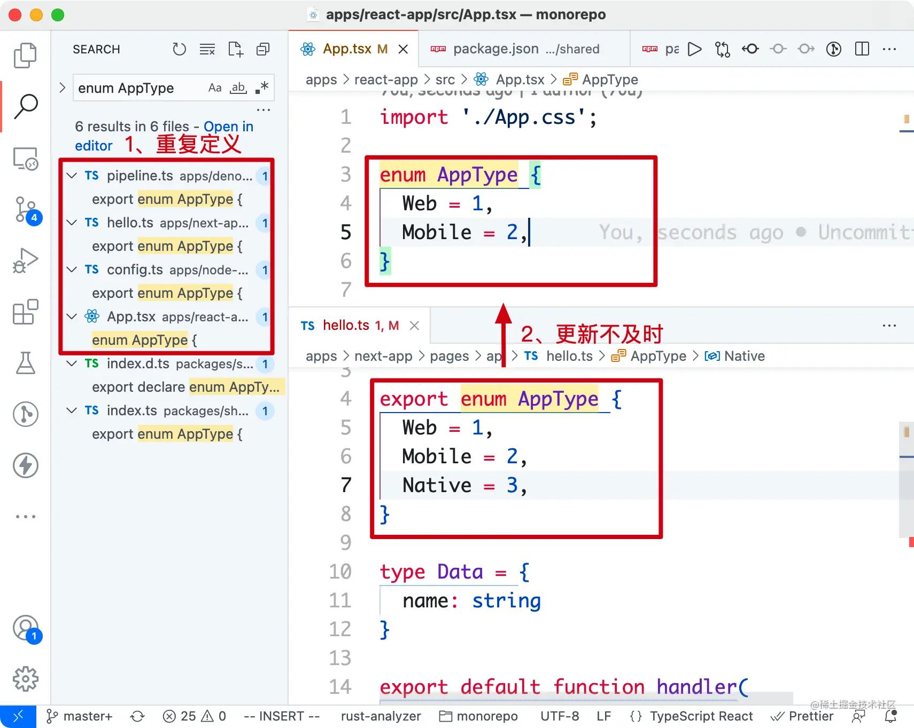

- **依赖管理问题**：为解决重用问题，我们也试过将模块先发成 npm 包，但发完需要**更新**应用 package.json 中的**依赖版本**，一来一回非常折腾。
- **跨项目使用问题**：同构就是指 **模块同时跑在前后端项目**，兼容不同的**模块包规范**（CommonJS、ESM 等）。如果没有很好的设计包结构，经常会在项目**编译打包时报错 ❌**。

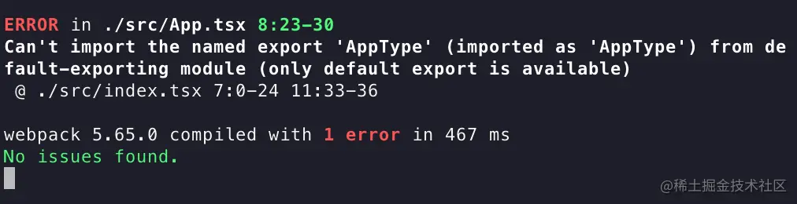

# 有哪些类型的模块包？

由于历史原因，JavaScript 模块化系统一直没有统一规范，大致发展过程是：CJS → AMD → CMD → UMD → ESM，这给设计一个**跨应用使用的模块**带来不少麻烦。

在设计模块包之前，有必要先了解下目前主流的模块类型和规范（esm、cjs、umd）。

| 模块类型/格式/规范                                                                                                                         | 描述                                                                                                                                                                         | 导出语法 | 使用语法 | 备注 |
| ------------------------------------------------------------------------------------------------------------------------------------------ | ---------------------------------------------------------------------------------------------------------------------------------------------------------------------------- | -------- | -------- | ---- |
| [esm（ES Modules）](https://link.juejin.cn?target=https%3A%2F%2Fdeveloper.mozilla.org%2Fen-US%2Fdocs%2FWeb%2FJavaScript%2FGuide%2FModules) | JavaScript 官方的标准化模块系统（[草案](https://link.juejin.cn?target=https%3A%2F%2Ftc39.es%2Fecma262%2F%23sec-modules)），在标准化道路上花了近 10 年时间。适用于：- Browser |          |          |      |

- Node.js ≥ [12.17](https://link.juejin.cn?target=https%3A%2F%2Fgithub.com%2Fnodejs%2Fnode%2Freleases%2Ftag%2Fv12.17.0) | **export default** fooexport const foo = 1;export { bar as foo } from '' | **import** foo **from** 'name'import { foo } from 'name'import { foo as bar } from 'name' | - JS 标准，优先考虑使用该模块
- Tree Shaking 友好 | | [cjs（CommonJS）](https://link.juejin.cn?target=https%3A%2F%2Fwww.wikiwand.com%2Fen%2FCommonJS) | Node.js 的模块标准，文件即模块。适用于：- Node.js | module.exports = foo**exports**.foo = 1; | const foo = **require**('name');const { foo } = require('name'); | - 对 Tree Shaking 不友好
- 前端也可以使用 cjs 格式，依靠构建工具（webpack / rollup 等） | | [umd（Universal Module Definition）](https://link.juejin.cn?target=https%3A%2F%2Fgithub.com%2Fumdjs%2Fumd) | umd 严格意义上**不算规范**，只是社区出的通用包模块结合体的**格式**，兼容 CJS 和 AMD 格式。浏览器端用来挂载全局变量 （如：`window.*`）适用于：- Browser（**external 场景**）
- Node.js（较少） | (function (root, factory) {if (// amd) {} else if (//cjs) {} else (//global) {}})(this, function() {}) | window.Reactwindow.ReactDOM$ | |

通过上面模块的对比，对于**现阶段**选择模块**规范**的**最佳实践**是：

- 共享配置模块（跨前后端）：同时打出 **ESM**、**CJS** 格式的包（目前 Node.js 运行时对 ESM 支持不是很好）
- UI 组件库：同时打出 **ESM**、**CJS**、**UMD**（umd 主要是为了让前端项目可以做 external，减少构建时长）
- 面向 Node.js 项目：目前只需要打出 CJS 格式

# package.json 模块声明

如果模块设计是一门艺术，`package.json` 就是这门艺术的**说明书**！在实际开发过程中，有不少开发者并不能正确配置 package.json。

## 基础信息

大部分字段来源于 [npm 官方](https://link.juejin.cn?target=https%3A%2F%2Fdocs.npmjs.com%2Fcli%2Fv8%2Fconfiguring-npm%2Fpackage-json) 的定义，描述一个包的基础信息：

```perl
// package.json
{
    // 包名（示例：import {} from 'your-lib'）
    "name": "your-lib",
    "version": "1.0.0",
    "description": "一句话介绍你的包",
    // 发布到 npm 上的目录，不同于 `.npmignore` 黑名单，`files` 是白名单
    "files": ["dist", "es", "lib"],
    // 安全神器，不发到 npm 上
    "private": true,

    /**
     * 包依赖
     */
    // 运行时依赖，包消费者会安装的依赖
    "dependencies": {
        "lodash": "^4.17.21",
        // ❌ "webpack": "^5.0.0",
        // ❌ "react": "^17.0.0" 不推荐将 react 写进依赖
    },
    "peerDependencies": {
       "react": "^16.0.0 || ^17.0.0",
       "react-dom": "^16.0.0 || ^17.0.0"
    },
    // 开发时依赖，使用方不会安装到，只为包开发者服务
    "devDependencies": {
        "rollup": "^2.60.2",
        "eslint": "^8.5.0",
        "react": "^16.0.0",
        "react-dom": "^16.0.0"
    }
}

```

这里要注意的点：

### version

遵循 [semver](https://link.juejin.cn?target=https%3A%2F%2Fdocs.npmjs.com%2Fabout-semantic-versioning%2F) 语义化版本（[验证小工具](https://link.juejin.cn?target=https%3A%2F%2Fsemver.npmjs.com%2F)），格式一般为 `{major}.{minor}.{patch}`。

- `major`：大功能/特性更新、对用户使用方式**有影响**；
- `minor`：新功能、对用户使用方式**无影响**；
- `patch`：bug 修复/不影响用户

我们来看几个**易错**的例子：

- 发 alpha/beta 版，1.0.1 版本已发布，发下一个 beta 版：
  - ❌ 发 1.0.1-beta.1
  - ✅ 发 1.0.2-beta.1
- **^0.x.y** 版本匹配问题。例如：用户配置 `"^0.9.0"`，匹配不了 0.10.0 版本（如下图）。建议正式版从 1.x 开始发版。

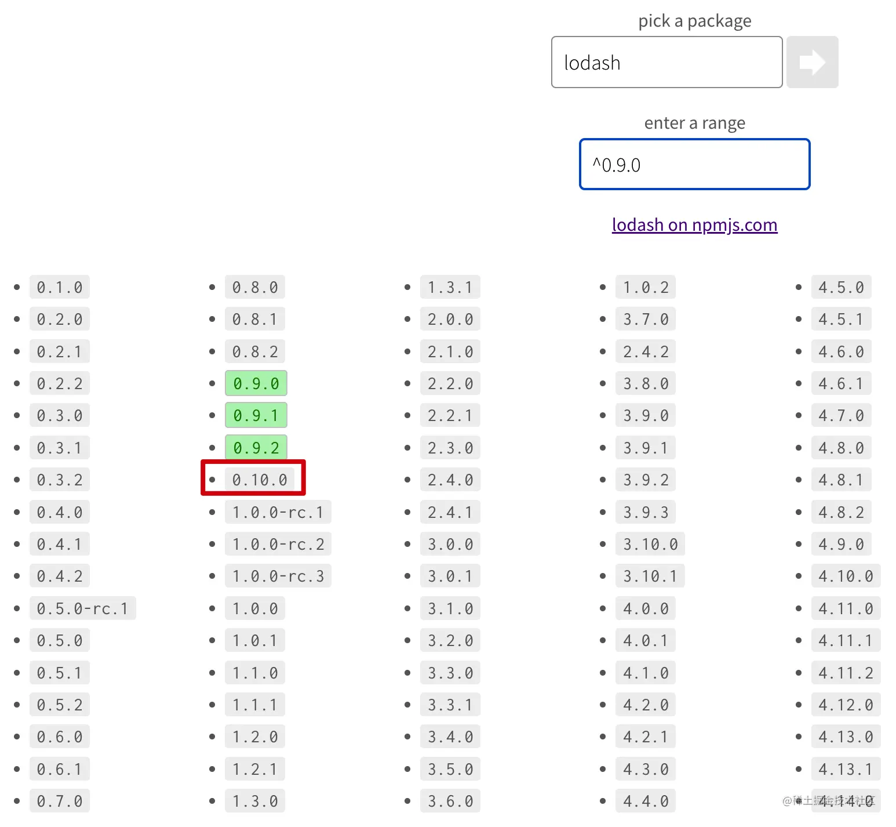

### dependencies, devDependencies, peerDependencies

模块包的依赖，很多模块开发者容易写错的地方。这里用 生产者 表示 模块包开发者，消费者 表示使用模块包的应用

- `dependencies`：**运行时依赖**，模块消费者会安装这里的依赖。不推荐的配置：
  - ❌ "webpack": "^5.0.0"，消费者会安装 webpack，除非这个模块包揽 webpack 功能不需要应用安装
  - ❌ "react": "^17.0.0"，消费者安装 react 依赖，可能带来 React 多实例问题
- `devDependencies`：**开发时依赖**，消费者不会安装，只为生产者服务。例如：
  - ✅ "rollup": "^2.60.2"
  - ✅ "webpack": "^5.0.0"
  - ✅ "react": "^17.0.0"
- `peerDependencies`：**宿主依赖**，指定了当前模块包在**使用前**需要**安装的依赖**，这个配置争议比较大，npm 7 后会默认自动安装依赖，而 pnpm、yarn 目前不会。
  - ✅ "react": "^16.0.0 || ^17.0.0"

### private

不发布的包，记得设置为 `true`，避免误操作 `npm publish` 发到外网造成安全问题。

```kotlin
# packages/private/package.json
{
  "private": true
}
$ npm publish
npm ERR! code EPRIVATE
npm ERR! This package has been marked as private
npm ERR! Remove the 'private' field from the package.json to publish it.

```

## 模块类型

声明当前包属于哪种模块格式（cjs、esm），不同条件加载不同的模块类型，类型的配置字段源于：

- [npm 规范](https://link.juejin.cn?target=https%3A%2F%2Fdocs.npmjs.com%2Fcli%2Fv8%2Fconfiguring-npm%2Fpackage-json%23main)
- [Node.js 官方模块加载规范](https://link.juejin.cn?target=https%3A%2F%2Fnodejs.org%2Fdocs%2Flatest-v13.x%2Fapi%2Fesm.html%23esm_enabling)
- [Package Exports](https://link.juejin.cn?target=https%3A%2F%2Fwebpack.js.org%2Fguides%2Fpackage-exports%2F)

### 单入口（main, module, browser）

如果是单入口包，始终从包名导出 `import from 'your-lib'`，可以按如下配置：

```json
{
  // -----单入口----
  // 入口文件（使用 cjs 规范）
  "main": "lib/index.js",
  // 入口文件（使用 esm 规范）
  "module": "es/index.js",
  // 包类型导出
  "typings": "typings/index.d.ts",
  // 浏览器入口
  "browser": "dist/index.js",
  "sideEffects": false
}
```

参数说明：

- `main`：cjs 格式的入口文件
- `module`：esm 格式的入口文件
- `browser`：浏览器端使用，配置成 umd 格式（webpack < 5 会优先使用 `browser`）
- `sideEffects`：副作用配置，主要用在 Tree Shaking 场景，设置成 `false` 则告诉打包工具大胆进行 Tree Shaking。

### 多入口（exports, browser）

多入口包，例如 `import from 'your-lib/react'`、`import from 'your-lib/vue'`，推荐配置：

```json
{
  // ----多入口---
  "exports": {
    "./react": {
      "import": "dist/react/index.js",
      "require": "dist/react/index.cjs"
    },
    "./vue": {
      "import": "dist/vue/index.js",
      "require": "dist/vue/index.cjs"
    }
  },
  "browser": {
    "./react": "dist/react/index.js",
    "./vue": "dist/vue/index.js"
  },
  "sideEffects": false
}
```

参数说明：

- `exports`：Node.js 提出的模块导出[提案](https://link.juejin.cn?target=https%3A%2F%2Fgithub.com%2Fjkrems%2Fproposal-pkg-exports%2F)，好处是可以定义导出的模块路径，支持不同环境（Node.js、浏览器等）下使用不同格式（esm、cjs）的包
- `browser` 和 `sideEffects` 含义同上

---

对 package.json 了解后，开始从常见的模块包看下如何进行设计。

# 怎样设计模块包？

初始化一个 Monorepo 示例项目（包含 apps 和 packages），目录结构如下（其中 apps 包含常见的应用类型）：

```markdown
- apps（前端、后端）
  - deno-app
  - next-app
  - node-app
  - react-app
  - umi-app
  - vite-app
  - vite-react-app
- packages（模块包）
  - shared （共享配置模块）
    - configs
      - tsconfig.base.json
    - types
    - utils
      - index.ts
    - package.json
  - ui（组件库）
    - react
    - vue
    - package.json
  - native（Rust/C++ 原生模块编译成 npm，用在 Node.js）
    - src
      - lib.rs
    - package.json
- .npmrc
- package.json
- pnpm-workspace.yaml
```

每个模块包的设计按照下面的步骤展开介绍：

1. 应用中如何使用？
2. 怎么构建？
3. 怎么配 package.json
4. 效果展示

## 共享配置模块（packages/shared）

现在要解决枚举、配置、工具方法的复用，希望同时在所有项目中可使用

### 使用方式

应用中的使用如下：

1. 项目中声明模块的依赖，`workspace:*` 表示使用当前 Monorepo 的 shared 模块包

```less
// apps/*/package.json
{
  "dependencies": {
     "@infras/shared": "workspace:*"
  }
}

```

> 为了更方便地调试 Monorepo 包模块，这里我们使用 [pnpm workspace 协议](https://link.juejin.cn?target=https%3A%2F%2Fpnpm.io%2Fworkspaces%23workspace-protocol-workspace)（同时 [yarn](https://link.juejin.cn?target=https%3A%2F%2Fyarnpkg.com%2Ffeatures%2Fworkspaces%23publishing-workspaces) 也支持了这一协议）。

1. 在项目中使用 `import` 引 esm 格式、`require` 引 cjs 格式、常用的项目配置 `tsconfig.json`

```javascript
// apps/*/index.{ts,tsx,jsx}
import { AppType } from '@infras/shared/types';
import { sum } from '@infras/shared/utils';

console.log(AppType.Web); // 1
console.log(sum(1, 1));   // 2

// apps/*/index.js
const { AppType } = require('@infras/shared/types');
const { sum } = require('@infras/shared/utils');

// apps/*/tsconfig.json
{
 "extends": "@infras/shared/configs/tsconfig.base.json"
}

```

### 构建出 esm、cjs 格式

上文讲到过，我们最后同时打出 esm 和 cjs 格式的包，这样使用方可以按需取用。那么，我们应该用哪个构建工具呢？

这里可选的编译/打包工具：

- Transformer（编译）：babeljs、TypeScript、esbuild
- Bundler（打包）：Rollup、esbuild、webpack、tsup、unbuild

> 两者区别：编译（a → a'、b → b'）、打包（ab → c，All in One）

经过实践，这里选择 [tsup](https://link.juejin.cn?target=https%3A%2F%2Fgithub.com%2Fegoist%2Ftsup)，可以快速的、方便的、开箱即用的构建出 esm、cjs 格式的包，同时还有类型。

> 用 tsup 不用 tsc/rollup/babel 的原因：共享配置模块其实只需要 tsc 就可以解决，用不上 rollup 丰富的生态，工具配置多又麻烦。还有一点是编译打包速度上 tsup 更快。

打包配置 `tsup.config.ts` 如下：

```php
// packages/shared/tsup.config.ts
import { defineConfig } from 'tsup';

export default defineConfig({
  entry: ['utils/index.ts', "types/index.ts"],
  clean: true,
  dts: true,
  outDir: "dist",
  format: ['cjs', 'esm']
});

```

执行下 `tsup` 会生成 `dist` 目录，结构如下：

```markdown
# packages/shared

- dist
  - utils
    - index.js（cjs）
    - index.mjs（esm）
  - types
    - index.js
    - index.mjs
- utils
- types
- package.json
```

注：不将多入口 utils、types 目录放到 src 目的是为了在 Monorepo 项目中有更好的 TS 类型支持！实际是用了障眼法，将类型提示指向源文件 ts，真正使用的是 dist 产物目录，比如：

- shared
  - dist
    - react
      - index.js（应用构建加载的入口）
  - react
    - index.ts（编辑器类型提示的入口）

### package.json

通用模块包的 package.json 如下，因为是**多入口**，这里用 `exports` 、`browser`的组合导出了 **cjs 和 esm** 格式包。

```ruby
// packages/shared/package.json
{
  "name": "@infras/shared",
  "version": "0.0.1",
  "description": "An infrastructure monorepo shared library for all projects and apps.",
  "browser": {
    "./types": "./dist/types/index.mjs",
    "./utils": "./dist/utils/index.mjs"
  },
  "exports": {
    "./types": {
      "import": "./dist/types/index.mjs",
      "require": "./dist/types/index.js"
    },
    "./utils": {
      "import": "./dist/utils/index.mjs",
      "require": "./dist/utils/index.js"
    }
  },
  "scripts": {
    "prepare": "npm run build",
    "dev": "tsup --watch",
    "build": "tsup"
  },
  "devDependencies": {
    "tsup": "^5.10.3"
  }
}

```

- `scripts.prepare`：给模块包加上 [prepare](https://link.juejin.cn?target=https%3A%2F%2Fdocs.npmjs.com%2Fcli%2Fv8%2Fusing-npm%2Fscripts%23life-cycle-scripts) 构建脚本后，执行的时机包括：
  - 发布前编译（相当于 `prepublishOnly`）
  - **本地** **npm** **install** 会执行（不同于 `postinstall` 在任何时候 install 都会执行，会造成消费者 install 时 `tsup` 依赖不存在报错）

> 同时在使用 `pnpm publish` 发包的时候会移除 `scripts.prepare`（[源码实现](https://link.juejin.cn?target=https%3A%2F%2Fgithub.com%2Fpnpm%2Fpnpm%2Fblob%2Ff5e732e289c9f34c399394a9bb2254d9c96bfd29%2Fpackages%2Fexportable-manifest%2Fsrc%2Findex.ts%23L42)）

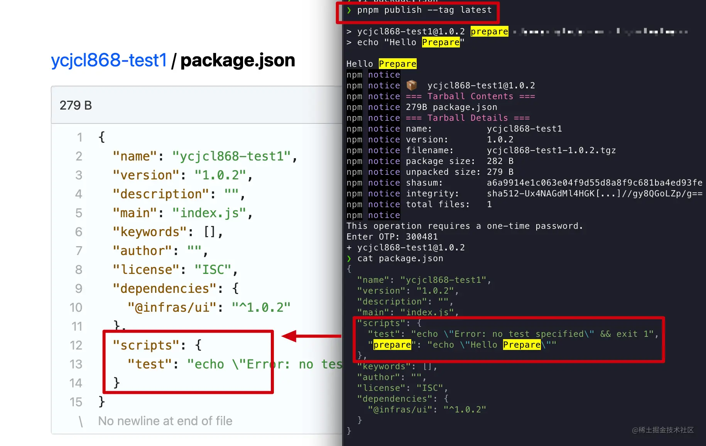

### 运行

在前端项目中使用：`pnpm start --filter "react-app"`

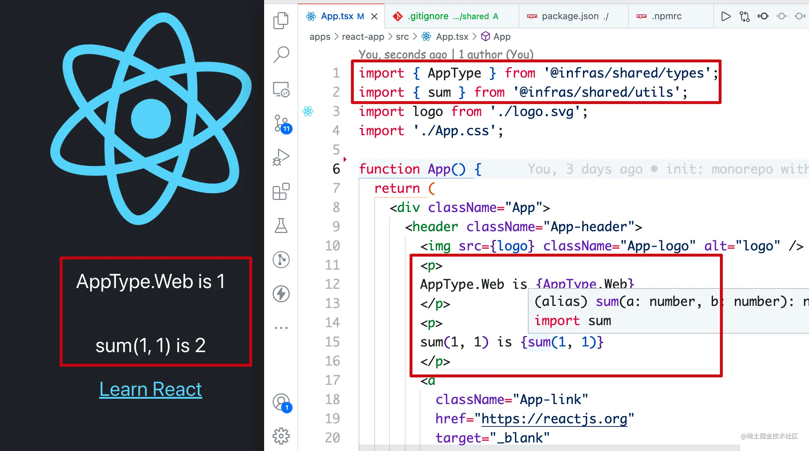

在 Node.js 项目中使用 `pnpm start --filter "node-app"`：

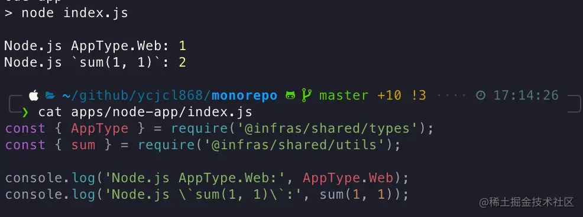

Vite 中使用 `pnpm start --filter "vite-app" `：


## 组件库 UI 模块（packages/ui）

在 Monorepo 微前端组织架构下，组件库复用的场景可以有效提升研发效率。

### 使用方式

应用/项目引入方式如下：

1. 项目中声明模块的依赖，`workspace:*` 表示使用当前 Monorepo 的 ui 模块包，若不是 Vite 应用需要配置下 ` dependenciesMeta['``@infras/ui'].``injected: true `

```json
// apps/*/package.json
{
  "dependencies": {
    "@infras/ui": "workspace:*"
  },
  // 非 Vite 应用
  "dependenciesMeta": {
    "@infras/ui": {
      "injected": true
    }
  }
}
```

#### dependenciesMeta 起因

这里有 **dependenciesMeta** 配置非常有意思，源于 pnpm（≥ 6.20）用来解决 Monorepo 下 React 多版本实例导致的 **Invalid hook call** 问题。

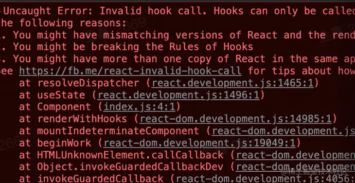

问题的原因在于：UI 组件库 `devDependencies` 中的 React 版本和 应用 中的 React 版本不一致，如下引用结构，应用使用的是 React@17，而组件库使用的是 React@16。（issues：[react#13991](https://link.juejin.cn?target=https%3A%2F%2Fgithub.com%2Ffacebook%2Freact%2Fissues%2F13991%23issuecomment-435343455)、[pnpm#3558](https://link.juejin.cn?target=https%3A%2F%2Fgithub.com%2Fpnpm%2Fpnpm%2Fissues%2F3558%23issuecomment-883037179)、[rushstack#2820](https://link.juejin.cn?target=https%3A%2F%2Fgithub.com%2Fmicrosoft%2Frushstack%2Fissues%2F2820%23issuecomment-883896316)、[组件多实例问题](https://link.juejin.cn?target=https%3A%2F%2Fblog.csdn.net%2Fqq_21567385%2Farticle%2Fdetails%2F121088506) 等）：

```sql
--- react-app
 |  |- react@17.0.0
 |- @infras/ui
 |  |- react@16.0.0 <- devDependencies

```

在此之前，要解决这个问题，之前有两种方案：

- 指定 react 版本，前端应用层在打包构建时，指定具体 react 版本，强制将版本统一。
- 依赖提升，优先使用最新版本的 react，但应用使用版本还是有问题。（pnpm#hoist）

而 pnpm 6.20 后推出的 `dependenciesMeta` ，实际上是 UI 组件库包硬链到应用里，解决 react 组件库本地开发和 peerDependencies 的问题：

```bash
 apps
   node_modules
     @infras/ui
-      node_modules

```

1. 前端使用：分别在 React、Vue 项目中引入组件库

```javascript
// React 应用： apps/*/index.{ts,tsx,jsx}
import { Component } from '@infras/ui/react';
<Component />

// Vue 应用： apps/*/index.vue
<script setup lang="ts">
import { Component } from '@infras/ui/vue';
</script>
<template>
    <Component />
</template>

```

> 对于不同前端框架的组件，**不建议从一个入口导出**（即 `import { ReactC, VueC } from 'ui'`），这样会给应用的按需编译带来很大的麻烦！

1. 组件服务端渲染

```javascript
// apps/node-app/index.js
const { Component } = require('@infras/ui/react')
const React = require('react')
const ReactDOMServer = require('react-dom/server')
console.log(
  'SSR: ',
  ReactDOMServer.renderToString(React.createElement(Component))
)
```

为了同时构建 **React、Vue 组件库模块**，包目录设计大致如下：

```markdown
# packages/ui

- react
  - Component.tsx
  - index.ts
- vue
  - Component.vue
  - index.ts
- package.json
```

### 构建出 esm、cjs、umd

> 问个小问题：一般大型组件库需要构建出 cjs 格式，面向场景是什么？

选择 **Rollup** 来同时打包 React、Vue 组件库，需要有几点注意：

- 配置包格式为 **esm**、**cjs**、**umd**
- external 掉 react、react-dom、vue，组件库不建议将框架 React、Vue 打包进去

rollup 配置如下：

```php
// packages/ui/rollup.config.js
import { defineConfig } from 'rollup';
...

export default defineConfig([
  {
    input: 'react/index.tsx',
    external: ['react', 'react-dom'],
    plugins: [...],
    output: [
      {
        name,
        file: './dist/react/index.js',
        format: 'umd',
        globals: {
          react: 'React',
          'react-dom': 'ReactDOM'
        }
      },
      {
        name,
        file: './es/react/index.js',
        format: 'es',
      },
      {
        name,
        file: './lib/react/index.cjs',
        format: 'commonjs',
      }
    ]
  },
  {
    input: 'vue/index.ts',
    external: ['vue'],
    plugins: [...]
    output: [
      {
        name,
        file: './dist/vue/index.js',
        format: 'umd',
        globals: {
          vue: 'vue',
        }
      },
      {
        name,
        file: './es/vue/index.js',
        format: 'es',
      },
      {
        name,
        file: './lib/vue/index.cjs',
        format: 'commonjs',
      }
    ]
  }
])

```

执行 `rollup --config rollup.config.js` 后，就会生成 `dist` 、`es`、`lib`目录：

```markdown
# packages/ui

- dist
  - react
  - vue
- es
  - react
  - vue
- lib
  - react
  - vue
- react
- vue
- package.json
```

### package.json

组件库的 package.json 同样是**多入口**，和通用模块一样使用 `exports` 的组合导出了 **cjs、esm、umd** 格式包。

```perl
{
  "name": "@infras/ui",
  "version": "1.0.0",
  "description": "An infrastructure monorepo ui library for all front-end apps.",
  "browser": {
    "./react": "./es/react/index.js",
    "./vue": "./es/vue/index.js"
  },
  "exports": {
    "./react": {
      "import": "./es/react/index.js",
      "require": "./lib/react/index.cjs",
      "default": "./dist/react/index.js"
    },
    "./vue": {
      "import": "./es/vue/index.js",
      "require": "./lib/vue/index.cjs",
      "default": "./dist/vue/index.js"
    }
  },
  "scripts": {
    "start": "npm run dev",
    "dev": "rollup --config rollup.config.js --watch",
    "build": "rollup --config rollup.config.js",
    "prepare": "npm run build",
    "prepublishOnly": "npm run build"
  },
  "peerDependencies": {
    "react": "^16.0.0 || ^17.0.0",
    "react-dom": "^16.0.0 || ^17.0.0",
    "vue": "^3.0.0"
  },
  "devDependencies": {
    "typescript": "^4.5.2",
    "@babel/...": "",
    "rollup/...": "^2.60.2"
  }
}

```

组件库在 package.json 声明有一点**特别**要**注意**：

- 组件库增加 **browser** 配置，不然在 webpack ≤ 4 会出现 `Module not found: Error: Can't resolve '模块名'` 的报错

```json
{
+ "browser": {
+   "./react": "./es/react/index.js",
+   "./vue": "./es/vue/index.js"
+ },
}

```

原因：Webpack 5 以下不支持 `exports` 配置 [webpack#9509](https://link.juejin.cn?target=https%3A%2F%2Fgithub.com%2Fwebpack%2Fwebpack%2Fissues%2F9509)。 Webpack 4 优先走 `browser`，而 Webpack 5 优先走 `exports`。

### 运行

启动 React 应用（`pnpm start --filter "react-app"`）：

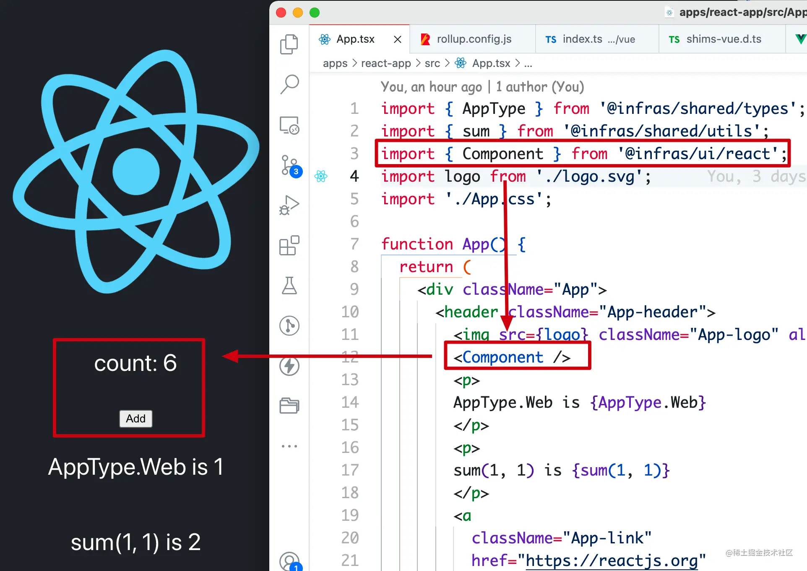

启动 Vue 应用（`pnpm start --filter "vite-app"`）：

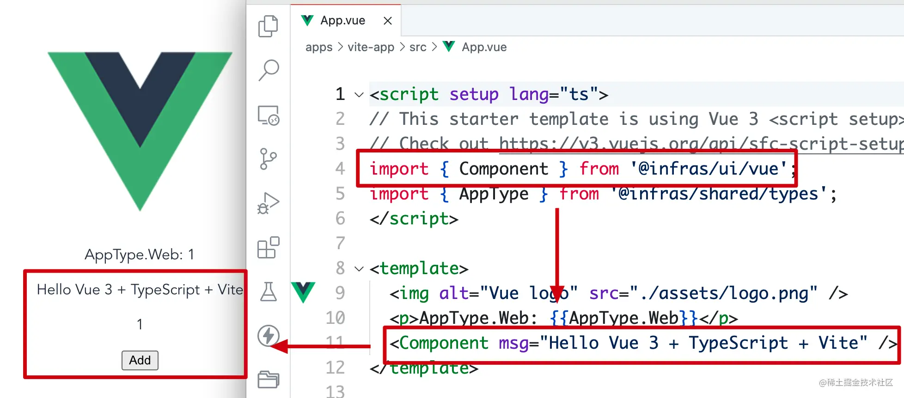

服务端渲染（`pnpm start --filter "node-app"`）：

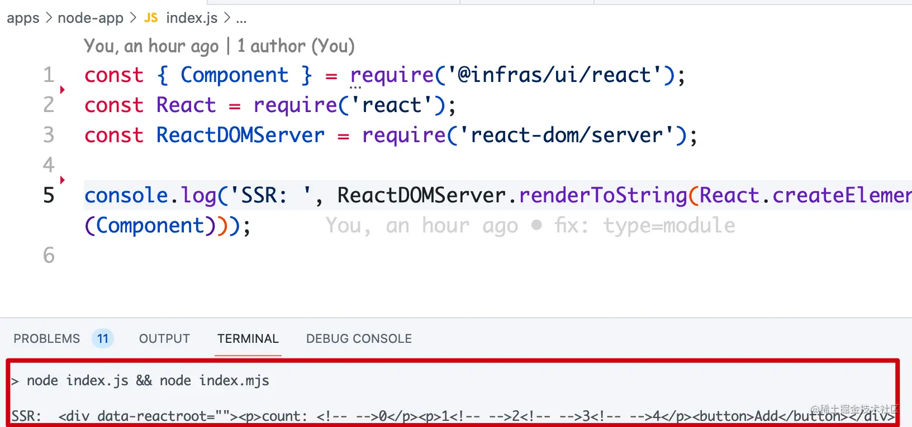

## 原生语言模块（packages/native）

有趣的是，我们可以在 Monorepo 中使用 Rust / Golang 编写的 npm 包模块，处理一些 CPU 密集型任务。

### 使用方式

在 Node.js 应用的使用方式如下：

1. 项目中声明原生语言模块的依赖

```less
// apps/node-app/package.json
{
  "dependencies": {
     "@infras/rs": "workspace:*"
  {
}

```

1. Node.js 中调用：

```javascript
// apps/node-app/index.js
const { sum } = require('@infras/rs')
console.log('Rust `sum(1, 1)`:', sum(1, 1)) // 2
// apps/node-app/index.mjs
import { sum } from '@infras/rs'
```

### 构建出 cjs

这里使用 [napi-rs](https://link.juejin.cn?target=https%3A%2F%2Fgithub.com%2Fnapi-rs%2Fnapi-rs) 初始化一个 Rust 构建的 npm 模块包，napi-rs 并没有构建出 esm 格式的包，而是选择用 cjs 格式来兼容 esm（相关 [node#40541](https://link.juejin.cn?target=https%3A%2F%2Fgithub.com%2Fnodejs%2Fnode%2Fissues%2F40541%23issuecomment-964303018)）

```markdown
# packages/rs

- src
  - lib.rs
- npm
- index.js
- index.d.ts
- package.json
- Cargo.toml
```

### package.json

直接使用 napi-rs 初始化出来的 package.json，无须进行修改即可使用。

```perl
{
  "name": "@infras/rs",
  "version": "0.0.0",
  "type": "commonjs",
  "main": "index.js",
  "types": "index.d.ts",
  "devDependencies": {
    "@napi-rs/cli": "^2.0.0"
  },
  "scripts": {
    "prepare": "npm run build",
    "artifacts": "napi artifacts",
    "build": "napi build --platform --release",
    "build:debug": "napi build --platform",
    "version": "napi version"
  }
}

```

### 运行

Node 项目中 `pnpm start --filter "node-app"`，这样看 Rust 编译后的函数执行效率比 Node.js 原生快不少（**8.44** **ms** → **0.069ms**）

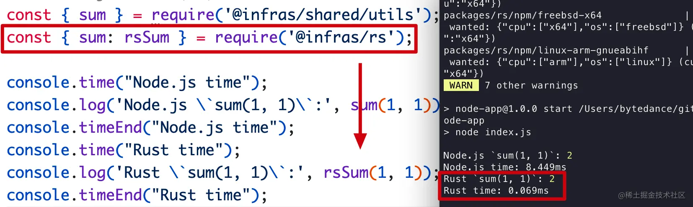

# 发布模块包

如果有发包需求，可以有以下两种方式：

## 命令行发布

将 Monorepo 非 `private: true` 的模块包发到 npm 源上，最简单的方式是执行 `publish` 命令。

```css
$ pnpm -r publish --tag latest

```

如果想增加包发布的 changelog，可以参考 [using-changesets](https://link.juejin.cn?target=https%3A%2F%2Fpnpm.io%2Fusing-changesets)
