# webpack配置总结 

webpack-cli 命令

:::note

--watch  监听webpack.config.js

--c

--o

:::

安装webpack: 

::: code-tabs

  @tab yarn 

```bash
yarn add webpack webpack-cli --dev
```

  @tab npm

```bash
npm install webpack webpack-cli -D
```

  :::

运行 `npx webpack` 的时候他默认会去找src下面的index.js文件作为入口文件，我们创建一个**hello.js**然后运行webpack指令`npx webpack`,他会通过入口文件解析依赖给我们打包出一个dist文件夹，这个文件夹就是存放编译之后的js文件的

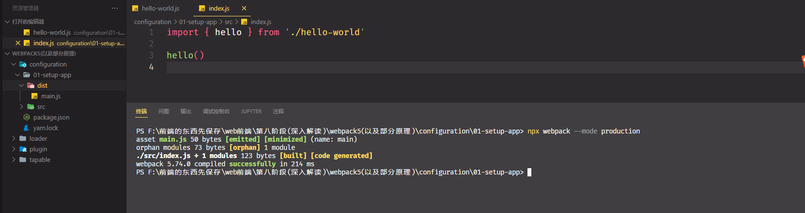

::: note

webpack默认会打包到dist/main.js下面

:::

我们也可以改变他的打包入口和输出位置,我们需要创建**webpack.config.js**文件

```javascript
const path = require('path')

module.exports = {
   entry: './src/index.js', // 文件的打包入口

  output: {
    filename: 'bundle.js', // 输出的文件
    path: path.join(__dirname, 'dist'), // 输出的文件夹
    clean: true,  // 清除上一次遗留的缓存
  },
}
```


## 一、基础配置

> 我们需要在打包的项目下面创建一个配置文件**webpack.config.js**

### 1.HtmlWebpackPlugin

> 这是我们学习的第一个插件，首先我们要按照**HtmlWebpackPlugin**这个插件然后注入到webpack的配置中去

```javascript
const path = require('path')
const HtmlWebpackPlugin = require('html-webpack-plugin')

module.exports = {
....
  mode: 'development', // 如果设置为production html文件会被压缩
  plugins: [
      new HtmlWebpackPlugin({
      template: path.join(__dirname, 'index.html'),
      filename: 'app.[contenthash:5].html', //输出的文件名
      title: '小蔡不菜', // 设置html 的title
      inject: 'body', // 设置js标签的插入位置
    }),
  ],
....
}
```

**title要通过ejs语法注入到html模板才可以**

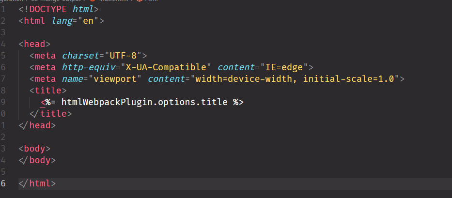

### 2 mode

> 此选项用于配置当前的开发环境 有两个可选值 production，development

- 配置development的时候代码无法准确定位代码位置

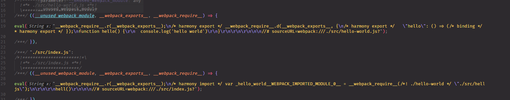

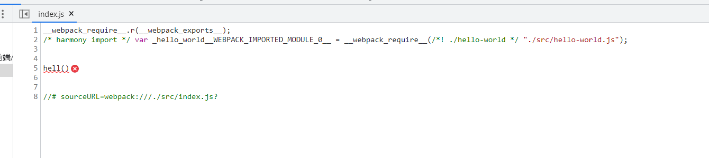

```javascript
module.exports = {
    ....
     mode: 'development', // production development
    ....
}
```

### 3.  devtool

- 可以设置source-map的类型  用来定位错误

 ```javascript
module.exports = {
    ....
       devtool: 'inline-source-map',
    ....
}
 ```

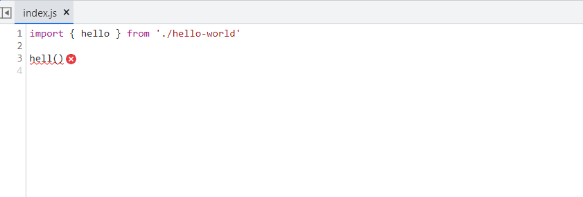

> 配置完之后错误定位正确!!!!

### 4.webpack-dev-server

`webpack-dev-server为我们提供了一个基本的web 服务，并且具有实时重载功能

> 安装：`yarn add --dev webpack-dev-server`

```javascript
module.exports = {
    ....
    devServer: {...options},
    ....
}
```

运行` npx  webpack server`

### 5.assetMoudle

- asset/resource  发送一个单独的文件并导出 URL。之前通过使用 `file-loader` 实现。

- asset/inline 导出一个资源的 base64的urlI。之前通过使用 `url-loader` 实现。
- asset/source 出资源的源代码。之前通过使用 `raw-loader` 实现。
- asset  在导出一个 data URI 和发送一个单独的文件之间自动选择。之前通过使用 `url-loader`，并且配置资源体积限制实现。

```javascript
// 配置资源模块
 module: {
   output: {
    assetModuleFilename: 'images/[contenthash:5][ext]', // 配置资源文件的输出的文件夹 1
  },

    rules: [
      { 
       test: /\.png$/,
       type: 'asset/resource'， 
       generator: {
         // 配置资源文件的输出的文件夹 2 这种方式优先级高
          filename: 'images/[contenthash:7][ext]', 
        }, 
       },
    ],
  },
```

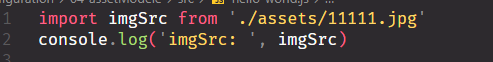

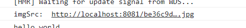

```javascript
// 通用 配置
.....
module: {
    rules: [
      {
        test: /\.jpg$/,
        type: 'asset',
        parser: {
          dataUrlCondition: {
            maxSize: 1024,
          },
        },
      },
    ],
  },
.....
```

### 6.loader

因为webpack默认只支持打包js 而不支持其他格式模块文件，如果要打包其他格式文件的话需要引入特定loader 来进行预解析

#### 6.1 处理css

处理css需要配置两个loader 

- style-loader  用来将解析后的css数据注入到style标签里面去  **优先级高**
- css-loader 用来解析css文件
- less-loader  用来解析less文件

```javascript
....
  module: {
    rules: [
      {
        test: /\.(css|less)$/,
        use: ['style-loader', 'css-loader', 'less-loader'],
      },
    ],
  }
....
```

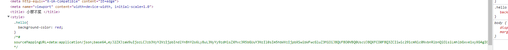

#### 6.2 抽离和压缩css


抽离css到单独文件我们需要依赖一个插件

> npm i -D **`mini-css-extract-plugin`**

压缩我需要安装

> npm i -D **`css-minimizer-webpack-plugin`**

```javascript
 mode: 'production', // 要开启压缩必须要生成环境下面才行  
 plugins: [
    new MiniCssExtractPlugin({ filename: 'styles/[contenthash:5].[name].css' }),
  ],
  module: {
    rules: [
      {
        test: /\.(css|less)$/,
        use: [MiniCssExtractPlugin.loader, 'css-loader', 'less-loader'],
      },
    ],
  },
   optimization: {
    minimizer: [new CssMiniMizerWebapcPlugin()],
  },
      
```

#### 6.3 加载字体

```javascript
  module: {
    rules: [
      {
        test: /\.(woff|woff2|eot|ttf|otf)$/,
        type: 'asset/resource',
      },
    ],
  }
```

#### 6.4解析json模块

```javascript
  module: {
    rules: [
      {
        test: /\.yaml$/,
        type: 'json',
        parser: {
          parse: yaml.parse,
        },
      },
    ],
  }
```

####  6.5 babel-loader

babel-loader的左右主要是做语法降级，语法兼容人低版本浏览器也可以支持高版本语法

> npm i -D  **`babel-loader @babel/core @babel/preset-env`**

- babel-loader：在webpack里应用babel解析ES6语法
- @babel/core：babel的核心模块 用来加载babel配置的
- @babel/preset-env：babel预设 ，一堆补丁集合,相当于每一个新语法需要一个补丁，babel帮我们把补丁集成到一起

在webpack 中，需要引入babel-loader

```javascript
 module: {
    rules: [
      {
        test: /\.js$/,
        use: {
          loader: 'babel-loader',
          options: {
            presets: ['@babel/preset-env'],
          },
        },
        exclude: [/node_moudules/],
      },
    ],
  },
```

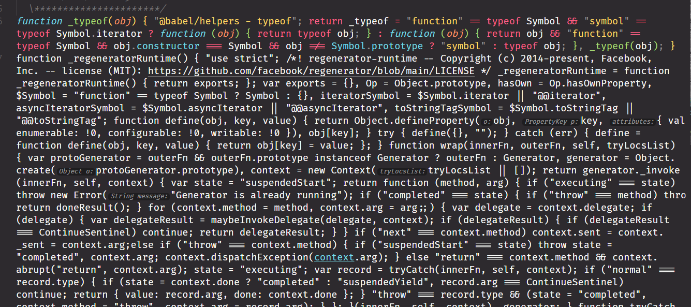

- regeneratorRuntime是webpack打包成功的全局辅助函数，由babel生成，用于兼容async语法

我们需要安装这个包

> npm install --save @babel/runtime   [详情](https://www.babeljs.cn/docs/babel-runtime)
>
> npm install --save-dev @babel/plugin-transform-runtime

```javascript
 module: {
    rules: [
      {
        test: /\.js$/,
        use: {['
              ']'']
          loader: 'babel-loader',
          options: {
            presets: ['@babel/preset-env'],
            plugins: [['@babel/plugin-transform-runtime']],
          },
        },
        exclude: [/node_modules/],
      },
    ],
  }
```


### 7.代码分离(code-spliting)

#### 7.1 入口配置

codesplit 最简单的方式就是配置多入口webpack会根据入口构建多个chunk

```javascript
....
  entry: {
    main: './src/index.js',
    other: './src/another-module.js',
  },
  output: {
    filename: '[chunkhash:5].[name].js', // 多入口要设置成多个导出
    clean: true,
  },
....
```

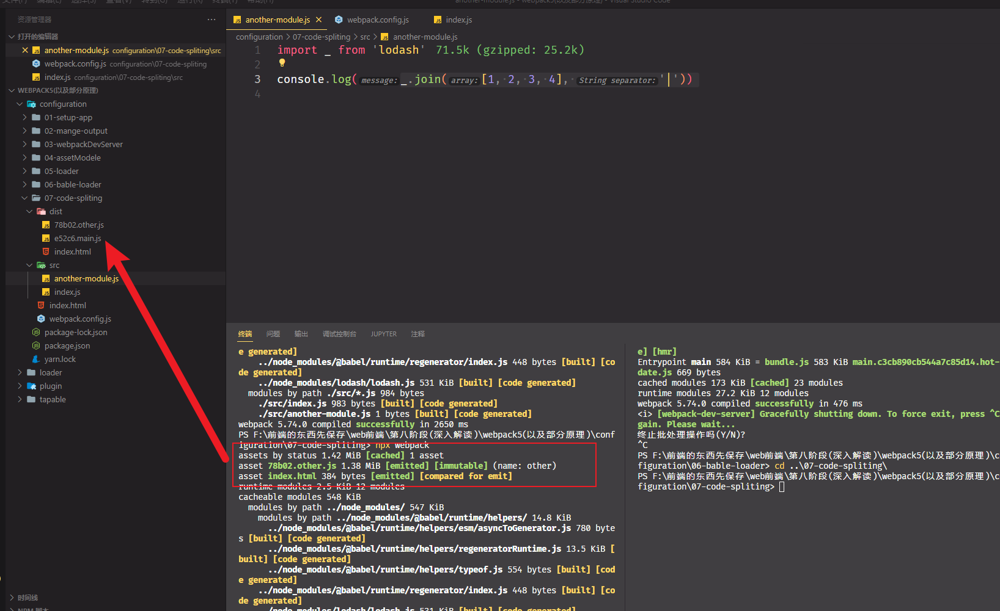

**我们从打包后的bundle可以发现两个个文件都引入了lodash，loadsh也被打包了两次，这会出现一个问题，如果多个文件同时引入一个包那么这个包会被打包好几次**

我们可以通过配置dependOn 来抽离公共模块

```javascript
 
1.第一种方式
entry: {
    main: {
      import: './src/index.js',
      dependOn: 'shared',
    },
    other: {
      import: './src/another-module.js',
      dependOn: 'shared',
    },
    shared: 'lodash', // 要抽离的公共模块
  }
    
2.第二种方式
  optimization: {
    splitChunks: {
      chunks: 'all',
    },
  },
```

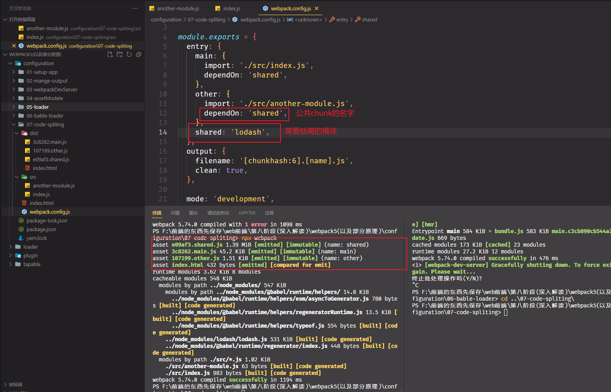

#### 7.2 动态导入

涉及到动态代码拆分的使用，我们一般使用import函数去导入模块，webpack会根据import的导入自动生成chunk

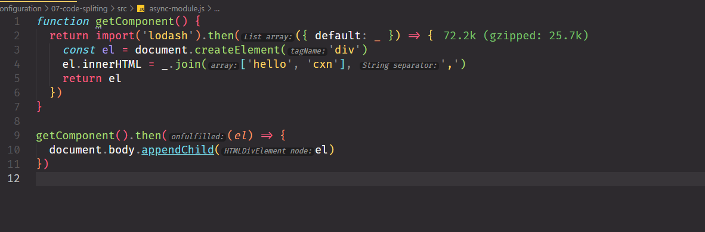

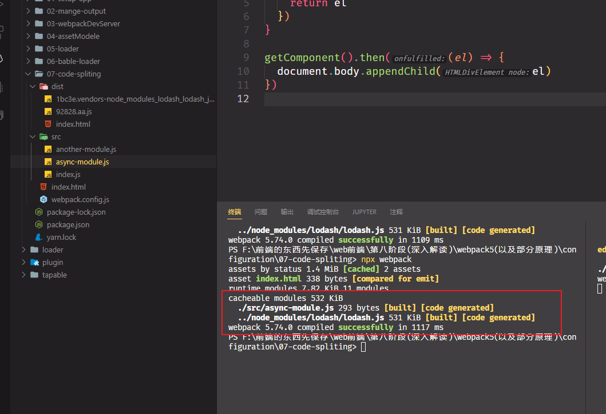

#### 7.3 懒加载

:::note

懒加载是一种很好的优化网页的方式，这种方式实际上是先把你的代码在一些逻辑断点处分离开，从而达到按需加载的目的默写代码块可能永远不会加载

:::


```javascript
//math.js
export const add = (x, y) => {
  return x + y
}


// index.js
const button = document.createElement('button')
button.textContent = '加法'
button.addEventListener('click', () => {
  import('./math.js').then(({ add }) => {
    console.log(add(5, 6))
  })
})
document.body.append(button)

```

- 当我们点击按钮的时候才会加载math.js这个文件


- 我们可以来配置两个魔法函数prefetch 预获取，preload 预加载 和 chunkname 

预获取可以让浏览器在空闲的时候引入这个文件，不会去加载主线程的执行

使用预加载的时候请求会发现状态码变为304

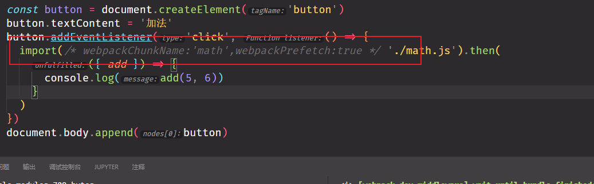

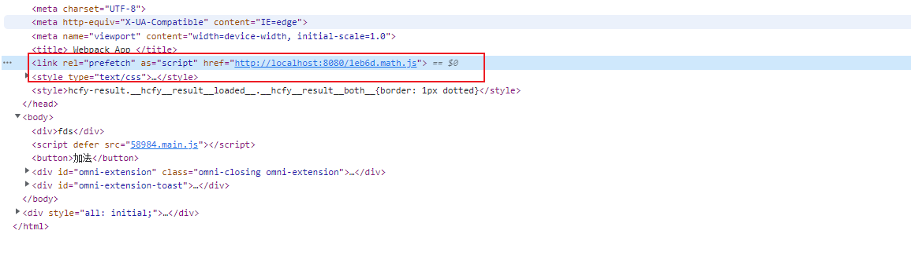


### 8.缓存

#### 8.1 hash

当我们的文件配置了chunk之后浏览器会自动缓存我们的文件

>   filename: '[chunkhash:5].[name].js',

#### 8.2 缓存第三方库

因为第三方库不像我们本地代码需要经常修改，所以我们可以对第三方代码缓存

```javascript
 optimization: {
    splitChunks: {
      // chunks: 'all',
      cacheGroups: {
        vendor: {
          test: /[\\/]node_modules[\\/]/,
          name: 'vendors',
          chunks: 'all',
        },
      },
    },
  }
```

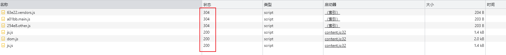

### 9 环境配置

  #### output.publicPath

配置文件基本路径也可以配置cdn路径

#### 9.1 环境变量

> 执行   npx webpack --env production|development  
>
> 或者 --env 后面跟任意键值对 key = value 也会被注入到env里面

我们要使用配置的env我们需要将webpack.config.js里面的对象设置成函数

env = *{ WEBPACK_BUNDLE: true, WEBPACK_BUILD: true, production: true,.... }*

```javascript
module.exports = (env) => {......}
```

#### 9.2 配置合并

要合并配置我们需要安装一个插件 **webpack-merge**

```javascript
const merge = require('webpack-merge')

//使用 直接合并
module.exports = merge(base,dev|pro)
```


###  10. 压缩js

我们需要安装terser-webpack-plugin

为什么webpack开箱即用的压缩会失效因为我们引入了css-minimizer-webpack-plugin

```javascript
  optimization: {
      minimizer: [new TerserWebapckPlugin(), new CssMiniMizerPlugin()]
    }
```

## 二、高级配置

### 1.sourceMap

| 模式                    | 解释                                                         |
| ----------------------- | ------------------------------------------------------------ |
| eval                    | 每个module会封装到eval里包裹执行，并且会在末尾添加注释 //@sourceURL |
| source-map              | 生成一个map文件                                              |
| hidden-source-map       | 和source-map一样，当不会在bundle末尾添加注释                 |
| inline-source-map       | 每个module会通过eval()来执行，并且生成一个DataURL形式的sourceMap |
| eval-source-map         | 每个module会通过eval()来执行，并且生成一个DataURL形式的SourceMap |
| cheap-source-map        | 生成一个没有列信息(column-mappings)的sourceMap文件，不包含loader的sourceMap（例如babel的sourceMap） |
| cheap-module-source-map | 生成一个没有列信息的sourceMap文件同时loader的sourcemap也被简化为只包含对应行的。 |

要注意：生产环境我们一般不会开启sourceMap功能，主要由两点原因

1. 通过bundle和sourceMap文件，可以反编译出源码---也就是说，线上产物有sorceMap文件的话，就意味着暴露源码的风险
2. 我们可以观察到，sourceMap的文件体积相对来说比较巨大，这跟我们生成环境的追求不同(更轻更小的bundle)

### 2.devServer

开发环境下我们需要启动web服务，方便我们模拟一个用户从浏览器中访问我们的web服务，读取我们的打包产物，以观察我们代码在客户端的表现，webpack内置了这样的功能，我们只需要简单的配置就可以开启他

再此之前我们要安装他

> npm i -D webpack-dev-server

基本使用

```javascript
  devServer: {
    // 设置要监听的静态目录
    static: './dist',
    open: true,
    compress: true, //启动压缩
    port: 8001,
    headers: {
      // 添加想用
      'X-Access-Token': 'fsfds',
    },
    proxy: {
      // 配置代理
      '/api': 'locahost:3000',
    },
    host: '0.0.0.0', // 开发服务器主机
    // https: true,
    http2: true,
    historyApiFallBack: true, // 配置前端history配置404的跳转
    hot: true, // 模块热加载
  }
```

### 3.eslint

eslint是用来扫描代码规范的工具，严格意义上来说eslint的配置和webpackModule无关

> npx eslint --init  初始化eslint

```javascript
  devServer: {
	// 关闭eslint的错误弹框
    client: {
      overLay: true,
    },
  }
```

### 4.git-hooks 与 husky

为了保证团队里面的开发人员提交代码的时候代码符合规范，我们可以在开发者上传代码的时候进行校验，我们常用husky来协助进行代码提交时的eslint校验，在使用husky之前我们先来研究一下`git-hook`

- git-hook

git-hook的存放目录在我们项目地下的.git 文件夹下的hooks文件夹里面

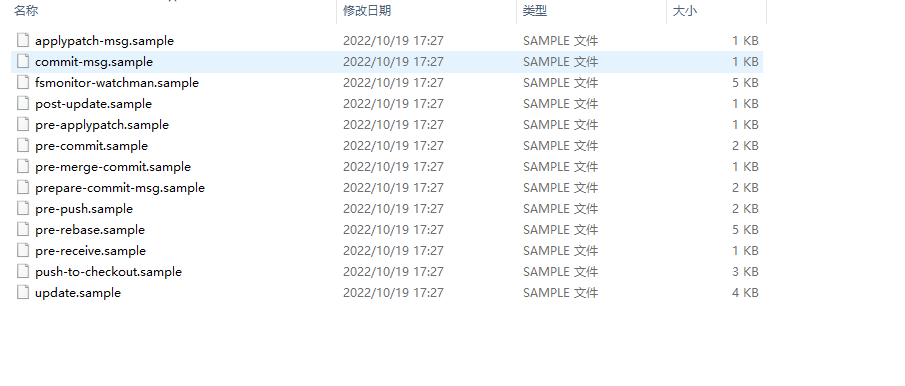

所谓的git-hook就是在我们gi执行一些操作的做一些特殊处理

我们可以看到很多的git钩子我们希望在提交之前拦截我们可以选择 **pre-commit.sample**

我们可以查看pre-commit.sample的内容 就是一些脚本命令

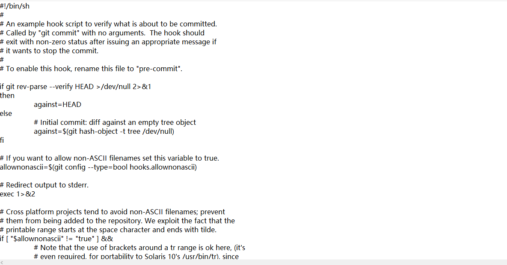我们将文件夹重命名为 **pre-commit**

在里面输入一些东西  window环境下边我们需要指解析规则 在文件头部加一行 ***#!/bin/bash***

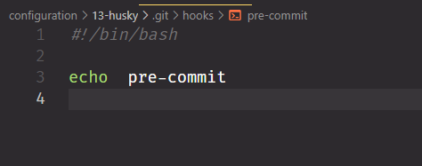

然后我们执行git commit 发现，输出了我们要打印的内容

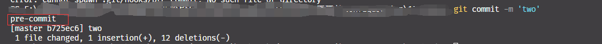

我们将pre-commit里面的内容修改为

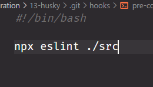

在执行一下commit发现 commit 失败被eslint 拦截

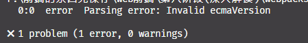

> 我们发现所有动作都是我们手工拦截的，有没有什么工具来帮助我们完成？
>
> 答案是有，我们可以借助husky这个工具来帮助我们，官网-> [husky](https://typicode.github.io/husky/#/?id=install)

:::notes

prepare脚本会在pnpm install之后自动执行。也就是说当我们执行pnpm install安装完项目依赖后会执行 husky install命令，该命令会创建.husky目录并指定该目录为git hooks所在的目录。

:::

我们可以借助husky来帮助我们做提交信息校验

我们可以执行 **`npx husky add .husky/commit-msg 'npx --no-install commitlint --edit "$1"' `**

这条命令帮助我们生成一个hook文件

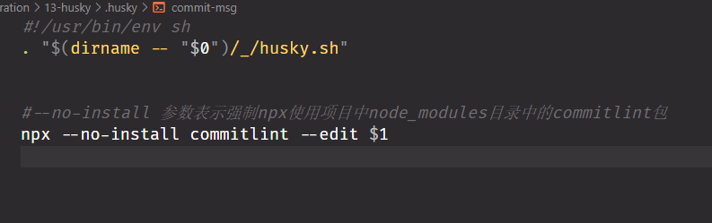

### 5.resolve(模块解析)

webpack默认解析三种路径

- 相对路径
- 绝对路径
- 模块路径

```javascript
  resolve: {
    // 配置路径别名
    alias: {
      '@': path.resolve(__dirname, './src'),
    },
    // 配置扩展名
    extensions:['tsx','js','json','vue']
  }
```

### 6.externals(外部扩展)

有时候我们为了减少bundle的体积，从而把一些不变的第三方库用cdn的方式引入，比如Jquery

```html
<script src="https://cdn.bootcdn.net/ajax/libs/jquery/3.6.1/jquery.js"></script>
```

这个时候我们想载我们的代码里面使用jquery好像上面几种引入方式都不行，这时候就要借助webpack给我们提供的externals的配置项了，让我们可以配置外部扩展模块

```javascript
  externalsType: 'script',  // 要将cdn挂载到 script标签上
  externals: {
    jquery: [  // cdn和全局变量名
      'https://cdn.bootcdn.net/ajax/libs/jquery/3.6.1/jquery.js',
      'jQuery',
    ],
  },
```

### 7.依赖图(dependency graph)

每当一个文件依赖另一个文件的时候，webpack会直接将文件视为纯在依赖关系，webpack开始工作的时候，他会根据我们写的入口开始，webpack‘ 会递归的构建一个依赖图，这个依赖图包含着应用程序中所需的每个模块，然后将所有模块打包成bundle(也就是output的配置项)

**bundle分析工具(bundle analysis)**

- webpack-chart
- webpack-visualizer
- webpack-bundle-analyzer
- bundle-stats

我们来使用 **webpack-bundle-analyzer**演示效果

> 安装 `npm i -D webpack-bundle-analyzer`

### 8.postcss和css模块

postCss是一个用JavaScript编写的css代码转换工具，比如可以使用Autoprefixer插件自动获取浏览器的流行度和能够支持的属性，并根据这些数据自动帮我们转换css的规则前缀，将最新的css语法装换成浏览器能够理解的语法

css 模块可以然你永远不用当心命名太大众化而出现命名冲突

postcss与webpack结合需要安装 `style-loader`，`css-loader`，`postcss-loader`三个loader

> 安装 npm i -D autoprefixer postcss-loader

```javascript
  module: {
    rules: [
      {
        // test: /\.css$/,
        // global 目录下的css文件才需要模块化
        test: /^(?!.*\\.global).*\\.css/,
        use: [
          'style-loader',
          {
            loader: 'css-loader',
            options: {
              modules: true, // 开启css 模块
              localIdentName: '[hash:bas64:6]', // 模块名生成规则
            },
          },
          'postcss-loader',
        ],
      },
    ],
  },
```

在项目目录创建一个  **postss.config.js**

```javascript
module.exports = {
  plugins: [require('autoprefixer')],
}

```

css 模块化导入方式

> import style from './style.css'

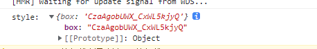


### 9.多页应用

```javascript
 plugins: [
    new HtmlWebpackPlugin({
      template: path.join(__dirname, 'index.html'),
      filename: 'a/idnex.html', // 设置输出目录
      inject: 'body',
      title: '第一个页面',
      chunks: ['app'], // 可以设置插件指定的引入chunks
      publicPath: 'http://www.a.com',
    }),
    new HtmlWebpackPlugin({
      template: path.join(__dirname, 'index2.html'),
      inject: 'body',
      title: '我是第二个页面',
      filename: 'b/idnex2.html',
      chunks: ['app2'],
      publicPath: 'http://www.b.com',
    }),
  ]
```

### 10.Tree Shaking

树摇webpack5内置了，但是还是有些缺陷 如果我们引入的第三方库但是并没有去使用他还是会被一起bundle进去

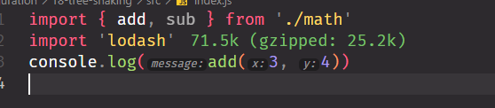

这时候就需要我们的另一个配置项：**sideEffect**这个属性让我们告诉打包工具哪些需要模块需要被tree-shaking

> 允许通过配置的方式去标识代码是否有副作用，从而为 Tree Shaking 提供更多的压缩空间。

:::note 注意

package.json和webpack配置文件中的sideEffects虽然同名，但表示的意义不同。

- package.json的sideEffects：标识当前package.json所影响的项目，当中所有的代码是否有副作用
  - 默认true，表示当前项目中的代码有副作用

- webpack配置文件中的sideEffects：开启功能，是否移除无副作用的代码
  - 默认false，表示不移除无副作用的模块

- 在production模式下自动开启。
  - webpack不会识别代码是否有副作用，只会读取package.json的sideEffects字段。

二者需要配合使用，才能处理无副作用的模块。

:::

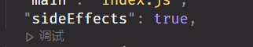

### 11.PWA 渐进式网络应用程序

- pwa主要是通过一个叫做serverWorks的技术实现的

#### 11.1 添加Workbox

添加workbox-webpack-plugin插件，然后调整`webpack.config.js`文件

```bash
npm i -D workbox-webpack-plugin
```

```javascript
  plugins: [
      ....
    new WorkboxWebpackPlugin.GenerateSW({
      clientsClaim: true, // 快速启动serviceWorker
      skipWaiting: true, // 不遗留任何旧的serviceWorker
    }),
     .....
  ],
```

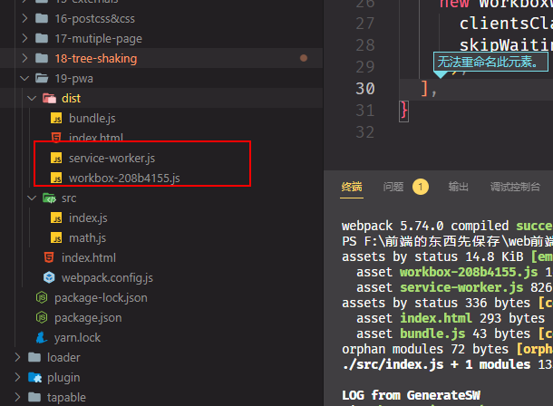

#### 11.2注册serviceWorker

在你的入口文件注册

```javascript
if ('serviceWorker' in navigator) {
	window.addEventListener('load', () => {
		navigator.serviceWorker.register('/service-worker.js')
			.then(registration => {
				console.log('service-worker registed');
			}).catch(error => {
				console.log('service-worker register error');
			})
	})
}
```

### 12.shimming 预置依赖

#### 12.1 shimming 预置全局变量

我们可以把一个第三方的模块依赖改为使用一个全局变量来代替，要实现这些我们需要使用`ProvidePlugin`插件

```javascript
  plugins: [
    new webpack.ProvidePlugin({
      _: 'lodash',
    }),
  ],
```

#### 12.2 细粒度shimming

一些遗留模块的this指向的是window对象

```javascript
this.alert("hello webpack")
```

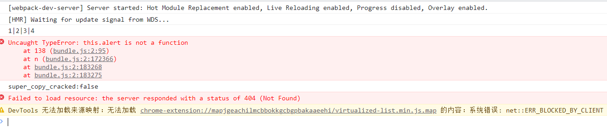

当模块运行在CommonJS上下文的时候，这将会变成一个问题，因为此时的this指向的是module.exports，在这种情况下可以使用`imports-loader`覆盖this指向

> npm i -D imports-loader

```javascript
  module: {
    rules: [
      {
        test: path.resolve('.scr/index.js'),
        use: 'imports-loader?wrapper=window',
      },
    ],
  }
```

### 13 Polyfills

安装polyfills

> npm i -D @babel/polyfill

我们更推荐使用 babel-loader下面开启useBuiltIns选项，启动来加载polyfill，babel-preset-env 通过package 里面的browserslist来指定浏览器特性

要使用这个特性我们需要安装一个库来支持

> npm install -D core-js@3

```javascript
 module: {
    rules: [
      {
        test: /\.js$/,
        exclude: /node_modules/,
        use: {
          loader: 'babel-loader',
          options: {
            presets: [
              [
                '@babel/preset-env',
                {
                  targets: ['last 1 version', '> 1%'],
                  useBuiltIns: 'usage',
                  corejs: 3,
                },
              ],
            ],
          },
        },
      },
    ],
  }
```

### 14.library

[官网](https://webpack.docschina.org/guides/author-libraries/)

```javascript
  entry: './src/index.js',
  output: {
    filename: 'bundle.js',
    clean: true,
    library: {
      name: 'myLib',
      type: 'umd',
    },
    globalObject: 'globalThis',
  },
```

### 15.dll

 ```javascript
npm i -D add-asset-html-webpack-plugin
 ```

1.新建一个配置文件webpack.dll.config

```javascript
const path = require('path')
const webpack = require('webpack')

module.exports = {
  mode: 'production',
  entry: {
    lodash: ['lodash'],
  },
  output: {
    filename: '[name].js',
    path: path.resolve(__dirname, 'dll'),
    library: '[name]_[hash]',
  },
  plugins: [
    new webpack.DllPlugin({
      name: '[name]_[hash]',
      path: path.resolve(__dirname, 'dll/manifest.json'),
    }),
  ],
}

```

2.配置webpack.config

```javascript
const webpack = require('webpack')
const path = require('path')
const HtmlWebpackPlugin = require('html-webpack-plugin')
const AddAssetHtmlPlugin = require('add-asset-html-webpack-plugin')

module.exports = {
  entry: './src/app.js',
  output: {
    filename: 'bundle.js',
    clean: true,
  },
  mode: 'production',
  plugins: [
    new HtmlWebpackPlugin({
      template: path.join(__dirname, 'index.html'),
      inject: 'body',
    }),
    new webpack.DllReferencePlugin({
      manifest: path.resolve(__dirname, 'dll/manifest.json'),
    }),
    new AddAssetHtmlPlugin({
      filepath: path.resolve(__dirname, './dll/lodash.js'),
      publicPath: './',
    }),
  ],
}

```

3.配置package.json

```json
  "scripts": {
    "dll": "webpack --config ./webpack.dll.config.js"
  }
```


## 三、提升构建性能

### 通用环境

1 更新到最新版本

2.loader应用于最少数量的必要模块

我们可以使用 include 和exclude 这两个属性

3.尽量少的使用插件

4.减少配置解析选项 relove

5.减少编译的整体大小

我们可以设置splitChunksPlugin，移除未引用的代码

6.持久化缓存

在weipack配置中启动cache选项就好

```javascript
module.exports = {
    cache:{
        type:'memory'
    }
}

```

7.自定义plugin和loader

### 开发环境

1.开启webpack --watch

2.开启webpack-dev-server

### 生产环境

