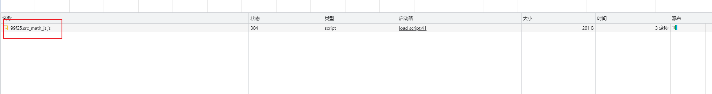
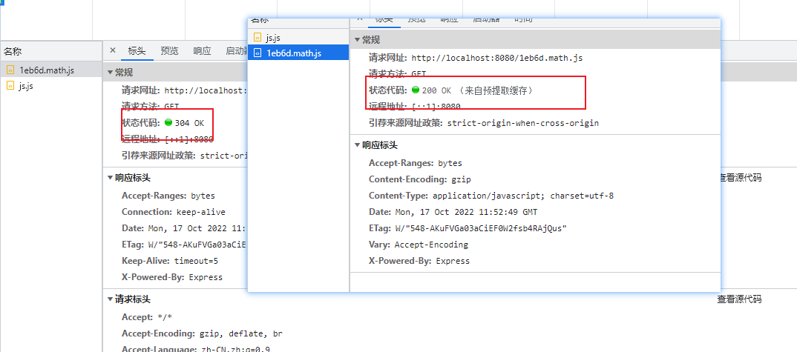

# webpack配置总结 

webpack-cli 命令

:::note

--watch  监听webpack.config.js

--c

--o

:::


安装webpack: 

::: code-tabs

  @tab yarn 

```bash
yarn add webpack webpack-cli --dev
```

  @tab npm

```bash
npm install webpack webpack-cli -D
```

  :::

运行 `npx webpack` 的时候他默认回去找src下面的index.js文件作为入口文件，我们创建一个**hello.js**然后运行webpack指令`npx webpack`,他会通过入口文件解析依赖给我们打包出一个dist文件夹，这个文件夹就是存放编译之后的js文件的


::: note

webpack默认会打包到dist/main.js下面

:::

我们也可以改变他的打包入口和输出位置,我们需要创建**webpack.config.js**文件

```javascript
const path = require('path')

module.exports = {
   entry: './src/index.js', // 文件的打包入口

  output: {
    filename: 'bundle.js', // 输出的文件
    path: path.join(__dirname, 'dist'), // 输出的文件夹
    clean: true,  // 清除上一次遗留的缓存
  },
}
```


## 一、基础配置

> 我们需要在打包的项目下面创建一个配置文件**webpack.config.js**

### 1.HtmlWebpackPlugin

> 这是我们学习的第一个插件，首先我们要按照**HtmlWebpackPlugin**这个插件然后注入到webpack的配置中去

```javascript
const path = require('path')
const HtmlWebpackPlugin = require('html-webpack-plugin')

module.exports = {
....
  mode: 'development', // 如果设置为production html文件会被压缩
  plugins: [
      new HtmlWebpackPlugin({
      template: path.join(__dirname, 'index.html'),
      filename: 'app.[contenthash:5].html', //输出的文件名
      title: '小蔡不菜', // 设置html 的title
      inject: 'body', // 设置js标签的插入位置
    }),
  ],
....
}
```

**title要通过ejs语法注入到html模板才可以**


### 2 mode

> 此选项用于配置当前的开发环境 有两个可选值 production，development

- 配置development的时候代码无法准确定位代码位置


```javascript
module.exports = {
    ....
     mode: 'development', // production development
    ....
}
```

### 3.  devtool

- 可以设置source-map的类型  用来定位错误

 ```javascript
module.exports = {
    ....
       devtool: 'inline-source-map',
    ....
}
 ```


> 配置完之后错误定位正确!!!!

### 4.webpack-dev-server

`webpack-dev-server为我们提供了一个基本的web 服务，并且具有实时重载功能

> 安装：`yarn add --dev webpack-dev-server`

```javascript
module.exports = {
    ....
    devServer: {...options},
    ....
}
```

运行` npx  webpack server`

### 5.assetMoudle

- asset/resource  发送一个单独的文件并导出 URL。之前通过使用 `file-loader` 实现。

- asset/inline 导出一个资源的 base64的urlI。之前通过使用 `url-loader` 实现。
- asset/source 出资源的源代码。之前通过使用 `raw-loader` 实现。
- asset  在导出一个 data URI 和发送一个单独的文件之间自动选择。之前通过使用 `url-loader`，并且配置资源体积限制实现。

```javascript
// 配置资源模块
 module: {
   output: {
    assetModuleFilename: 'images/[contenthash:5][ext]', // 配置资源文件的输出的文件夹 1
  },

    rules: [
      { 
       test: /\.png$/,
       type: 'asset/resource'， 
       generator: {
         // 配置资源文件的输出的文件夹 2 这种方式优先级高
          filename: 'images/[contenthash:7][ext]', 
        }, 
       },
    ],
  },
```


```javascript
// 通用 配置
.....
module: {
    rules: [
      {
        test: /\.jpg$/,
        type: 'asset',
        parser: {
          dataUrlCondition: {
            maxSize: 1024,
          },
        },
      },
    ],
  },
.....
```

### 6.loader

因为webpack默认只支持打包js 而不支持其他格式模块文件，如果要打包其他格式文件的话需要引入特定loader 来进行预解析

#### 6.1 处理css

处理css需要配置两个loader 

- style-loader  用来将解析后的css数据注入到style标签里面去  **优先级高**
- css-loader 用来解析css文件
- less-loader  用来解析less文件

```javascript
....
  module: {
    rules: [
      {
        test: /\.(css|less)$/,
        use: ['style-loader', 'css-loader', 'less-loader'],
      },
    ],
  }
....
```


#### 6.2 抽离和压缩css


抽离css到单独文件我们需要依赖一个插件

> npm i -D **`mini-css-extract-plugin`**

压缩我需要安装

> npm i -D **`css-minimizer-webpack-plugin`**

```javascript
 mode: 'production', // 要开启压缩必须要生成环境下面才行  
 plugins: [
    new MiniCssExtractPlugin({ filename: 'styles/[contenthash:5].[name].css' }),
  ],
  module: {
    rules: [
      {
        test: /\.(css|less)$/,
        use: [MiniCssExtractPlugin.loader, 'css-loader', 'less-loader'],
      },
    ],
  },
   optimization: {
    minimizer: [new CssMiniMizerWebapcPlugin()],
  },
      
```

#### 6.3 加载字体

```javascript
  module: {
    rules: [
      {
        test: /\.(woff|woff2|eot|ttf|otf)$/,
        type: 'asset/resource',
      },
    ],
  }
```

#### 6.4解析json模块

```javascript
  module: {
    rules: [
      {
        test: /\.yaml$/,
        type: 'json',
        parser: {
          parse: yaml.parse,
        },
      },
    ],
  }
```

####  6.5 babel-loader

babel-loader的左右主要是做语法降级，语法兼容人低版本浏览器也可以支持高版本语法

> npm i -D  **`babel-loader @babel/core @babel/preset-env`**

- babel-loader：在webpack里应用babel解析ES6语法
- @babel/core：babel的核心模块 用来加载babel配置的
- @babel/preset-env：babel预设 ，一堆补丁集合,相当于每一个新语法需要一个补丁，babel帮我们把补丁集成到一起

在webpack 中，需要引入babel-loader

```javascript
 module: {
    rules: [
      {
        test: /\.js$/,
        use: {
          loader: 'babel-loader',
          options: {
            presets: ['@babel/preset-env'],
          },
        },
        exclude: [/node_moudules/],
      },
    ],
  },
```


- regeneratorRuntime是webpack打包成功的全局辅助函数，由babel生成，用于兼容async语法

我们需要安装这个包

> npm install --save @babel/runtime   [详情](https://www.babeljs.cn/docs/babel-runtime)
>
> npm install --save-dev @babel/plugin-transform-runtime

### 7.代码分离(code-spliting)

#### 7.1 入口配置

codesplit 最简单的方式就是配置多入口webpack会根据入口构建多个chunk

```javascript
....
  entry: {
    main: './src/index.js',
    other: './src/another-module.js',
  },
  output: {
    filename: '[chunkhash:5].[name].js', // 多入口要设置成多个导出
    clean: true,
  },
....
```


**我们从打包后的bundle可以发现两个个文件都引入了lodash，loadsh也被打包了两次，这会出现一个问题，如果多个文件同时引入一个包那么这个包会被打包好几次**

我们可以通过配置dependOn 来抽离公共模块

```javascript
 
1.第一种方式
entry: {
    main: {
      import: './src/index.js',
      dependOn: 'shared',
    },
    other: {
      import: './src/another-module.js',
      dependOn: 'shared',
    },
    shared: 'lodash', // 要抽离的公共模块
  }
    
2.第二种方式
  optimization: {
    splitChunks: {
      chunks: 'all',
    },
  },
```


#### 7.2 动态导入

涉及到动态代码拆分的使用，我们一般使用import函数去导入模块，webpack会根据import的导入自动生成chunk


#### 7.3 懒加载

:::note

懒加载是一种很好的优化网页的方式，这种方式实际上是先把你的代码在一些逻辑断点处分离开，从而达到按需加载的目的默写代码块可能永远不会加载

:::


```javascript
//math.js
export const add = (x, y) => {
  return x + y
}


// index.js
const button = document.createElement('button')
button.textContent = '加法'
button.addEventListener('click', () => {
  import('./math.js').then(({ add }) => {
    console.log(add(5, 6))
  })
})
document.body.append(button)

```

- 当我们点击按钮的时候才会加载math.js这个文件



- 我们可以来配置两个魔法函数prefetch 预获取，preload 预加载 和 chunkname 

预获取可以让浏览器在空闲的时候引入这个文件，不会去加载主线程的执行

使用预加载的时候请求会发现状态码变为304




### 8.缓存

#### 8.1 hash

当我们的文件配置了chunk之后浏览器会自动缓存我们的文件

>   filename: '[chunkhash:5].[name].js',

#### 8.2 缓存第三方库

因为第三方库不像我们本地代码需要经常修改，所以我们可以对第三方代码缓存

```javascript
 optimization: {
    splitChunks: {
      // chunks: 'all',
      cacheGroups: {
        vendor: {
          test: /[\\/]node_modules[\\/]/,
          name: 'vendors',
          chunks: 'all',
        },
      },
    },
  }
```


### 9 环境配置

  #### output.publicPath

配置文件基本路径也可以配置cdn路径

#### 9.1 环境变量

> 执行   npx webpack --env production|development  
>
> 或者 --env 后面跟任意键值对 key = value 也会被注入到env里面

我们要使用配置的env我们需要将webpack.config.js里面的对象设置成函数

env = *{ WEBPACK_BUNDLE: true, WEBPACK_BUILD: true, production: true,.... }*

```javascript
module.exports = (env) => {......}
```

#### 9.2 配置合并

要合并配置我们需要安装一个插件 **webpack-merge**

```javascript
const merge = require('webpack-merge')

//使用 直接合并
module.exports = merge(base,dev|pro)
```


###  10. 压缩js

我们需要安装terser-webpack-plugin

为什么webpack开箱即用的压缩会失效因为我们引入了css-minimizer-webpack-plugin

```javascript
  optimization: {
      minimizer: [new TerserWebapckPlugin(), new CssMiniMizerPlugin()]
    }
```

## 二、高级配置

### 1.sourceMap

| 模式                    | 解释                                                         |
| ----------------------- | ------------------------------------------------------------ |
| eval                    | 每个module会封装到eval里包裹执行，并且会在末尾添加注释 //@sourceURL |
| source-map              | 生成一个map文件                                              |
| hidden-source-map       | 和source-map一样，当不会在bundle末尾添加注释                 |
| inline-source-map       | 每个module会通过eval()来执行，并且生成一个DataURL形式的sourceMap |
| eval-source-map         | 每个module会通过eval()来执行，并且生成一个DataURL形式的SourceMap |
| cheap-source-map        | 生成一个没有列信息(column-mappings)的sourceMap文件，不包含loader的sourceMap（例如babel的sourceMap） |
| cheap-module-source-map | 生成一个没有列信息的sourceMap文件同时loader的sourcemap也被简化为只包含对应行的。 |

要注意：生产环境我们一般不会开启sourceMap功能，主要由两点原因

1. 通过bundle和sourceMap文件，可以反编译出源码---也就是说，线上产物有sorceMap文件的话，就意味着暴露源码的风险
2. 我们可以观察到，sourceMap的文件体积相对来说比较巨大，这跟我们生成环境的追求不同(更轻更小的bundle)

### 2.devServer

开发环境下我们需要启动web服务，方便我们模拟一个用户从浏览器中访问我们的web服务，读取我们的打包产物，以观察我们代码在客户端的表现，webpack内置了这样的功能，我们只需要简单的配置就可以开启他

再此之前我们要安装他

> npm i -D webpack-dev-server

基本使用

```javascript
  devServer: {
    // 设置要监听的静态目录
    static: './dist',
    open: true,
    compress: true, //启动压缩
    port: 8001,
    headers: {
      // 添加想用
      'X-Access-Token': 'fsfds',
    },
    proxy: {
      // 配置代理
      '/api': 'locahost:3000',
    },
    host: '0.0.0.0', // 开发服务器主机
    // https: true,
    http2: true,
    historyApiFallBack: true, // 配置前端history配置404的跳转
    hot: true, // 模块热加载
  }
```

### 3.eslint

eslint是用来扫描代码规范的工具，严格意义上来说eslint的配置和webpackModule无关

> npx eslint --init  初始化eslint

```javascript
  devServer: {
	// 关闭eslint的错误弹框
    client: {
      overLay: true,
    },
  }
```

### 4.git-hooks 与 husky

