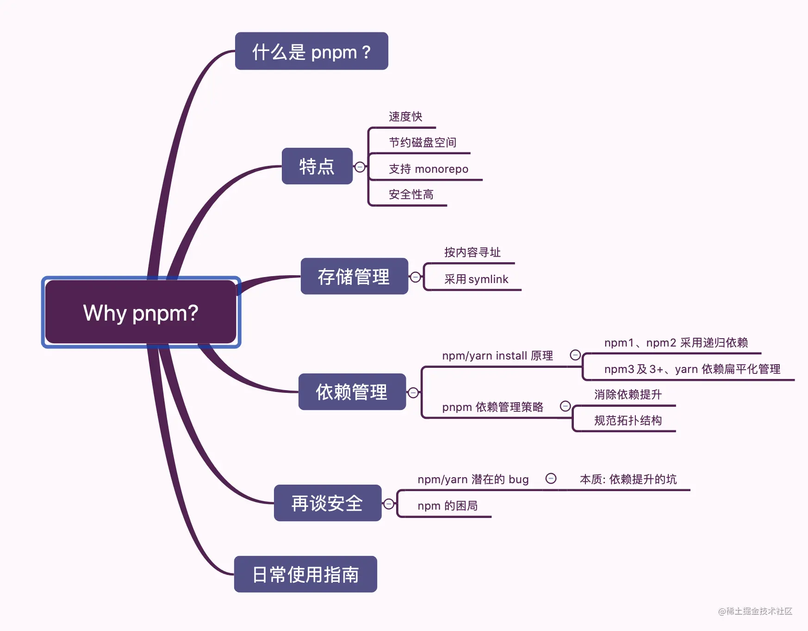
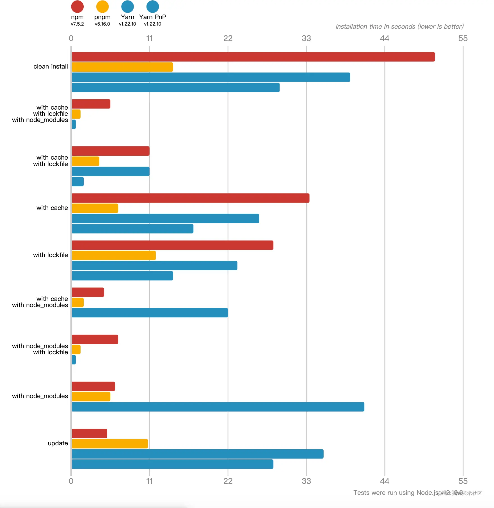
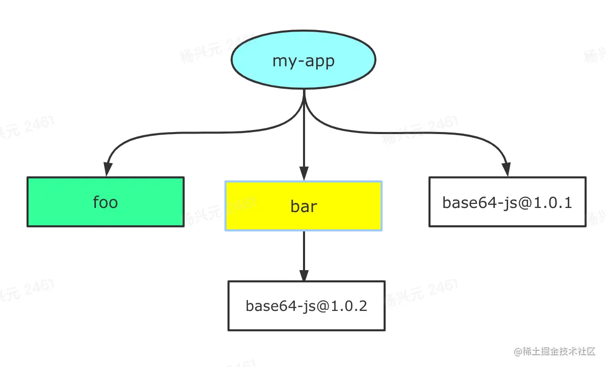
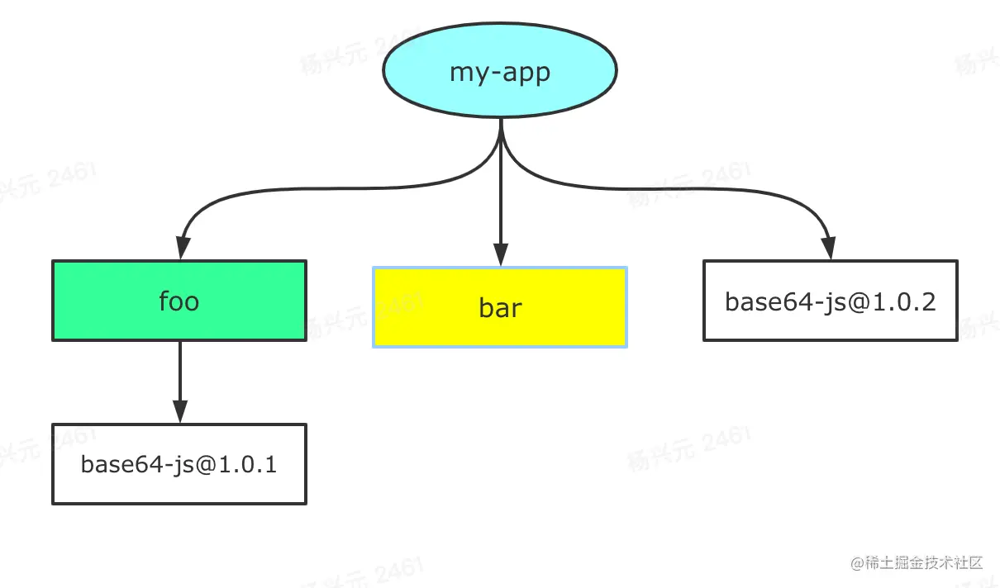
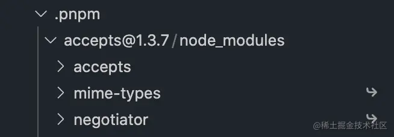

# 关于现代包管理器的深度思考——为什么现在我更推荐 pnpm 而不是 npm/yarn?

::: note

要知道pnpm 的优势在哪里？它解决了什么问题？就要知道 pnpm 的作者在开发 pnpm 的时候，他认为的 npm/yarn 的弱点在哪里。

pnpm它由 npm/yarn 衍生而来，但却解决了 npm/yarn 内部潜在的 bug，并且极大了地优化了性能，扩展了使用场景。下面是本文的思维导图:

:::



## 一、什么是 pnpm ?

pnpm 的[官方文档](https://link.juejin.cn?target=https%3A%2F%2Fpnpm.js.org%2Fen%2F)是这样说的:

> Fast, disk space efficient package manager

因此，pnpm 本质上就是一个包管理器，这一点跟 npm/yarn 没有区别，但它作为杀手锏的两个优势在于:

- 包安装速度极快；
- 磁盘空间利用非常高效。

它的安装也非常简单。可以有多简单?

```js
npm i -g pnpm
复制代码
```

## 二、特性概览

### 1. 速度快

pnpm 安装包的速度究竟有多快？先以 React 包为例来对比一下:


可以看到，作为黄色部分的 pnpm，在绝多大数场景下，包安装的速度都是明显优于 npm/yarn，速度会比 npm/yarn 快 2-3 倍。

对 yarn 比较熟悉的同学可能会说，yarn 不是有 [PnP 安装模式](https://link.juejin.cn?target=https%3A%2F%2Fclassic.yarnpkg.com%2Fen%2Fdocs%2Fpnp%2F)吗？直接去掉 node_modules，将依赖包内容写在磁盘，节省了 node 文件 I/O 的开销，这样也能提升安装速度。（具体原理见[这篇文章](https://link.juejin.cn?target=https%3A%2F%2Floveky.github.io%2F2019%2F02%2F11%2Fyarn-pnp%2F)）

接下来，我们以这样一个[仓库](https://link.juejin.cn?target=https%3A%2F%2Fgithub.com%2Fpnpm%2Fbenchmarks-of-javascript-package-managers)为例，我们来看一看 benchmark 数据，主要对比一下 `pnpm` 和 `yarn PnP`:



从中可以看到，总体而言，`pnpm` 的包安装速度还是明显优于 `yarn PnP`的。

### 2. 高效利用磁盘空间

pnpm 内部使用`基于内容寻址`的文件系统来存储磁盘上所有的文件，这个文件系统出色的地方在于:

- 不会重复安装同一个包。用 npm/yarn 的时候，如果 100 个项目都依赖 lodash，那么 lodash 很可能就被安装了 100 次，磁盘中就有 100 个地方写入了这部分代码。但在使用 pnpm 只会安装一次，磁盘中只有一个地方写入，后面再次使用都会直接使用 `hardlink`(硬链接，不清楚的同学详见[这篇文章](https://link.juejin.cn?target=https%3A%2F%2Fwww.cnblogs.com%2Fitech%2Farchive%2F2009%2F04%2F10%2F1433052.html))。
- 即使一个包的不同版本，pnpm 也会极大程度地复用之前版本的代码。举个例子，比如 lodash 有 100 个文件，更新版本之后多了一个文件，那么磁盘当中并不会重新写入 101 个文件，而是保留原来的 100 个文件的 `hardlink`，仅仅写入那`一个新增的文件`。

### 3. 支持 monorepo

随着前端工程的日益复杂，越来越多的项目开始使用 monorepo。之前对于多个项目的管理，我们一般都是使用多个 git 仓库，但 monorepo 的宗旨就是用一个 git 仓库来管理多个子项目，所有的子项目都存放在根目录的`packages`目录下，那么一个子项目就代表一个`package`。如果你之前没接触过 monorepo 的概念，建议仔细看看[这篇文章](https://link.juejin.cn?target=https%3A%2F%2Fwww.perforce.com%2Fblog%2Fvcs%2Fwhat-monorepo)以及开源的 monorepo 管理工具[lerna](https://link.juejin.cn?target=https%3A%2F%2Fgithub.com%2Flerna%2Flerna%23readme)，项目目录结构可以参考一下 [babel 仓库](https://link.juejin.cn?target=https%3A%2F%2Fgithub.com%2Fbabel%2Fbabel)。

pnpm 与 npm/yarn 另外一个很大的不同就是支持了 monorepo，体现在各个子命令的功能上，比如在根目录下 `pnpm add A -r`, 那么所有的 package 中都会被添加 A 这个依赖，当然也支持 `--filter`字段来对 package 进行过滤。

### 4. 安全性高

之前在使用 npm/yarn 的时候，由于 node_module 的扁平结构，如果 A 依赖 B， B 依赖 C，那么 A 当中是可以直接使用 C 的，但问题是 A 当中并没有声明 C 这个依赖。因此会出现这种非法访问的情况。但 pnpm 脑洞特别大，自创了一套依赖管理方式，很好地解决了这个问题，保证了安全性，具体怎么体现`安全`、规避非法访问依赖的`风险`的，后面再来详细说说。

## 三、依赖管理

### npm/yarn install 原理

主要分为两个部分, 首先，执行 npm/yarn install之后，`包如何到达项目 node_modules 当中`。其次，node_modules `内部如何管理依赖`。

执行命令后，首先会构建依赖树，然后针对每个节点下的包，会经历下面四个步骤:

- 1. 将依赖包的版本区间解析为某个具体的版本号
- 1. 下载对应版本依赖的 tar 包到本地离线镜像
- 1. 将依赖从离线镜像解压到本地缓存
- 1. 将依赖从缓存拷贝到当前目录的 node_modules 目录

然后，对应的包就会到达项目的`node_modules`当中。

那么，这些依赖在`node_modules`内部是什么样的目录结构呢，换句话说，项目的依赖树是什么样的呢？

在 `npm1`、`npm2` 中呈现出的是嵌套结构，比如下面这样:

```js
node_modules
└─ foo
   ├─ index.js
   ├─ package.json
   └─ node_modules
      └─ bar
         ├─ index.js
         └─ package.json
复制代码
```

如果 `bar` 当中又有依赖，那么又会继续嵌套下去。试想一下这样的设计存在什么问题:

1. 依赖层级太深，会导致文件路径过长的问题，尤其在 window 系统下。
2. 大量重复的包被安装，文件体积超级大。比如跟 `foo` 同级目录下有一个`baz`，两者都依赖于同一个版本的`lodash`，那么 lodash 会分别在两者的 node_modules 中被安装，也就是重复安装。
3. 模块实例不能共享。比如 React 有一些内部变量，在两个不同包引入的 React 不是同一个模块实例，因此无法共享内部变量，导致一些不可预知的 bug。

接着，从 npm3 开始，包括 yarn，都着手来通过`扁平化依赖`的方式来解决这个问题。相信大家都有这样的体验，我明明就装个 `express`，为什么 `node_modules`里面多了这么多东西？


没错，这就是`扁平化`依赖管理的结果。相比之前的`嵌套结构`，现在的目录结构类似下面这样:

```js
node_modules
├─ foo
|  ├─ index.js
|  └─ package.json
└─ bar
   ├─ index.js
   └─ package.json
复制代码
```

所有的依赖都被拍平到`node_modules`目录下，不再有很深层次的嵌套关系。这样在安装新的包时，根据 node require 机制，会不停往上级的`node_modules`当中去找，如果找到相同版本的包就不会重新安装，解决了大量包重复安装的问题，而且依赖层级也不会太深。

之前的问题是解决了，但仔细想想这种`扁平化`的处理方式，它真的就是无懈可击吗？并不是。它照样存在诸多问题，梳理一下:

- 1. 依赖结构的**不确定性**。
- 1. 扁平化算法本身的**复杂性**很高，耗时较长。
- 1. 项目中仍然可以**非法访问**没有声明过依赖的包

后面两个都好理解，那第一点中的`不确定性`是什么意思？这里来详细解释一下。

假如现在项目依赖两个包 foo 和 bar，这两个包的依赖又是这样的: 

那么 npm/yarn install 的时候，通过扁平化处理之后，究竟是这样 

还是这样？



答案是: 都有可能。取决于 foo 和 bar 在 `package.json`中的位置，如果 foo 声明在前面，那么就是前面的结构，否则是后面的结构。

这就是为什么会产生依赖结构的`不确定`问题，也是 `lock 文件`诞生的原因，无论是`package-lock.json`(npm 5.x才出现)还是`yarn.lock`，都是为了保证 install 之后都产生确定的`node_modules`结构。

尽管如此，npm/yarn 本身还是存在`扁平化算法复杂`和`package 非法访问`的问题，影响性能和安全。

### pnpm 依赖管理

pnpm 的作者`Zoltan Kochan`发现 yarn 并没有打算去解决上述的这些问题，于是另起炉灶，写了全新的包管理器，开创了一套新的依赖管理机制，现在就让我们去一探究竟。

还是以安装 `express` 为例，我们新建一个目录，执行:

```csharp
pnpm init -y
复制代码
```

然后执行:

```
pnpm install express
复制代码
```

我们再去看看`node_modules`:

```
.pnpm
.modules.yaml
express
复制代码
```

我们直接就看到了`express`，但值得注意的是，这里仅仅只是一个`软链接`，不信你打开看看，里面并没有 node_modules 目录，如果是真正的文件位置，那么根据 node 的包加载机制，它是找不到依赖的。那么它真正的位置在哪呢？

我们继续在 .pnpm 当中寻找:

```sql
▾ node_modules
  ▾ .pnpm
    ▸ accepts@1.3.7
    ▸ array-flatten@1.1.1
    ...
    ▾ express@4.17.1
      ▾ node_modules
        ▸ accepts
        ▸ array-flatten
        ▸ body-parser
        ▸ content-disposition
        ...
        ▸ etag
        ▾ express
          ▸ lib
            History.md
            index.js
            LICENSE
            package.json
            Readme.md
复制代码
```

好家伙！竟然在 `.pnpm/express@4.17.1/node_modules/express`下面找到了!

随便打开一个别的包:



好像也都是一样的规律，都是`<package-name>@version/node_modules/<package-name>`这种目录结构。并且 express 的依赖都在`.pnpm/express@4.17.1/node_modules`下面，这些依赖也全都是**软链接**。

再看看`.pnpm`，`.pnpm`目录下虽然呈现的是扁平的目录结构，但仔细想想，顺着`软链接`慢慢展开，其实就是嵌套的结构！

```sql
▾ node_modules
  ▾ .pnpm
    ▸ accepts@1.3.7
    ▸ array-flatten@1.1.1
    ...
    ▾ express@4.17.1
      ▾ node_modules
        ▸ accepts  -> ../accepts@1.3.7/node_modules/accepts
        ▸ array-flatten -> ../array-flatten@1.1.1/node_modules/array-flatten
        ...
        ▾ express
          ▸ lib
            History.md
            index.js
            LICENSE
            package.json
            Readme.md
复制代码
```

将`包本身`和`依赖`放在同一个`node_module`下面，与原生 Node 完全兼容，又能将 package 与相关的依赖很好地组织到一起，设计十分精妙。

现在我们回过头来看，根目录下的 node_modules 下面不再是眼花缭乱的依赖，而是跟 package.json 声明的依赖基本保持一致。即使 pnpm 内部会有一些包会设置依赖提升，会被提升到根目录 node_modules 当中，但整体上，根目录的`node_modules`比以前还是清晰和规范了许多。

## 四、再谈安全

不知道你发现没有，pnpm 这种依赖管理的方式也很巧妙地规避了`非法访问依赖`的问题，也就是只要一个包未在 package.json 中声明依赖，那么在项目中是无法访问的。

但在 npm/yarn 当中是做不到的，那你可能会问了，如果 A 依赖 B， B 依赖 C，那么 A 就算没有声明 C 的依赖，由于有依赖提升的存在，C 被装到了 A 的`node_modules`里面，那我在 A 里面用 C，跑起来没有问题呀，我上线了之后，也能正常运行啊。不是挺安全的吗？

还真不是。

第一，你要知道 B 的版本是可能随时变化的，假如之前依赖的是`C@1.0.1`，现在发了新版，新版本的 B 依赖 `C@2.0.1`，那么在项目 A 当中 npm/yarn install 之后，装上的是 2.0.1 版本的 C，而 A 当中用的还是 C 当中旧版的 API，可能就直接报错了。

第二，如果 B 更新之后，可能不需要 C 了，那么安装依赖的时候，C 都不会装到`node_modules`里面，A 当中引用 C 的代码直接报错。

还有一种情况，在 monorepo 项目中，如果 A 依赖 X，B 依赖 X，还有一个 C，它不依赖 X，但它代码里面用到了 X。由于依赖提升的存在，npm/yarn 会把 X 放到根目录的 node_modules 中，这样 C 在本地是能够跑起来的，因为根据 node 的包加载机制，它能够加载到 monorepo 项目根目录下的 node_modules 中的 X。但试想一下，一旦 C 单独发包出去，用户单独安装 C，那么就找不到 X 了，执行到引用 X 的代码时就直接报错了。

这些，都是依赖提升潜在的 bug。如果是自己的业务代码还好，试想一下如果是给很多开发者用的工具包，那危害就非常严重了。

npm 也有想过去解决这个问题，指定`--global-style`参数即可禁止变量提升，但这样做相当于回到了当年嵌套依赖的时代，一夜回到解放前，前面提到的嵌套依赖的缺点仍然暴露无遗。

npm/yarn 本身去解决依赖提升的问题貌似很难完成，不过社区针对这个问题也已经有特定的解决方案: **dependency-check**，地址: [github.com/dependency-…](https://link.juejin.cn?target=https%3A%2F%2Fgithub.com%2Fdependency-check-team%2Fdependency-check)

但不可否认的是，pnpm 做的更加彻底，独创的一套依赖管理方式不仅解决了依赖提升的安全问题，还大大优化了时间和空间上的性能。

## 五、日常使用

说了这么多，估计你会觉得 `pnpm` 挺复杂的，是不是用起来成本很高呢？

恰好相反，pnpm 使用起来十分简单，如果你之前有 npm/yarn 的使用经验，甚至可以无缝迁移到 pnpm 上来。不信我们来举几个日常使用的例子。

### pnpm install

跟 npm install 类似，安装项目下所有的依赖。但对于 monorepo 项目，会安装 workspace 下面所有 packages 的所有依赖。不过可以通过 --filter 参数来指定 package，只对满足条件的 package 进行依赖安装。

当然，也可以这样使用，来进行单个包的安装:

```js
// 安装 axios
pnpm install axios
// 安装 axios 并将 axios 添加至 devDependencies
pnpm install axios -D
// 安装 axios 并将 axios 添加至 dependencies
pnpm install axios -S
复制代码
```

当然，也可以通过 --filter 来指定 package。

### pnpm update

根据指定的范围将包更新到最新版本，monorepo 项目中可以通过 --filter 来指定 package。

### pnpm uninstall

在 node_modules 和 package.json 中移除指定的依赖。monorepo 项目同上。举例如下:

```css
// 移除 axios
pnpm uninstall axios --filter package-a
复制代码
```

### pnpm link

将本地项目连接到另一个项目。注意，使用的是硬链接，而不是软链接。如:

```bash
pnpm link ../../axios
复制代码
```

另外，对于我们经常用到`npm run/start/test/publish`，这些直接换成 pnpm 也是一样的，不再赘述。更多的使用姿势可参考官方文档: [pnpm.js.org/en/](https://link.juejin.cn?target=https%3A%2F%2Fpnpm.js.org%2Fen%2F)

可以看到，虽然 pnpm 内部做了非常多复杂的设计，但实际上对于用户来说是无感知的，使用起来非常友好。并且，现在作者现在还一直在维护，目前 npm 上周下载量已经有 10w +，经历了大规模用户的考验，稳定性也能有所保障。


